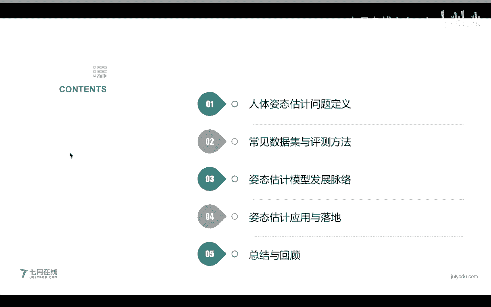
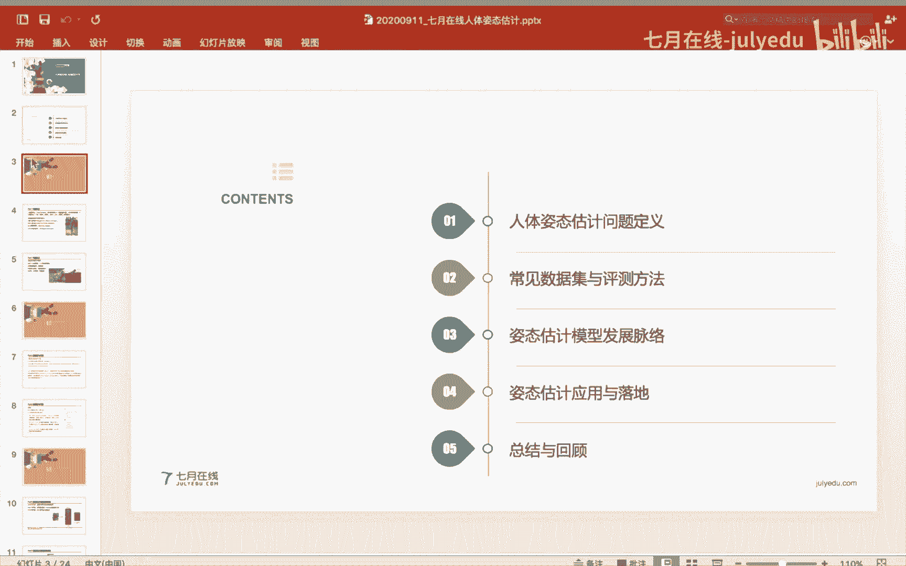
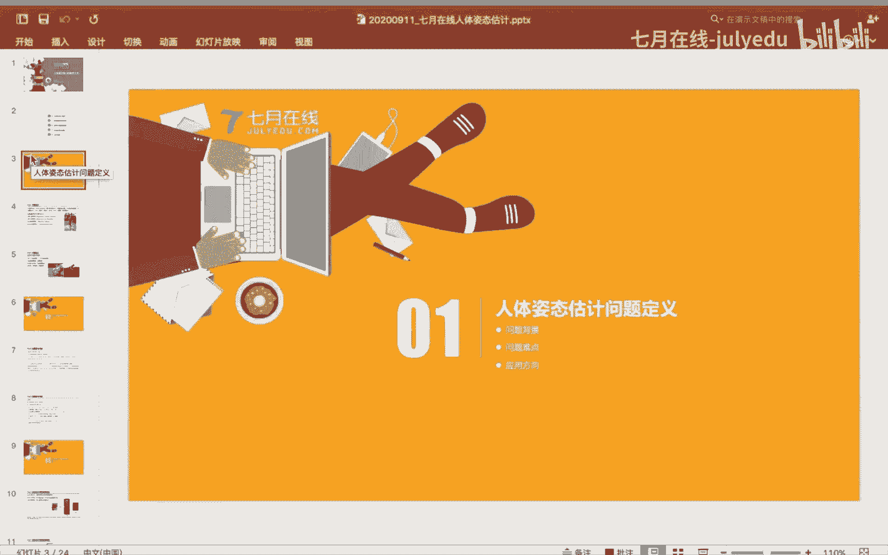
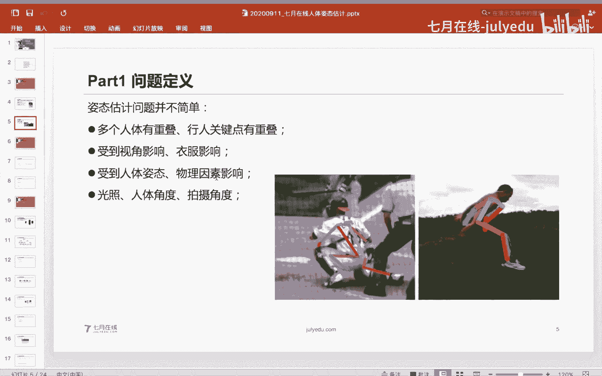
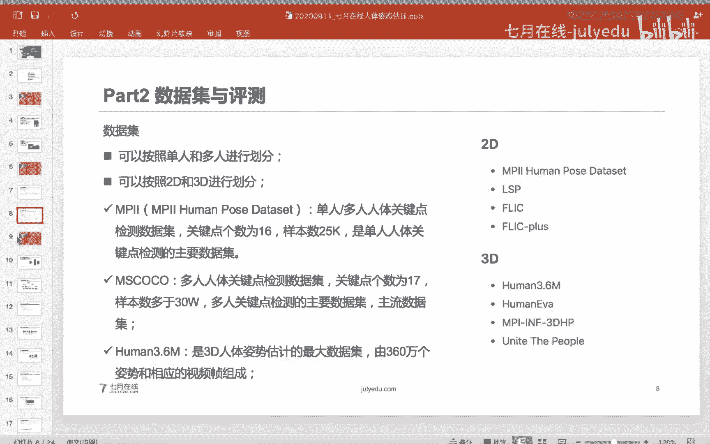
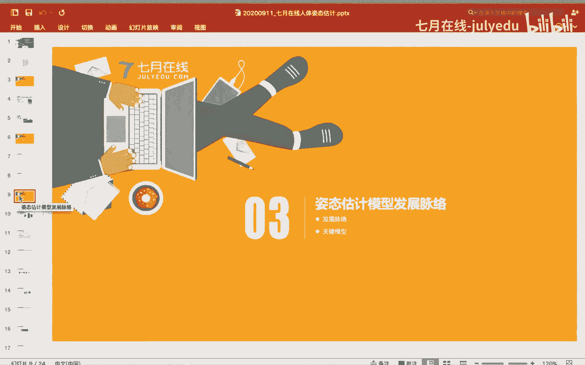
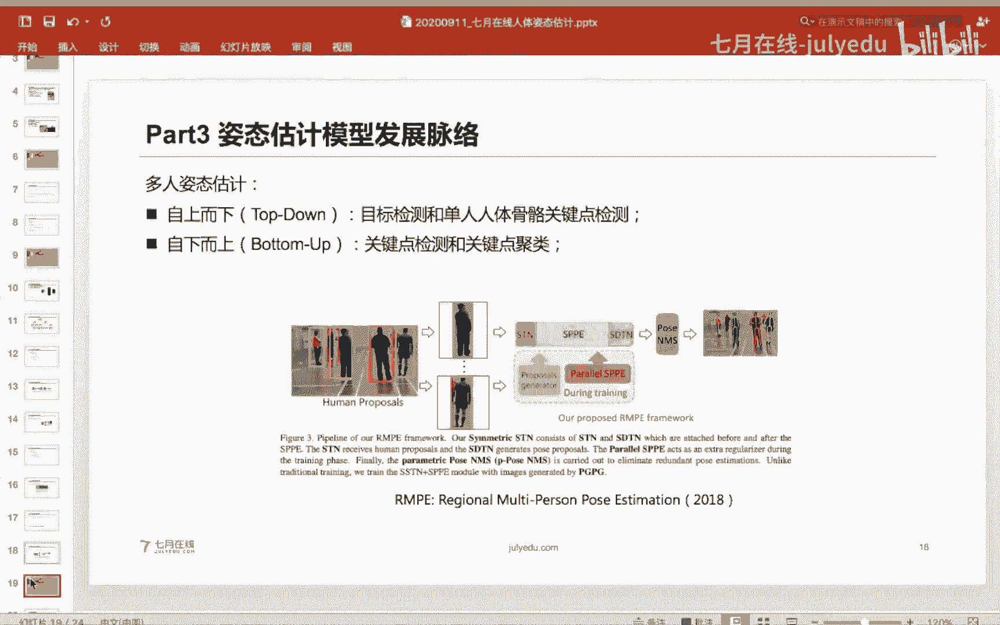
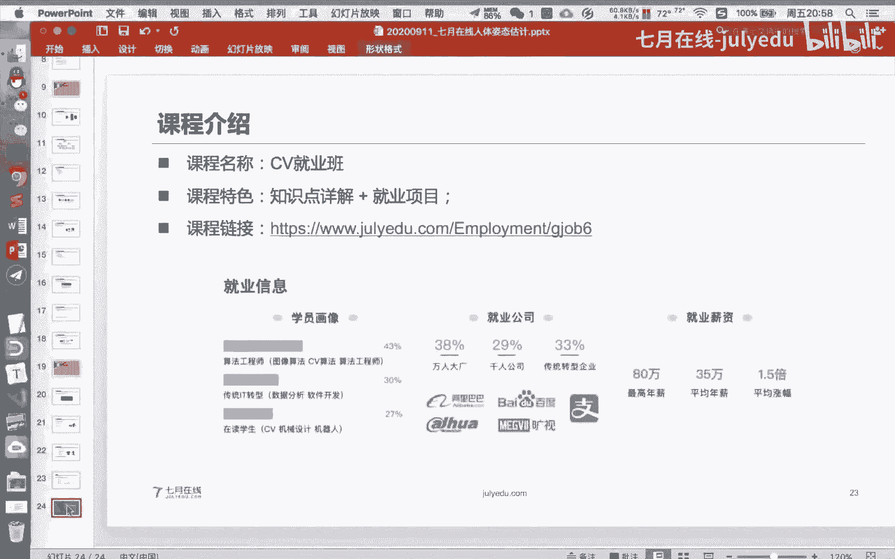
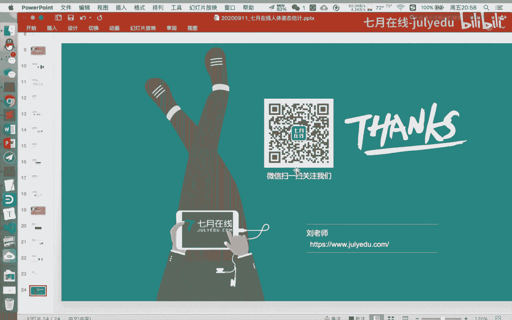

# 人工智能—计算机视觉CV公开课（七月在线出品） - P6：人体姿态估计的前世今生 👤➡️🦴

在本节课中，我们将要学习人体姿态估计这一计算机视觉基础且应用广泛的任务。我们将从问题定义出发，了解其核心概念、发展历程、常用数据集与评估方法，并探讨其在实际场景中的应用与挑战。

## 1. 人体姿态估计的问题定义

人体姿态估计是计算机视觉中的一个基础问题，其核心任务是从图像或视频中识别并定位出人体的关键骨骼点。

从名称中的“估计”一词可以看出，它与分类或检测任务不同，其目标是预测关键点的具体位置。例如，从右侧的骨骼图可以看出，定义某些关键点（如运动员的右肩）本身就可能存在模糊性或难度。

因此，精细的人体姿态估计是一项具有挑战性的任务。

根据数据的不同，人体姿态估计可以划分为以下几类：
*   **单人姿态估计**：图像中仅包含一个人。
*   **多人姿态估计**：图像中包含多个人。
*   **人体姿态追踪**：在视频序列中追踪人体的姿态。
*   **3D人体姿态估计**：预测人体关键点在三维空间中的坐标。

现实生活中，2D的单人或多人姿态估计更为常见。该技术已广泛应用于各类场景，例如抖音等应用中的舞蹈特效和动作打分。

姿态估计不仅限于2D图片，还可以扩展到视频帧的姿态追踪以及3D姿态预测。3D姿态估计在游戏建模、AR/VR等领域有重要应用。因此，人体姿态估计在计算机视觉、工业界和游戏领域都有着广泛的应用前景。

然而，人体姿态估计并非一个简单的问题，它面临诸多挑战：
*   **关键点重叠**：多个人体之间或人体自身各部分（如交叉的腿、重叠的肩膀）的关键点可能相互遮挡。
*   **视角多变**：人体姿态是三维空间的运动在二维平面的投影，拍摄角度（仰视、俯视、侧面）的多样性增加了识别难度。
*   **外观干扰**：衣物颜色可能与背景相似，影响模型对边界的判断。
*   **部分可见**：人体可能被遮挡，只露出一部分肢体，导致关键点检测不全。
*   **环境影响**：光照条件、拍摄角度等物理因素会影响图像信号，进而影响模型性能。

现实中的姿态估计通常处理较为规整的正面视角，但实际应用场景要复杂得多。

## 2. 常见数据集与评测方法

人体姿态估计的发展高度依赖于大规模、高质量的数据集。数据量的多少直接影响模型的精度。例如，COCO、MPII等大型数据集对推动该领域发展起到了关键作用。

同时，业界也有一系列标准化的评测指标来衡量模型性能：

*   **PCK**：正确估计的关键点比例。它是一个较早的指标，计算预测关键点与真实关键点之间的欧氏距离，并通过设定阈值来判断是否正确。虽然较老，但在工程项目中作为衡量标准仍很方便。
*   **AP (Average Precision)**：平均精度，是当前主流的评测指标，尤其在学术论文中。其计算方式因任务而异：
    *   **单人姿态估计**：针对单张图片中的单个人体，计算预测关键点与真实关键点之间的相似度（常用OKS指标），然后计算AP。
    *   **多人姿态估计**：需要先检测出多个人体，再为每个人体计算AP，最后对所有人体或所有图片的AP进行平均，得到mAP。

目前，人体姿态估计领域常用的一些数据集包括：

*   **MPII**：主流的单人人体关键点检测数据集，包含约16个关键点，样本数近2.5万。该数据集目前已被广泛研究，精度很高，适合初学者入门。
*   **COCO**：主流的多人人体关键点检测数据集，包含17个关键点，样本量超过30万。它是评测多人姿态估计性能的重要基准。
*   **AI Challenger**：由创新工场在2017-2018年举办的比赛数据集，样本量约38万，包含14个关键点，曾是一个经典的大规模数据集。
*   **Human3.6M**：大型3D人体姿态估计数据集，包含360万个姿势和对应的视频帧，由11位演员从4个视角拍摄15天得到，数据量达数十GB。

## 3. 姿态估计模型的发展脉络

人体姿态估计模型的发展与深度学习的演进密切相关。在深度学习兴起之前，主要处理单人姿态估计，采用手工特征（如SIFT、HOG）结合浅层模型以及关键点间的空间关系进行建模。

深度学习，特别是卷积神经网络（CNN），极大地推动了姿态估计的发展。自2014年起，基于CNN的姿态估计方法开始涌现。MPII数据集的引入为模型训练提供了充足的数据支持。

其发展脉络大致可分为几个阶段：
*   **2014-2015年**：主流方法是对关键点坐标进行直接回归。
*   **2015-2017年**：方法演变为热力图回归与坐标回归相结合。
*   **2018年至今**：研究重点转向多人姿态估计。

**坐标点回归**的代表工作是 `DeepPose`。它是首个使用CNN进行姿态估计的方法，将关键点的坐标位置作为网络直接回归的目标，即让网络输出具体的坐标值。

**热力图回归**的代表模型是 `CPM`。它不再直接回归坐标，而是预测一个表示关键点可能出现位置的“热力图”。热力图上的每个像素值表示该位置是关键点的概率。这种方法类似于分类任务中的软标签，预测的是一个分布，通常能使模型收敛更快。`CPM` 通过多阶段网络结构，在不同尺度上预测热力图，融合后得到最终的关键点位置，其精度优于直接回归坐标的方法。

后续的许多工作（如结合热力图与偏移量预测）都是在此基础上的改进，以处理人体尺度变化、关键点间关系等复杂情况。

当前，姿态估计模型主要分为两大技术路线：
*   **单人姿态估计**：如 `CPM` 及其后续著名的 `OpenPose`。
*   **多人姿态估计**：又可细分为：
    *   **自上而下**：先检测图像中所有的人体边界框，再在每个框内进行单人姿态估计。
    *   **自下而上**：先检测图像中所有的关键点，再将关键点聚类、组合成不同的人体实例。

目前，自上而下的方法更为常见。例如2018年的 `RMPE` 等论文，借鉴了目标检测的思想，通过人体检测框来辅助姿态估计，取得了很好的效果。后续还有 `CPN`、`HRNet` 等更先进的模型不断刷新性能纪录。

## 4. 姿态估计的应用与落地

人体姿态估计是计算机视觉中非常容易落地的领域之一，其应用场景极为广泛：

*   **动作识别与评分**：分析运动员、舞者的姿态，进行动作打分或规范性评估。
*   **安防监控**：检测危险行为，如打架、摔倒、闯入禁区等。
*   **游戏与交互**：驱动VR/AR虚拟形象，实现体感游戏、舞蹈机联动等。
*   **时尚与电商**：检测服饰的关键点（衣领、袖口、裙摆等），用于服装检索、虚拟试衣、时尚分析。这不仅限于人体，也可用于宠物、特定物体等任何有关键点定义的对象。

姿态估计的落地仍需解决一些实际问题：
*   **行为细粒度判断**：例如，如何区分“握手”和“打架”？这需要结合时序信息分析关键点的运动模式。
*   **数据扩增**：对于姿态估计任务，简单的图像翻转、平移可能导致关键点标注失效或产生歧义，需要设计针对性的扩增策略。
*   **与相关任务对比**：与人脸关键点检测相比，人体姿态估计的关键点分布更稀疏、空间关系更复杂，且常面临严重遮挡，因此难度通常更大。
*   **任务结合**：姿态估计常与行人重识别、行为识别等任务结合，形成更复杂的应用系统。

## 5. 总结与课程介绍

本节课我们一起学习了人体姿态估计的完整图景。我们从**问题定义**入手，理解了其核心任务与挑战。接着，介绍了支撑该领域发展的**常见数据集和评测指标**。然后，梳理了**模型发展的主要脉络**，从坐标回归到热力图回归，从单人估计到多人估计。最后，探讨了姿态估计在多个行业的**广泛应用和落地思考**。

人体姿态估计是一个基础、重要且充满活力的研究方向，掌握它不仅有助于理解计算机视觉的核心技术，也能为解决众多实际问题提供有力工具。

---
**（以下为课程推广内容）**

如果您希望更深入地学习人体姿态估计及计算机视觉的其他核心技术与项目实战，可以关注我们的《计算机视觉就业班》。该课程不仅包含《人体关键点提取》等项目实战，还系统覆盖图像处理、传统视觉、深度学习、目标检测、语义分割、三维重建等核心知识点与6大实战项目，旨在帮助学员构建扎实的CV知识体系并积累项目经验，助力求职就业。

课程将于近期开班，现在报名可享专属优惠。感兴趣的同学可以点击页面上的“立即报名”咨询详情。今天的课件资料也会分享在直播群中，欢迎领取。

本节课到此结束，谢谢大家！