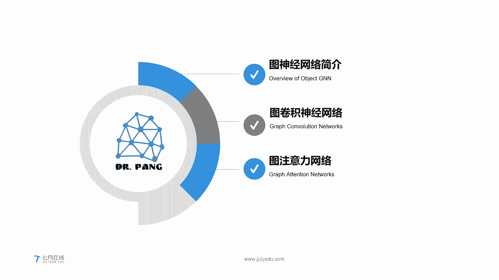
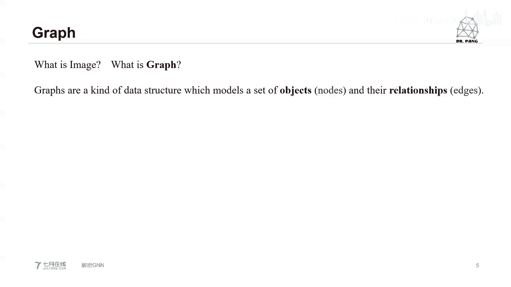
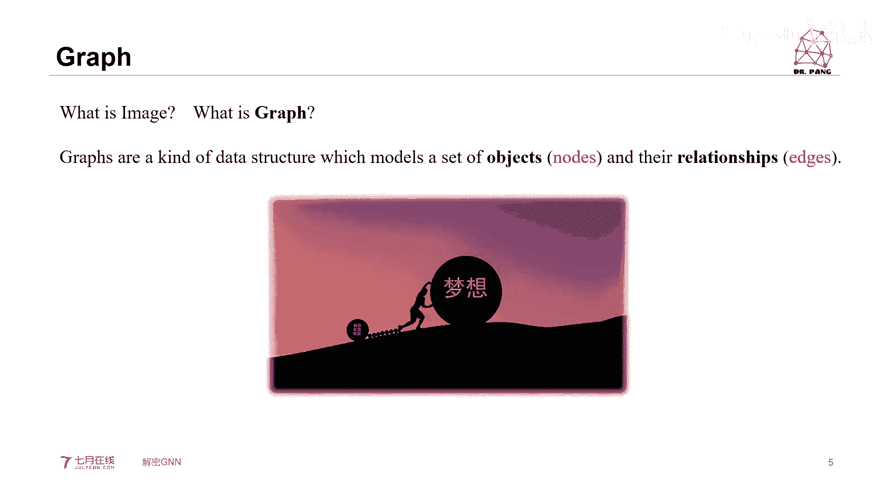
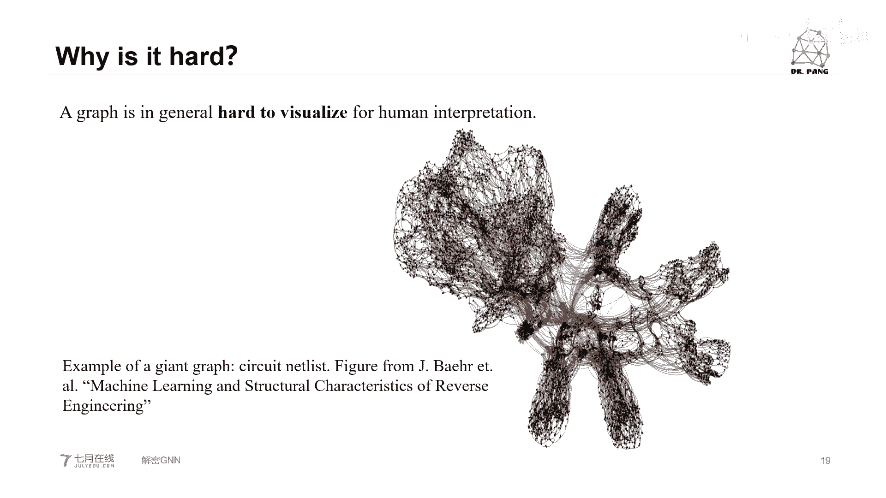
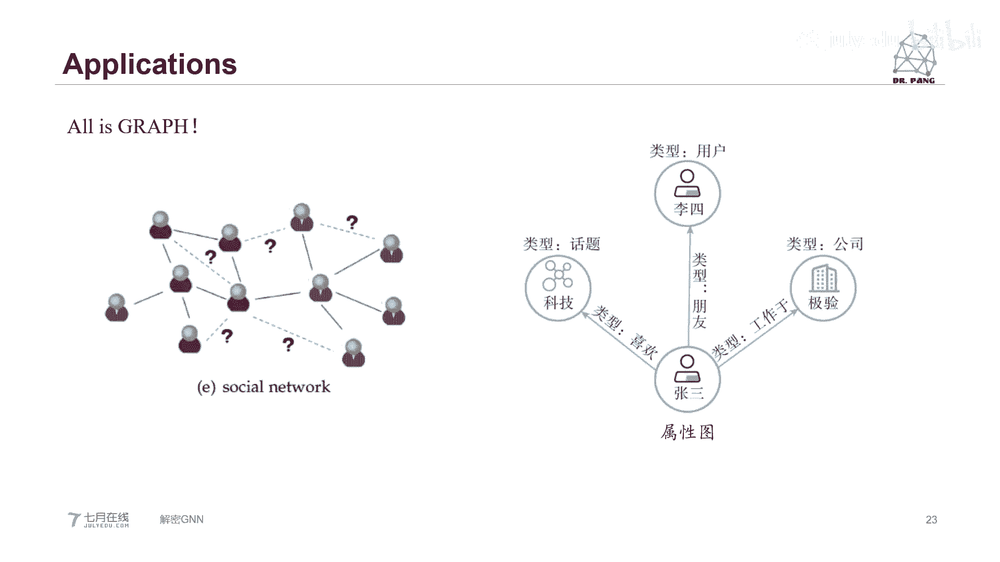
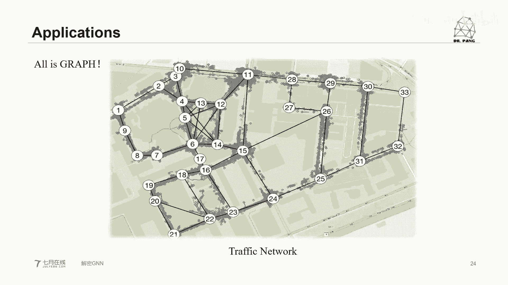
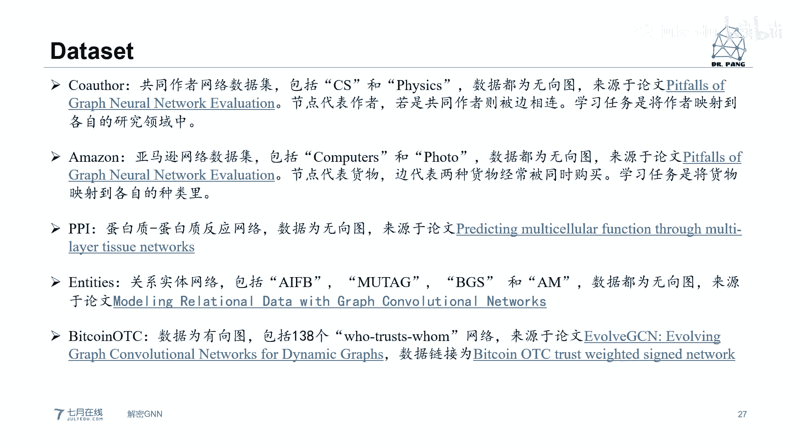
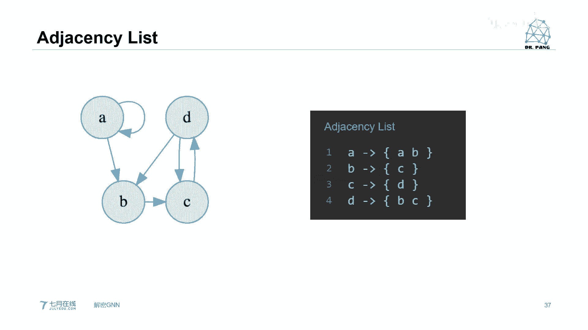
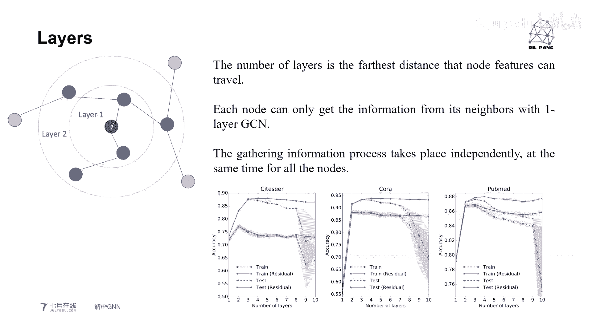
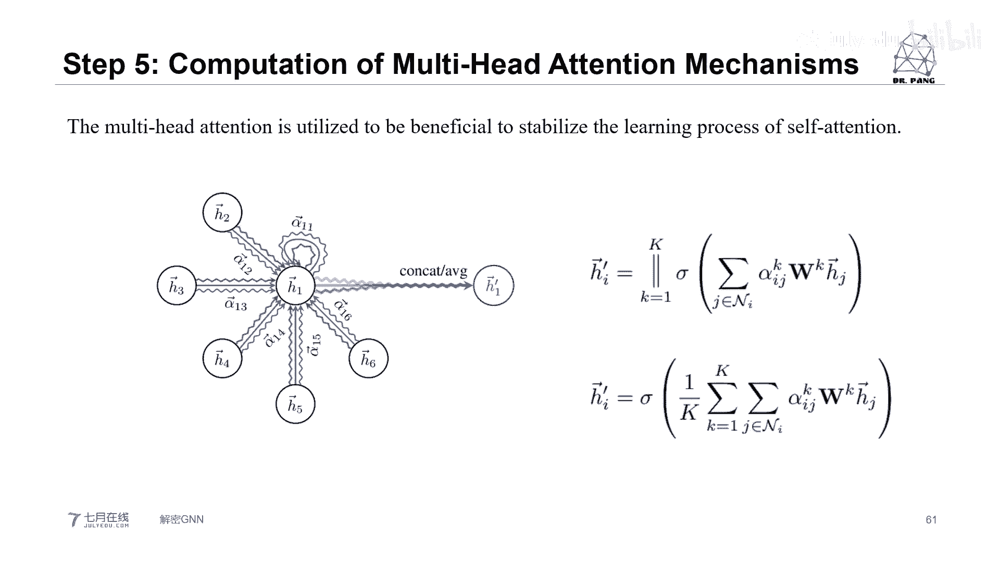

# 人工智能—计算机视觉CV公开课（七月在线出品） - P8：双语公开课《解密GNN》 🧠

在本节课中，我们将要学习图神经网络的基本概念、核心原理以及一个重要的变体——图注意力网络。我们将从图的基本定义开始，逐步深入到图卷积网络的工作原理，最后简要了解图注意力网络的运作方式。

## 图神经网络简介 📊

首先，我们需要明确几个基本问题：什么是图？什么是神经网络？什么是图神经网络？

图在计算机科学中通常对应英文单词 **graph**。它由两部分组成：**节点** 和 **边**。节点代表对象或实体，边代表对象之间的关系。

用数学公式可以表示为：
**G = (V, E)**
其中，**G** 代表图，**V** 代表节点集合，**E** 代表边集合。

图有多种分类方式：
*   **无向图 vs 有向图**：无向图的边没有方向，表示双向关系；有向图的边有箭头，表示单向关系。
*   **循环图 vs 非循环图**：循环图中存在路径能让信息从某个节点出发最终回到自身；非循环图则没有这种路径。
*   **连通图 vs 非连通图**：连通图中所有节点都直接或间接相连；非连通图中存在孤立的节点或子图。

图在现实世界中有广泛应用，例如社交网络（用户是节点，关注关系是边）、推荐系统（用户和商品是节点，购买行为是边）等。图神经网络的目标，就是利用深度学习的思想，直接在这些图结构的数据上进行学习和预测。

## 图卷积神经网络 🔄

上一节我们介绍了图的基本概念，本节中我们来看看图神经网络的一个核心模型——图卷积神经网络。

图卷积神经网络是一种直接在图上操作的神经网络，它利用图的结构信息来解决节点分类等问题。其核心思想是：每个节点从其所有邻居节点（包括自身）处聚合特征信息。

这与卷积神经网络的思想类似，都是聚合邻域信息。主要区别在于，CNN处理的是规整的网格数据（如图像像素），而GCN处理的是不规则的图结构。GCN通过引入**邻接矩阵 A** 来显式地表达图的结构。

一个简化的GCN层操作可以表示为：
**H^{(l+1)} = σ(Ã H^{(l)} W^{(l)})**
其中：
*   **H^{(l)}** 是第 l 层的节点特征矩阵。
*   **Ã** 是经过自循环和归一化处理后的邻接矩阵（具体为 **Ã = D^{-1/2} A D^{-1/2}**，A是邻接矩阵，D是度矩阵）。
*   **W^{(l)}** 是可学习的权重矩阵。
*   **σ** 是非线性激活函数。

以下是GCN工作流程的关键步骤：

1.  **构建邻接矩阵 A**：这是一个 N×N 的矩阵（N为节点数），如果节点 i 和 j 之间有边相连，则 A_{ij} = 1，否则为 0。
2.  **计算度矩阵 D**：这是一个对角矩阵，对角线上的值 D_{ii} 表示节点 i 的度（即相连的边数）。
3.  **添加自循环与归一化**：为了在信息聚合时包含节点自身的特征，并为连接数不同的节点进行归一化，我们计算 **Ã = D^{-1/2} (A + I) D^{-1/2}**，其中 I 是单位矩阵。
4.  **特征传播与变换**：将归一化的邻接矩阵 Ã 与节点特征矩阵 H 相乘，实现邻居信息的聚合，再通过可学习的权重矩阵 W 进行线性变换，最后经过激活函数。

通过堆叠多个GCN层，每个节点可以聚合到来自多跳邻居的信息，从而获得更丰富的特征表示。

## 图注意力网络 🎯

前面我们介绍了GCN，它平等地对待所有邻居节点。但在现实中，不同邻居的重要性往往不同。本节中我们来看看引入了注意力机制的图神经网络——图注意力网络。

图注意力网络的核心是为图中的每条边分配一个可学习的注意力权重，从而让节点在聚合邻居信息时能够“关注”更重要的邻居。

以下是GAT单头注意力层的主要计算步骤：

1.  **线性变换**：对每个节点的输入特征 **h_i** 进行线性变换。**z_i = W h_i**
2.  **计算注意力系数**：计算节点 i 对其邻居 j 的原始注意力分数。**e_{ij} = a([z_i || z_j])**，其中 `a` 是一个单层前馈神经网络，`||` 表示拼接操作。
3.  **归一化注意力系数**：使用 softmax 函数对某个节点 i 的所有邻居 j 的注意力系数进行归一化，得到最终的注意力权重 **α_{ij}**。**α_{ij} = softmax_j(e_{ij})**
4.  **聚合邻居信息**：使用归一化后的注意力权重对邻居节点的变换后特征进行加权求和，并应用非线性激活函数。**h'_i = σ( Σ_{j∈N(i)} α_{ij} z_j )**
5.  **多头注意力**：为了稳定学习过程并捕获不同方面的信息，GAT通常使用多头注意力。即独立执行 K 次上述步骤，然后将得到的 K 个特征向量拼接或求平均作为最终输出。**h'_i = ||_{k=1}^K σ( Σ_{j∈N(i)} α_{ij}^k W^k h_j )**

通过注意力机制，GAT能够为图中不同的连接分配不同的重要性，从而更灵活、更强大地对图结构数据进行建模。

## 总结 📝

本节课中我们一起学习了图神经网络的基础知识。我们从**图的基本定义**出发，了解了节点、边、邻接矩阵等核心概念。接着，我们深入探讨了**图卷积神经网络**的原理，明白了它如何通过归一化的邻接矩阵来聚合邻居信息。最后，我们简要介绍了**图注意力网络**，它通过引入注意力机制，使模型能够区分不同邻居的重要性。

图神经网络为我们处理非欧几里得空间的结构化数据（如社交网络、分子结构、知识图谱）提供了强大的工具。希望本课程能帮助你打开图神经网络世界的大门。