# 🖼️ 人工智能—计算机视觉CV公开课（P9）：图像搜索与分类

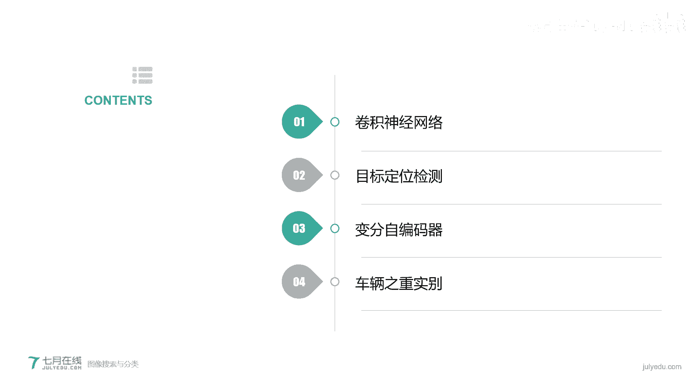

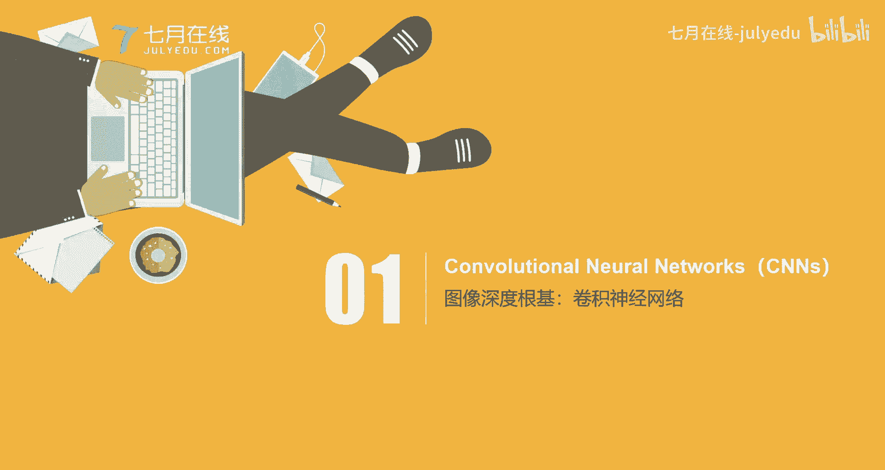

在本节课中，我们将要学习图像搜索与分类的核心概念，涵盖卷积神经网络、目标检测、变分自编码器以及车辆重识别等关键主题。我们将从基础原理入手，逐步深入到实际应用，确保初学者能够轻松理解。

---

## 🧠 第一部分：卷积神经网络（CNN）

上一节我们介绍了课程概述，本节中我们来看看卷积神经网络（CNN）。CNN是深度学习在计算机视觉领域的基石，主要用于解决目标识别或分类问题。

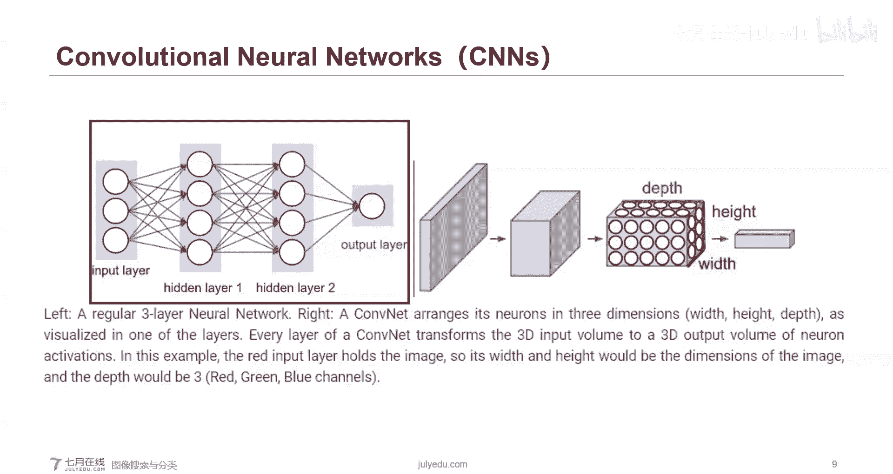

### 什么是卷积神经网络？

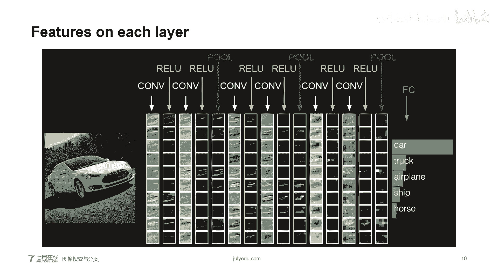

卷积神经网络主要解决目标识别问题。目标识别是指当看到一张照片时，能够识别出照片的主体是什么，例如区分照片中是猫、狗、建筑还是人。这个问题统称为分类问题。

### 机器如何进行图像分类？

人类通过寻找图像的相同点和不同点（如大小、形状、材质）来分类。机器则依靠寻找图像的特征来进行判别。特征在英文中称为“feature”。

以下是机器识别图像时依赖的主要特征类型：

*   **颜色特征**：计算机将颜色用数值表示，常见的方法如RGB（红、绿、蓝）模型，通过三维数值组合成各种颜色。
*   **形状特征**：例如图像中的线条、角、不规则结构等。
*   **纹理特征**：图像中大量重复的图案模式。

机器通过摄像头捕捉图像，在图像上找到这些特征，并将低级特征组合成高级特征，最终完成分类。

### CNN的基本结构

一个典型的CNN由三部分构成：输入端、输出端和中间的隐藏层。

*   **输入端**：输入一张图片。
*   **输出端**：输出分类结果，例如有3类电脑（笔记本电脑、台式机、平板电脑），则输出端对应3个节点。
*   **隐藏层**：位于输入和输出之间，其层数可以人为定义。隐藏层的主要目标是找出图像的各种特征。越靠近输入端的层，找到的特征越低级（如边缘、角点）；越靠近输出端的层，找到的特征越高级（如物体部件、整体形状）。

### 卷积层与卷积核

CNN的核心组件是卷积层，其核心操作是卷积，依赖于卷积核（也称为过滤器）。

*   **卷积核**：是一个小矩阵（如3x3x3），其作用是像过滤器一样在图像上滑动，搜索特定的模式（如斜线、竖线、圆角）。不同的卷积核用于检测不同的特征。
*   **卷积操作**：卷积核在输入图像上从左到右、从上到下滑动。在每个位置，卷积核与对应的图像区域进行元素相乘并求和，得到一个数值，所有数值组成一个新的矩阵，称为特征图。

在卷积操作中，有两个重要概念：

*   **填充**：在图像外围填充像素（通常为0），以确保卷积核能扫描到图像边缘的每一个像素。
*   **步长**：卷积核每次滑动的像素距离。步长越大，扫描速度越快，但可能忽略细节；步长越小，特征提取越精细，但计算量越大。

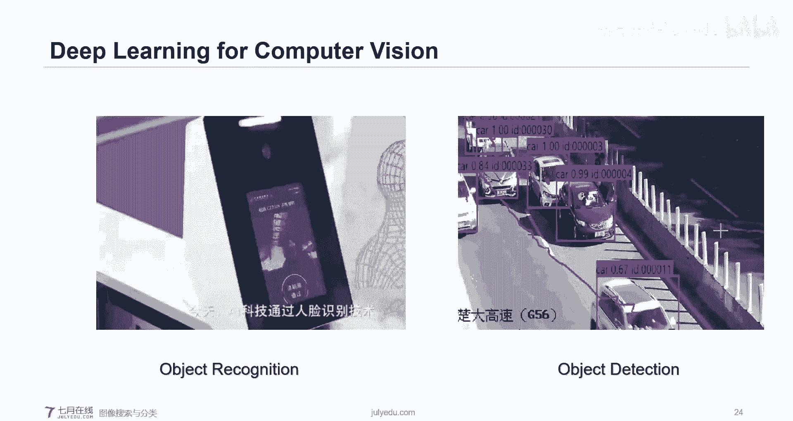

### 池化层

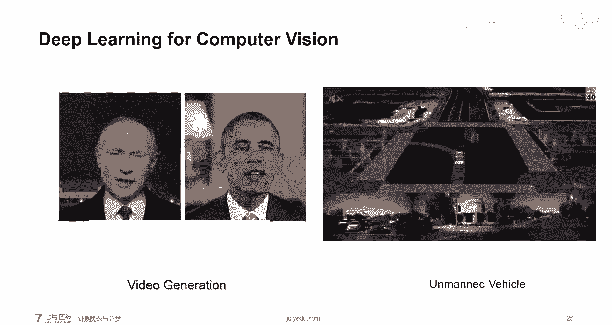

在卷积层之后，通常会连接一个池化层。

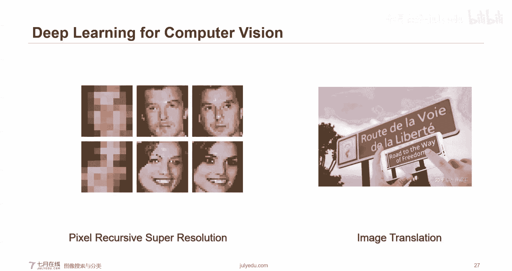

*   **作用**：对卷积层输出的特征图进行下采样，减少数据量，同时保留主要特征，并增强模型的平移不变性。
*   **常见操作**：最大池化（取区域内最大值）或平均池化（取区域内平均值）。例如，将一个4x4的区域分成4个2x2的小块，对每个小块取最大值，最终得到一个2x2的输出。

卷积层和池化层可以组合成一个基本的隐藏层模块，并在网络中重复多次。

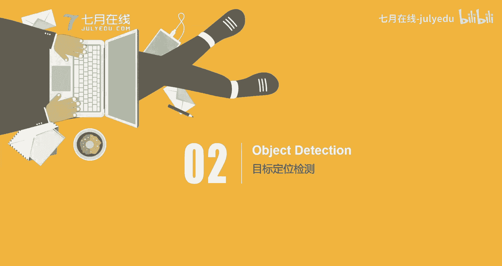

### 从特征到分类

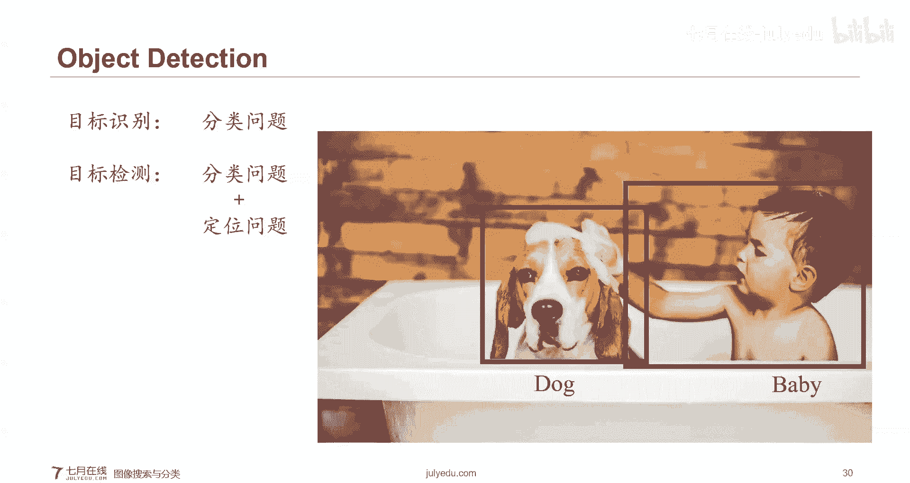

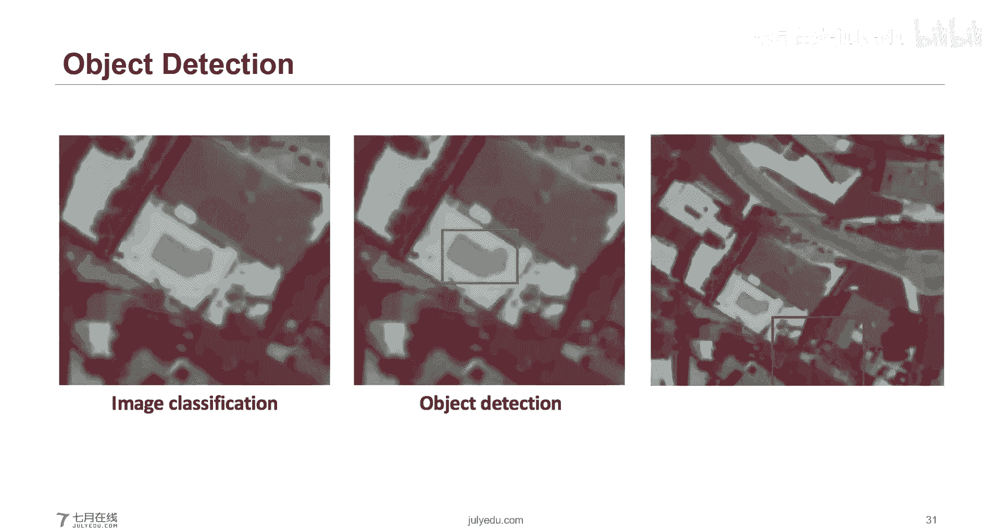

经过多层卷积和池化后，网络会输出一个三维特征图。为了进行分类，需要将这个三维特征图“拉平”成一维向量，然后连接一个或多个全连接层。

*   **全连接层**：将前面提取的所有特征进行综合，最终映射到输出层的各个类别节点上。
*   **输出与训练**：输出层每个节点代表一个类别的概率。训练网络时，我们输入已知标签的图片（如猫的图片，标签为“猫”），通过调整网络内部参数，使得网络对于猫图片的输出中“猫”对应的概率最高。训练完成后，网络便能对新的、未见过的图片进行分类。

### CNN的发展与应用

CNN自提出以来，网络层数不断加深，性能持续提升，例如AlexNet、VGG、GoogLeNet、ResNet等。如今，我们通常使用深度学习框架来构建CNN，无需手动设计每一层和过滤器。

CNN的应用非常广泛，包括：
*   目标识别（如人脸识别、Face ID）
*   目标检测（如交通监控、无人驾驶）
*   图像生成（如风格迁移，将普通照片转化为梵高画作风格）
*   医学图像分析等。

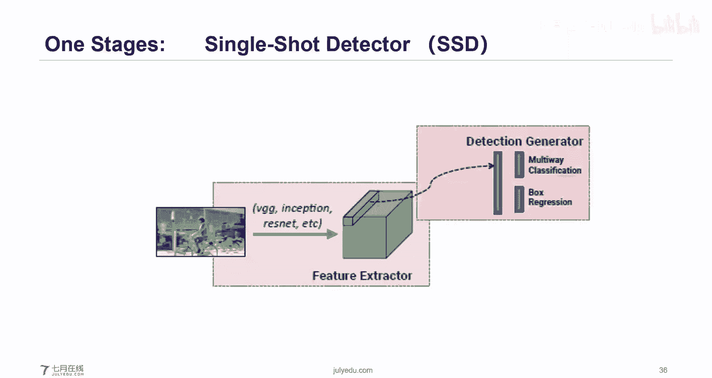

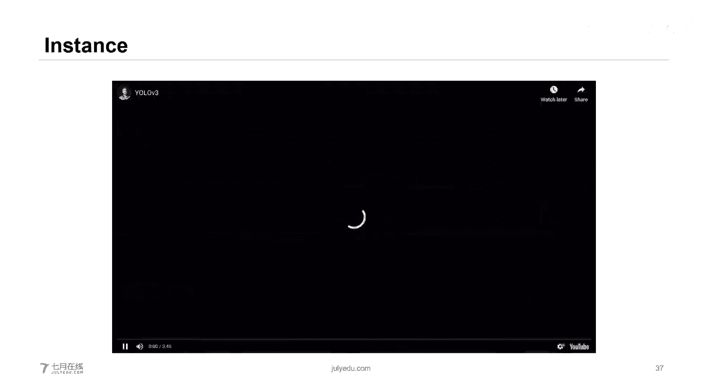

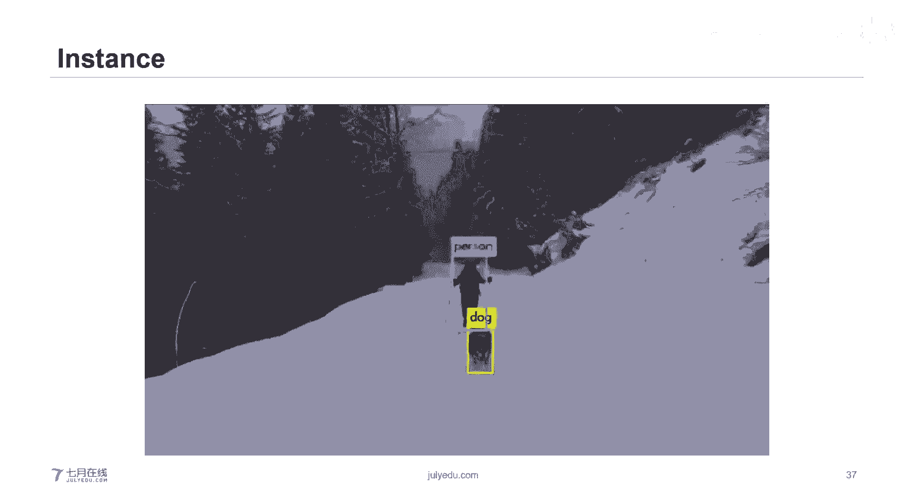

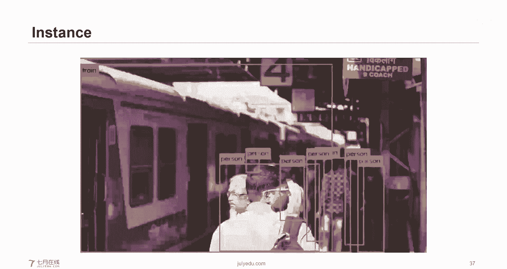

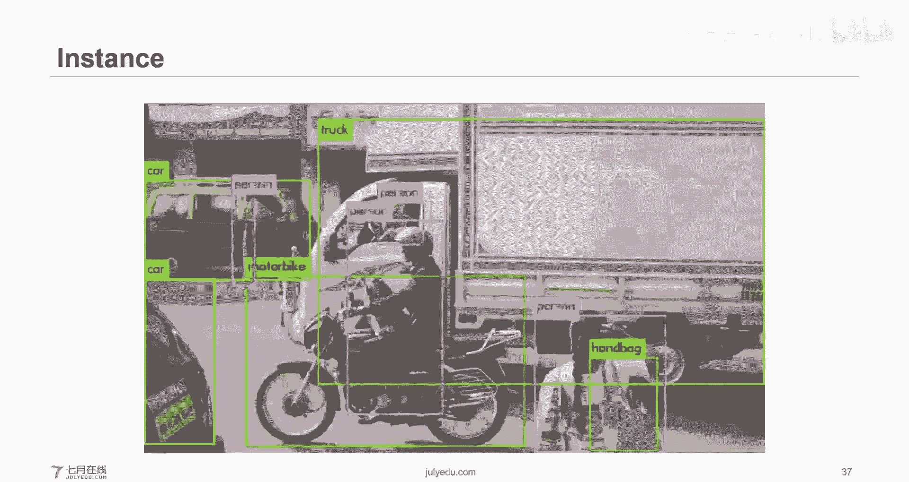

---

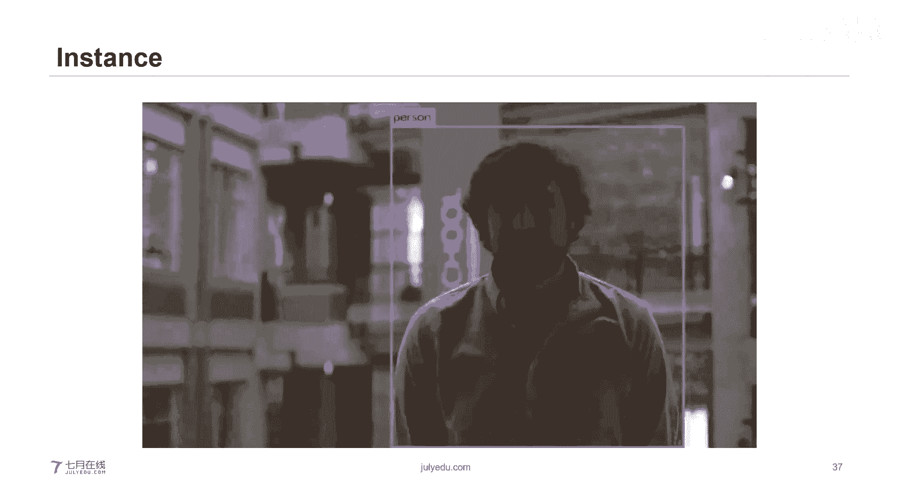

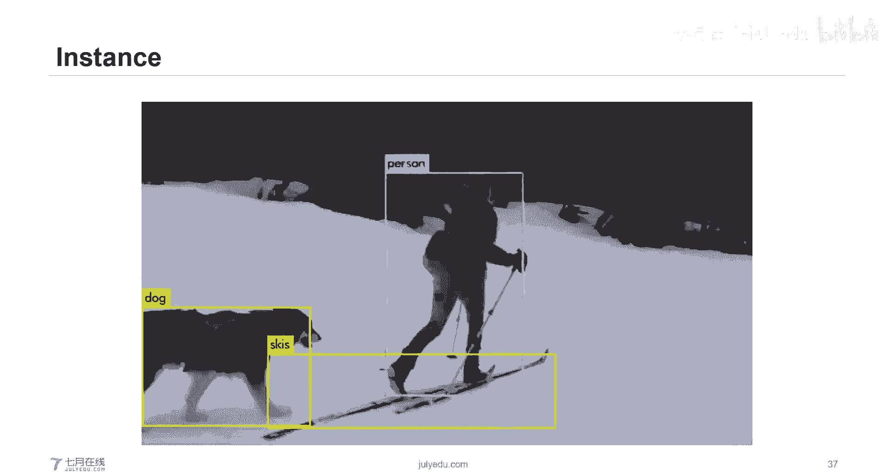

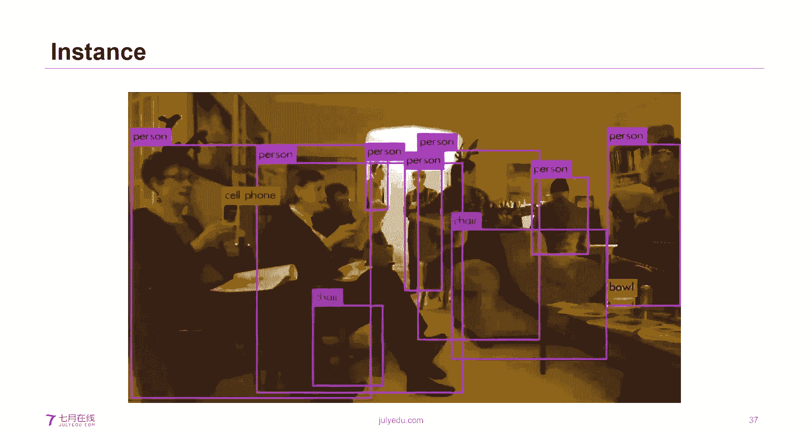

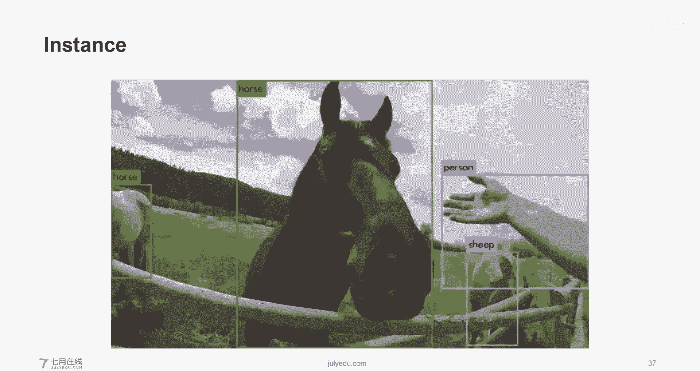

## 🔍 第二部分：目标检测与定位

上一节我们介绍了用于图像分类的CNN，本节中我们来看看目标检测。目标检测在分类的基础上，增加了定位任务，即不仅要识别出物体是什么，还要用边界框标出它在图像中的位置。

### 从分类到检测

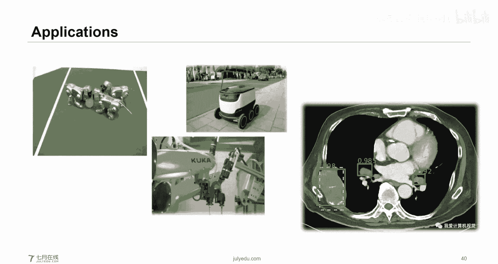

目标识别是一个分类问题，例如判断图像中是狗还是婴儿。目标检测则是一个“分类+定位”问题，需要在图像中找到目标并用矩形框圈出，例如在一张有狗和婴儿的图片中，分别用框标出狗和婴儿的位置。

### 目标检测的主要方法

传统方法（如滑动窗口）效率低下。现代基于深度学习的目标检测方法主要分为两大流派：

1.  **两阶段检测**：首先生成一系列可能包含目标的候选区域，然后对这些候选区域进行分类和精确边框回归。**精度通常较高，但速度较慢**。
    *   **代表算法**：R-CNN系列、Fast R-CNN、Faster R-CNN、Mask R-CNN。
2.  **一阶段检测**：直接在图像的不同位置进行密集抽样和预测，一步到位地输出分类和边框信息。**速度非常快，但精度传统上略低于两阶段方法**。
    *   **代表算法**：YOLO系列、SSD、RetinaNet、CornerNet。

近年来，一些新算法（如CornerNet-Lite）致力于结合两者的优点，在保持高速度的同时提升精度。

### 目标检测的应用

目标检测技术已广泛应用于各个领域：
*   **车牌识别**：自动定位并识别车牌号码。
*   **智能交通**：检测车辆、行人，分析车流轨迹，进行碰撞预警。
*   **行人检测**：公共安全监控。
*   **图像搜索**：通过拍摄物体搜索相关信息。
*   **机器人**：帮助机器人定位和抓取物体。
*   **工业自动化**：机械臂的视觉引导。
*   **医疗影像**：辅助医生定位病变区域。

---

## 🎨 第三部分：变分自编码器（VAE）

上一节我们讨论了如何检测和定位图像中的物体，本节中我们来看看如何生成图像。变分自编码器是一种强大的生成模型。

### 从自编码器到变分自编码器

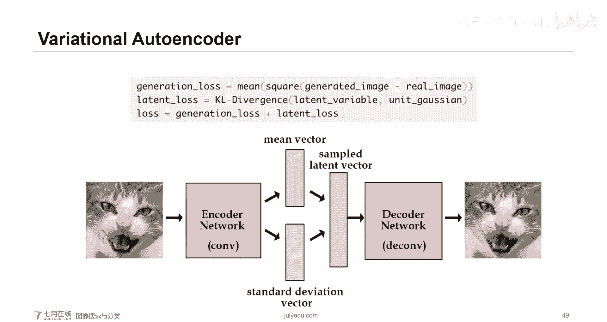

*   **自编码器**：一种神经网络，目标是学习输入数据的压缩表示（编码），并能从这个压缩表示中重建出原始数据（解码）。训练目标是让输出尽可能接近输入，相当于一个高效的数据压缩和重建工具。
*   **变分自编码器的改进**：标准自编码器学到的编码空间不规则，难以用于生成新数据。VAE对其进行了关键改进：
    1.  **约束编码**：强迫编码器产生的潜在变量服从一个简单的先验分布（通常是标准高斯分布）。
    2.  **采样生成**：从这个分布中采样，然后将采样点输入解码器，即可生成新的图像。
    3.  **平衡优化**：通过一个损失函数同时优化两项：**重建损失**（生成图像与原始图像的差异）和**KL散度损失**（潜在变量分布与标准高斯分布的差异）。这使得VAE既能生成多样化的新图像，又能保证生成图像的质量和合理性。

VAE使我们能够通过操纵潜在空间中的点，来生成具有特定特征的、全新的图像。

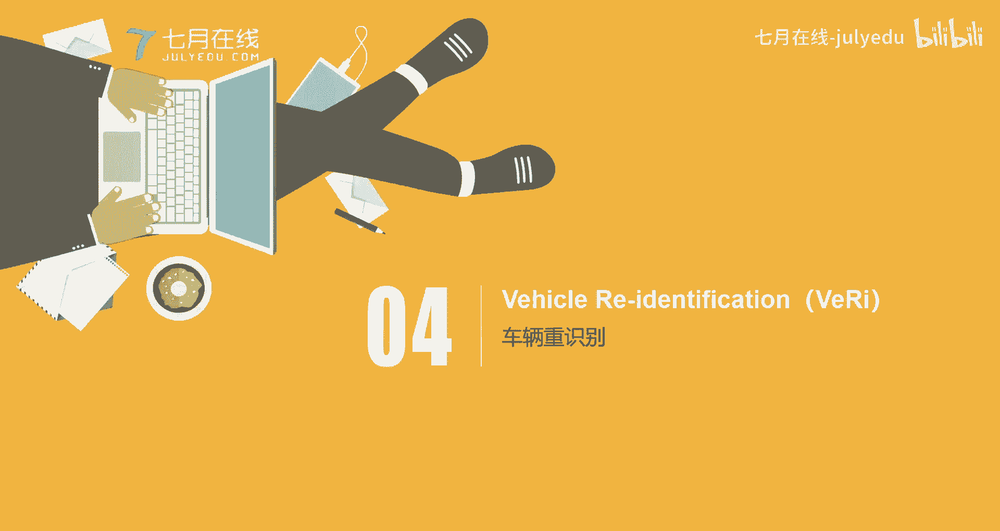

---

## 🚗 第四部分：车辆重识别

上一节我们介绍了生成图像的VAE，本节我们来看一个具体的应用难题——车辆重识别。车辆重识别是指在不同的时间、不同的摄像头视角下，重新识别并跟踪同一辆车辆。

### 什么是车辆重识别？

已知在某一时刻、某一地点出现过的目标车辆，经过一段时间后，在可能覆盖的区域（如城市道路网络）中，重新定位并跟踪到这辆车。

### 车辆重识别的流程与挑战

一个典型的车辆重识别系统通常包含以下步骤：
1.  **确立假设空间**：根据车辆最大可能行驶速度，划定一个合理的圆形搜索区域。
2.  **缩小搜索空间**：结合地图信息，过滤掉非道路区域（如湖泊、学校），极大缩小搜索范围。
3.  **筛选候选数据**：召回该区域内所有摄像头在相关时间段抓拍到的车辆图像。
4.  **确定可疑车辆**：在候选车辆中，通过比对找到目标车辆。

这个过程面临诸多挑战：
*   **视角差异**：同一车辆在不同角度拍摄的照片差异很大。
*   **摄像头差异**：不同摄像头的分辨率、光照条件不同。
*   **车牌信息缺失或模糊**：车牌被遮挡、污损，或高速运动导致图像模糊。
*   **行驶路线不确定性**：交通状况、天气等因素可能改变车辆既定路线。

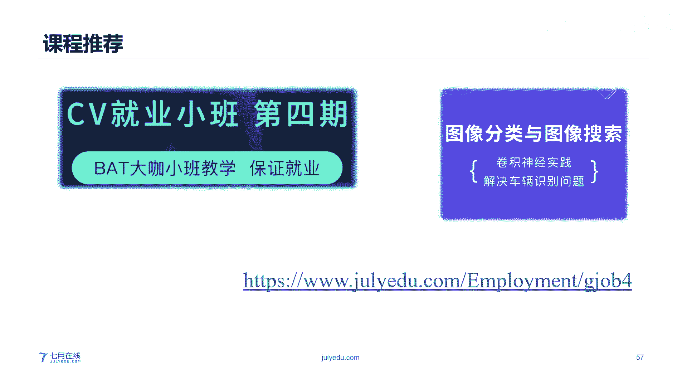

### 关键技术：如何应对模糊车牌？

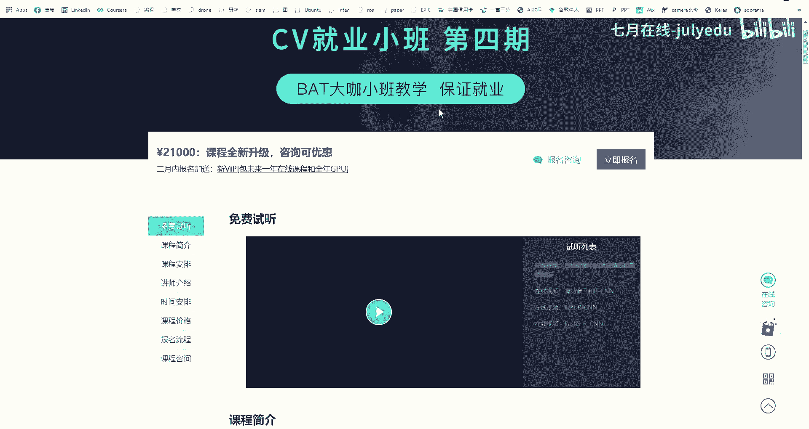

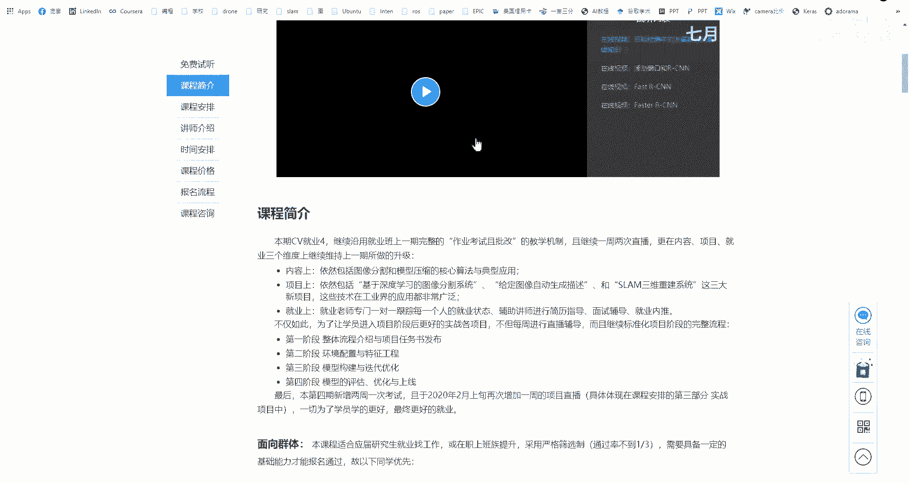

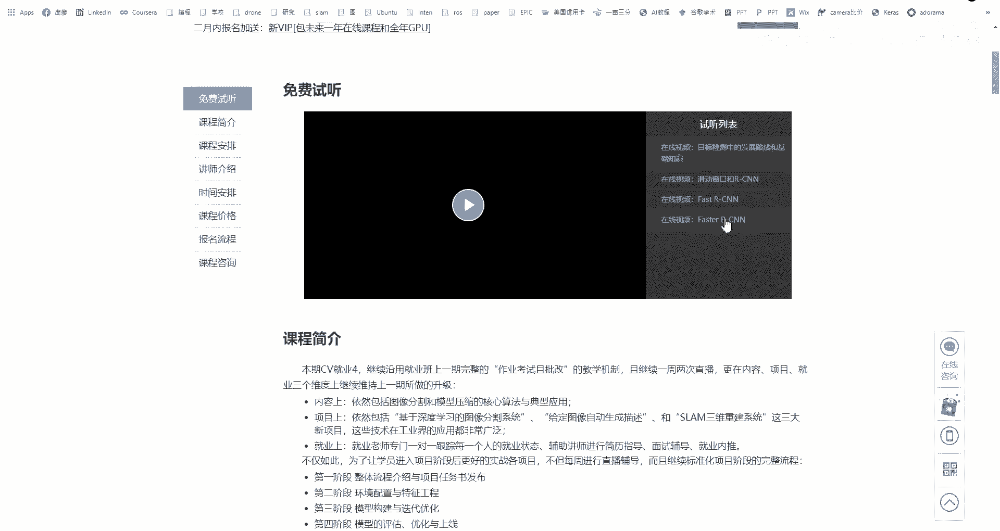

当车牌清晰时，直接进行字符识别即可匹配。但当车牌模糊时，可以采用“验证”而非“识别”的策略：
1.  使用目标检测模型截取出候选车辆的车牌区域。
2.  利用**孪生神经网络**来比较两个车牌区域的相似度。
    *   孪生神经网络由两个结构、参数完全相同的子网络组成。
    *   输入是两张车牌图片，分别通过子网络提取特征编码。
    *   计算两个特征编码之间的相似度（如欧氏距离）。
    *   相似度越高，说明是同一车牌的可能性越大。这样就不需要精确识别出模糊的车牌字符，只需判断两个车牌是否相似。

---

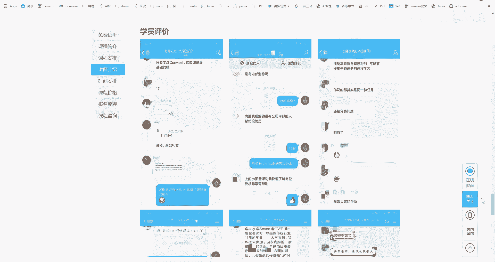

## 📚 课程总结

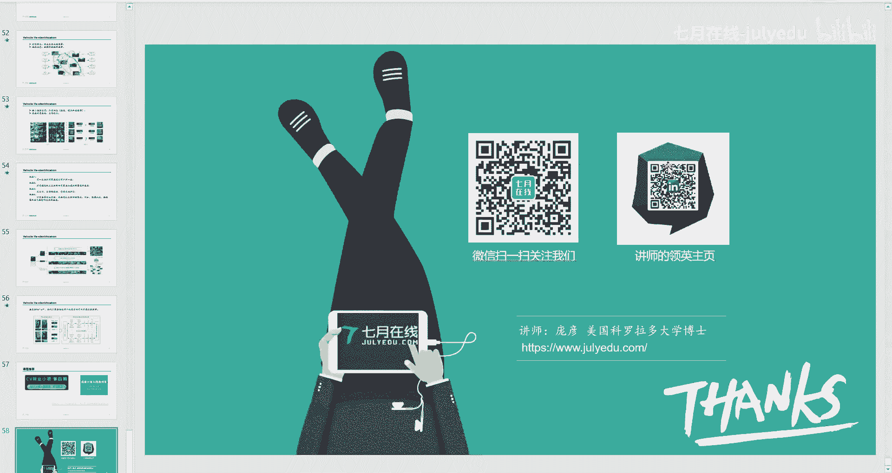

本节课中我们一起学习了计算机视觉中图像搜索与分类的四个核心主题：

1.  **卷积神经网络**：作为计算机视觉的基石，CNN通过卷积、池化等操作自动提取图像特征，完成高效的图像分类任务。
2.  **目标检测与定位**：在分类基础上发展而来，能够定位图像中多个物体的位置，主要分为精度高的两阶段方法和速度快的一阶段方法。
3.  **变分自编码器**：一种生成模型，通过编码-解码结构和潜在空间约束，能够学习数据分布并生成新的图像样本。
4.  **车辆重识别**：一个综合性的应用实例，结合了时空信息、外观过滤、车牌验证（尤其是应对模糊情况的孪生网络技术）来解决跨摄像头、跨时间的车辆追踪难题。

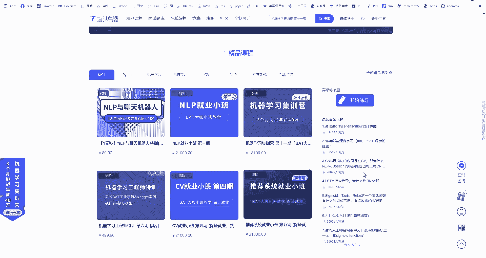

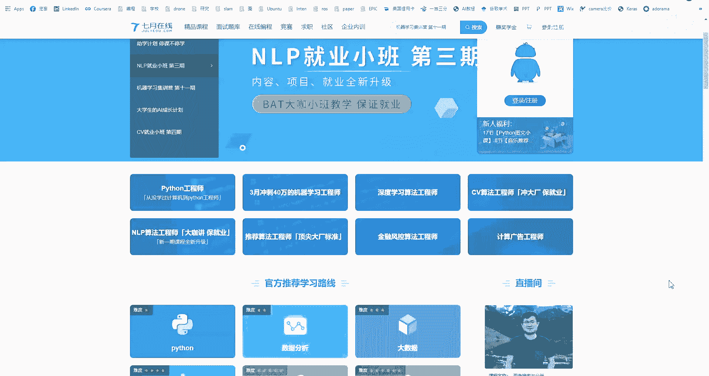

这些技术构成了现代图像搜索、分类与理解系统的基础，并广泛应用于安防、交通、医疗、娱乐等众多领域。希望本教程能帮助你建立起对计算机视觉这些核心概念的初步理解。