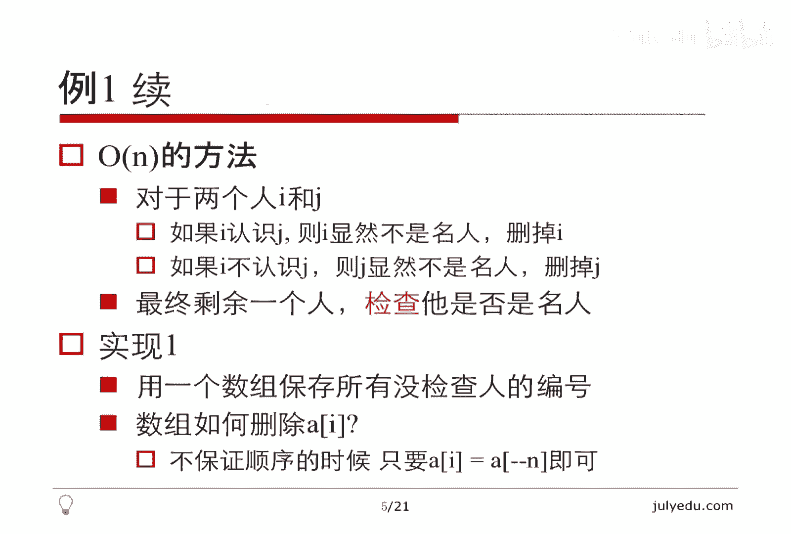
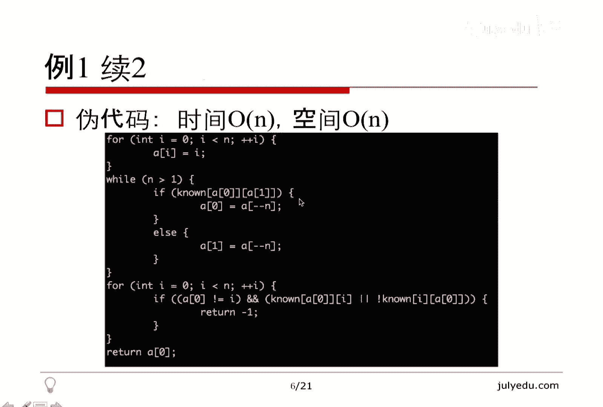
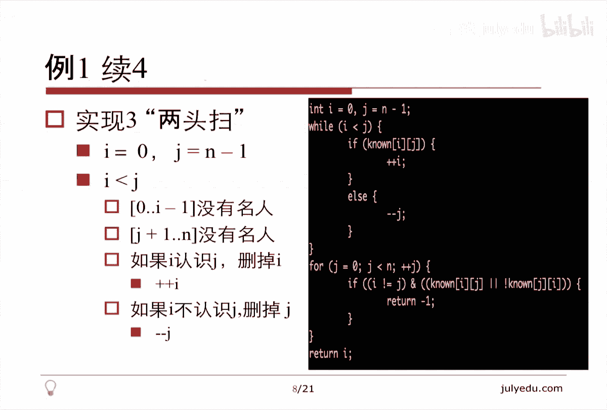
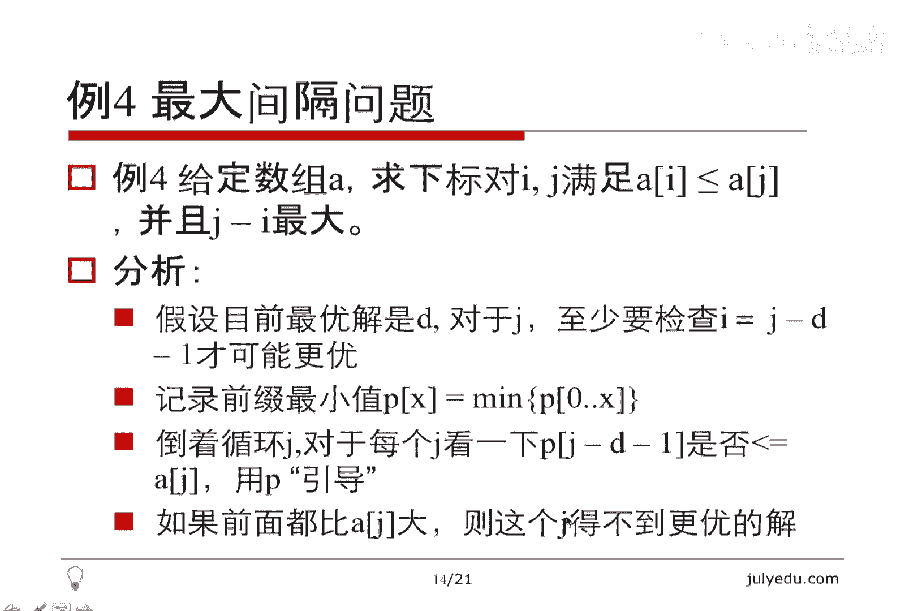
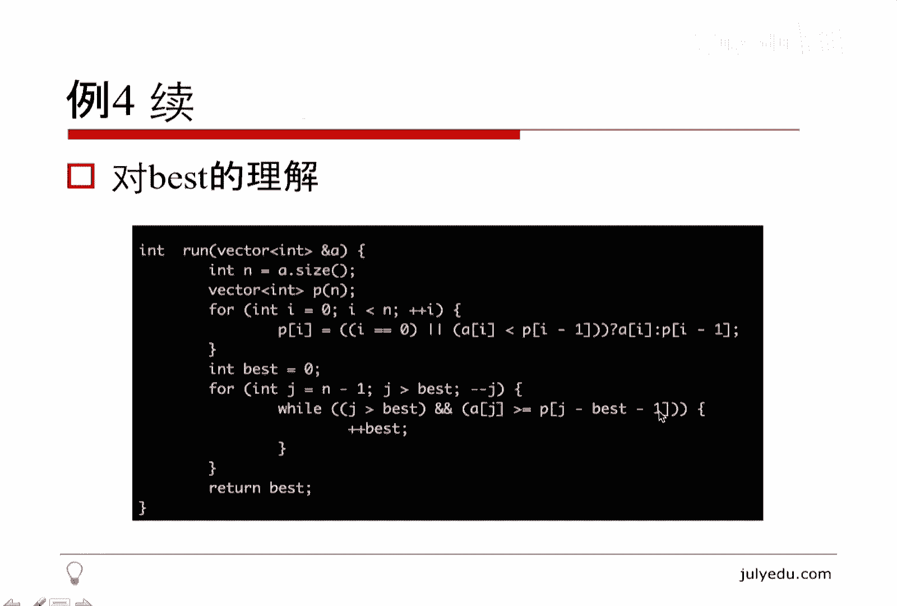
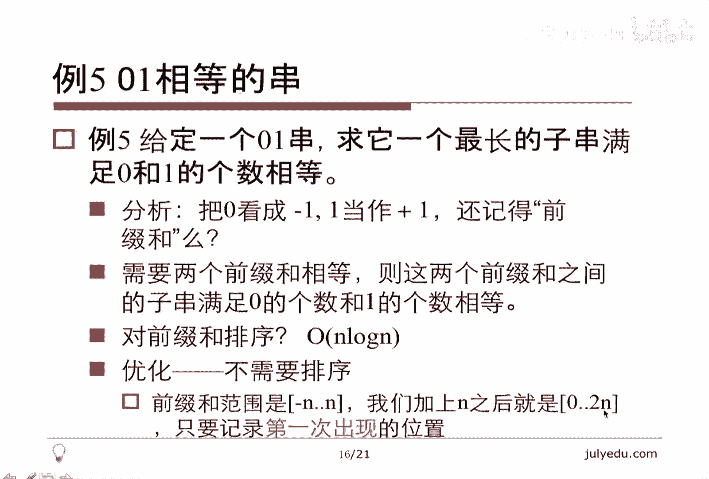
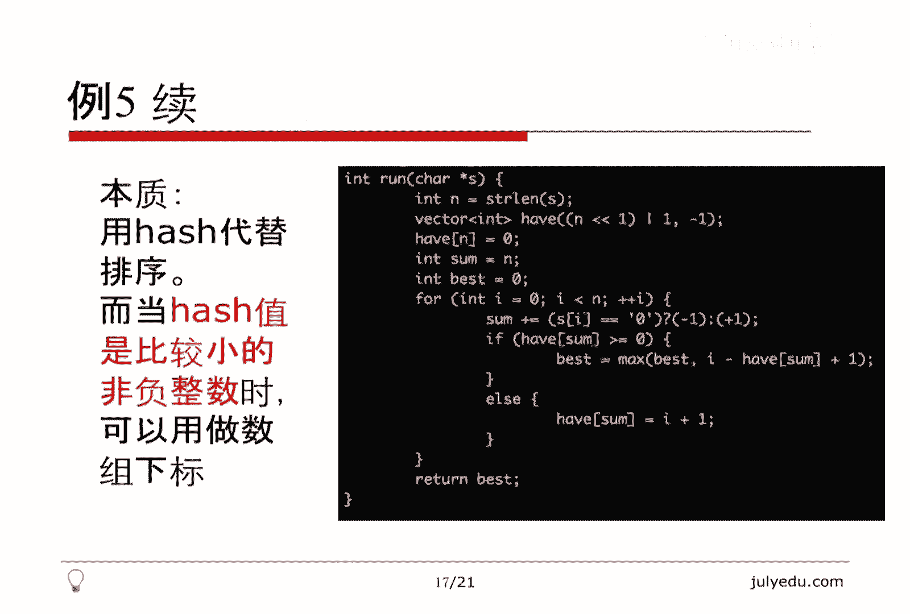
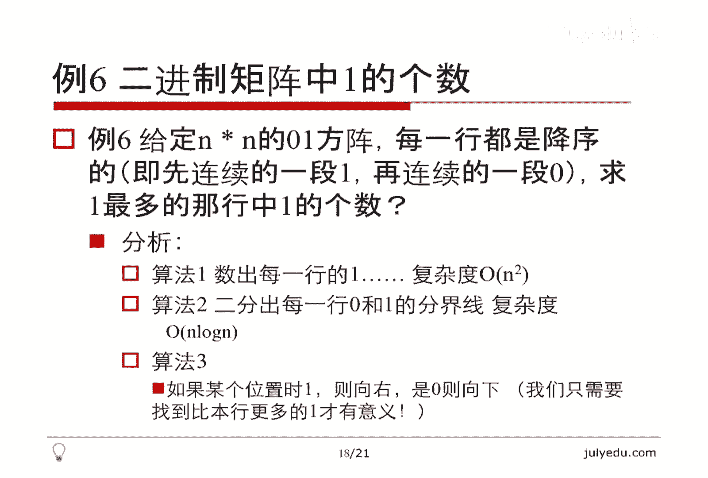
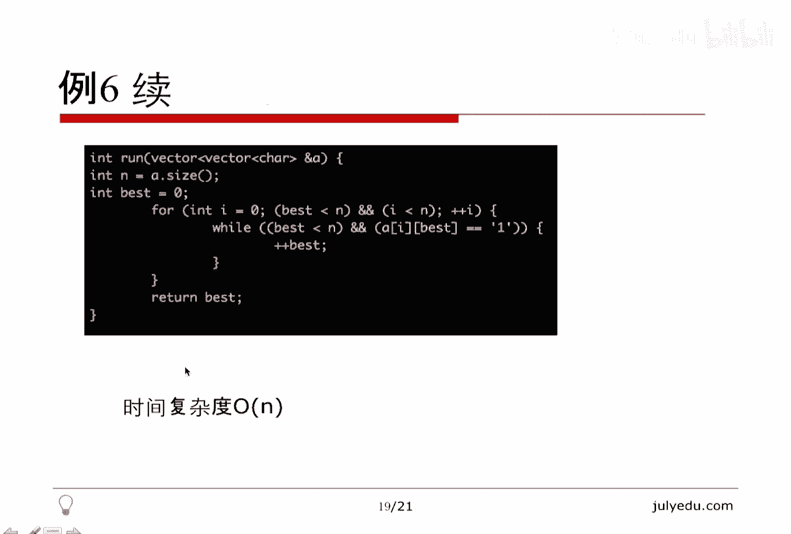
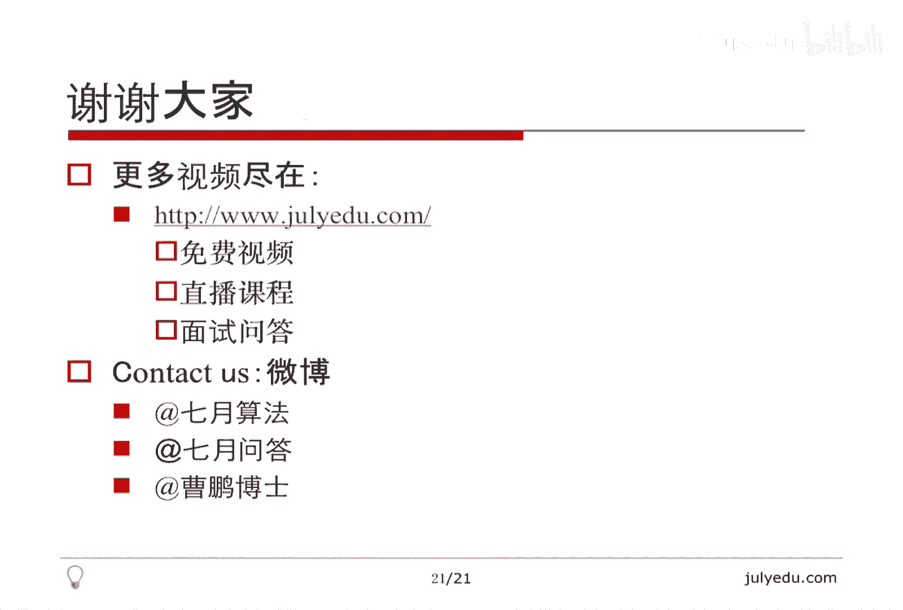

# 人工智能—面试求职公开课（七月在线出品） - P1：O(N)时间解决的面试题(上) 🧠

在本节课中，我们将学习一系列可以在 **O(N)** 时间复杂度内解决的经典面试题。理解并掌握这些线性时间算法，对于应对技术面试至关重要。我们将从基础概念入手，通过六个具体的例题，深入探讨如何设计并优化线性时间算法。

## 课程简介 📖

首先，我们需要明确 **O(N)** 中的 **N** 具体指代什么。**N** 代表问题的输入规模。例如，如果输入是一个图，我们需要明确 **N** 是指节点数还是边数。对于一个稠密图，边数可能是节点数的平方级别。因此，当我们说算法是 **O(N)** 时，必须清楚这个线性是相对于哪种输入规模而言的。

在方法上，**O(N)** 最直观的理解是扫描一遍输入，例如一个循环 **N** 次的简单遍历。但线性算法远不止于此，常见的形式还包括：
*   **双指针扫描**：从两端向中间或同向移动。
*   **看似嵌套但总次数为 O(N) 的循环**：关键在于内层循环的变量不减小，总循环次数与 **N** 成线性关系。
*   **利用数据结构的单调性**：如单调队列或单调栈，可以将复杂问题转化为线性时间可解的问题。

接下来，我们将通过具体问题来实践这些思想。

## 例题一：名人问题（社会名流问题） 👑

**问题描述**：给定一个 `N x N` 的矩阵 `M`，`M[i][j] = 1` 表示人物 `i` 认识人物 `j`，`M[i][j] = 0` 则表示不认识。矩阵不一定对称（即 `i` 认识 `j` 不代表 `j` 认识 `i`）。名人的定义是：他不认识任何其他人，但其他所有人都认识他。请找出所有名人。



**关键洞察**：一个群体中最多只能有一个名人。可以通过两两比较来排除不可能的人选。



**O(N²) 的朴素算法**：对于每个人 `i`，检查是否所有 `j` 都满足 `(i 不认识 j) 且 (j 认识 i)`。这需要两层循环。

**O(N) 的优化算法**：我们可以利用一次遍历找出可能的候选人。
1.  初始化候选人 `cand = 0`。
2.  遍历其他人 `i` (从 1 到 N-1)：
    *   如果 `cand` 认识 `i`，则 `cand` 不可能是名人，将 `cand` 更新为 `i`。
    *   如果 `cand` 不认识 `i`，则 `i` 不可能是名人，继续检查下一个 `i`。
3.  遍历结束后，`cand` 是唯一可能的候选人。最后，我们需要验证 `cand` 是否真的满足名人条件（即他不认识任何人，且所有人都认识他）。这个验证过程也是 O(N)。

**算法实现（O(1) 空间）**：
```python
def findCelebrity(M):
    n = len(M)
    cand = 0
    # 第一遍扫描，找出候选人
    for i in range(1, n):
        if M[cand][i]:  # cand 认识 i，cand 不是名人
            cand = i
    # 第二遍扫描，验证候选人
    for i in range(n):
        if i != cand and (M[cand][i] or not M[i][cand]):
            return -1  # cand 不是名人
    return cand
```
**算法分析**：时间复杂度为 **O(N)**，空间复杂度为 **O(1)**。我们通过巧妙的比较和排除，将问题规模线性减小。

## 例题二：接雨水问题（LeetCode 42） 💧



**问题描述**：给定 `n` 个非负整数表示每个宽度为 1 的柱子的高度图，计算按此排列的柱子，下雨之后能接多少雨水。

**核心思路**：对于第 `i` 个位置，它能接到的雨水量取决于它**左边最高柱子**和**右边最高柱子**中较矮的那个，再减去它自身的高度。公式为：
`water[i] = min(left_max[i], right_max[i]) - height[i]`

**O(N) 算法步骤**：
1.  计算前缀最大值数组 `left_max`，其中 `left_max[i]` 表示位置 `i` 及其左边柱子的最大高度。
2.  计算后缀最大值数组 `right_max`，其中 `right_max[i]` 表示位置 `i` 及其右边柱子的最大高度。
3.  遍历每个位置 `i`，累加 `min(left_max[i], right_max[i]) - height[i]`。

**算法实现**：
```python
def trap(height):
    if not height:
        return 0
    n = len(height)
    left_max = [0] * n
    right_max = [0] * n
    ans = 0

    # 计算前缀最大值
    left_max[0] = height[0]
    for i in range(1, n):
        left_max[i] = max(left_max[i-1], height[i])

    # 计算后缀最大值
    right_max[n-1] = height[n-1]
    for i in range(n-2, -1, -1):
        right_max[i] = max(right_max[i+1], height[i])

    # 计算总雨水量
    for i in range(n):
        ans += min(left_max[i], right_max[i]) - height[i]
    return ans
```
**算法分析**：我们通过三次线性扫描，分别计算前缀最大值、后缀最大值和最终结果，总时间复杂度为 **O(N)**，空间复杂度为 **O(N)**（用于存储两个最大值数组）。此方法直观地应用了动态规划的思想。

## 例题三：盛最多水的容器（LeetCode 11） 🏺

**问题描述**：给定一个长度为 `n` 的整数数组 `height`，代表 `n` 条垂直线的高度。找出其中的两条线，使得它们与 `x` 轴共同构成的容器可以容纳最多的水。

**核心思路**：容器的盛水量由**两条线的距离（底边）**和**两条线中较短者的高度（高）**决定，即面积 `S = min(height[i], height[j]) * (j - i)`。

**O(N²) 的朴素算法**：枚举所有可能的 `(i, j)` 组合。

**O(N) 的双指针算法**：
1.  初始化指针 `i = 0`, `j = n - 1`，以及最大面积 `max_area = 0`。
2.  当 `i < j` 时循环：
    *   计算当前面积 `area = min(height[i], height[j]) * (j - i)`，并更新 `max_area`。
    *   移动**高度较小**的指针：如果 `height[i] < height[j]`，则 `i += 1`；否则 `j -= 1`。

**算法正确性证明（简要）**：关键在于，每次移动高度较小的指针，是在**舍弃**不可能成为更优解的情况。因为容器的盛水量受限于较短边，固定短边并移动长边，宽度在减小，面积只会更小。因此，只有移动短边，才有可能在后续遇到更高的边，从而获得更大的面积。这个策略保证了最优解一定会被遍历到。

**算法实现**：
```python
def maxArea(height):
    i, j = 0, len(height) - 1
    max_area = 0
    while i < j:
        h = min(height[i], height[j])
        max_area = max(max_area, h * (j - i))
        if height[i] < height[j]:
            i += 1
        else:
            j -= 1
    return max_area
```
**算法分析**：指针 `i` 和 `j` 总共移动 `n-1` 次，时间复杂度为 **O(N)**，空间复杂度为 **O(1)**。这是一个利用问题特性进行贪心选择的经典例子。

## 例题四：最大间距问题 📏

**问题描述**：给定一个无序数组，找出数组在排序后，相邻元素之间最大的差值。要求在线性时间和空间内完成。



**挑战**：直接排序需要 O(N log N) 时间。我们需要一个 O(N) 的算法。

**O(N) 的桶排序思想算法**：
1.  找出数组中的最大值 `max_val` 和最小值 `min_val`。
2.  计算桶的容量 `bucket_size = max(1, (max_val - min_val) // (n - 1))` 和桶的数量 `bucket_num = (max_val - min_val) // bucket_size + 1`。
3.  创建 `bucket_num` 个桶，每个桶只记录该桶内的最大值和最小值。
4.  遍历数组，将每个元素放入对应的桶中（`index = (num - min_val) // bucket_size`），并更新该桶的最大最小值。
5.  遍历所有桶，最大间距只可能出现在**前一个非空桶的最大值**和**后一个非空桶的最小值**之间。



**算法实现（核心逻辑）**：
```python
def maximumGap(nums):
    if len(nums) < 2:
        return 0
    min_val, max_val = min(nums), max(nums)
    n = len(nums)
    bucket_size = max(1, (max_val - min_val) // (n - 1))
    bucket_num = (max_val - min_val) // bucket_size + 1

    buckets = [[float('inf'), float('-inf')] for _ in range(bucket_num)]

    for num in nums:
        idx = (num - min_val) // bucket_size
        buckets[idx][0] = min(buckets[idx][0], num)
        buckets[idx][1] = max(buckets[idx][1], num)

    max_gap = 0
    prev_max = min_val
    for i in range(bucket_num):
        if buckets[i][0] == float('inf'):  # 空桶
            continue
        max_gap = max(max_gap, buckets[i][0] - prev_max)
        prev_max = buckets[i][1]
    return max_gap
```
**算法分析**：此算法基于桶排序，但无需对桶内元素完全排序。我们利用了“最大间距一定不小于 `(max_val - min_val) / (n-1)`”这一特性来设置桶的大小，从而确保最大间距不会出现在桶内，只可能出现在桶间。时间复杂度为 **O(N)**，空间复杂度为 **O(N)**。

## 例题五：连续子数组：0 和 1 个数相等的最长子串 🔢

**问题描述**：给定一个二进制数组（只包含 0 和 1），找到含有相同数量的 0 和 1 的**最长连续子数组**，并返回该子数组的长度。

**核心转化**：将问题中的 0 视为 -1，1 视为 1。那么，“子数组中 0 和 1 数量相等” 就等价于 “子数组的和为 0”。进一步，子数组 `nums[i:j]` 的和为 0 等价于前缀和 `prefix_sum[j]` 等于前缀和 `prefix_sum[i-1]`。



**O(N) 的哈希表算法**：
1.  使用一个变量 `cur_sum` 记录当前的前缀和（初始为0），一个哈希表 `map` 记录每个前缀和**第一次出现**的下标（初始 `{0: -1}`，表示前缀和为0在索引-1处出现，用于处理从开头开始的子数组）。
2.  遍历数组：
    *   更新当前前缀和：`cur_sum += 1 if nums[i]==1 else -1`。
    *   如果 `cur_sum` 在哈希表中出现过（设第一次出现在 `index`），那么从 `index+1` 到 `i` 的子数组和为0，长度为 `i - index`。
    *   如果 `cur_sum` 没出现过，则将其值 `cur_sum` 和当前索引 `i` 存入哈希表。
3.  遍历过程中记录找到的最大长度。

**算法实现**：
```python
def findMaxLength(nums):
    sum_index_map = {0: -1}
    cur_sum = 0
    max_len = 0
    for i, num in enumerate(nums):
        cur_sum += 1 if num == 1 else -1
        if cur_sum in sum_index_map:
            max_len = max(max_len, i - sum_index_map[cur_sum])
        else:
            sum_index_map[cur_sum] = i
    return max_len
```
**算法分析**：通过将前缀和作为键存入哈希表，我们可以在 O(1) 时间内查询到某个和是否出现过，从而将寻找相等前缀和的时间复杂度从 O(N log N)（排序）降低到 O(N)。总时间复杂度为 **O(N)**，空间复杂度为 **O(N)**（最坏情况下需要存储 N 个不同的前缀和）。

## 例题六：行降序 01 矩阵中 1 最多的行 🔍



**问题描述**：给定一个 `N x N` 的 01 矩阵，其中每一行都是降序排列（即先出现连续的 1，后出现连续的 0）。找出 1 的数量最多的那一行，并返回其 1 的个数。要求时间复杂度 O(N)。

**关键观察**：由于矩阵是 `N x N` 的，且每行有序，一个 O(N log N) 的算法是对每行进行二分查找，找到第一个 0 的位置。但我们可以利用全局信息做得更好。

**O(N) 的走楼梯算法**：
1.  初始化答案 `max_ones = 0`，以及列指针 `col = 0`。
2.  从第一行 (`row = 0`) 开始遍历：
    *   在当前行，从当前列 `col` 开始向右移动，只要 `matrix[row][col] == 1`，就增加 `col` 和 `max_ones` 的计数。
    *   当遇到 `matrix[row][col] == 0` 或 `col == N` 时，停止向右。此时 `max_ones` 记录了到当前行为止看到的最大 1 的数量，`col` 指向了第一个 0 出现的位置（或末尾）。
    *   移动到下一行 (`row += 1`)。因为下一行的 `col` 列及之后的位置，如果还是 1，那么该行的 1 可能更多；如果是 0，则该行不可能超过当前的 `max_ones`，列指针 `col` 无需回退。

**算法分析**：列指针 `col` 在整个过程中只增不减，从 0 最多增加到 N。行指针 `row` 从 0 遍历到 N-1。因此总操作次数约为 `2N`，时间复杂度为 **O(N)**，空间复杂度为 **O(1)**。这个算法巧妙地利用了矩阵的行有序性和问题的目标，避免了不必要的重复检查。

## 总结与延伸 🎯



本节课我们一起学习了六个可以在 **O(N)** 线性时间内解决的面试算法问题。我们回顾一下核心要点：



1.  **明确问题规模 N**：始终要清楚算法复杂度中的 N 具体指代什么（如节点数、边数、数组长度）。
2.  **掌握经典模式**：
    *   **双指针/滑动窗口**：用于子数组、链表等问题（例题三、六）。
    *   **前缀和/前缀最值**：用于快速计算区间属性和比较（例题二、五）。
    *   **哈希表优化查找**：将查找时间从 O(log N) 或 O(N) 降至 O(1)（例题五）。
    *   **桶排序思想**：用于在特定条件下实现线性排序或统计（例题四）。
    *   **利用单调性**：通过排除不可能的解来缩小搜索空间（例题一、三、六）。
3.  **复杂度分析本质**：不要简单地数循环嵌套层数，而要分析**基本操作的总执行次数**与输入规模 N 的关系。

线性时间算法在面试中极为常见，除了本节课的例题，还有许多其他经典问题，例如：
*   链表相关（环检测、相交节点、反转等）
*   二叉树遍历（前序、中序、后序、层序）
*   使用 Partition 操作的问题（快速选择、颜色分类）
*   使用单调栈/队列的问题（柱状图中最大矩形、滑动窗口最大值）

要想熟练掌握，**多思考、多练习、多总结**是关键。希望本课程能帮助你建立起对 O(N) 算法的感性认识和理性分析框架，在面试中更加游刃有余。




---
**版权说明**：本课程内容基于《人工智能—面试求职公开课（七月在线出品）》P1 部分进行翻译、整理和再创作。核心算法思想与案例归原课程所有。