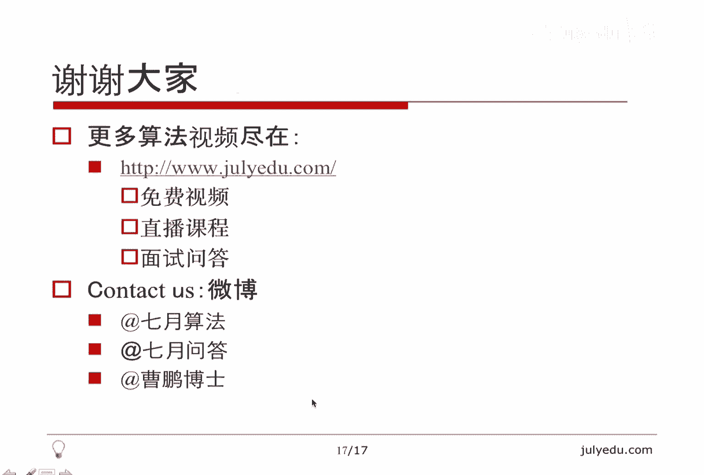

# 人工智能—面试求职公开课（七月在线出品） - P12：字符串高频面试题精讲 📝


在本节课中，我们将学习字符串相关的高频面试题。课程将从字符串的基本概念讲起，梳理常见题型，并通过五个典型例题深入讲解解题思路与技巧，最后进行总结。

## 字符串简介

字符串通常被视为字符数组。不同编程语言对字符串的处理方式有所不同。

在Java中，`String`是内置的不可变类。如需修改字符串，可使用`StringBuffer`、`StringBuilder`类，或使用`toCharArray()`方法将其转换为字符数组再操作。

在C++中，标准库提供了`std::string`类，它是可变的字符串。也可以直接使用`char`数组，两者在操作上差别不大，因为可以通过中括号`[]`直接访问和修改特定位置的字符。

在C语言中，只有字符数组，没有内置的字符串类。

以下是三个值得注意的要点：

1.  **C++字符串连接符的复杂度**：C++中，使用加号`+`进行字符串连接的复杂度通常被认为是线性的。在循环中频繁使用字符串连接可能导致复杂度退化为O(n²)。例如，构建一个从`a`到`z`的字符串，若在循环中不断使用`+`，复杂度约为26²；若使用字符数组预先赋值，则复杂度为26。
2.  **C++的`substr`函数**：`substr`函数的第二个参数是子串的长度，而非终点索引。这与Java的`substring`函数（参数为起点和终点，左闭右开区间）行为不同。
3.  **字符范围与统计**：统计字符串中各字符出现次数时，常直接将字符作为数组下标。在C/C++中，`char`通常为8位（ASCII码，范围0-255），数组大小需256。在Java中，`char`为16位Unicode编码（范围0-65535），数组大小需65536。

## 字符串面试题总体分析

字符串与数组密切相关，涉及数组的题目常可转化为字符串问题。字符串面试题主要分为以下几类：

*   **简单操作**：包括插入、删除、修改字符，以及字符串旋转等。
*   **规则判断**：判断字符串是否符合特定规则，如实现`atoi`（字符串转整数）、判断是否为合法浮点数、罗马数字与阿拉伯数字转换等。
*   **数字运算**：用字符串模拟大数（超出内置整数类型范围）的加、减、乘、除运算，例如二进制加法。
*   **排序交换**：涉及数组的排序与交换操作，典型如快速排序中的`partition`过程。
*   **字符计数**：统计字符串中各类字符的出现次数，常用于解决变位词判断等问题。变位词是指字母组成相同但顺序不同的单词，如`abc`和`bac`。
*   **匹配**：包括正则表达式匹配、子串匹配等。子串匹配的暴力解法复杂度较高，KMP算法是经典的高效解法，还可用于判断字符串是否为周期串。
*   **动态规划**：常见问题有最长公共子序列（LCS）、最长公共子串、编辑距离、最长回文子串等。
*   **搜索**：字符串可视为字符数组，因此可进行排列、组合等搜索操作，单词变换也是典型的搜索问题。

## 例题精讲

上一节我们梳理了字符串面试题的常见类型，本节中我们通过具体例题来深入理解其中的核心思想。

### 例题一：01串排序 🔢

**题目**：给定一个只包含`0`和`1`的字符串，只能通过交换任意两个位置的操作对其进行排序，问至少需要交换多少次才能使其有序（所有`0`在前，`1`在后）。

**思路**：此问题本质是快速排序中的`partition`过程。我们使用双指针法，一个指针`i`从左向右扫描找到第一个`1`，另一个指针`j`从右向左扫描找到第一个`0`，然后交换它们，并记录交换次数。

**代码**：
```cpp
int minSwaps(string s) {
    int n = s.length();
    int i = 0, j = n - 1;
    int count = 0;
    while (i < j) {
        while (i < j && s[i] == '0') i++;
        while (i < j && s[j] == '1') j--;
        if (i < j) {
            count++;
            i++;
            j--;
        }
    }
    return count;
}
```
**复杂度分析**：指针`i`只增不减，`j`只减不增，总共遍历字符串一次，时间复杂度为**O(n)**。

### 例题二：字符的替换与复制 📋

**题目**：给定一个足够大的字符数组，要求删除其中所有的`a`，并复制其中所有的`b`。

**思路**：
1.  **删除`a`**：使用双指针，一个指针`i`遍历原数组，另一个指针`n`指向新数组的当前位置。当`s[i]`不是`a`时，将其复制到`s[n]`，然后`n++`。遍历完成后，`s[0..n-1]`即为删除所有`a`后的字符串。
2.  **复制`b`**：先统计`b`的个数`countB`。新字符串长度为`n + countB`。从后向前（倒着）复制字符：设置指针`i`指向新字符串末尾，`j`指向旧字符串末尾。将`s[j]`复制到`s[i]`，如果`s[j]`是`b`，则再复制一个`b`。这样可以避免覆盖尚未处理的字符。

**倒着复制的核心思想**：当需要在数组中部插入元素时，从后向前处理可以确保源数据不会被目标数据覆盖，这是`memcpy`等函数处理内存重叠区域时的经典策略。

**思考题**：如何将字符串中的空格替换为`%20`？同样可以采用倒着复制的策略。

### 例题三：星号与数字的重排 ✨

**题目**：给定一个只包含`*`和数字的字符串，要求将`*`移到前面，数字移到后面。有两种要求：
1.  不要求保持数字的相对顺序。
2.  要求保持数字的相对顺序。

**思路**：
*   **方法一（不保持顺序）**：使用快排`partition`思想。维护循环不变式：`[0, i-1]`全是`*`，`[i, j-1]`全是数字，`[j, n-1]`是未处理字符。遍历时，遇到`*`就与`s[i]`交换，并移动`i`。此方法通过交换实现，但会改变数字顺序。
*   **方法二（保持顺序）**：使用倒着复制的思想。从后向前遍历，将数字依次放到数组尾部，最后将数组前部剩余位置填充为`*`。此方法保持了数字顺序，但不是纯粹的交换操作。

**面试提示**：遇到此类题目，应主动询问面试官是否需要保持数字顺序，以及是否允许使用非交换操作。

### 例题四：子串变位词（滑动窗口） 🪟

**题目**：给定两个字符串`A`和`B`，判断`B`是否是`A`的某个子串的变位词。

**思路**：采用滑动窗口结合字符计数的方法。假设字符串只包含小写字母。
1.  统计`B`中每个字母的出现次数，存入数组`count`（长度26）。同时维护变量`nonZero`，记录`count`中非零元素的个数。
2.  在`A`上设置一个长度为`len(B)`的滑动窗口。初始时，将`A`的前`len(B)`个字符纳入窗口，更新`count`数组（减去窗口中字符的计数），并相应更新`nonZero`。若此时`nonZero`为0，则找到变位词。
3.  滑动窗口：窗口向右移动一位时，需要“移除”原窗口最左字符（在`count`中加回其计数），“加入”新窗口最右字符（在`count`中减去其计数），并更新`nonZero`。每次移动后检查`nonZero`是否为0。

**代码关键**：
```cpp
vector<int> count(26, 0);
int nonZero = 0;
// 1. 初始化B的计数
for (char c : B) {
    int idx = c - 'a';
    if (count[idx] == 0) nonZero++;
    count[idx]++;
    if (count[idx] == 0) nonZero--; // 此情况本例不会出现
}
// 2. 初始化A的第一个窗口
for (int i = 0; i < B.length(); i++) {
    int idx = A[i] - 'a';
    count[idx]--;
    if (count[idx] == 0) nonZero--;
    else if (count[idx] == -1) nonZero++; // 从0变为-1
}
if (nonZero == 0) return true;
// 3. 滑动窗口
for (int i = B.length(); i < A.length(); i++) {
    int left_idx = A[i - B.length()] - 'a'; // 移除左端字符
    count[left_idx]++;
    if (count[left_idx] == 0) nonZero--;
    else if (count[left_idx] == 1) nonZero++;

    int right_idx = A[i] - 'a'; // 加入右端字符
    count[right_idx]--;
    if (count[right_idx] == 0) nonZero--;
    else if (count[right_idx] == -1) nonZero++;

    if (nonZero == 0) return true;
}
return false;
```
**复杂度**：窗口每次滑动是**O(1)**操作，整体时间复杂度为**O(n)**。

**思考题**：LeetCode第3题“无重复字符的最长子串”，同样可以使用滑动窗口配合字符计数来解决。

### 例题五：翻转句子中的单词 🔄

**题目**：翻转句子中单词的顺序，但保持每个单词内部的字符顺序不变。例如，`"I am a student"` 翻转为 `"student a am I"`。

**思路**：借助一个辅助函数`reverse(s, i, j)`，用于翻转字符串`s`中从索引`i`到`j`（闭区间）的子串。
1.  翻转整个句子：`reverse(s, 0, n-1)`。此时单词顺序和每个单词的字母顺序都被翻转。
2.  识别每个单词的边界（空格分隔），对每个单词再次调用`reverse`函数翻转回来。

**核心技巧**：通过两次翻转（整体翻转+局部翻转）达到目的，时间复杂度为**O(n)**。

**扩展：字符串循环移位**：将字符串`ABCD`左移2位得到`CDAB`。
1.  翻转前`m`位：`AB` -> `BA`
2.  翻转后`n-m`位：`CD` -> `DC`
3.  整体字符串变为`BADC`
4.  翻转整个字符串：`BADC` -> `CDAB`
同样运用了翻转的思想。

## 课程总结 🎯

本节课我们一起学习了字符串处理中的高频面试题。

我们首先理解了“原地操作”（in-place）的含义，它通常指利用输入数据自身的空间完成操作，而不一定严格是O(1)的额外空间。相关的例题包括字符串循环移位和快排`partition`过程。

我们重点掌握了**滑动窗口**技巧，它能够以**O(n)**的时间复杂度高效解决子串匹配、变位词判断等问题，其空间复杂度通常为**O(1)**（这里指字符集大小是常数）。

此外，课程还提及了其他重要题型：
*   **规则判断类**（如`atoi`）：考察细致的编程实现能力。
*   **匹配类**：笔试面试中通常允许使用暴力解法，直接实现KMP等复杂算法的情况较少。
*   **动态规划类**（如最长回文子串）：有经典的线性算法，但实现难度较高。




希望本课程能帮助大家更好地理解和应对字符串相关的面试挑战。