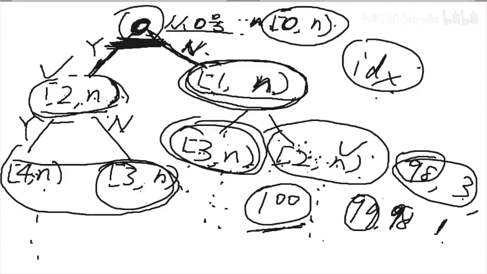
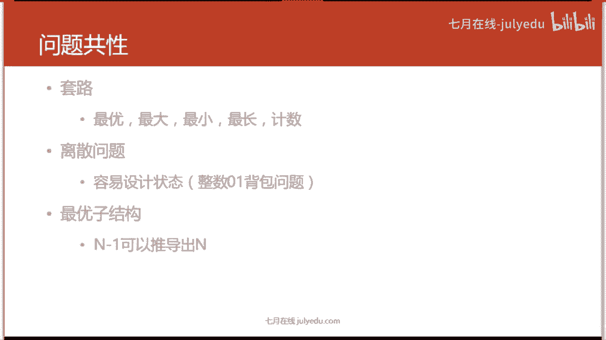

# 人工智能—面试求职公开课（七月在线出品） - P13：半小时掌握DP的基本套路 🚀


在本节课中，我们将要学习动态规划（Dynamic Programming，简称DP）的核心思想与基本实现套路。动态规划是算法面试中的高频考点，其本质并不复杂。我们将通过一个具体的例题，从递归解法入手，逐步引入缓存优化，最终掌握动态规划的通用解题思路。

## 课程概述 📖

动态规划在大学算法课中可能较少涉及，但却是公司面试的常考内容。这并非因为其难度，而是因为其核心思想——“加缓存”——在实际的大规模系统开发中至关重要。本节课的目标是让大家能够独立写出动态规划的代码。

学习本课的前置技能是理解递归和基本的深度优先搜索（回溯法）。动态规划的本质可以理解为 **递归 + 缓存**。

## 从递归到动态规划：以“打家劫舍”为例

我们以力扣（LeetCode）第198题“打家劫舍”作为示例。题目描述如下：你是一个专业的小偷，计划偷窃一条街上的房屋。每间房内都藏有一定的现金。唯一的约束是：如果两间相邻的房屋在同一晚上被偷，系统会自动报警。给定一个代表每个房屋存放金额的非负整数数组，计算你**在不触动警报装置的情况下**，一夜之内能够偷窃到的最高金额。

### 第一步：递归（暴力搜索）思路

面对此题，第一反应不应是动态规划，而应是尝试所有可能的偷窃方案，即求所有满足“不相邻”条件的房屋子集。这自然引向深度优先搜索（DFS）。

**定义搜索过程（状态）**：我们定义一个递归函数，其返回值是从第 `i` 个房屋开始偷窃，能获得的最大金额。参数 `i` 标识了当前要处理的“子问题”起点，这是区分不同任务的关键。

**拆解问题（决策）**：对于第 `i` 个房屋，我们有两种选择：
1.  **偷**：获得 `nums[i]` 的金额，但下一间房 `i+1` 不能偷，因此下一个子问题从 `i+2` 开始。
2.  **不偷**：获得 `0` 金额，下一间房 `i+1` 可以偷，因此下一个子问题从 `i+1` 开始。

原问题（从 `i` 开始）的解，就是这两种决策结果的最大值。这体现了 **最优子结构**：子问题的最优解能构成原问题的最优解。

**边界条件**：当 `i` 超过数组末尾时，无可偷房屋，返回 `0`。

根据以上分析，我们可以写出递归代码框架：
```python
def rob(nums, i):
    if i >= len(nums): # 边界条件
        return 0
    # 决策：偷 vs 不偷
    steal = nums[i] + rob(nums, i+2)
    not_steal = rob(nums, i+1)
    return max(steal, not_steal)
```
然而，直接提交此递归解法会超时。为什么呢？

### 第二步：识别重叠子问题与加缓存

我们画出上述递归的调用树（以 `i=0` 为例）：
```
                rob(0)
               /      \
       偷(0) /          \ 不偷(0)
           /              \
       rob(2)            rob(1)
       /    \            /    \
  rob(4) rob(3)     rob(3) rob(2)
```
可以清晰地看到，`rob(2)`、`rob(3)` 等函数被重复计算了多次。这就是 **重叠子问题**。重复计算导致时间复杂度呈指数级增长。

**解决方案：加缓存（记忆化搜索）**。我们用一个字典（Map）来存储已经计算过的子问题结果（`i` -> 最大金额）。在递归函数开始时，先检查缓存中是否有答案；在函数返回前，将计算结果存入缓存。

```python
memo = {}
def rob(nums, i):
    if i >= len(nums):
        return 0
    if i in memo: # 取缓存
        return memo[i]
    # 计算
    steal = nums[i] + rob(nums, i+2)
    not_steal = rob(nums, i+1)
    res = max(steal, not_steal)
    memo[i] = res # 存缓存
    return res
```
加上缓存后，每个子问题只计算一次，时间和空间复杂度都优化为 O(n)。这种方法称为 **记忆化搜索（Memoization）**，是自顶向下的动态规划。

### 第三步：总结动态规划的特征与套路

通过上面的例子，我们可以总结出动规问题的共性：

1.  **问题类型**：通常是求最优化问题（最大、最小、最长、计数等）。
2.  **问题性质**：问题是**离散**的，状态可以用有限个参数（如整数索引）描述。
3.  **最优子结构**：问题的最优解可以由其子问题的最优解推导出来（`N` 的解可由 `N-1` 或 `N-2` 等的解推导）。
4.  **重叠子问题**：递归算法会反复求解相同的子问题。

**动态规划的基本步骤**：
1.  **定义状态**：用一组参数明确地表示一个子问题。例如 `dp[i]` 表示从第 `i` 间房开始偷能获得的最大金额。
2.  **确定状态转移方程**：找出状态之间的关系。例如 `dp[i] = max(nums[i] + dp[i+2], dp[i+1])`。
3.  **确定初始（边界）条件**：例如 `dp[n] = 0`（`n` 为房屋总数，超出范围）。
4.  **计算顺序**：自底向上（从边界往目标状态递推）或自顶向下（记忆化搜索）。
5.  **空间优化**（可选）：根据状态转移方程，有时可以压缩存储空间。

对于“打家劫舍”问题，自底向上的递推写法如下：
```python
def rob(nums):
    n = len(nums)
    if n == 0:
        return 0
    # dp[i] 表示从第 i 间房开始（0-indexed）偷，能获得的最大金额
    dp = [0] * (n + 2) # 多分配两位，方便处理 i+2 的边界
    for i in range(n-1, -1, -1): # 从后往前递推
        dp[i] = max(nums[i] + dp[i+2], dp[i+1])
    return dp[0]
```
观察发现，`dp[i]` 只依赖于 `dp[i+1]` 和 `dp[i+2]`，因此可以进一步优化空间：
```python
def rob(nums):
    prev, curr = 0, 0 # 分别代表 dp[i+2], dp[i+1]
    for num in nums:
        # 计算当前的 dp[i]
        new = max(num + prev, curr)
        prev, curr = curr, new # 滚动更新
    return curr
```

## 本节课总结 🎯



本节课我们一起学习了动态规划的基本套路：
1.  **核心思想**：动态规划 = 递归 + 缓存，其精髓在于用空间（存储子问题解）换取时间（避免重复计算）。
2.  **解题起点**：面对最优化问题时，先尝试用递归（DFS）暴力搜索的思路去定义状态和决策。
3.  **优化关键**：识别递归树中的**重叠子问题**，通过**加缓存（记忆化）** 来优化。
4.  **实现形式**：可以采用自顶向下的**记忆化搜索**，也可以转化为自底向上的**递推（迭代）** 写法。
5.  **适用特征**：问题具有**离散状态**、**最优子结构**和**重叠子问题**。




记住，掌握“定义状态”和“写出状态转移方程”是解决动态规划问题的关键。从递归思考入手，再优化为动规，是一条清晰可靠的路径。