# 人工智能—面试求职公开课（七月在线出品） - P15：面试绝技 📝

在本节课中，我们将要学习如何为技术岗位的校招面试做准备。课程内容涵盖简历撰写、算法刷题、面试技巧以及知识广度积累等多个方面，旨在帮助应届生提升面试成功率。

## 概述

本节课将系统性地讲解技术面试的完整流程与核心技巧。我们将从简历准备开始，逐步深入到算法实践、面试沟通以及职业规划，为你提供一套实用的求职策略。

## 简历准备：你的第一张名片

上一节我们介绍了课程的整体框架，本节中我们来看看如何打造一份出色的简历。简历是面试官对你的第一印象，至关重要。

一份优秀的简历应该简洁、重点突出。面试官通常只会花很短的时间浏览，因此需要将最核心的信息放在最前面。

以下是撰写简历时需要关注的核心要点：

*   **内容精炼**：简历应控制在一页A4纸内，中文和英文各一份。字号不宜过小，避免内容过于拥挤。
*   **突出亮点**：按重要性排序，应优先展示**实习经验**、**学校和专业成绩**、**在校项目经历**。
*   **实习经验**：优质的实习经历是强有力的背书，可能让你免去笔试或电话面试环节。
*   **专业成绩**：对于没有实习经验的同学，优异的专业成绩（如专业排名）是证明学习能力的重要依据。实践表明，高分高能是普遍现象。
*   **项目经历**：可以展示课程大作业或个人项目，说明用到的算法和解决的问题。
*   **其他信息**：除非是学生会主席/副主席等能体现管理能力的职位，或外貌特别出众，否则类似学生会普通成员、寝室长等经历无需写入。高中学校除非是顶尖名校，否则也无需提及。
*   **学历权重**：在计算机领域，硕士学历相对于本科并无绝对优势，公司更看重实际能力和项目经验。强大的自学能力是关键。

一份专业的英文简历同样重要，建议请英语专业的同学帮忙审阅或利用网络资源（如Bing搜索）学习地道的表达方式。

## 算法刷题：从思路到代码的跨越

准备好简历后，下一步是夯实技术基础，而算法刷题是其中不可或缺的一环。很多同学懂思路，但无法流畅地转化为无bug的代码，这需要通过大量练习来解决。

刷题的目的不仅是做出题目，更是为了深入理解数据结构和语言特性，并培养良好的工程习惯。

以下是刷题的具体建议与步骤：

*   **平台选择**：推荐使用 **LeetCode** 或 **LintCode**。
*   **语言选择**：首选 **Python** 或 **C++**。**Java** 也是互联网公司的常用语言。面试时一般不对语言做硬性要求，但需保证熟练度。
*   **练习方法**：
    1.  遇到难题时，不要死磕，应主动搜索答案。
    2.  理解答案后，自己动手复现并调试通过。
    3.  间隔一段时间后，尝试不看答案独立完成。
*   **目标设定**：
    *   对于 **BAT** 普通部门，能独立在20-30分钟内解决中等难度题目即可。
    *   对于 **微软亚洲研究院**、**阿里核心算法团队**等，需要能应对 **Hard** 难度的题目。
*   **代码质量**：刷题时需注意代码风格、可读性和可维护性。要思考资源管理（如C++中的内存泄露）、异常处理等工程问题。
*   **心理建设**：起步阶段可能很慢，这是正常过程。坚持练习，速度和能力都会提升。

仅仅做出题目并不够，在工程实践中，代码的可维护性与团队协作效率同样重要。

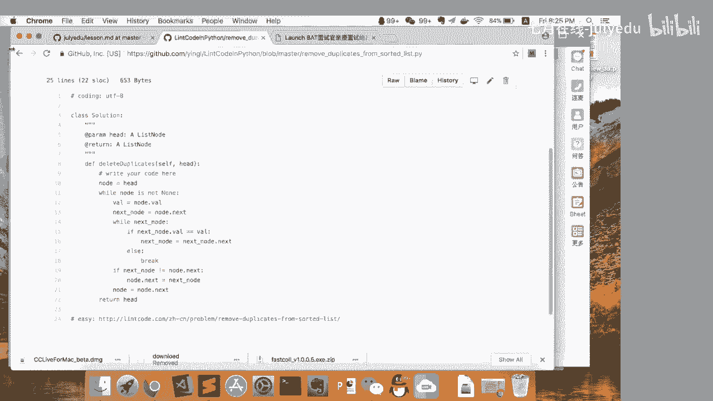

## 面试实战：沟通与编程技巧

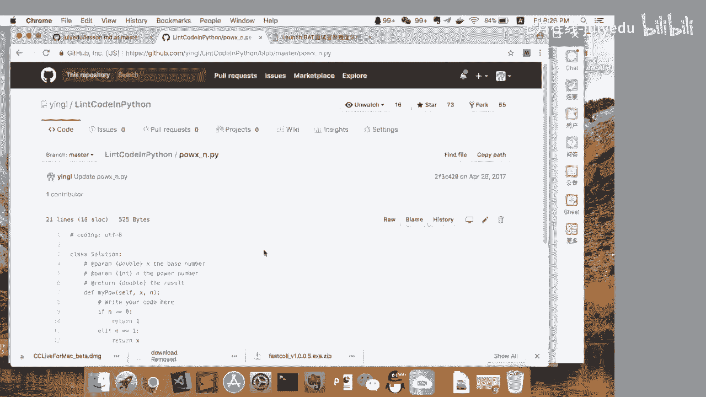

当简历和刷题准备就绪，真正的挑战在于面试现场的发挥。本节我们将探讨面试中的沟通与白板编程技巧。

面试是综合能力的考察，良好的沟通和严谨的编程习惯能为你大大加分。

### 自我介绍

自我介绍是固定环节，需要提前准备并反复练习。

*   **时间控制**：时长控制在5分钟左右。
*   **内容重点**：言简意赅，突出个人优势、技术强项和做过的“牛事”（如主导项目架构）。
*   **表达方式**：**放慢语速**，说好普通话。清晰的表达是重要的职场竞争力。

### 白板编程

白板编程是技术面试的核心，考察临场问题解决能力。

以下是白板编程的标准化流程：

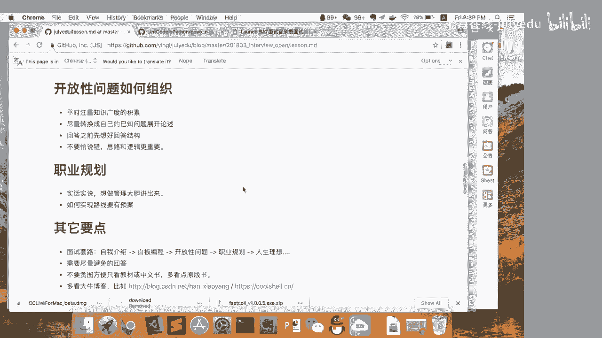

1.  **确认题意**：不要立即动笔。先与面试官反复确认题目要求、输入输出和边界条件，即使题目看似熟悉也要谨慎。
2.  **阐述思路**：先口头或书写伪代码，说明解题思路。即使不是最优解，也应先给出一个可行的基础方案。
3.  **优化迭代**：面试官通常会追问优化空间。此时可结合提示，讨论如何改进算法（如时间/空间复杂度）。
4.  **编写代码**：在思路清晰的基础上编写代码。注意代码结构清晰。
5.  **检查边界**：完成代码后，主动列举测试用例，覆盖各种边界情况（如空输入、单个元素、已排序/逆序等）。
6.  **讨论测试**：向面试官说明你的测试用例设计思路。在实际工作中，编写测试代码是开发的重要部分，这项技能会为你加分。

**关键禁忌**：切忌依赖在线判题系统的反馈来反复修改代码。在白板面试中，你需要具备“人肉调试”的能力，在心中模拟代码执行过程，争取一次写对。

## 开放性问题与知识广度

顺利通过编程考核后，面试官可能会探讨一些开放性问题，这考验你的知识储备和思维深度。

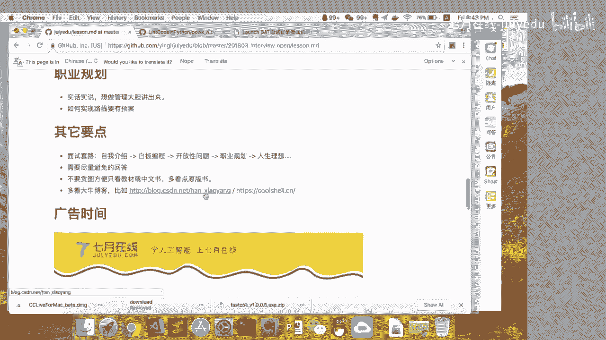

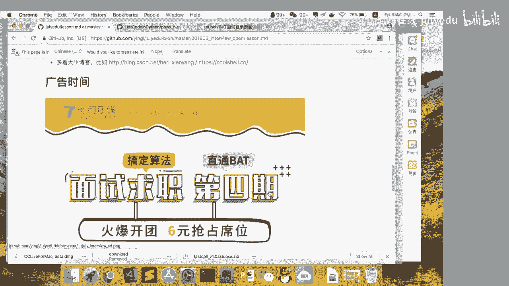

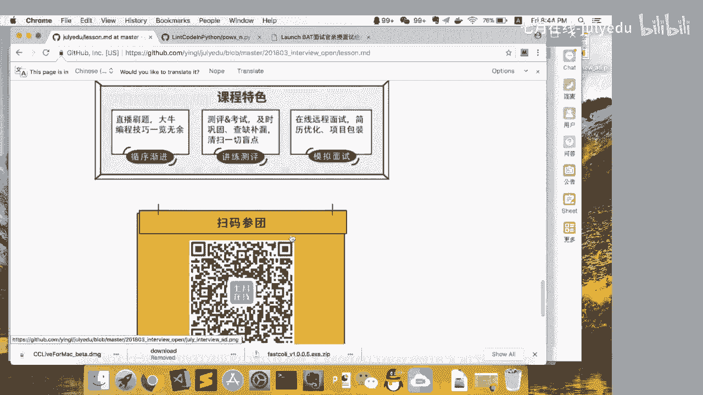

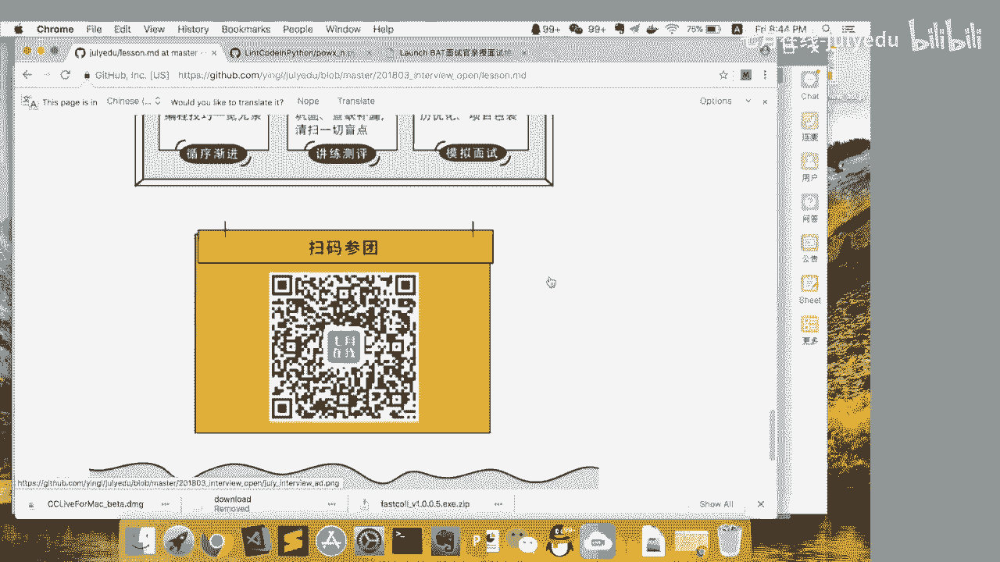

技术之路并非只有编码，对行业和技术的宏观思考同样重要。开放性问题没有标准答案，旨在考察你的学习能力和思维广度。

应对开放性问题的策略如下：

*   **日常积累**：不要局限于教科书。多关注行业动态、技术博客（如阮一峰、左耳朵耗子）、框架优缺点（如Spring, 微服务）、技术争议帖。
*   **逻辑自洽**：回答时不怕说错，但要保证逻辑严密，能自圆其说。例如，被问到如何设计一个IM系统，即使方案不实用，但只要你能清晰论证其优劣，并关联到已知技术（如点对点连接 vs 服务器中转，区块链的去中心化思想），就能体现思考能力。
*   **深入本质**：关注技术演变的本质原因，理解不同技术方案背后的权衡（如工程效率 vs 执行效率）。

## 职业规划与其他建议

最后，面试官可能会询问你的职业规划。这是一个表达个人志向的机会。

职业规划问题没有标准答案，但态度要诚恳积极。

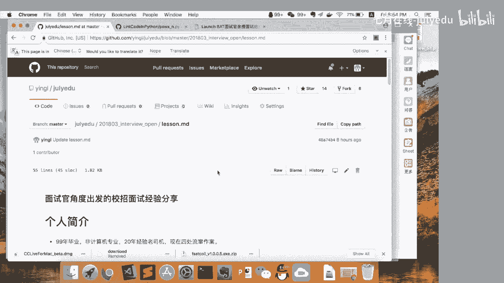

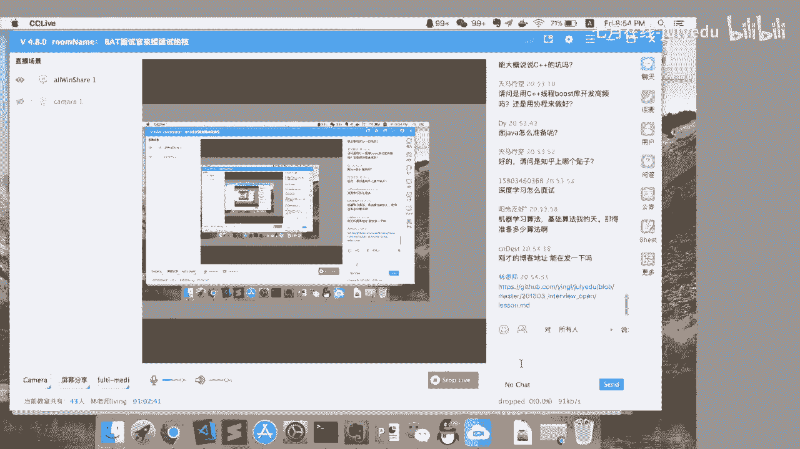

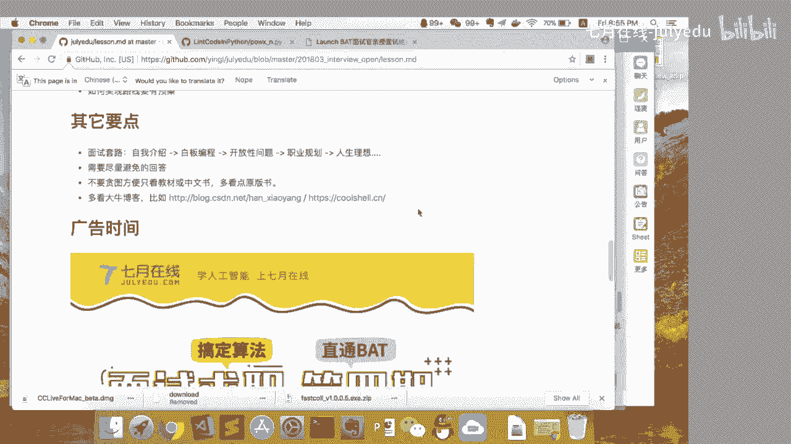

*   **如实回答**：无论是想走技术专家路线还是管理路线，都可以直接表达。
*   **展示规划**：可以简要说明你计划如何通过学习技术和积累经验来实现目标。
*   **展现热情**：表达对技术和行业的热情，但避免说“我进来以后会努力学习”之类的话，这暗示你入职前准备不足。公司希望你入职即能产生价值。

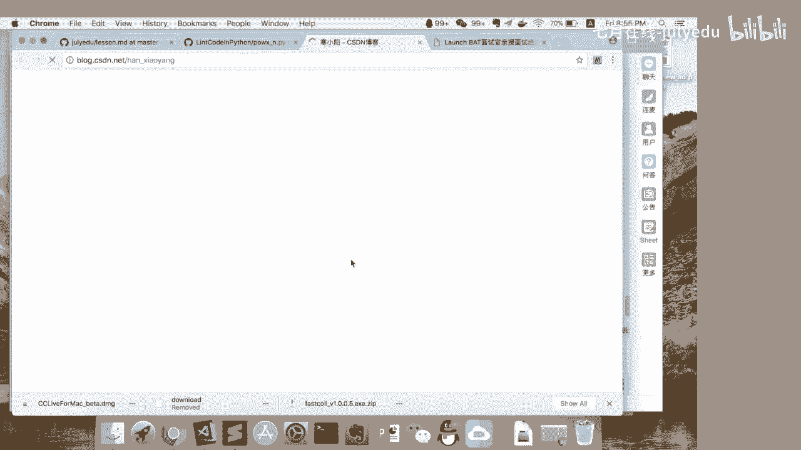

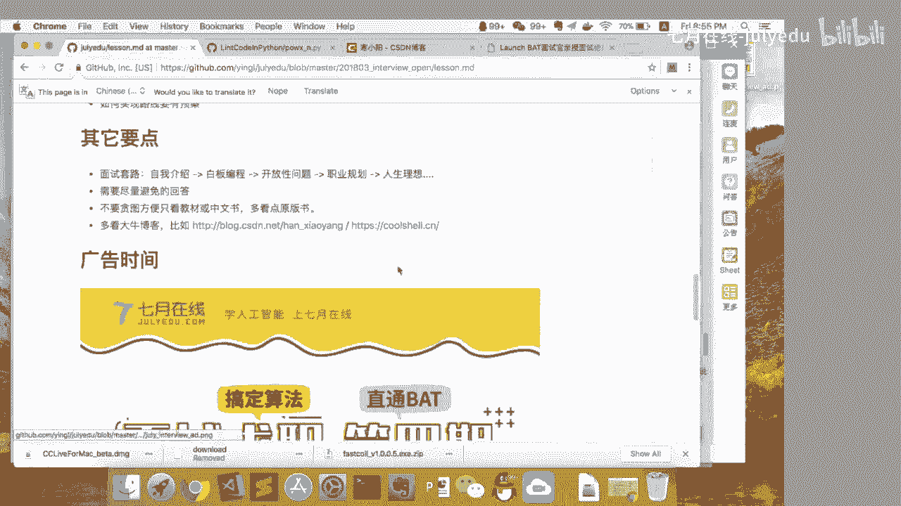

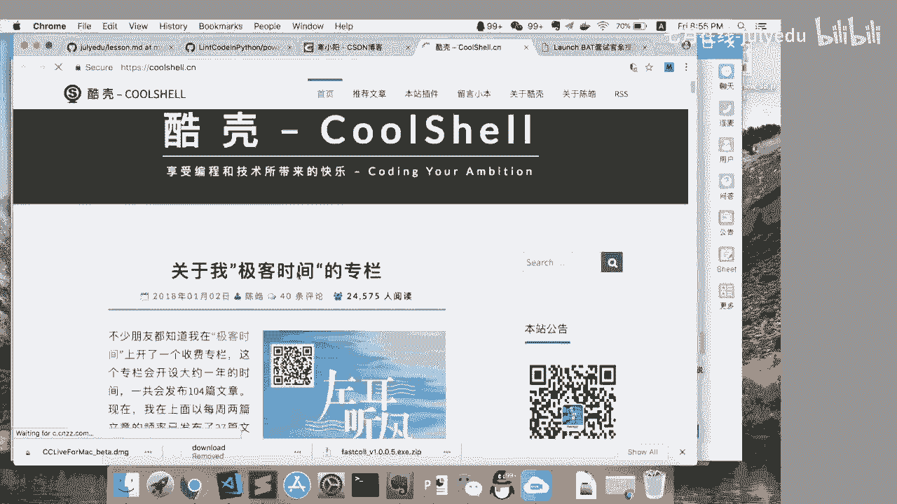

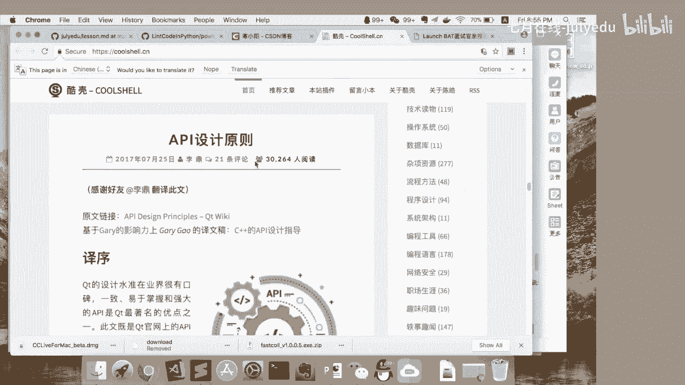

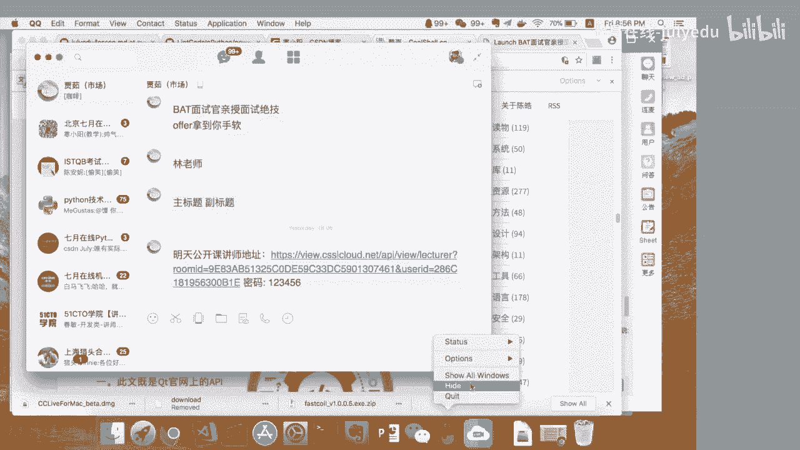

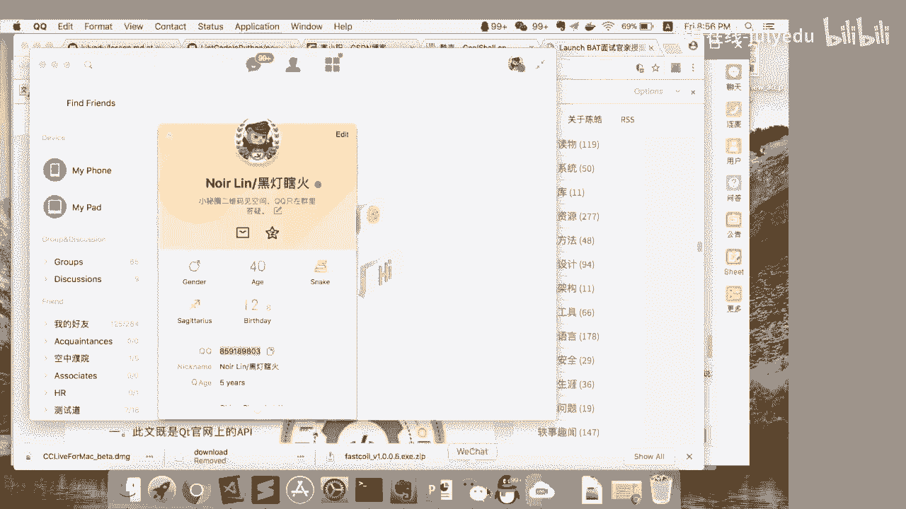

此外，还有一些重要的补充建议：

*   **经典教材**：阅读英文原版技术书籍（如《Thinking in C++》），通常比中文译本更清晰。
*   **技术博客**：定期阅读业内大牛的博客（如韩小阳的机器学习博客，左耳朵耗子的技术博客）以拓宽视野。
*   **个人品牌**：将学习总结、项目代码整理到 **GitHub** 或个人博客上，这会是简历上的亮点。
*   **语言态度**：不要有强烈的语言偏好，应表达“公司需要什么，我就学什么”的积极态度。
*   **忌讳之言**：切勿在面试测试开发岗时说“我代码写得不好，所以来做测试”。测试开发岗同样需要扎实的编码能力。

## 总结

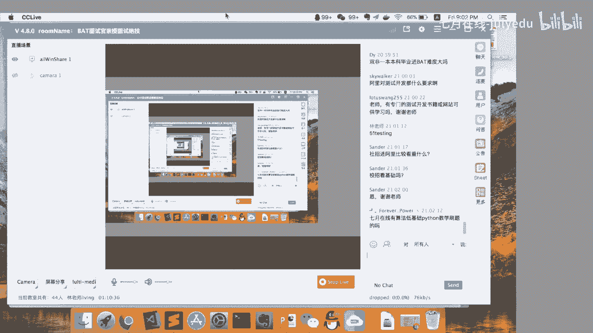

本节课中我们一起学习了技术校招面试的完整攻略。我们从**简历撰写**开始，明确了如何打造简洁有力的个人名片；接着深入**算法刷题**，掌握了从理解到熟练的练习方法；然后进入**面试实战**，学习了自我介绍、白板编程的沟通与解题技巧；最后探讨了如何应对**开放性问题**并规划职业发展。

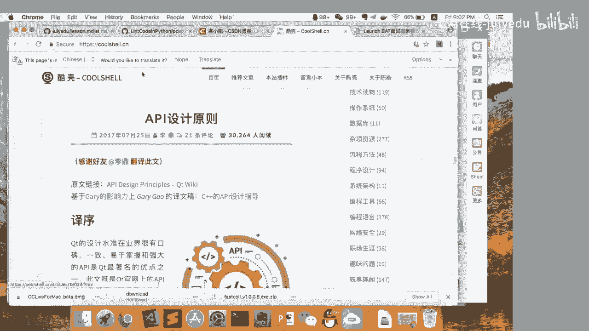

记住，面试是双向选择的过程。充分准备，展示真实的自己，同时保持开放学习的心态，是成功的关键。祝大家在即将到来的面试季中收获理想的Offer！