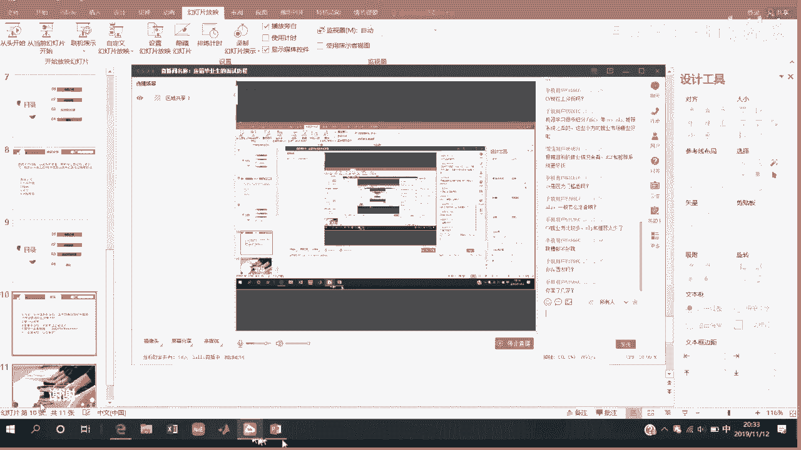

# 人工智能面试求职公开课（七月在线出品） - P16：应届毕业生的面试历程 🎓

在本节课中，我们将跟随一位从机械专业成功转型算法岗的应届毕业生的视角，回顾他在秋招过程中的真实经历、遇到的挑战以及总结出的宝贵经验。课程将涵盖从前期准备、面试实战到心态调整的全过程，旨在为有志于进入人工智能领域的同学提供一份实用的求职指南。

## 概述

本节课将分享一位非科班背景学生的算法岗求职历程。内容主要包括自我介绍与转行契机、秋招的整体感悟、具体公司的面试经验复盘、以及针对求职准备和心态调整的实用建议。我们将重点关注数据结构与算法能力在面试中的核心地位，以及如何有效避坑。

## 个人背景与转行契机

我目前就读于某C9高校的机械专业硕士。在转向算法岗位之前，我仅会一点简单的C++，对数据结构和机器学习基础几乎一无所知。

最初我尝试自学，看过“西瓜书”和“花书”，但效果不佳，前前后后折腾了近两个月，感到非常迷茫。一个偶然的机会，我了解到七月在线的课程。当时我的一位同学报了推荐系统班，反馈老师讲得不错。考虑到当时已是四五月份，秋招临近，时间紧迫，我决定报名试一试。

在七月在线的学习对我帮助很大。在后续面试中，我明显感觉到很多被问及的机器学习和深度学习基础知识，都是课程中详细讲解过的。例如，面试OPPO时，面试官要求我徒手推导SVM，从最初的分类思想到最后求解最宽分界面的完整过程，包括SMO算法，这些在课程中都有细致深入的讲解。

## 秋招整体感悟与核心建议

上一节我们了解了转行的起点，本节中我们来看看我对整个秋招过程的总结。我的核心感悟是：**技术实力是根本**。如果基础不扎实，找工作会非常辛苦。作为非科班转行的学生，我深刻体会到“菜是原罪”。因此，在面试前不要抱有任何侥幸心理，必须夯实基础。

对于想转算法岗的同学，我认为最重要的两点是：
1.  **掌握机器学习和深度学习的项目经验或基础知识**。
2.  **打好计算机基础，特别是数据结构和算法**，并精通一门编程语言（如C++或Python）。

以下是具体的建议列表：

*   **夯实基础**：必须静下心来沉淀自己。对于算法岗，数据结构（如栈、队列、链表、二叉树）必须掌握得非常清楚。很多公司都有手撕代码环节，这是第一道关卡。
*   **及时获取招聘信息**：实力是一部分，机遇同样重要。要主动关注各公司的招聘动态，充分利用学校、七月在线平台、已工作学长学姐等渠道的内推资源，掌握信息差。
*   **重视实习经历**：实习经历非常重要。我曾拿到华为的实习Offer，但因导师不同意未能成行，这在秋招中让我感觉比较吃亏。有大厂实习经历对后续找工作帮助巨大。
*   **把握招聘节奏**：秋招通常分为提前批（6-8月）和正式批（8-10月）。提前批可能“神仙打架”，但面试难度有时相对较低；正式批岗位更多，竞争也更激烈。之后还有一些银行、中小公司的招聘。无论如何，提升自身硬实力始终是第一要务。

## 具体公司面试经验分享

在分享了整体建议后，本节我将复盘几个具体公司的面试经历，希望能给大家带来更直观的参考。

我主要分享四家公司的面试情况。

### 1. 云从科技

我面试了云从科技，共经历了两轮技术面和一轮HR面。我遗憾地在第二轮总监面（主管面）的手写代码题上失利。

**面试过程回顾**：
*   **一面**：面试官首先让我详细介绍项目，并针对项目细节问得非常深入，包括模型参数、过拟合、梯度爆炸、Batch Normalization等。随后问了一个机器学习问题：如何区分聚类是否完成。幸运的是，这个问题在七月在线的课程中由小杨老师讲解过，我得以顺利回答。最后是一道算法题，类似于桶排序，我完成了。
*   **面试技巧**：一面后，我主动询问了面试官的工作方向，并请他给我一些建议。从他的反馈中，我能感觉到面试情况还不错。他提到学校项目与企业项目的区别，这让我心里有了底。果然，当天下午就收到了二面通知。
*   **二面**：面试官较为高冷，让我讲完项目后，问了几个问题，如是否了解TensorFlow底层框架。由于我是非科班，对此了解不深。最后是一道算法题，题目本身有一定难度，我未能给出最优解。

### 2. OPPO

OPPO的面试问得极其细致。

**面试过程回顾**：
面试官在项目提问后，开始考察我对经典神经网络架构的了解，从AlexNet问到ResNet等。我按照发展脉络逐个讲解，面试官表示认可。然而，在手写代码环节，我遇到一道环形链表插入节点的题目，没有在规定时间内写完。
面试后我同样请求建议，面试官说：“如果你做CV，基础知识没问题了，但数据结构和代码能力还有欠缺。” 我立刻明白这次面试失败了。总结来说，对于招聘硕士，公司非常看重动手能力和工程实现能力，代码能力是核心考察点。

### 3. 中兴通讯

我最终选择了中兴，部分原因是工作地点在西安。面试共三面。

**面试过程回顾**：
*   **一面**：依然是项目介绍，面试官问了一些PyTorch相关的问题。最后是一道堆排序的算法题，我用伪代码阐述了思路。
*   **二面**：聊得比较轻松，面试官主要看中我简历上的论文和专利。
*   **三面**：主要是谈薪资。

从这三家公司的经历可以看出，**所有公司无一例外都会考察数据结构和手写代码能力**。

### 4. 中国移动

中国移动的招聘流程启动很晚（10月底11月），因为我已拿到其他Offer且地点在上海，最终没有选择。

## 面试中踩过的“坑”与重要提醒

上一节我们复盘了具体面试，本节我们来看看我在过程中踩过的一些“坑”，希望大家能引以为戒。

1.  **笔试时间冲突**：我曾同时参加苏宁和顺丰的笔试，两者时间重叠。我没注意到顺丰的笔试可以顺延半小时，结果两边都没做好。**建议**：仔细阅读笔试通知，如有冲突，尝试协调或优先准备更有把握的。
2.  **忽视基础**：我最初自学时，只关注机器学习算法，对数据结构几乎不懂。上了七月在线的数据结构和刷题班后，才系统补上。**深刻教训**：自信心不能建立在薄弱的基础上，必须补齐所有短板。
3.  **非科班转型的路径**：对于非科班同学，短期内冲击阿里、腾讯等大厂算法岗可能较难。可以考虑先加入中等规模的公司积累经验和项目，后续再寻求跳槽机会。

## 学习资源与技能准备建议

基于我的经验，我强烈推荐以下学习资源和准备重点：

以下是推荐的课程与学习资料：

*   **陈小云《数据结构与算法》**：B站上有免费课程，讲解得非常清晰，强烈推荐。
*   **七月在线《面试求职第四期》及配套刷题班**：与上述课程配套练习，效果很好。
*   **《剑指Offer》**：针对C++/Java，是经典的面试算法题集。
*   **LeetCode**：必须持续刷题，很多面试题都源于此。

以下是针对算法岗（尤其是CV方向）的具体技能准备建议：

*   **计算机基础**：数据结构和算法是重中之重。常见考点包括：二叉树遍历、链表翻转、快速排序/归并排序等。
*   **编程语言**：Python或C++至少精通一门。如果做CV，Python基本够用；掌握C++会是加分项。
*   **CV方向知识**：必须熟悉经典神经网络架构（如AlexNet, VGG, GoogLeNet, ResNet等），了解它们的关键创新点和成功原因。
*   **项目与简历**：简历上的项目必须了如指掌，对用到的算法要能透彻推导和讲解，否则容易被怀疑真实性。

## 心态调整与最终建议

求职是一场持久战，心态至关重要。

以下是一些心态调整的建议：

*   **避免情绪大起大落**：不要因为一个Offer而骄傲，也不要因连续被拒而沮丧。保持自信，平稳的心态有助于在后续面试中正常发挥。
*   **持续学习**：无论秋招结果如何，都是一个过程。重要的是保持学习，不断提升自己。“塞翁失马，焉知非福”。
*   **关于报班**：可以理性评估投入产出比。报班可能用50-100小时达到自学200小时的效果，省下的时间可以用来做其他提升。投资自己永远是值得的，但报了班就一定要努力学，否则就是浪费。

## 总结与答疑摘要

本节课中，我们一起学习了一位非科班同学的算法岗求职全历程。我们总结了以下核心要点：

1.  **硬实力是根基**：数据结构和算法能力是面试的“敲门砖”和“试金石”，必须高度重视。
2.  **信息与机遇**：积极获取招聘信息，争取实习机会，把握招聘节奏。
3.  **实战经验**：面试中项目讲解要深入，手写代码需熟练，并学会从面试官反馈中获取信息。
4.  **资源与准备**：善用优质学习资源，系统性地补足知识体系，针对目标岗位进行专项准备。
5.  **心态决定状态**：保持平稳自信的心态，将求职视为长期成长过程的一部分。

**答疑摘要**：
*   **岗位选择**：目前CV岗位多但竞争者也多，门槛被抬高；NLP和推荐系统岗位相对竞争稍小。可以根据兴趣和竞争情况选择方向。
*   **语言选择**：Python对于算法岗基本够用，也有同学仅凭Python找到NLP工作。掌握C++会是优势。
*   **非科班路径**：非科班转型需要付出更多努力，重点补齐计算机基础，可以考虑“先入行再提升”的策略。

希望我的这些经验和教训能帮助大家在求职路上走得更加顺利。