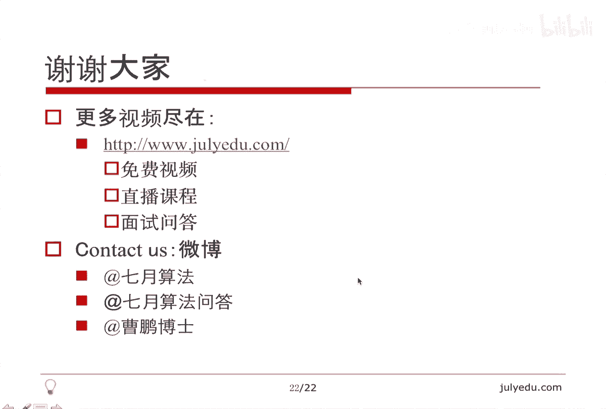

# 人工智能—面试求职公开课（七月在线出品） - P2：O(N)时间解决的面试题(中) 🧠


在本节课中，我们将继续学习如何在O(N)时间复杂度内解决一系列经典的面试算法问题。课程将从组合数学、巧妙证明、动态规划等多个角度展开，帮助大家树立“计数不等于枚举”的理念，并掌握处理复杂问题的简化思路。

## 课程概述 📋

本节课主要涵盖以下内容：组合数学中的下一个/上一个排列问题；通过数学证明巧妙解决问题；区分枚举与计数的不同；以及一个较难的最大子数组变种问题的动态规划解法。我们将通过7个例题来具体阐述这些概念。

## 1. 下一个排列 🔄

上一节我们介绍了O(N)时间算法的总体思路，本节中我们首先来看一个具体的字典序问题：找到给定排列的下一个排列。

**核心概念**：给定一个排列，我们希望找到在字典序中刚好比它大的下一个排列。例如，`12345`的下一个排列是`12354`。

**算法思路**：可以概括为“二找一交换一翻转”。
1.  **找X**：从右向左找到第一个满足 `A[X] < A[X+1]` 的位置 `X`。这意味着 `A[X]` 右边的序列 `B` 是降序的。
2.  **找Y**：在 `B` 中从右向左找到第一个大于 `A[X]` 的数 `A[Y]`（即大于 `A[X]` 的最小值）。
3.  **交换**：交换 `A[X]` 和 `A[Y]`。
4.  **翻转**：将 `X` 位置之后的序列（即 `B`）进行翻转（反转），使其变为升序。

以下是算法实现的伪代码描述：
```cpp
void nextPermutation(vector<int>& nums) {
    int n = nums.size();
    int x = -1;
    // 找X
    for (int i = n - 2; i >= 0; --i) {
        if (nums[i] < nums[i + 1]) {
            x = i;
            break;
        }
    }
    if (x < 0) {
        // 已是最大排列，翻转得到最小排列
        reverse(nums.begin(), nums.end());
        return;
    }
    int y = -1;
    // 找Y
    for (int i = n - 1; i > x; --i) {
        if (nums[i] > nums[x]) {
            y = i;
            break;
        }
    }
    // 交换
    swap(nums[x], nums[y]);
    // 翻转
    reverse(nums.begin() + x + 1, nums.end());
}
```
**算法优点**：时间复杂度为O(N)，且能正确处理包含重复元素的序列。上一个排列的算法与此对称，只需修改比较符号的方向。

## 2. 分割01串问题 ✂️

接下来，我们看一个需要利用数学性质巧妙解决的问题。

**问题描述**：给定一个长度为 `4N` 的01串，其中恰好有 `2N` 个0和 `2N` 个1。你可以将其切割成若干段后重新拼接，目标是使拼接后的两部分各自恰好包含 `N` 个0和 `N` 个1，并且要求切割的段数最少。

**核心思路**：答案只能是2或3。无需真正找到切割点，只需分析第一个长度为 `2N` 的窗口。
1.  定义函数 `F(k)` 为从位置 `k` 开始长度为 `2N` 的子串中，`0的个数 - 1的个数`。
2.  计算 `F(0)`。如果 `F(0) == 0`，则直接从中间 `(2N)` 处切开即可（答案为2）。
3.  如果 `F(0) != 0`，则由于 `F(0) + F(2N) = 0` 且 `F(k)` 每次变化为±2，在 `0` 到 `2N` 之间必然存在某个位置 `y` 使得 `F(y) = 0`。此时切三段：`[0, y-1]`, `[y, y+2N-1]`, `[y+2N, 4N-1]`，将首尾两段拼为一部分，中间段为另一部分（答案为3）。

以下是判断最少段数的伪代码：
```python
def min_cuts(s):
    n = len(s) // 4  # 原题中的N
    diff = 0
    for i in range(2 * n):
        if s[i] == '0':
            diff += 1
        else:
            diff -= 1
    if diff == 0:
        return 2  # 切一刀，成两段
    else:
        return 3  # 切两刀，成三段
```

## 3. 平衡分割点问题 ⚖️

现在，我们分析一个通过等式推导即可解决的问题，无需复杂计算。

**问题描述**：给定长度为 `N` 的正整数数组 `A` 和一个特定值 `X`，求一个位置 `M` (0 ≤ M ≤ N)，使得 `A[0..M-1]` 中等于 `X` 的元素个数，等于 `A[M..N-1]` 中不等于 `X` 的元素个数。

**推导与解法**：
设数组中 `X` 的总个数为 `countX`。
设前 `M` 个元素中有 `y` 个 `X`。
则后 `N-M` 个元素中，非 `X` 的个数为 `(N - M) - (countX - y)`。
根据要求：`y = (N - M) - (countX - y)`。
化简得：`M = N - countX`。

因此，解法非常简单：只需遍历数组一次，统计 `X` 出现的次数 `countX`，答案 `M` 即为 `N - countX`。时间复杂度O(N)，空间复杂度O(1)。

**思考题**：10个硬币，4正6反，在不能看的情况下，如何通过翻面操作将它们分成两组，使得两组正面朝上的硬币数相同？提示：将硬币分成6个和4个两组，并将第二组的4个硬币全部翻面。

## 4. 统计子序列 “PAT” 的数量 🔢

从这个问题开始，我们引入“计数”与“枚举”的区别。直接枚举所有“PAT”子序列需要O(N³)时间，而计数可以在O(N)内完成。

**问题描述**：给定一个由字母 `P`、`A`、`T` 组成的字符串，计算有多少个子序列是“PAT”。子序列不要求连续。

**计数策略**：
我们维护三个变量：
*   `countP`: 到目前为止出现的 `P` 的个数。
*   `countPA`: 到目前为止能形成的 `PA` 序列的个数（每个 `A` 可以和它之前的所有 `P` 形成 `PA`）。
*   `countPAT`: 到目前为止能形成的 `PAT` 序列的个数（每个 `T` 可以和它之前的所有 `PA` 形成 `PAT`）。

遍历字符串：
*   遇到 `P`: `countP++`。
*   遇到 `A`: `countPA += countP` (这个 `A` 可以和前面所有的 `P` 组成新的 `PA`)。
*   遇到 `T`: `countPAT += countPA` (这个 `T` 可以和前面所有的 `PA` 组成新的 `PAT`)。

最终 `countPAT` 即为答案。时间复杂度O(N)，空间复杂度O(1)。

```python
def countPAT(s):
    countP = countPA = countPAT = 0
    for ch in s:
        if ch == 'P':
            countP += 1
        elif ch == 'A':
            countPA += countP
        else: # ch == 'T'
            countPAT += countPA
    return countPAT
```
**扩展思考**：LeetCode 115题 “Distinct Subsequences” 是此问题的泛化形式。

## 5. 最小平均值子数组 📉

这个问题展示了如何通过分析问题性质，将搜索空间从O(N²)缩小到O(N)。

**问题描述**：在给定数组中，寻找一个**长度至少为2**的子数组，使其平均值最小。输出该子数组的起始位置（若有多个，取起始位置最小的）。

**关键洞察**：**长度至少为2的最优解（平均值最小），其长度要么是2，要么是3**。
*   假设存在一个长度大于3的最优解，我们可以将其划分为若干个长度为2或3的片段。根据平均值最小性质，这些片段的平均值必须相等，否则就会有一个片段比最优解平均值更小，矛盾。因此，最优解的平均值一定等于某个长度为2或3的子数组的平均值。

**解法**：只需遍历数组，计算所有长度为2和长度为3的子数组的平均值，记录平均值最小的子数组起点即可。比较时可用乘法避免浮点数精度问题：比较 `(sum2 * 3)` 和 `(sum3 * 2)`。

```python
def minAvgSlice(A):
    n = len(A)
    min_avg_value = float('inf')
    min_index = 0
    
    # 检查长度为2的子数组
    for i in range(n - 1):
        avg = (A[i] + A[i+1]) / 2.0
        if avg < min_avg_value or (avg == min_avg_value and i < min_index):
            min_avg_value = avg
            min_index = i
            
    # 检查长度为3的子数组
    for i in range(n - 2):
        avg = (A[i] + A[i+1] + A[i+2]) / 3.0
        if avg < min_avg_value or (avg == min_avg_value and i < min_index):
            min_avg_value = avg
            min_index = i
            
    return min_index
```

## 6. 环形数组的最大子数组和 🌀

这是经典最大子数组和问题（Kadane算法）的一个变体，数组是环形的（首尾相连）。

**问题分析**：环形数组的最大子数组和有两种情况：
1.  最大子数组没有跨越数组首尾（即位于数组中间）。这种情况直接用普通Kadane算法求解。
2.  最大子数组跨越了数组首尾（由开头的一段和结尾的一段组成）。这种情况等价于**数组总和减去中间那段最小子数组和**。

**解法**：
1.  用Kadane算法求一次不跨越边界的最大子数组和 `max1`。
2.  求数组总和 `total`。
3.  用Kadane算法求一次最小子数组和 `min2`（或对数组取反后求最大子数组和）。
4.  如果 `total - min2 > max1` 且 `min2` 对应的子数组不是整个数组（避免全为负数时误判），则跨越边界的和为 `total - min2`。
5.  最终结果为 `max(max1, total - min2)`。

```python
def maxSubarraySumCircular(A):
    def kadane(arr):
        max_ending_here = max_so_far = arr[0]
        for x in arr[1:]:
            max_ending_here = max(x, max_ending_here + x)
            max_so_far = max(max_so_far, max_ending_here)
        return max_so_far
    
    n = len(A)
    # 情况1：不跨越边界
    max_kadane = kadane(A)
    
    # 情况2：跨越边界
    total = sum(A)
    # 求最小子数组和：对数组取反后求最大子数组和，再取反
    max_wrap = total + kadane([-x for x in A]) # 相当于 total - min_subarray
    
    # 特殊情况处理：如果所有数都是负数，kadane(A)就是最大值，max_wrap会是0（total - total）
    if max_wrap == 0:
        return max_kadane
    return max(max_kadane, max_wrap)
```

## 7. 至多交换一次的最大子数组和 🔀

这是本节课最难的一个问题，需要精巧的动态规划定义。

**问题描述**：允许交换数组中任意两个元素一次（或零次），求交换后可能的最大子数组和。

**动态规划定义**：
*   `F[i]`：在子数组 `A[0..i]` 中，**一段以 `A[i]` 结尾的子数组** 与 **一个独立的孤立点（不与那段子数组重叠）** 两者之和的最大值。这段子数组可以为空，孤立点可以是 `0..i` 中任意一个点。
*   `G[i]`：以 `A[i]` 开头的最大子数组和（经典Kadane算法从右向左的版本）。

**状态转移**：
*   `F[i] = max(F[i-1] + A[i], max(A[0..i]))`
    *   第一种情况：延续 `F[i-1]` 中的那段子数组，把 `A[i]` 加进去，孤立点不变。
    *   第二种情况：那段子数组为空，只取 `A[0..i]` 中的最大值作为孤立点。
*   `G[i] = max(A[i], A[i] + G[i+1])`

**最终答案的构成**：考虑交换的元素对 `(A[j], A[i])`，其中 `j < i`。
*   如果我们交换 `A[j]` 和 `A[i]`，并且最终的最大子数组包含了被换过来的 `A[j]`（现在在位置 `i`），那么这个子数组的和可以表示为：`G[i] - A[i] + F[i-1]`。
    *   `G[i] - A[i]`：是以 `i` 开头（但去除了原来的 `A[i]`）的子数组和。
    *   `F[i-1]`：包含了 `i` 之前的一个孤立点（即被换走的 `A[j]`）和可能的一段子数组。
*   此外，还要考虑不交换的情况（普通最大子数组和）以及 `j > i` 的情况（可通过数组翻转再计算一次来处理）。

```python
def maxSumWithOneSwap(A):
    n = len(A)
    if n == 0:
        return 0
    
    # 从左到右计算F[i]和G[i]，并记录普通最大子数组和
    F = [0] * n
    G = [0] * n
    F[0] = A[0]
    cur_max = A[0] # 记录A[0..i]的最大值，用于计算F[i]
    overall_max = A[0] # 普通最大子数组和
    
    max_val = A[0] # A[0..i]的最大值
    for i in range(1, n):
        # 计算G[i] (需要先算，因为用到了G[i-1]其实是i-1开头的)
        # 但更简单的方式：先正向算F和普通最大和，再反向算G
        pass # 此处省略详细实现，展示思路
    
    # 反向计算G[i]
    G[n-1] = A[n-1]
    for i in range(n-2, -1, -1):
        G[i] = max(A[i], A[i] + G[i+1])
    
    # 组合答案
    ans = overall_max # 不交换
    for i in range(1, n):
        # 交换一个j < i 的元素
        ans = max(ans, G[i] - A[i] + F[i-1])
    
    # 处理 j > i 的情况：翻转数组再算一次
    # ... 
    return ans
```
**核心**：理解 `F[i]` 的定义，它为我们提供了在 `i` 位置之前可用于交换的“最佳孤立点”信息。

## 课程总结 🎯

本节课我们一起学习了7个可以在O(N)时间内解决的面试算法题：
1.  **下一个排列**：通过“二找一交换一翻转”的固定流程解决。
2.  **分割01串**：利用数学性质将答案简化为2或3，避免复杂搜索。
3.  **平衡分割点**：通过等式推导得到简洁公式。
4.  **统计子序列“PAT”**：展示了“计数”优于“枚举”的思想，用动态计数替代暴力搜索。
5.  **最小平均值子数组**：通过问题分析，将搜索范围缩小到长度为2和3的子数组。
6.  **环形最大子数组和**：将问题分解为不跨越和跨越首尾两种情况处理。
7.  **至多交换一次的最大子数组和**：利用巧妙的动态规划定义 `F[i]` 和 `G[i]` 解决问题。




解决问题的关键在于**深入分析问题性质、寻找规律、定义合适的状态**，而不是急于编写暴力代码。多思考、多练习，才能灵活运用这些技巧。下节课我们将继续探讨更多与序列相关的问题。