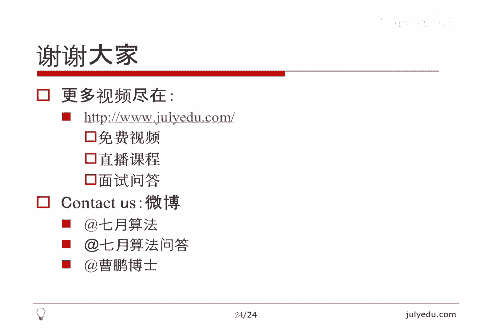

# 人工智能—面试求职公开课（七月在线出品） - P3：O(N)时间解决的面试题(下) 🚀

在本节课中，我们将学习一系列可以在 **O(N)** 线性时间复杂度内解决的经典面试题。我们将对这些问题进行分类汇总，并深入讲解其中一些核心问题的解决思路和代码实现。

---

## 例题汇总 📚

上一节我们介绍了O(N)时间复杂度的概念，本节中我们来看看一系列具体的面试题目。我将它们分成了10个类别，每个类别包含多个相关问题。

### 1. 最大子数组问题

以下是和最大子数组相关的两个核心问题。

#### 1.1 最大子数组和

这是LeetCode第53题，也是动态规划中的经典问题。目标是找到一个连续子数组，使其和最大。

**方法一：利用最小前缀和**
前缀和是从第一项开始连续相加的和。例如，空数组、`A[1]`、`A[1]+A[2]` 都是前缀和。以 `A[i]` 结尾的最大子数组和，等于 `A[1]` 加到 `A[i]` 的前缀和减去之前最小的一个前缀和。因为被减数固定时，减数越小，差越大。我们可以线性时间计算前缀和并维护最小前缀和。

**方法二：动态规划**
记录以每个位置 `i` 结尾的最大子数组和 `dp[i]`。状态转移方程为：
`dp[i] = max(dp[i-1] + A[i], A[i])`
即，要么延续之前的子数组，要么自己单独作为一个新子数组。

#### 1.2 最大子数组乘积

这是LeetCode第152题，与最大子数组和类似，但需要考虑正负数的影响。

由于两个负数相乘可得正数，我们需要同时记录以当前位置结尾的**最大乘积**和**最小乘积**。状态转移时，需要考虑当前数 `A[i]` 的正负性。

以下是核心代码逻辑：
```python
def maxProduct(nums):
    if not nums:
        return 0
    max_ending_here = min_ending_here = global_max = nums[0]
    for i in range(1, len(nums)):
        temp_min = min_ending_here
        min_ending_here = min(nums[i], nums[i] * min_ending_here, nums[i] * max_ending_here)
        max_ending_here = max(nums[i], nums[i] * temp_min, nums[i] * max_ending_here)
        global_max = max(global_max, max_ending_here)
    return global_max
```

---

### 2. 循环移位与翻转 🔄

给定一个长度为N的数组，将其循环右移M位。直接移动的复杂度是O(N*M)。一个经典的O(N)方法是利用三次翻转。

**算法步骤：**
1.  翻转前M个元素。
2.  翻转后N-M个元素。
3.  翻转整个数组。

例如，数组 `[1,2,3,4,5]`， M=2：
1.  翻转前2位：`[2,1,3,4,5]`
2.  翻转后3位：`[2,1,5,4,3]`
3.  翻转整个数组：`[3,4,5,1,2]`

翻转函数可以这样实现：
```python
def reverse(arr, left, right):
    while left < right:
        arr[left], arr[right] = arr[right], arr[left]
        left += 1
        right -= 1
```
总体时间复杂度为O(2N)，即O(N)。

---

### 3. Partition相关算法 🎯

Partition是快速排序的核心步骤，可以解决多种问题。

**3.1 荷兰国旗问题 (LeetCode 75)**
对只包含0,1,2的数组进行原地排序。使用三个指针将数组分为 `<1`, `=1`, `>1` 三部分。

**3.2 奇偶/正负分开**
将数组按奇偶性或正负性分开，是经典的两种分类Partition。

**3.3 第一个缺失的正整数 (LeetCode 41)**
给定一个未排序的整数数组，找出其中没有出现的最小的正整数。可以通过交换，将数值 `i` 放到数组索引 `i-1` 的位置上，然后再次遍历查找。

**3.4 第K大/小数 & 最大的K个数**
*   **第K大数**：可以利用改进的快速选择算法，通过“五数取中”选择pivot，并将数组分为 `<pivot`, `=pivot`, `>pivot` 三段来递归求解，平均O(N)。
*   **最大的K个数**：使用一个大小为K的**最小堆**。遍历数组，维护堆中始终是已看到的最大的K个数。时间复杂度为O(N log K)，实现简单，是面试中的推荐写法。

---

### 4. 众数与出现频率问题 📊

**4.1 寻找众数**
众数定义为出现次数**超过一半**的数。使用Boyer-Moore投票算法，可以在O(N)时间和O(1)空间内解决。

**4.2 推广：出现次数大于 N/K 的数**
寻找所有出现次数超过 N/K 的元素。可以使用一个能容纳 (K-1) 个候选者的“计数器”（如哈希表）。原理是：如果有K个不同的数，同时消去它们，不会影响那些频率超过 N/K 的数。当K为常数时，算法复杂度为O(N)。

---

### 5. 单调栈与队列 📉

**5.1 单调栈求最大矩形面积 (LeetCode 84)**
给定一个柱状图，求能勾勒出的最大矩形面积。核心思想：当一根柱子入栈时，其**左边界**确定；出栈时，其**右边界**确定。从而可以计算以该柱子为高的最大矩形面积。每根柱子只入栈出栈一次，时间复杂度O(N)。

**5.2 单调队列求滑动窗口最值 (LeetCode 239)**
维护一个**双端队列**，队头始终是当前窗口的最大值（或最小值）。新元素入队时，将队尾所有小于它的元素弹出，以保证队列的单调递减性。同时，需要检查队头元素是否已滑出窗口。每个元素入队出队各一次，总体O(N)。

一个极致的应用是：求有多少个子数组，其最大值与最小值之差 <= K。使用两个单调队列分别维护窗口内的最大值和最小值，利用滑动窗口思想，左右指针只增不减，可在O(N)时间内解决。

---

### 6. 树相关问题 🌳

对于有N个节点的树（包括二叉树），其边数为N-1，因此许多遍历和查询操作可以在O(N)时间内完成。

*   树的高度/深度
*   判断二叉树是否对称/平衡
*   二叉树的最小/最大深度
*   求所有和为指定值的路径
*   二叉树与双向链表转换
*   二叉树的前序、中序、后序遍历

**一个经典技巧：求树的直径**
树的直径是树中任意两个节点之间的最长路径。一个巧妙的O(N)算法是：
1.  从任意节点 `u` 出发，进行DFS/BFS，找到距离它最远的节点 `x`。
2.  从节点 `x` 出发，再次进行DFS/BFS，找到距离它最远的节点 `y`。
路径 `x-y` 就是树的一条直径。本质是两次DFS/BFS。

---

### 7. 滑动窗口（双指针）问题 🪟

这类问题通常要求找到一个满足特定条件的连续子数组（子串）。

**7.1 长度最小的子数组 (LeetCode 209)**
给定一个正整数数组和一个目标值S，找出**总和 >= S** 的**长度最小**的连续子数组。
由于数组元素全为正数，具有**单调性**：如果一个窗口的和太小，扩大它（右移右指针）和可能增大；如果和已经 >=S，缩小它（右移左指针）可能找到更短的合格窗口。左右指针只增不减，时间复杂度O(N)。

**7.2 最小覆盖子串 (LeetCode 76) & 无重复字符的最长子串 (LeetCode 3)**
*   **76题**：在字符串S中找到一个最短的子串，包含字符串T的所有字符。维护一个滑动窗口，用哈希表记录窗口内字符与目标字符的差值。
*   **3题**：找到一个不包含重复字符的最长子串。同样使用滑动窗口，当窗口内出现重复字符时，移动左指针直到重复消除。

它们的共同点是：根据窗口是否满足条件，**同步地向右移动左右指针**。

---

### 8. 链表相关问题 ⛓️

链表是一种线性结构，许多操作可以在一次遍历（O(N)）内完成。

*   **求长度、翻转链表**：基础操作。包括指定区间翻转(92)、K个一组翻转(25)。
*   **插入删除节点**：涉及指针操作，如删除倒数第N个节点(19)。
*   **特殊链表**：复制带随机指针的链表(138)。
*   **链表相交**：判断两个链表是否相交，并找到交点(160)。
*   **链表环**：判断链表是否有环(141)，并找到环的起点(142)。
*   **回文链表**：可以找到链表中点，翻转后半部分，与前半部分比较（O(1)空间，但会改变链表结构）。

---

### 9. 哈希表妙用 🔑

**9.1 两数之和 (LeetCode 1)**
在数组中找出两个数，使它们的和等于目标值。最直接的方法是使用哈希表。遍历数组，对于每个数 `nums[i]`，在哈希表中查找 `target - nums[i]`。若存在，则找到答案；否则将 `nums[i]` 及其索引存入哈希表。时间复杂度O(N)。

**9.2 谷歌面试题：最少排序次数**
给定一个1到N的排列，每次操作可将一个数移到末尾，问至少操作几次能将其排序。
**关键思路**：寻找从1开始，在原始排列中**按顺序连续出现的最长前缀**。例如排列 `[3,1,5,4,2]`，从1开始能找到 `[1,2]` 是连续出现的。那么，我们只需要将剩余的数字（本例中是3,5,4）依次移到末尾即可。操作次数 = N - 最长连续前缀的长度。只需扫描一遍数组，O(N)时间。

**9.3 摩根斯坦利赛题变种**
允许将数字移动到**开头或末尾**。目标是找到中间一段**最长**的、在原始排列中已经按顺序排列的子序列（不一定从1开始）。我们可以用动态规划解决：
*   令 `dp[x]` 表示从数值 `x` 开始，在数组中出现的最长连续序列长度（即x, x+1, x+2...连续出现）。
*   从后往前遍历数组，如果 `A[i]+1` 在之后出现，则 `dp[A[i]] = dp[A[i]+1] + 1`。
*   最后，找到最大的 `dp` 值 `M`，这意味着有一段长度为 `M` 的连续数字已经有序。我们只需将其他 `N-M` 个数字移动到两端即可。时间复杂度O(N)，空间复杂度O(N)。

---

## 总结 🎉

本节课我们一起学习了多种可以在 **O(N)** 线性时间复杂度内解决的面试算法题，涵盖了数组、字符串、链表、树、滑动窗口、单调数据结构、哈希表等多个领域和技巧。

核心要点回顾：
1.  **前缀和与差分**：用于快速计算子数组和。
2.  **双指针/滑动窗口**：利用问题单调性，使左右指针单向移动。
3.  **Partition思想**：不仅是排序，也是分类和选择问题的利器。
4.  **单调栈/队列**：高效维护区间最值信息。
5.  **哈希表**：以空间换时间，实现快速查找。
6.  **树的遍历**：许多树问题本质是遍历的变体。
7.  **链表操作**：理解指针的指向是解决链表问题的关键。
8.  **问题转化**：将复杂问题（如最少排序次数）转化为寻找特定模式（如最长连续序列）。




O(N)算法通常意味着高效和优雅，是面试中的重点。理解这些问题的本质和通用模式，并勤加练习，是掌握它们的最佳途径。