# 人工智能—面试求职公开课（七月在线出品） - P4：阿里巴巴面试题精讲 🎯


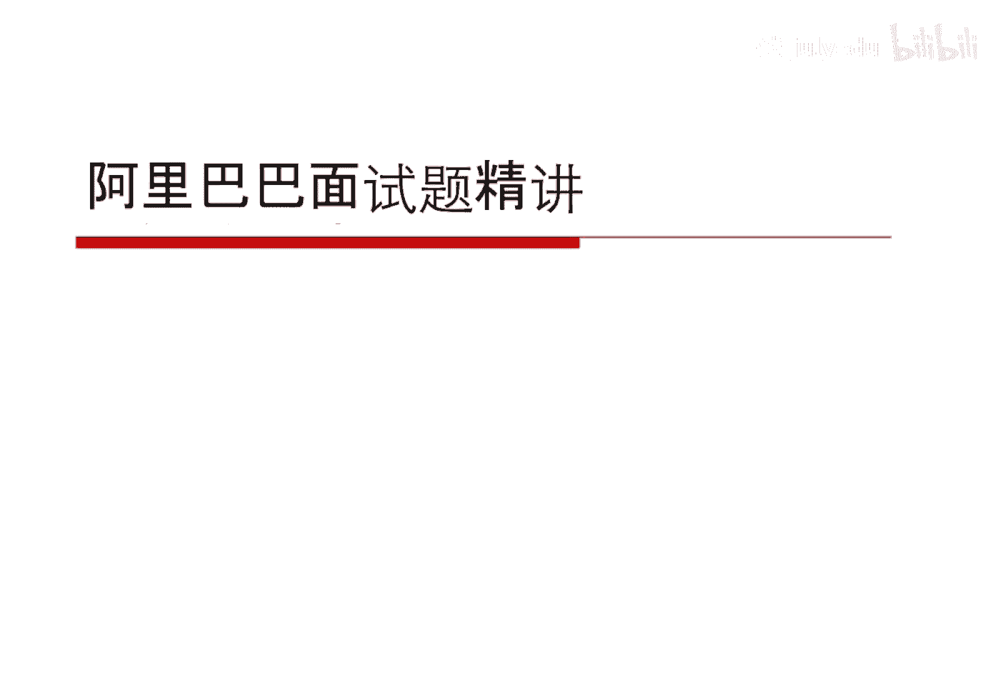

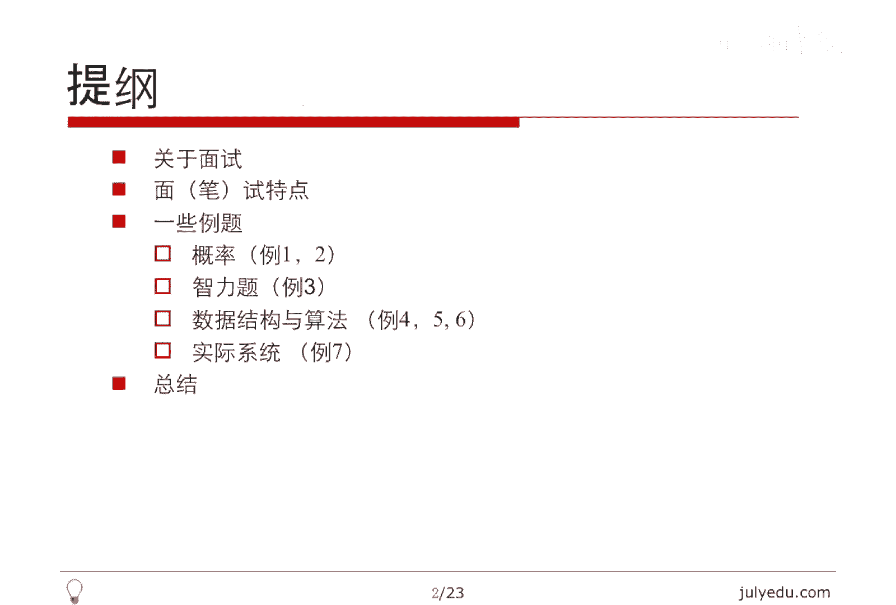

在本节课中，我们将学习如何应对阿里巴巴等大型科技公司的技术面试。课程将精选七道典型面试题，涵盖概率、智力题、数据结构与算法以及系统设计等多个方面，帮助你掌握解题思路与核心技巧。

---

## 关于面试的观点 🤔

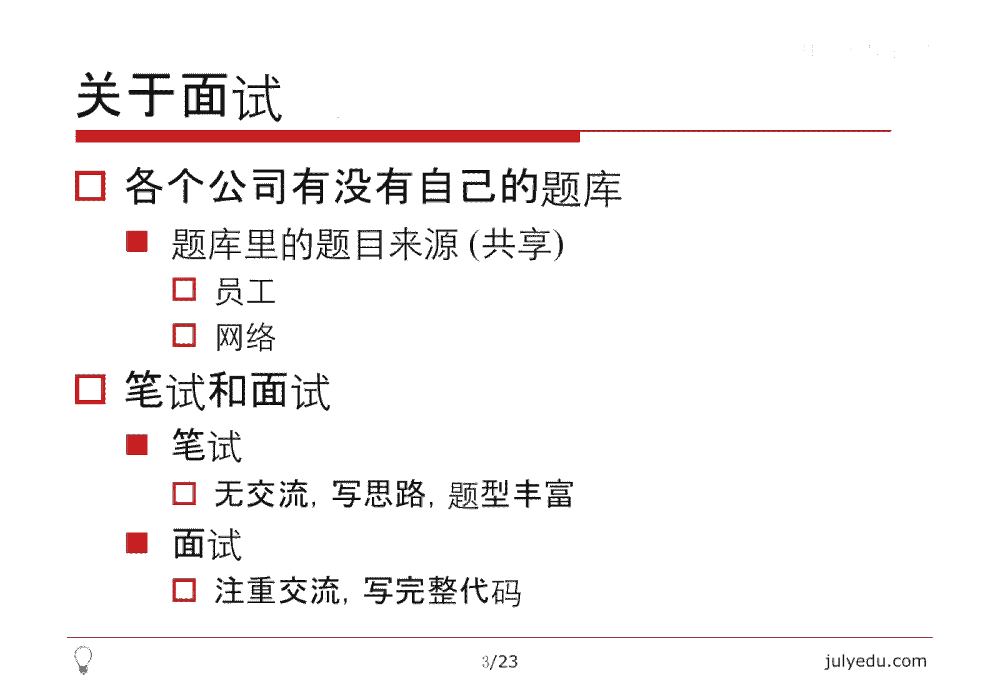

首先，我们来谈谈关于面试的一些观点。各大公司是否有自己的专属题库并不重要，因为题目来源通常是共享的，可能来自员工出题或网络搜集。因此，一道题目可能被多家公司使用，无需为其打上特定公司的标签。

笔试和面试存在显著区别。笔试通常以试卷形式进行，要求独立完成，题型多样但程序题较少，且缺乏与考官的即时交流。面试则强调面对面沟通，通常要求编写完整代码，并有机会向面试官阐述思路，这是展示逻辑思维和表达能力的关键环节。

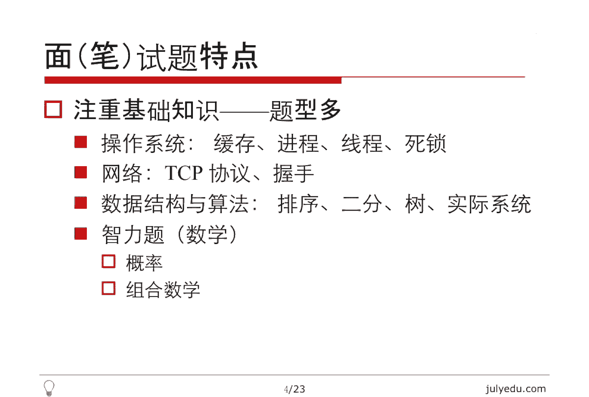

---

## 笔试与面试题的特点 📝

接下来，我们看看笔试和面试题目的特点。以阿里巴巴为例，其题目非常重视计算机科学的基础知识。

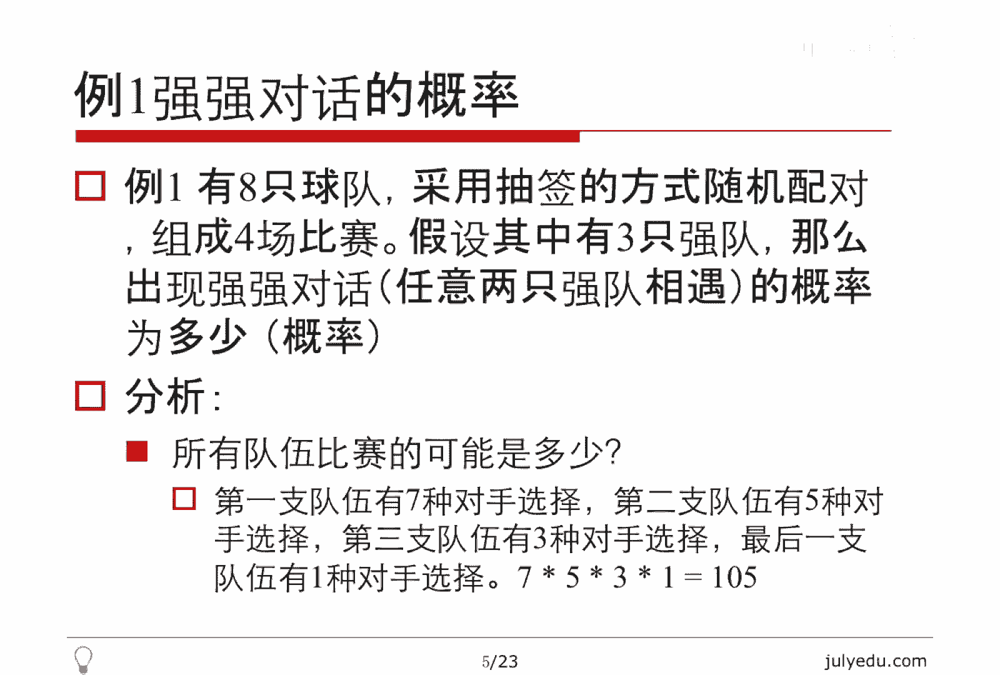

笔试题型广泛，涉及操作系统（如缓存、LRU算法、进程线程、死锁）、计算机网络（如TCP三次握手、URL访问流程）等。数据结构与算法始终是考察重点，包括排序、二分查找、树与图等。此外，也可能出现数学概率题或智力题。

面试则更侧重于交流与实际问题解决能力，有时会包含开放性的系统设计问题。

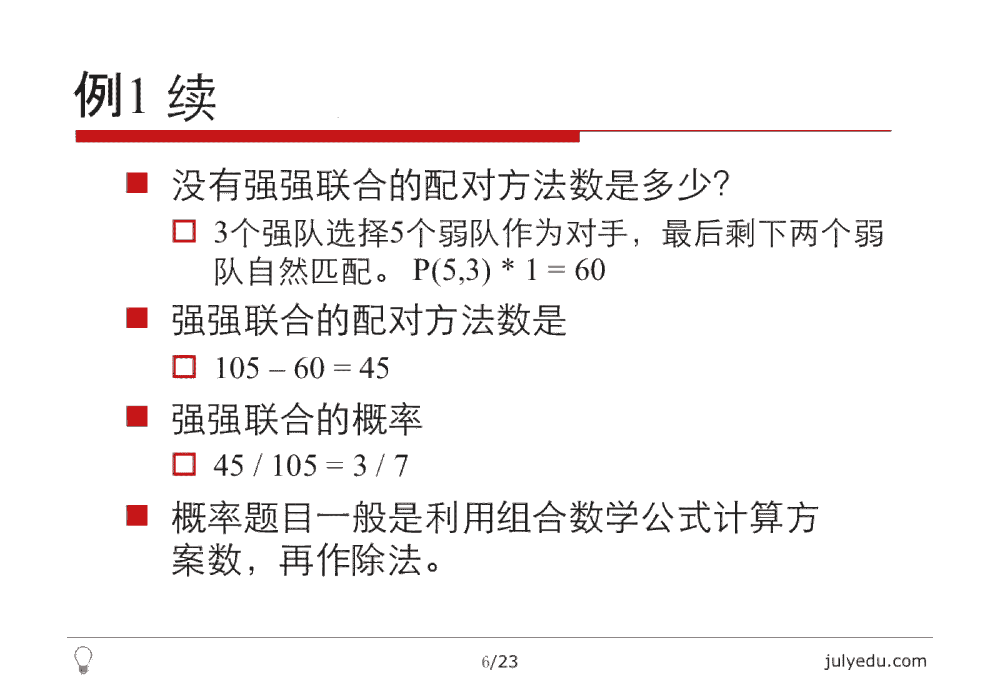

---

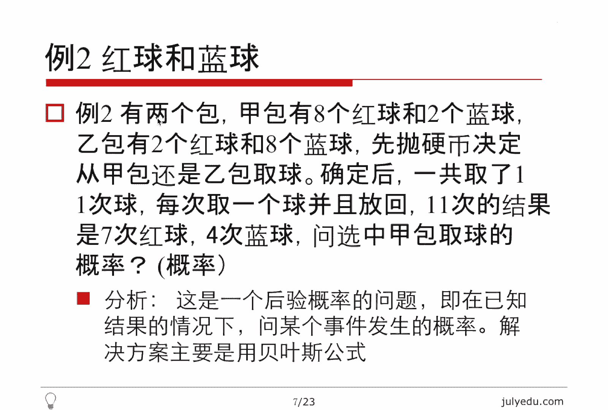

## 精选例题讲解

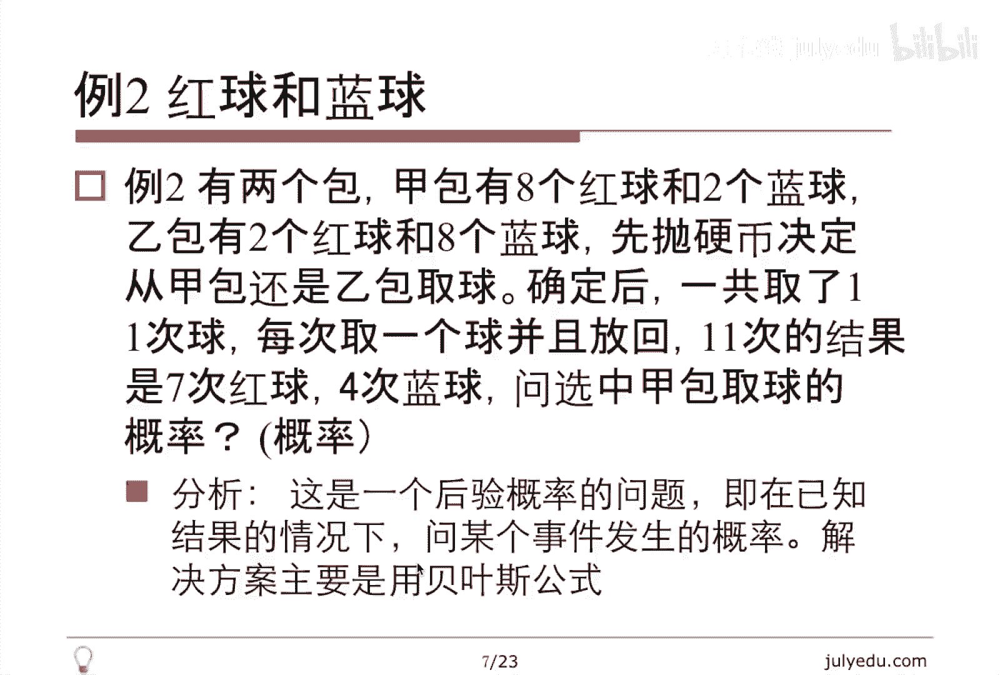

下面，我们将深入讲解七道精选例题，它们分别代表了不同的考察方向。

### 例题一：球队强强对话（概率）⚽

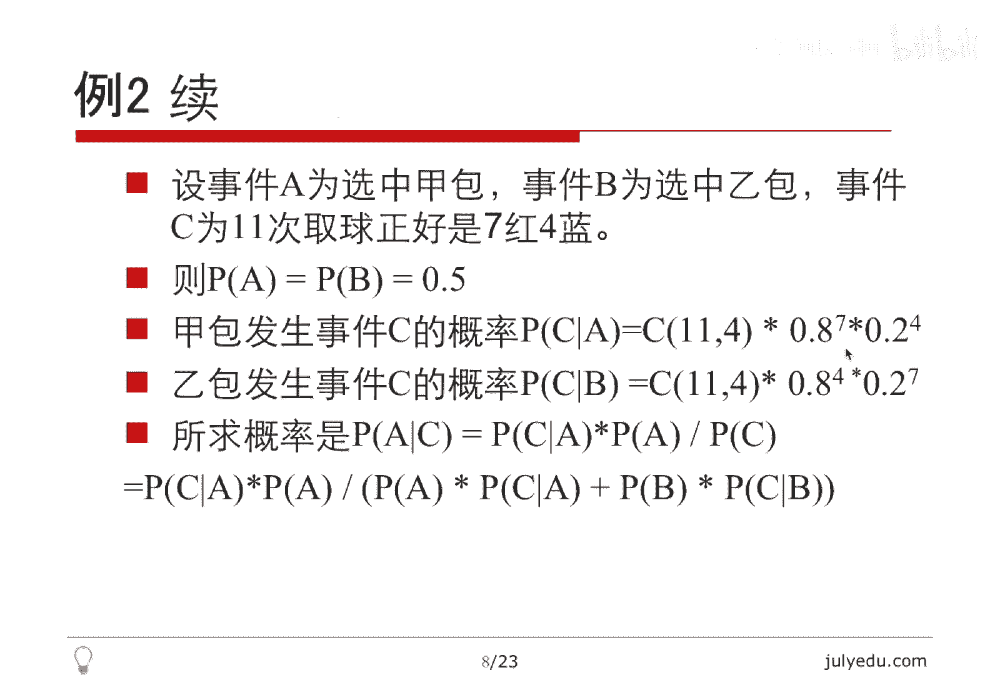

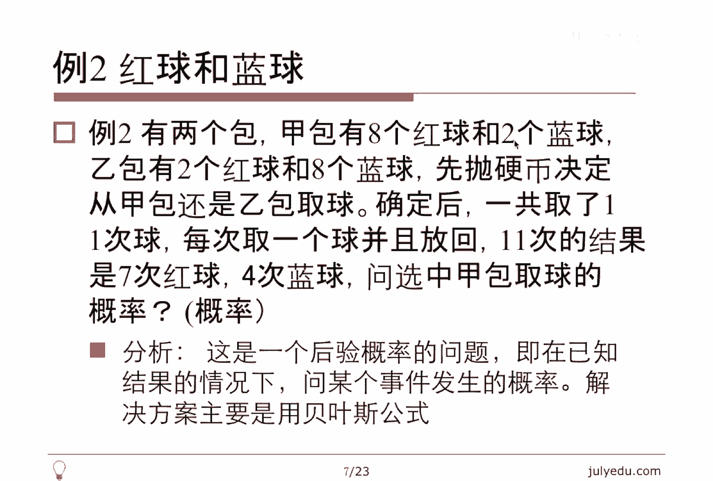

**问题**：8支球队随机抽签两两配对。已知其中有3支强队，问出现“强强对话”（即两支强队被分到同一对）的概率是多少？

**解题思路**：这是一个组合数学问题。首先计算8支球队两两配对的总方案数。我们可以依次为球队选择对手，总方案数为 `7 * 5 * 3 * 1 = 105`。


接着，计算没有强强对话（即每个强队都与弱队配对）的方案数。从5支弱队中选出3支与强队配对，并考虑顺序，方案数为 `P(5,3) = 5*4*3 = 60`。

因此，强强对话的方案数为 `105 - 60 = 45`。最终概率为 `45 / 105 = 3/7`。

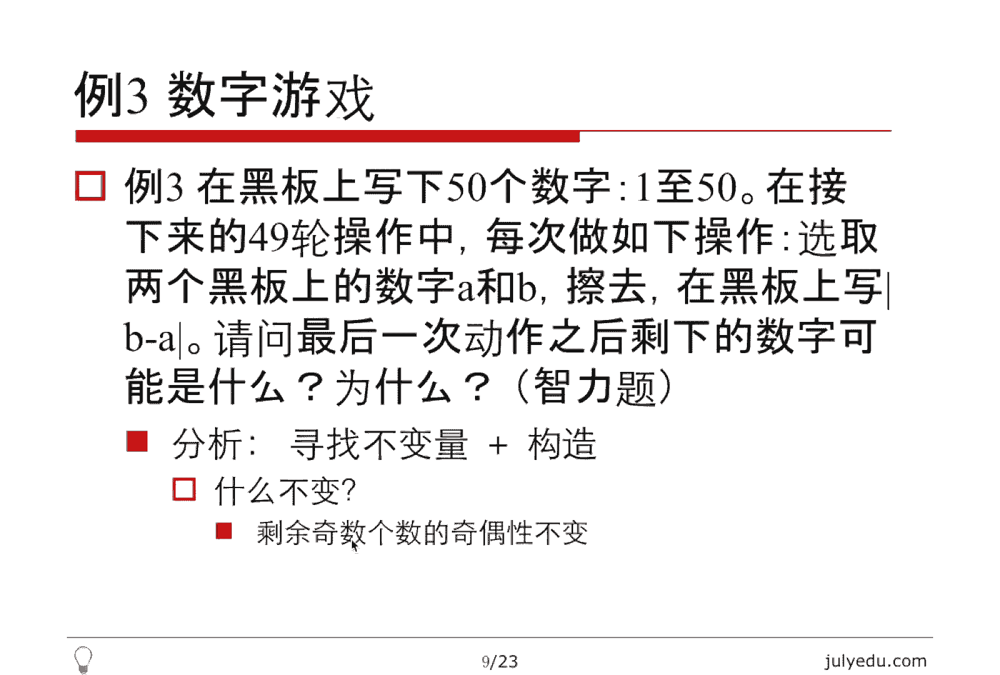

**总结**：此类概率题通常通过计算满足条件与总情况的方案数，运用组合数学公式求解。

---

### 例题二：选包抽球（后验概率）🎲

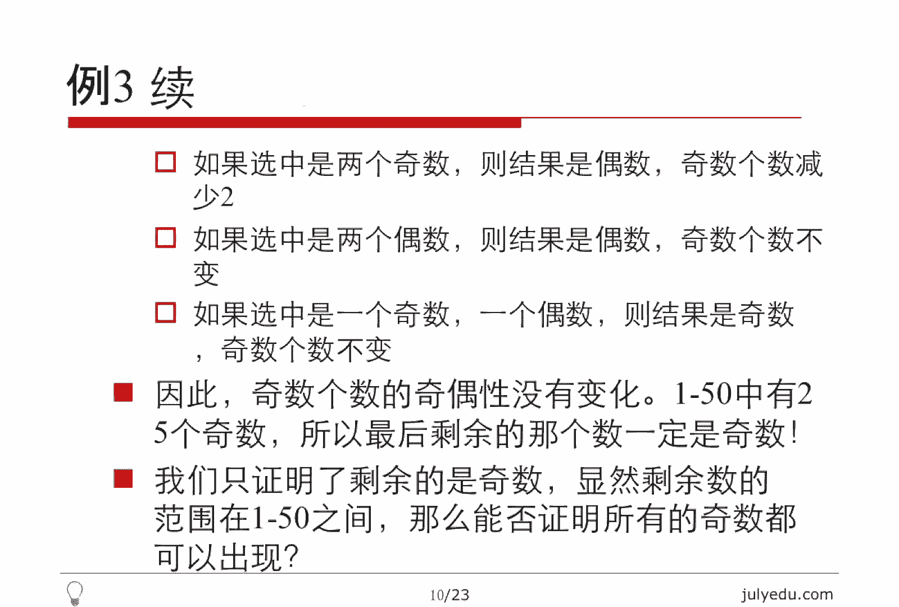

**问题**：有两个包，甲包有8红球2蓝球，乙包有8蓝球2红球。先抛硬币决定选哪个包，然后从选中包中有放回地取球11次，结果恰好是7红4蓝。问最初选中甲包的概率是多少？

**解题思路**：这是一个典型的后验概率问题，需使用贝叶斯公式。

定义事件：
*   A: 选中甲包
*   B: 选中乙包
*   C: 11次取球结果为7红4蓝

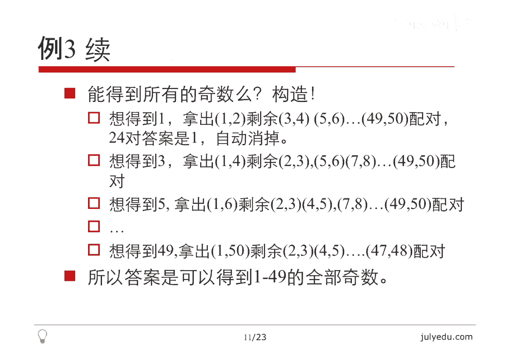

已知先验概率 `P(A) = P(B) = 0.5`。
在已知选中甲包的条件下，事件C发生的概率服从二项分布：`P(C|A) = C(11,4) * (0.8)^7 * (0.2)^4`。
同理，`P(C|B) = C(11,4) * (0.2)^7 * (0.8)^4`。

所求概率为 `P(A|C)`。根据贝叶斯公式：
`P(A|C) = [P(C|A) * P(A)] / [P(C|A)*P(A) + P(C|B)*P(B)]`
代入已知数值即可计算出结果。

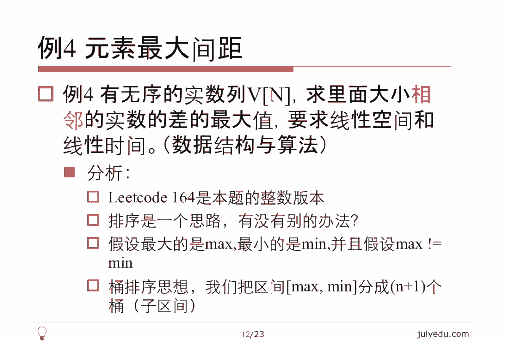

**总结**：对于已知结果反推原因的条件概率问题，贝叶斯公式是核心工具。

---

### 例题三：黑板上的数字（智力题）🧠

**问题**：黑板上写有1到50。每次操作擦去两个数，写上它们的差（绝对值）。经过49次操作后只剩一个数，问这个数可能是什么？为什么？

**解题思路**：关键在于寻找不变量。考虑剩余数字中**奇数的个数**的奇偶性。
每次操作有三种情况：
1.  擦去两个奇数：差为偶数，奇数个数减少2。
2.  擦去两个偶数：差为偶数，奇数个数不变。
3.  擦去一奇一偶：差为奇数，奇数个数不变。

因此，奇数个数的奇偶性始终保持不变。初始有25个奇数（奇数个），故最终剩下的数只能是奇数（奇数个奇数不可能通过每次减2变为0）。

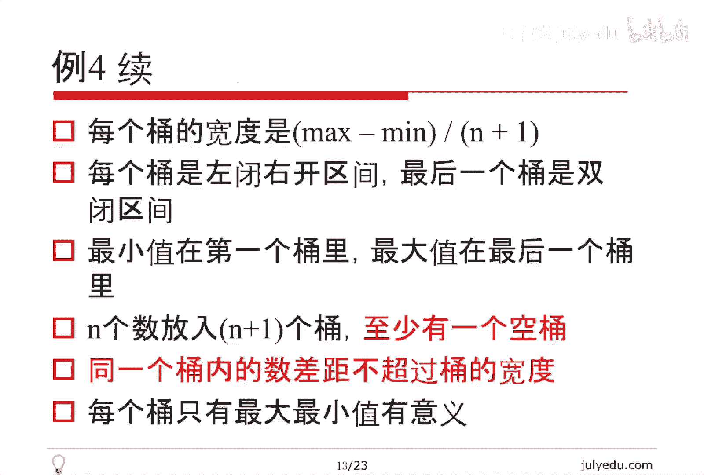

范围上，结果显然在0到50之间。通过构造法（例如，若想得到1，则保留1和2，将其余数字配对相消）可以证明，1到49之间的所有奇数都可能出现。

**答案**：最终结果可能是1到49之间的任意奇数。

---

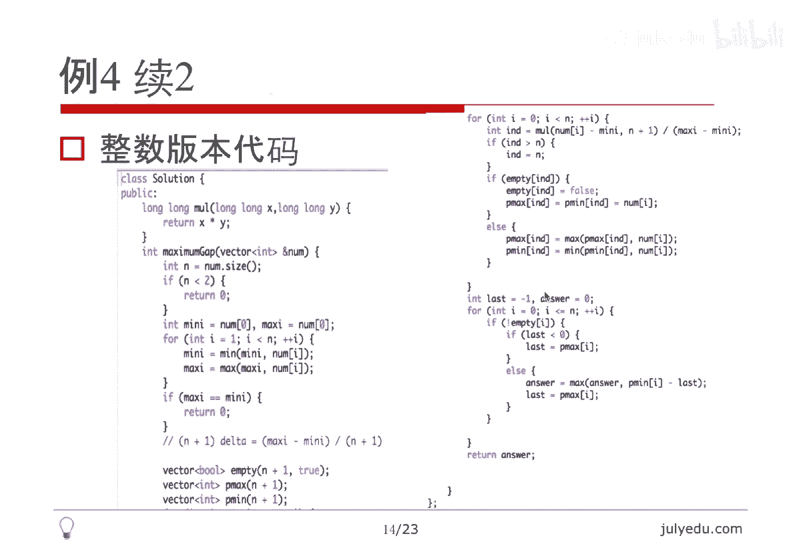

上一节我们探讨了数学和智力问题，本节开始，我们将重点转向数据结构与算法，这是技术面试的核心。

### 例题四：最大间距（线性时间与空间）📊

**问题**：给定一个无序的实数数组，要求在线性时间和线性空间复杂度内，找出数组排序后相邻元素之间最大的差值。

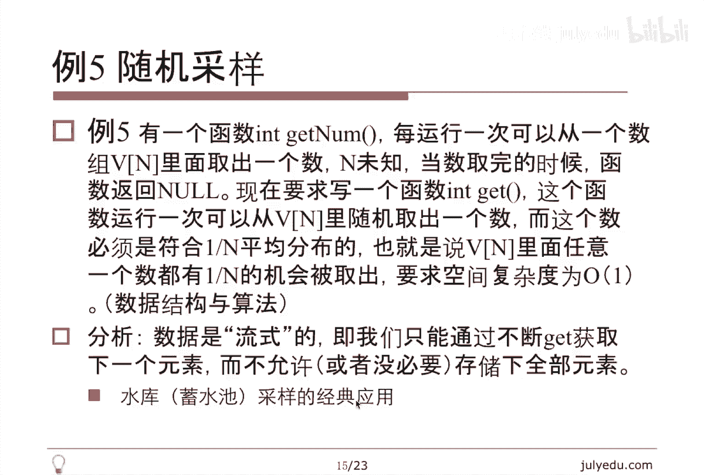

**解题思路**：直接排序需要 O(n log n) 时间。要达到 O(n)，需使用**桶排序**的思想。
1.  遍历数组，找到最小值 `min` 和最大值 `max`。
2.  将数值范围 `[min, max)` 平均分成 `n+1` 个桶（区间），每个桶的宽度为 `bucketSize = (max - min) / (n+1)`。
3.  将每个数放入对应的桶中，**每个桶只记录桶内元素的最小值和最大值**。
4.  根据鸽巢原理，`n` 个数放入 `n+1` 个桶，至少有一个空桶。**最大间距一定不会出现在同一个桶内部**，因为空桶的存在保证了其相邻非空桶之间最小值与最大值的差至少为一个桶的宽度。
5.  因此，只需遍历所有桶，用当前桶的最小值减去前一个非空桶的最大值，并记录最大值，即为答案。

**代码关键步骤**：
```python
def maximumGap(nums):
    if len(nums) < 2:
        return 0
    n = len(nums)
    min_val, max_val = min(nums), max(nums)
    if min_val == max_val:
        return 0

    bucket_size = max(1, (max_val - min_val) // (n + 1))
    bucket_count = (max_val - min_val) // bucket_size + 1
    buckets_min = [float('inf')] * bucket_count
    buckets_max = [float('-inf')] * bucket_count

    for num in nums:
        idx = (num - min_val) // bucket_size
        buckets_min[idx] = min(buckets_min[idx], num)
        buckets_max[idx] = max(buckets_max[idx], num)

    max_gap = 0
    prev_max = buckets_max[0]
    for i in range(1, bucket_count):
        if buckets_min[i] == float('inf'): # 空桶
            continue
        max_gap = max(max_gap, buckets_min[i] - prev_max)
        prev_max = buckets_max[i]
    return max_gap
```

---

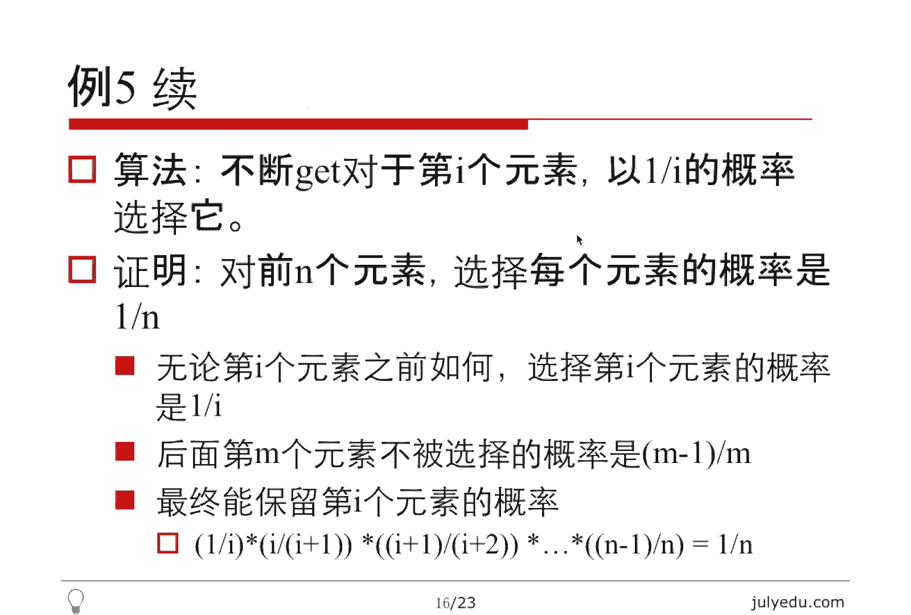

### 例题五：流式数据随机采样（蓄水池抽样）🎣

**问题**：有一个数据流（只能通过 `get_next()` 依次访问元素，无法预知总数 `n`），要求设计一个算法，**等概率**地随机返回流中的一个元素。空间复杂度需为 O(1)。

**解题思路**：使用**蓄水池抽样**算法。算法步骤如下：
1.  初始化结果 `result`，计数器 `i = 0`。
2.  当读到一个新元素 `x` 时：
    *   `i += 1`
    *   以 `1/i` 的概率用 `x` 替换当前的 `result`。
    *   以 `(i-1)/i` 的概率保持 `result` 不变。
3.  数据流结束后，返回 `result`。

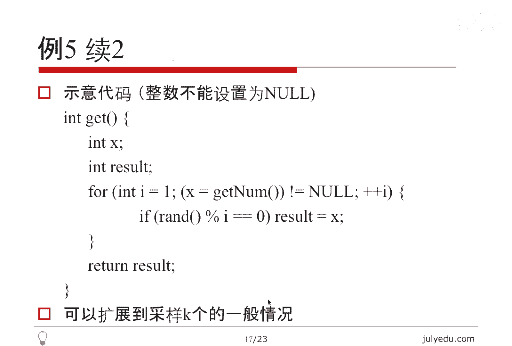

**证明**：对于第 `i` 个元素，它被选中并最终保留的概率是：
`(1/i) * [i/(i+1)] * [(i+1)/(i+2)] * ... * [(n-1)/n] = 1/n`
因此，每个元素被选中的概率都是 `1/n`。

**伪代码**：
```
result = None
i = 0
while (x = get_next()) is not None:
    i += 1
    if random.randint(1, i) == 1:  # 以 1/i 的概率
        result = x
return result
```
**扩展**：此算法可推广到随机抽取 `k` 个样本的情况。

---

### 例题六：查找 AI = I 的下标 🔍

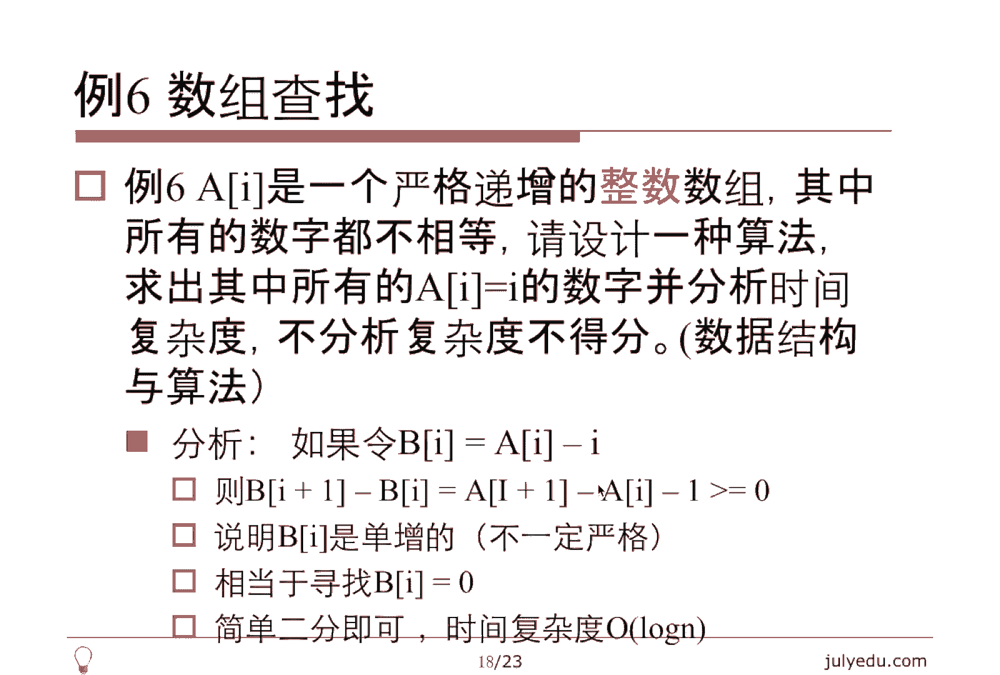

**问题**：给定一个严格递增的整数数组 `A`，寻找是否存在下标 `i` 使得 `A[i] == i`。要求分析时间复杂度。

**解题思路**：构造新数组 `B`，其中 `B[i] = A[i] - i`。
由于 `A` 严格递增且为整数，`A[i+1] - A[i] >= 1`，因此 `B[i+1] - B[i] = (A[i+1] - (i+1)) - (A[i] - i) = A[i+1] - A[i] - 1 >= 0`。
所以 `B` 是一个**非严格递增**数组。问题转化为在 `B` 中查找值 `0`。

这可以通过标准的**二分查找**在 O(log n) 时间内解决。注意，我们无需显式构造 `B` 数组，在二分查找过程中动态计算 `A[mid] - mid` 的值即可。

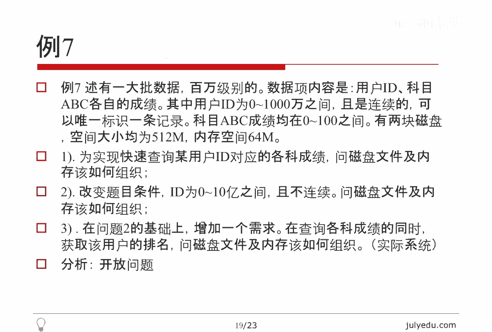

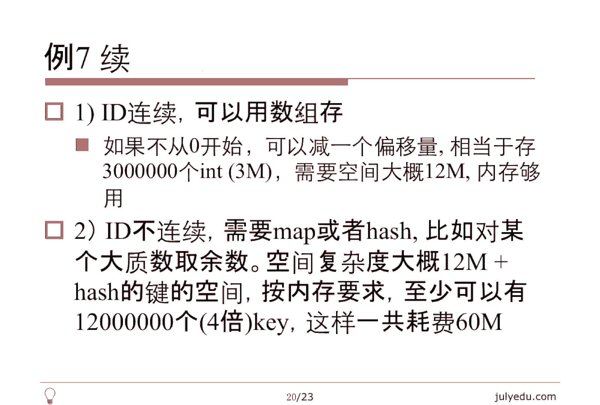


---

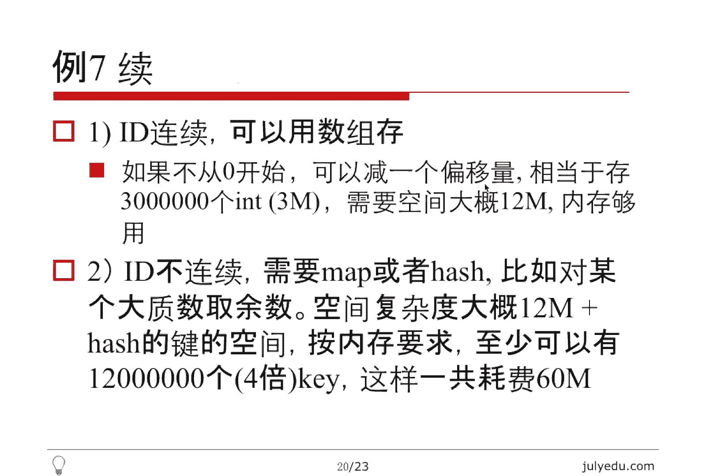

### 例题七：成绩查询与排名系统设计（开放问题）💻

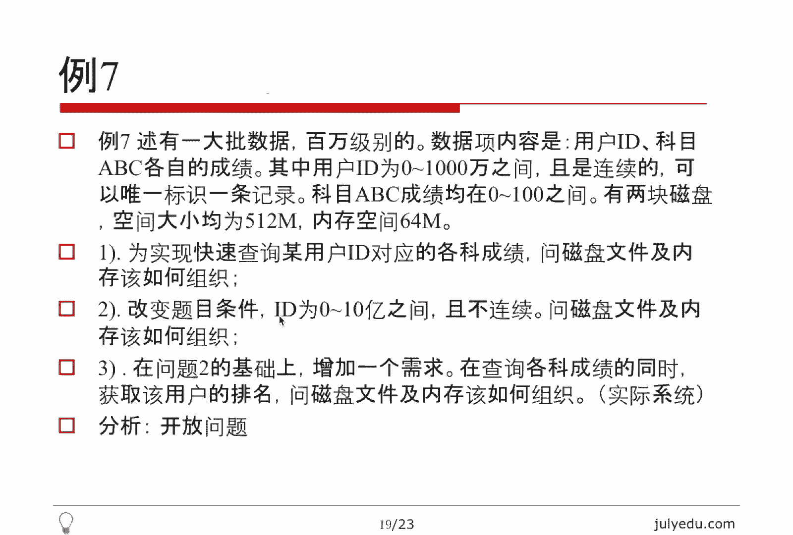

**问题**：设计一个系统，存储百万条学生成绩记录（ID，科目A/B/C成绩）。需求：(1) 快速查询指定ID的各科成绩；(2) ID范围变为0-10亿且不连续时如何应对；(3) 支持按总分或单科成绩排名。

**思路分析**：
这是一个开放的系统设计问题，以下提供一些思考方向：

1.  **ID连续时**：可直接用数组存储，将ID偏移后作为索引。百万条记录，每科成绩用1字节存储（0-100），总内存消耗约3MB，效率极高。


2.  **ID不连续且范围大时**：
    *   **核心**：需要将稀疏的、大范围的ID映射到紧凑的存储索引。
    *   **方法一（内存哈希）**：使用哈希表（如开放寻址或链地址法）。预估存储空间，例如设计一个大小为1200万的哈希数组来映射100万条记录，结合成绩存储，总内存可能在几十MB量级，需评估是否可接受。
    *   **方法二（磁盘哈希）**：若内存受限，可将哈希表和部分数据放在磁盘上，通过文件IO进行查找，但速度会慢于纯内存方案。

3.  **支持排名**：
    *   **排序**：需要对百万级数据进行排序。内存充足时可使用快速排序；考虑到成绩范围很小（0-100或总分0-300），使用**计数排序**是更优选择，时间复杂度可达 O(n)。
    *   **外部排序**：如果数据量极大无法全部装入内存，需使用**外部归并排序**：将数据分块读入内存排序后写回临时文件，再对这些有序文件进行多路归并。
    *   **存储排名**：排序后，可将排名作为额外字段存入记录中。更新时可能需要全量重排或使用增量更新策略。

4.  **优化思路**：
    *   **数据压缩**：成绩值域小，可使用更小的数据类型（如`uint8`）存储。
    *   **索引结构**：为常用的查询字段（如总分）建立索引。

---

## 课程总结 📚

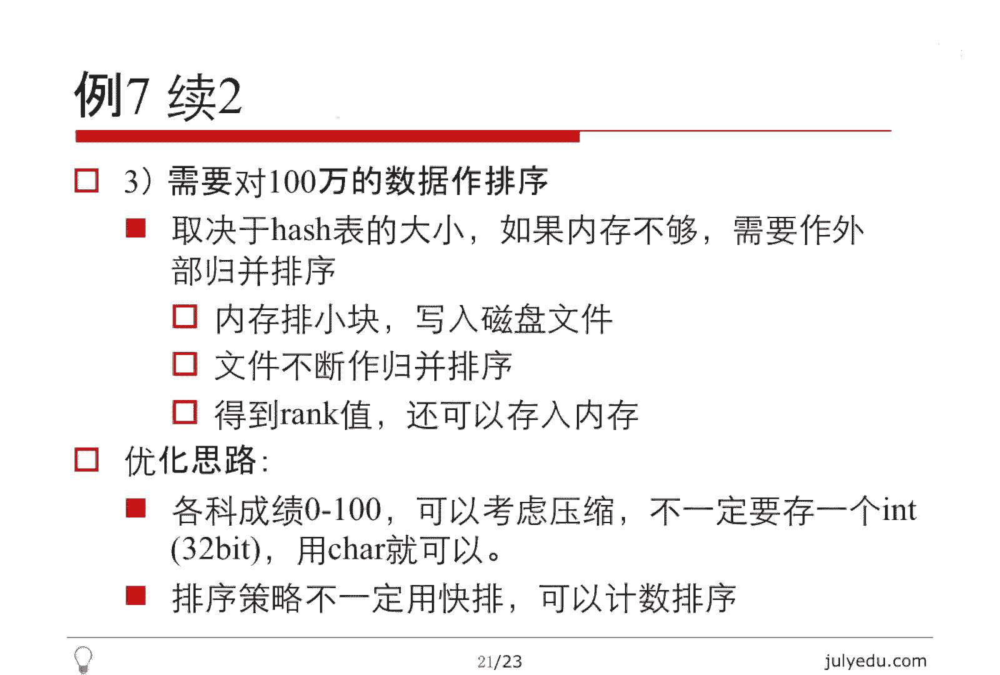

本节课我们一起学习了应对技术面试的多种策略与经典题型。

我们了解到，笔试注重广泛的基础知识考察，而面试则更侧重于交流能力、思维过程以及解决开放性问题的能力。在面试中，应主动与面试官沟通思路，对问题进行合理假设和简化。

通过七道例题，我们掌握了：
*   利用组合数学解决概率问题。
*   运用贝叶斯公式处理后验概率。
*   通过寻找不变量解决智力题。
*   使用桶排序思想在线性时间内求解最大间距问题。
*   应用蓄水池抽样算法处理流式数据的随机采样。
*   通过问题转换与二分查找解决特定条件的查找问题。
*   从多个角度思考系统设计问题，权衡空间、时间与实现复杂度。

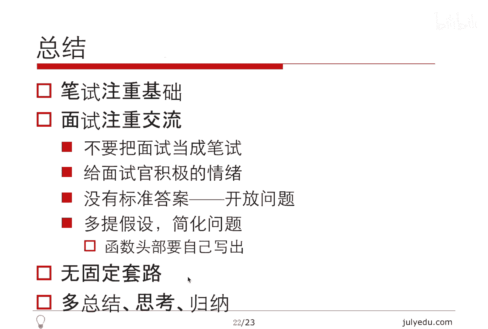

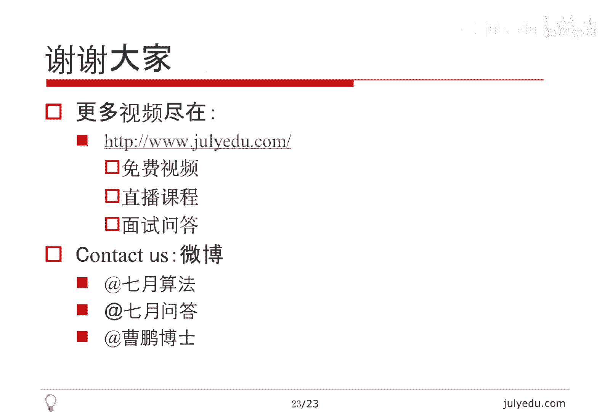

希望本课程能帮助你更好地准备技术面试，提升解题能力。