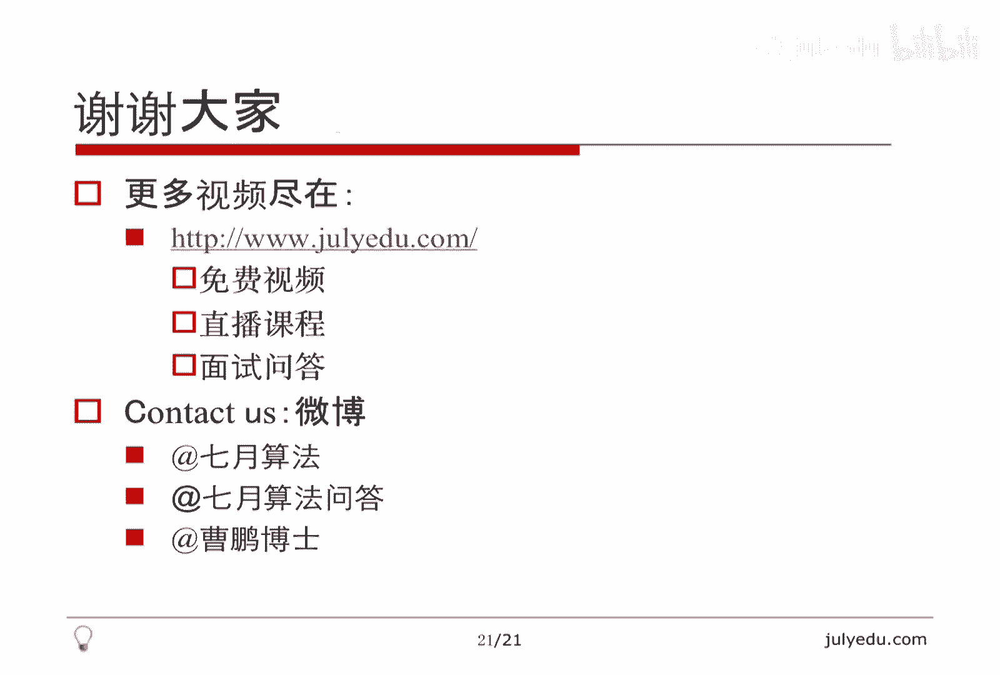

# 人工智能—面试求职公开课（七月在线出品） - P5：曹博：我的北美求职心得

## 🎯 课程概述

在本节课中，我们将学习北美科技公司求职的完整流程、核心挑战与准备策略。课程内容基于讲师的亲身经历，旨在为有志于赴美工作的同学提供一份实用的指南。

---

## 📋 求职一般流程

上一节我们介绍了课程概述，本节中我们来看看北美求职的一般流程。该流程与国内求职有相似之处，但存在一些关键差异。

以下是主要的求职渠道：

1.  **LinkedIn**：平台上有许多招聘人员（Recruiter），可以主动联系他们或被他们联系，通过站内信或电话沟通后投递简历。
2.  **直接投递**：通过公司官网直接申请职位，但成功率通常较低，因为候选人众多，简历容易石沉大海。
3.  **内推**：通过已在目标公司工作的朋友、学长等进行内部推荐。公司对内部推荐的重视程度较高，获得面试的机会也更大。
4.  **比赛**：通过参加如LeetCode、Codeforces、TopCoder等平台上的编程比赛，如果获得优异名次（如前十、前二十），公司可能会主动联系。

在获得面试机会后，流程通常如下：

1.  **HR初步沟通**：HR会进行约10到20分钟的电话沟通，了解你的背景、项目经验、技术栈和职业意向，并介绍公司概况。
2.  **电话面试**：通常有1到3轮，在线上进行。
3.  **现场面试**：需要前往美国公司所在地进行，通常有5到6轮，从早晨持续到晚上。中午可能与工程师共进午餐，了解公司文化。
4.  **发放Offer**：面试通过后，公司会发放录用通知。
5.  **办理签证**：公司协助办理美国工作签证（主要是H-1B）。
6.  **入职**：通常在10月1日之后。

从电话面试到现场面试的通过率相对较高，但从现场面试到最终获得Offer的难度则大很多。

---

## 🏢 可投递的公司列表

了解了流程后，我们来看看哪些公司值得关注。由于签证办理对公司是项负担，因此并非所有美国公司都愿意从海外招聘。

以下是部分已知从中国招聘的知名公司：

*   **FLAG**：这是一个流传的说法，指代四家巨头公司：
    *   **F** - Facebook (Meta)
    *   **L** - LinkedIn
    *   **A** - Amazon
    *   **G** - Google
*   **Microsoft** (微软)
*   **Twitter** (推特)
*   **Storm8** (一家游戏公司)
*   **Apple** (苹果)
*   **Pocket Gems** (一家手游公司)
*   **Tango** (一款类似微信的通讯工具)
*   **Thinx** (总部在加拿大，美国有分部)

建议优先考虑FLAG、微软、推特等规模较大、有成熟海外招聘流程的公司。

---

## 😫 公司招聘的烦恼

为什么公司从海外招聘如此谨慎？本节我们来分析公司方的考量。

公司招聘海外员工面临以下主要烦恼：

1.  **人才供给**：美国本土毕业生数量充足，但平均水平可能不及来自中国、印度等地的顶尖候选人。公司为追求更高水平人才，才愿意承担额外成本从海外招聘。
2.  **面试协调成本**：安排跨时区的电话面试本身就更耗时。安排现场面试则需承担机票、酒店住宿等费用，成本显著高于招聘本土候选人。
3.  **签证与等待周期**：工作签证（H-1B）实行抽签制，每年4月1日提交申请，10月1日生效。这意味着从发出Offer到员工入职，至少有半年等待期，无法满足紧急的招聘需求。
4.  **提高招聘标准**：正因为招聘海外员工成本高、周期长，公司对其面试要求也水涨船高，期望招到更优秀的人才。

这些因素共同导致了海外求职面试难度大、不确定性高。

---

## 🛂 签证问题详解

签证是海外求职的核心挑战之一。本节我们详细解读美国工作签证H-1B。

**H-1B签证核心信息：**

*   **性质**：非移民签证，与雇主绑定。必须由雇主为你申请。
*   **有效期**：首次有效期一般为3年，可延期3年，最长总计6年。
*   **绿卡转换**：在H-1B期间，公司通常会为员工申请绿卡（移民签证）。在申请进入一定阶段（如I-140批准后），即使绿卡未最终获批，H-1B身份也可无限期延期。

**签证流程与抽签：**

1.  **提交申请**：每年4月1日，雇主将申请材料提交至美国移民局（USCIS）。
2.  **抽签**：移民局每年发放约65,000个H-1B签证名额。若申请人数超额，则通过电脑随机抽签决定。
3.  **硕士及以上学历优待**：拥有美国硕士或博士学位的申请人，享有20,000个优先名额（包含在65,000个内），中签率更高。
4.  **结果与生效**：抽签结果通常在5-6月公布。中签者需准备领事馆面签，通过后签证于当年10月1日生效。

因此，最理想的求职节奏是在每年4月1日前拿到Offer，以便赶上当年的抽签。对于留学生，毕业后可申请OPT（Optional Practical Training）临时工作许可，作为等待H-1B抽签期间的合法工作身份。

---

## 📝 面试题型与准备方法

面对高标准的面试，该如何准备？本节我们将面试内容分为技术与非技术两方面进行梳理。

**非技术面试准备：**

以下是常见的非技术问题类型：

*   **自我介绍与项目经历**：清晰阐述你的背景和做过的项目。
*   **行为问题**：考察团队协作与解决问题的方式。例如：“如果同事进度慢影响团队，你会如何处理？”
*   **开放性问题**：考察产品思维与批判性思考。例如：“你认为我们产品有哪些可以改进的地方？”
*   **文化契合度**：了解你是否能融入团队和公司文化。

**技术面试准备：**

技术面试的形式多样，主要包括：

1.  **在线编程测试**：在HackerRank或Codility等平台完成，通常有倒计时。
    ```python
    # 示例：一个简单的OA题目框架
    def solve(input_data):
        # 你的解题逻辑
        result = ...
        return result
    ```
2.  **电话面试**：主要考察编程和算法，难度通常不会太高，但受限于沟通形式。
3.  **现场面试**：考察范围最广，可能包括：
    *   **编程与算法**：核心考察内容。
    *   **系统设计**：设计一个分布式系统，如短链接服务、售票系统等。考察工程综合能力。
    *   **逻辑/数学题**：考察思维敏捷度。
    *   **测试与调试**：如何测试一个功能或排查系统问题。

---

## 🔍 面试例题选讲

为了让大家有更直观的感受，本节我们选取几个不同类型的面试题进行简要讲解。

**1. 逻辑题：100把锁**
> 100把锁编号1-100，初始锁着。第一个人把所有锁打开；第二个人将编号为2的倍数的锁状态反转（即关上）；第i个人将编号为i的倍数的锁状态反转。问第100人操作后，哪些锁是开着的？
> **关键**：每把锁被操作的次数等于其编号的约数个数。只有约数个数为奇数的锁，最终状态是开的。而只有完全平方数的约数个数是奇数。

**2. 概率题：蚂蚁碰撞**
> 三只蚂蚁位于等边三角形三个顶点，各自随机选择一条边沿顺时针或逆时针爬行，速度相同。问它们不会相互碰撞的概率是多少？
> **关键**：所有蚂蚁同向（全顺时针或全逆时针）则不会碰撞。每只蚂蚁有2种方向选择，总共有 `2^3 = 8` 种情况。因此不碰撞概率为 `2/8 = 1/4`。

**3. 算法题：水流问题（太平洋大西洋水流问题）**
> 给定一个矩阵，左边界和上边界邻接“太平洋”，右边界和下边界邻接“大西洋”。每个格子有高度，水只能向不高（或相等）于当前格子的相邻格子流动。找出所有能同时流到太平洋和大西洋的格子。
> **关键**：从两个海洋的边界分别进行DFS或BFS逆向搜索（从低往高找），标记能到达的格子。最后取两个标记集合的交集。
> ```python
> # 思路伪代码
> def pacificAtlantic(heights):
>     # 初始化两个访问矩阵
>     can_reach_p = dfs_from_pacific_border(heights)
>     can_reach_a = dfs_from_atlantic_border(heights)
>     # 找到两个矩阵都为True的坐标
>     return [(i, j) for i in range(rows) for j in range(cols) if can_reach_p[i][j] and can_reach_a[i][j]]
> ```

**4. 系统设计题：短链接系统**
> 如何设计一个像微博或Twitter那样的短链接生成服务？
> **考察点**：哈希函数设计、长链接到短码的映射、避免哈希冲突、高并发下的性能、分布式系统下的唯一ID生成、数据存储与缓存策略等。

---

## 🎓 课程总结

本节课中，我们一起学习了北美求职的完整图景。

我们首先梳理了从投递简历到最终入职的**一般流程**，强调了内推的重要性。接着，列出了部分对海外候选人开放的**公司列表**。然后，深入分析了公司招聘海外员工的**烦恼与成本**，这解释了面试高要求的原因。**签证（H-1B）** 部分我们详细讲解了其抽签机制和漫长周期，这是海外求职最大的不确定性之一。

在面试准备部分，我们将其分为**技术面**和**非技术面**，并列举了编程、算法、系统设计、行为问题等多种题型。通过几个**例题**，我们直观感受了面试的考察方向。

最后，需要认识到北美求职是**实力与运气**的结合。面试本身具有随机性，签证抽签更是无法控制。因此，保持良好心态，将每次面试视为锻炼，不断积累经验至关重要。即使实力出众，也需要一定的运气才能成功。

希望这份心得能帮助你在求职路上少走弯路。祝你好运！

---




