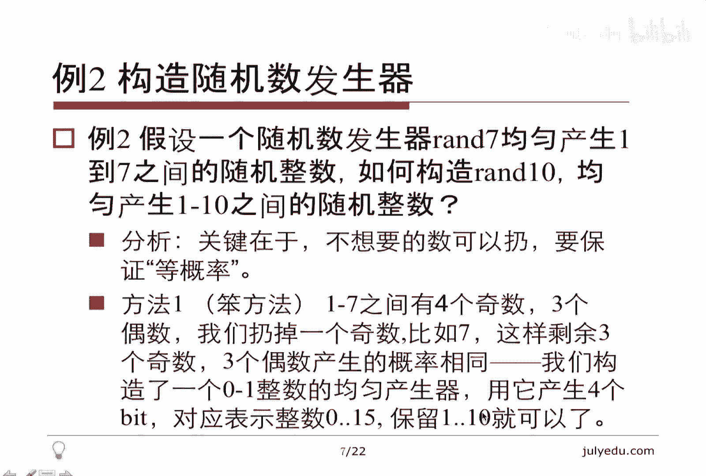
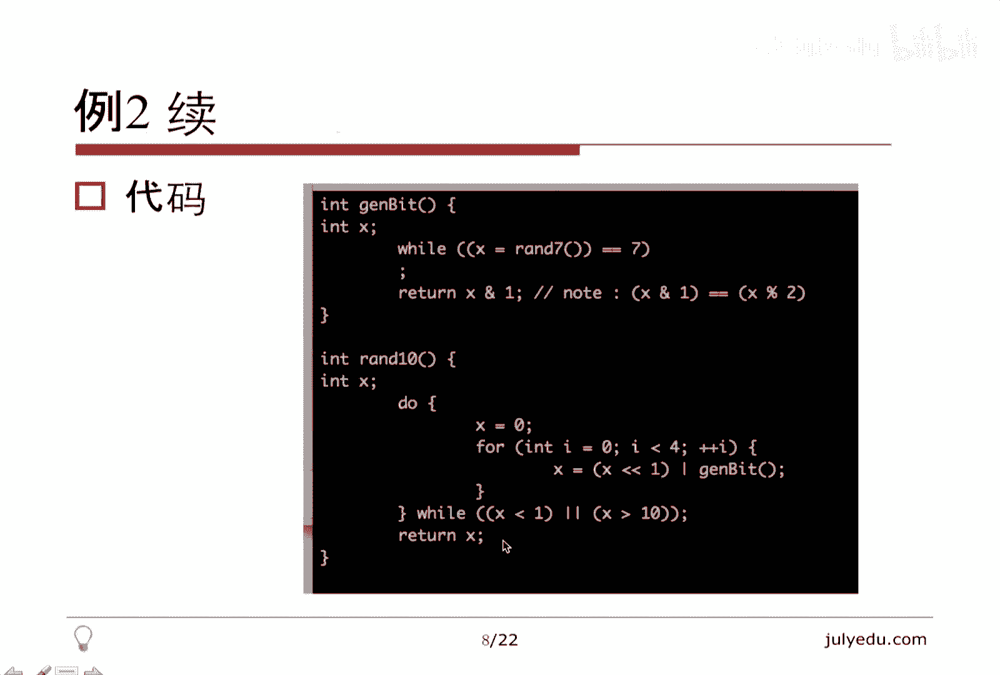
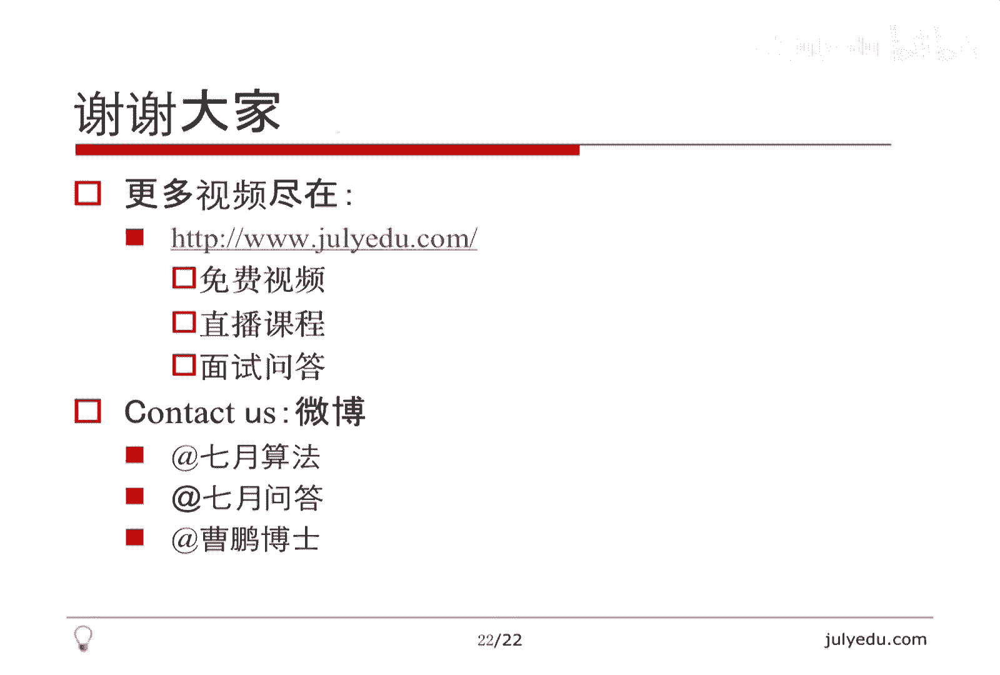

# 人工智能—面试求职公开课（七月在线出品） - P6：概率面试题精讲 🎲

在本节课中，我们将要学习概率论在算法面试中的核心应用。课程将从概率的基本概念入手，逐步深入到随机数生成、采样算法等经典面试题，并通过多个例题帮助大家掌握解题思路。

## 课程简介 📋

概率相关的面试题主要考察以下几个范围：
*   对**独立事件**的理解。
*   **古典概率**，即通过计数（排列组合）做除法。
*   **条件概率**，即给定一个事件成立，求另一个事件的概率。
*   **期望**的计算。
*   **随机数的产生和利用**（采样）。

前四个知识点主要出现在笔试的选择题、填空题和计算题中。最后一个知识点“随机数的产生和利用”则更常见于面试中，也可能出现在笔试的大题里。

## 预备知识：关于随机性 💡

在深入具体题目之前，我们先了解一些关于随机性的背景知识。

随机数的产生在计算机科学中是一个深刻的课题。一个著名的计算机科学家在其著作《编程珠玑》中用了大量篇幅讨论如何产生随机数。我们只需有一个感性认识：**随机性和不可预测性存在差异**。

这个差异在密码学中尤为明显。例如，固定一个整数 `M`，对所有自然数 `N` 计算 `N % M`（取余数），结果在 `0` 到 `M-1` 之间是均匀分布的。虽然它具有一定的随机性，但在密码学中通常不被采用，因为它是可预测的（具有周期性）。

因此，在面试中如果考察构造随机数发生器，题目通常会**假设存在一个基础的随机数发生器**，而不会要求我们凭空构造。

关于期望的计算，一个常见技巧是将其转化为**方程组**来求解。例如，对于状态 `A`，其期望 `E(A)` 可以表示为 `E(A) = 1 + Σ [P(从A到邻居状态) * E(邻居状态)]`。通过为每个状态建立类似的方程，我们可以形成一个多元一次方程组，从而解出所有状态的期望值。

## 例题精讲 📚

上一节我们介绍了概率面试题的考察范围和预备知识，本节中我们来看看具体的例题。



### 例题1：理解独立性



这个例题旨在帮助大家精确理解“独立”的概念。

假设 `X1`, `X2` 是两个**二元随机变量**，即它们以各50%的概率取值为0或1。定义 `X3 = X1 XOR X2`（异或运算：相同为0，不同为1）。

直觉上，`X3` 与 `X1`、`X2` 似乎因为定义式而相关。但实际上，`X3` 与 `X1` 以及 `X3` 与 `X2` 都是**相互独立**的。

我们可以枚举验证：
*   当 `(X1, X2)` 为 `(0,0)` 时，`X3=0`
*   当 `(X1, X2)` 为 `(0,1)` 时，`X3=1`
*   当 `(X1, X2)` 为 `(1,0)` 时，`X3=1`
*   当 `(X1, X2)` 为 `(1,1)` 时，`X3=0`

观察可知，无论 `X1` 是0还是1，`X3` 都有一半的概率是0，一半的概率是1。根据独立的定义——`P(A∩B) = P(A)P(B)`——可以验证它们满足独立性。

**关键点**：判断独立性不能凭直觉，必须依据数学定义。

### 例题2：构造随机数发生器

这是一个非常经典的面试题。题目通常会给定一个随机数发生器，要求构造另一个。

**题目**：给定一个均匀生成 `[1, 7]` 范围内整数的随机函数 `rand7()`，请构造一个均匀生成 `[1, 10]` 范围内整数的随机函数 `rand10()`。

**核心思路**：我们可以丢弃（拒绝）不想要的采样结果，但必须保证在**接受**的样本中，每个结果都是**等概率**出现的。

以下是两种方法：

**方法一（利用二进制）**：
1.  调用 `rand7()`，如果结果是7则重试，直到得到 `[1, 6]` 范围内的数。此时，奇数和偶数各三个，等概率。
2.  将奇数映射为1，偶数映射为0，我们就得到了一个均匀的 `rand2()`，即等概率产生0和1。
3.  调用4次 `rand2()`，拼接成一个4位二进制数，可以等概率生成 `[0, 15]` 共16个数。
4.  如果生成的数在 `[1, 10]` 范围内，则接受；否则（即0或11-15），拒绝并重试。

```python
# 伪代码示意
def rand10():
    while True:
        # 步骤1,2: 生成一个均匀的0/1
        def rand2():
            while True:
                num = rand7()
                if num != 7:
                    return num % 2 # 奇数得1，偶数得0
        # 步骤3: 生成0-15的随机数
        num = 0
        for i in range(4):
            num = (num << 1) | rand2()
        # 步骤4: 拒绝采样
        if 1 <= num <= 10:
            return num
```

**方法二（利用七进制，更高效）**：
1.  将 `rand7()` 减1，得到均匀的 `[0, 6]` 发生器。
2.  将其视为7进制。调用两次，分别作为高位 `a` 和低位 `b`，可以等概率生成 `[0, 48]`（即 `7*7-1`）共49个数。
3.  我们拒绝 `[40, 48]` 这9个数。此时剩下的 `[0, 39]` 共40个数，每个数的个位数（0-9）都出现了4次，因此是均匀的。
4.  将得到的数取个位并加1，即得到 `[1, 10]`。

```python
# 伪代码示意
def rand10():
    while True:
        a = rand7() - 1 # 高位
        b = rand7() - 1 # 低位
        num = a * 7 + b # 均匀生成 0~48
        if num < 40: # 拒绝40~48，保留0~39
            return (num % 10) + 1 # 均匀生成1~10
```

**方法对比**：方法二丢弃的样本更少，因此**期望的调用次数更少**，效率更高。
一个通用结论：如果一次实验成功的概率是 `p`，那么直到成功所需的**期望实验次数是 `1/p`**。

### 例题3：用不均匀硬币构造均匀硬币

**题目**：给定一个随机函数 `randP()`，它以概率 `p` 产生0，以概率 `1-p` 产生1（`0<p<1`）。请构造一个等概率产生0和1的随机函数。

**思路**：利用两次独立调用 `randP()` 的结果。
*   连续调用两次，结果只有四种可能：`00`, `01`, `10`, `11`。
*   其中，`01` 和 `10` 出现的概率是相等的，都是 `p*(1-p)`。
*   因此，我们可以丢弃 `00` 和 `11` 的情况。当得到 `01` 时输出0，得到 `10` 时输出1。

```python
def randFair():
    while True:
        a = randP()
        b = randP()
        if a == 0 and b == 1:
            return 0
        if a == 1 and b == 0:
            return 1
        # 其他情况(a==b)则重试
```

### 例题4：连续随机变量的概率计算

这是一道出现在笔试中的选择题，考察将概率问题转化为几何问题。

**题目**：设随机变量 `X` 在 `[0, a]` 上均匀分布，`Y` 在 `[0, b]` 上均匀分布，且相互独立。给定 `z`，求 `P(X + Y <= z)`。

**解法**：
1.  `(X, Y)` 的所有可能取值构成一个面积为 `a * b` 的矩形。
2.  直线 `X + Y = z` 将这个矩形分为两部分。
3.  `P(X + Y <= z)` 就等于直线下方区域面积与矩形总面积之比。
4.  需要根据 `z` 相对于 `a` 和 `b` 的大小进行**分类讨论**：
    *   当 `0 <= z <= min(a, b)` 时，区域是三角形，面积为 `z^2 / 2`。
    *   当 `min(a, b) < z <= max(a, b)` 时，区域是一个五边形。
    *   当 `max(a, b) < z <= a+b` 时，区域是矩形减去一个小三角形。
    *   当 `z > a+b` 时，概率为1；当 `z < 0` 时，概率为0。

### 例题5：水库采样算法

这是本节课的重点之一。它用于解决**数据流**中的等概率随机采样问题。

**问题**：有一个长度很大（甚至未知）的数据流，我们只能顺序访问一次。请设计一个算法，从中**等概率地随机选取 `k` 个元素**。

**算法步骤（水库采样）**：
1.  初始化一个大小为 `k` 的数组 `reservoir`。
2.  对于数据流中第 `i` 个元素（`i` 从1开始计数）：
    a. 如果 `i <= k`，直接放入 `reservoir[i-1]`。
    b. 如果 `i > k`，随机生成一个 `[0, i-1)` 范围内的整数 `j`。
    c. 如果 `j < k`，则用第 `i` 个元素替换 `reservoir[j]`。

**算法证明**：
目标是证明，在处理完所有 `N` 个元素后，每个元素被留在 `reservoir` 中的概率都是 `k/N`。
*   对于前 `k` 个元素：它们一开始被选入。第 `i (i<=k)` 个元素要最终留下，必须在后续所有 `(i+1)` 到 `N` 次替换中都不被换出。这个概率是 `(k/(k+1)) * ((k+1)/(k+2)) * ... * ((N-1)/N) = k/N`。
*   对于第 `i (i>k)` 个元素：它被选入 `reservoir` 的概率是 `k/i`。选入后，要最终留下，必须在后续所有替换中不被换出，概率为 `(i/(i+1)) * ... * ((N-1)/N) = i/N`。因此，最终留下的概率是 `(k/i) * (i/N) = k/N`。

**优点**：无需预先知道数据流的总长度 `N`，空间复杂度仅为 `O(k)`。

**应用**：从大文件中随机读取一行（`k=1`的特殊情况）、从未知长度链表中随机选取节点等。

### 例题6：随机重排数组

**问题**：如何均匀随机地打乱一个数组（即生成其所有 `n!` 个排列中的一个）？

**经典算法（Fisher-Yates Shuffle）**：
1.  初始化数组，`arr[i] = i`（或待打乱的原始数据）。
2.  遍历下标 `i` 从 `0` 到 `n-2`：
    a. 生成一个 `[i, n-1]` 范围内的随机整数 `j`。
    b. 交换 `arr[i]` 和 `arr[j]`。

```python
import random
def shuffle(arr):
    n = len(arr)
    for i in range(n-1): # 最后一个元素无需交换
        j = random.randint(i, n-1) # 生成[i, n-1]的随机整数
        arr[i], arr[j] = arr[j], arr[i]
```
**关键**：每次交换时，随机范围是从当前下标 `i` 开始，而不是从0开始。这保证了每个排列出现的概率相等。

### 例题7：加权随机采样

这是水库采样的进阶问题，在实际推荐系统中常有应用。

**问题**：给定 `n` 个元素和对应的权重 `w_i`（假设为整数）。要求随机抽取一个元素，且元素被抽中的概率与其权重成正比。

**方法一：按权重复制（朴素）**
将每个元素 `i` 复制 `w_i` 份，得到一个扩大的列表，然后在这个列表上进行普通的等概率采样（如水库采样）。该方法简单直观，但当权重很大时非常浪费空间。

**方法二：前缀和+二分查找**
1.  计算所有权重的总和 `total_weight`。
2.  计算每个元素的前缀和，形成一个累积分布区间。例如，权重为 `[3, 2, 6]`，则区间为 `[0,3)`, `[3,5)`, `[5,11)`。
3.  生成一个 `[0, total_weight)` 之间的随机数 `r`。
4.  使用**二分查找**找到 `r` 所在的区间，对应的元素即为被选中的元素。
该方法省空间，但需要二分查找，时间复杂度为 `O(log n)`。

**方法三：概率选择法**
这是一种更巧妙的算法，尤其适合权重差异大的情况。
1.  以 `1/n` 的概率随机选择一个元素作为“候选”。
2.  对于这个候选元素 `i`，我们以概率 `p = w_i / w_max`（或其他特定形式）来决定是否接受它。`w_max` 是最大权重。
3.  如果接受，则返回该元素；否则，拒绝并回到步骤1重试。

**原理分析**：
设我们采用 `p = w_i / w_max`。那么在一次循环中，选中元素 `i` 并接受的概率为 `(1/n) * (w_i / w_max)`。这是一个几何分布的过程。最终，元素 `i` 被选中的概率与 `w_i` 成正比。此方法的**期望循环次数**与 `n` 和权重分布有关，通常优于朴素方法。

**应用**：根据歌曲的评分（权重）进行随机推荐，评分越高的歌曲被推荐的概率越大。

## 课程总结 🎯

本节课我们一起学习了概率论在算法面试中的核心应用。

*   **采样算法**是重中之重，尤其是**水库采样算法**，它优雅地解决了数据流中的等概率随机采样问题。其扩展形式如加权采样（例题7）也有很强的实用价值。
*   **概率与算法**的结合无处不在。例如快速排序中随机选择pivot来避免最坏情况，将期望时间复杂度降至 `O(n log n)`；哈希函数的设计中利用随机性来减少冲突；以及在**随机算法**中，通过多次运行一个成功概率不高的算法，来极高概率地获得正确解（例如运行30次，失败概率可降至约10亿分之一）。
*   **随机数构造**是经典面试题，解题关键在于利用已有的随机源，通过“拒绝采样”和“数值进制转换”等技巧，在保证均匀性的前提下构造目标随机数发生器。
*   理解**独立性的严格数学定义**，并能将其与直觉区分，是解决基础概率题的关键。




希望本课程能帮助大家更好地应对面试中涉及概率与统计的挑战。