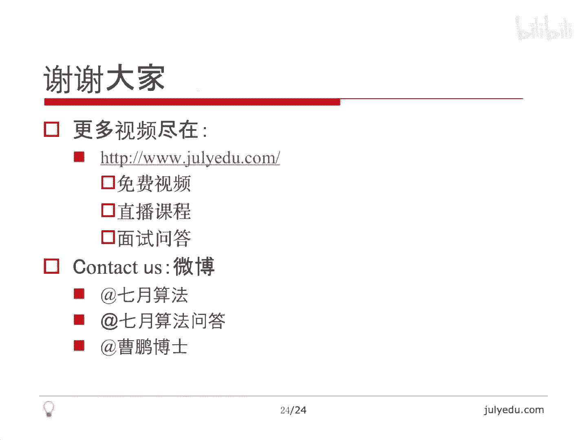

# 人工智能—面试求职公开课（七月在线出品） - P7：谷歌面试题精讲 🎯

在本节课中，我们将学习如何应对技术面试，特别是通过精讲六道经典的谷歌面试题，从简单到复杂，涵盖数学、动态规划、组合数学、图论和位运算等多个领域。我们将深入分析每道题的解题思路，并学习如何与面试官进行有效沟通。

## 面试心得交流 🤝

上一节我们介绍了课程的整体安排，本节中我们来看看面试的一些通用心得。

关于面试，有人会问各个公司是否有自己的面试题库。这个问题意义不大。即使公司有题库，题目来源一方面是员工原创，但相对较少。另一方面，他们也通过网络搜罗题目。因此，即使公司有自己的题库，不同公司题库的重合度也会很大。所以，关注特定公司的面试题意义不大，应该关注所有公司的面试题，因为它们交集非常大。

笔试和面试不同。笔试是面对卷子埋头做题，没有交流。面试则是展现自我和思路的过程，需要与面试官交流。很多面试书籍都强调不要把面试当成笔试。面试官希望并需要你与他交流，这样才能展现你的思路。

面试的关键点并非解决所有问题，而是给面试官留下良好印象。解题是留下好印象的重要条件，但光解题不够。你需要与他交流。即使有些问题不能完全解决，把想到的思路说出来也比什么都不说要好。总的来说，你需要向面试官展现一个良好的个人印象。

## 六道谷歌面试题精讲 🧩

以下是本节课的重点，我们将讲解六道从简单到困难的谷歌面试题。

### 例题一：求和问题

给定一个数 `N`，求不超过 `N` 的所有能被 3 或者 5 整除的数的和。例如，`N=9`，能被 3 整除的数是 3, 6, 9；能被 5 整除的数是 5。和为 23。

这是一个数学问题。我们可以枚举能被 3 整除的数，其项数为 `N/3`（向下取整）。同理，能被 5 整除的数的项数为 `N/5`。这两个序列有重复，重复的数是既能被 3 整除又能被 5 整除的数，即 15 的倍数，项数为 `N/15`。

这三个都是等差数列。关键是对等差数列求和，公式为 `(首项 + 尾项) * 项数 / 2`。最终答案为能被 3 整除的数的和加上能被 5 整除的数的和，减去能被 15 整除的数的和。

在面试中，我们需要与面试官交流 `N` 的范围，确认是否会超过 `int` 类型，是否需要使用 `long long`。因为等差数列的和是 `N^2` 级别的，很可能超过 `int`。通常面试官会告知无需考虑，但主动交流是必要的。

核心代码非常简单：
```cpp
int sumDivisibleBy(int n, int divisor) {
    int count = n / divisor;
    return divisor * count * (count + 1) / 2;
}
// 最终结果： sumDivisibleBy(N, 3) + sumDivisibleBy(N, 5) - sumDivisibleBy(N, 15)
```

### 例题二：合法字符串计数

如果一个字符串只包含 A、B、C 三个字母，并且任意相邻三个字母不全相同（即非法），问长度为 `N` 的合法字符串有多少个。

这可以用类似动态规划的递推思路解决。定义两个状态：
*   `dp[i][0]`: 长度为 `i`，最后两位**不同**的合法串数量。
*   `dp[i][1]`: 长度为 `i`，最后两位**相同**的合法串数量。

以下是状态转移的推导：
*   对于 `dp[i][0]`（最后两位不同）：
    *   如果前 `i-1` 位最后两位不同（状态0），最后一位可以加一个与这两个字母都不同的字母，有1种选择；或者加一个与倒数第二位相同的字母（此时最后两位变为相同，状态变为1），有1种选择。所以贡献为 `dp[i-1][0]`。
    *   如果前 `i-1` 位最后两位相同（状态1），最后一位必须加一个与倒数第一位不同的字母（以保持最后两位不同），有2种选择。所以贡献为 `2 * dp[i-1][1]`。
    *   因此，`dp[i][0] = dp[i-1][0] + 2 * dp[i-1][1]`。
*   对于 `dp[i][1]`（最后两位相同）：
    *   只能由前 `i-1` 位最后两位不同（状态0）的情况，最后一位加上一个与倒数第一位相同的字母得到，有1种选择。所以 `dp[i][1] = dp[i-1][0]`。

初始状态：`dp[1][0] = 3` (A, B, C)，`dp[1][1] = 0`。
最终答案为 `dp[N][0] + dp[N][1]`。

由于 `dp[i]` 只依赖于 `dp[i-1]`，可以进行空间优化。时间复杂度为 `O(N)`。对于更大的 `N`，可以使用矩阵快速幂优化到 `O(log N)`。

### 例题三：最少交换次数

给定一个包含 `0` 到 `N-1` 的排列的数组，只允许将任意一个数与 `0` 交换。问至少需要交换多少次，才能将数组排序（即 `i` 在 `A[i]` 的位置）。

这个问题涉及组合数学中的“圈”概念。一个排列可以划分为若干个不相交的环（圈）。例如，`0` 在位置1，`1` 在位置2，`2` 在位置0，这就构成了一个长度为3的圈。

关于交换次数的结论：
1.  对于一个长度为 `m` 且**包含0**的圈，最少需要 `m-1` 次交换（只与0交换）使其所有元素归位。
2.  对于一个长度为 `m` 且**不包含0**的圈，需要先将0交换进这个圈（1次），然后进行 `m-1` 次交换使元素归位，最后再将0交换出去（实际上归位后0自然在正确位置，但总计需要 `m+1` 次交换）。

因此，算法步骤如下：
1.  找出数组中所有的圈。
2.  对每个圈，如果包含0，答案增加 `(圈长度 - 1)`；否则，答案增加 `(圈长度 + 1)`。

寻找圈可以通过遍历数组并标记已访问的元素来实现，时间复杂度为 `O(N)`。

### 例题四：最少移动次数

给定一个 `1` 到 `N` 的排列，每次操作可以将任意一个数移到序列末尾。问至少需要几次操作能使序列有序（升序）。

关键思路是寻找最长前缀有序子序列。即从序列开头开始，找到最长的连续上升子序列，且其值是从1开始连续递增的。

例如，序列 `[3, 1, 2, 4, 5]`。从开头找：1不在开头，但我们可以发现，如果保留最终在正确位置上的元素，它们必须是 `1, 2, ...` 这样连续出现在原序列中的。我们从值1开始检查：
*   1在原序列中。
*   2在1的后面。
*   3应该在2的后面，但原序列中3在1的前面，因此有序链在3处断开。

因此，最长的可保留前缀是 `[1, 2]`。从第一个不满足条件的值（即3）开始，后面的所有数（3, 4, 5）都需要被移动到末尾。所以操作次数为 `N - 2 = 3`。

算法只需扫描一次数组，时间复杂度为 `O(N)`。

### 例题五：拆墙迷宫（BFS扩展）

在一个矩阵迷宫中，`S` 是起点，`E` 是终点，`.` 是路，`#` 是墙。第一问：从 `S` 到 `E` 的最短路径步数（经典BFS）。第二问：如果最多可以拆掉 `K` 面墙（`K=3`），求最短路径步数。

第一问是标准的广度优先搜索（BFS）。

第二问的暴力方法是枚举所有可能的 `K` 面墙的组合，对每种组合进行BFS，复杂度极高（`O((N^2)^K * N^2)`），不可接受。

一个巧妙的建图方法：构建一个 `(K+1)` 层的立体图。
*   每一层都是原始迷宫的复制。
*   层内的移动规则与普通BFS相同（只能走到非墙位置）。
*   层与层之间的边表示“拆墙”操作：如果当前层某个位置 `(x, y)` 的邻居是墙，那么可以从当前层的 `(x, y)` 点，建立一条指向**下一层**对应墙位置 `(x', y')` 的边。这表示拆掉了这面墙，进入了下一层。
*   起点位于第0层的 `S`，终点可以是任何一层的 `E`。

在这个 `(K+1)` 层的图上进行BFS，找到从起点层 `S` 到任意终点层 `E` 的最短路径。路径长度就是最少步数，而跨层的次数就代表了拆墙的数量。这种方法将复杂度降到了 `O(K * N^2)`。

### 例题六：最大长度乘积（位运算）

给定一个单词字典，找到两个单词，使得它们不包含相同的字母，并且它们的长度乘积最大。允许预处理字典。

这是一个开放性问题，需要与面试官交流思路。

**基础方法（暴力枚举）**：
将每个单词转换成一个26位的位掩码（bitmask），如果单词包含某个字母，则对应位为1。对于两个单词的掩码 `mask1` 和 `mask2`，如果 `(mask1 & mask2) == 0`，则说明它们没有公共字母。
然后枚举所有单词对 `(i, j)`，检查掩码并计算长度乘积，取最大值。时间复杂度为 `O(N^2 * L)`，其中 `L` 为单词平均长度。当 `N` 很大时（如百万级）不可行。

**优化方法（预处理+位运算DP）**：
1.  **预处理**：计算每个单词的位掩码 `mask` 和长度 `len`。
2.  **状态定义**：令 `dp[mask]` 表示所有字母集合是 `mask` **的子集**的单词中，最大的长度值。例如，`mask=0111`（表示字母`a,b,c`），那么 `dp[mask]` 可能是单词 “ab”（掩码`0011`）、“ac”（掩码`0101`）或 “abc”（掩码`0111`）的长度最大值。
3.  **状态转移**：为了计算 `dp[mask]`，我们可以用其子集来更新。一种高效的方式是：
    *   首先，用每个单词自身的掩码 `w_mask` 更新 `dp[w_mask] = max(dp[w_mask], len)`。
    *   然后，对于每个 `mask`，枚举其二进制位，将某一位的1变为0得到 `sub_mask`，用 `dp[sub_mask]` 来更新 `dp[mask]`：`dp[mask] = max(dp[mask], dp[sub_mask])`。这样，`dp[mask]` 最终就存储了其所有子集掩码对应的最大长度。
    *   这个动态规划的过程时间复杂度为 `O(26 * 2^26)`。
4.  **求解答案**：遍历每个单词 `word`，其掩码为 `w_mask`，长度为 `len`。与它无公共字母的单词，其掩码 `other_mask` 必须满足 `(w_mask & other_mask) == 0`，即 `other_mask` 是 `w_mask` 的补集 `complement` 的子集。而 `dp[complement]` 正好存储了这样的单词的最大长度。因此，候选乘积为 `len * dp[complement]`。遍历所有单词取最大值即可。
5.  **复杂度**：预处理 `O(N*L)`，DP `O(26 * 2^26)`，求解 `O(N)`。空间复杂度 `O(2^26)`。

这个方法利用位运算和状态压缩，将问题转化为了对子集最优值的查询，适合字典很大但字母集有限（26个）的场景。

## 课程总结 📚

本节课中我们一起学习了技术面试的沟通技巧和六道谷歌经典面试题。

首先，我们再次强调一定要和面试官积极交流，不要把面试当成笔试，要展现思考过程。即使问题没有完全解决，交流也能留下好印象。

其次，我们通过六道例题涵盖了多种解题技巧：
1.  **数学求和**：利用等差数列公式，并注意数据范围。
2.  **递推/动态规划**：解决计数问题，定义合适的状态。
3.  **组合数学与环**：理解排列的环结构，分析最优操作。
4.  **贪心思维**：寻找最长可保留序列以最小化操作。
5.  **图论建图**：通过升维（多层图）将复杂条件转化为标准BFS。
6.  **位运算与状态压缩**：利用位掩码表示集合，并通过动态规划预处理子集最优解，以优化枚举。

谷歌以及很多公司的面试题并没有固定套路，题目往往很灵活。多总结、多思考、多归纳，才能培养出解决问题的“感觉”。希望本课的内容能对大家的面试准备有所帮助。祝大家好运！




