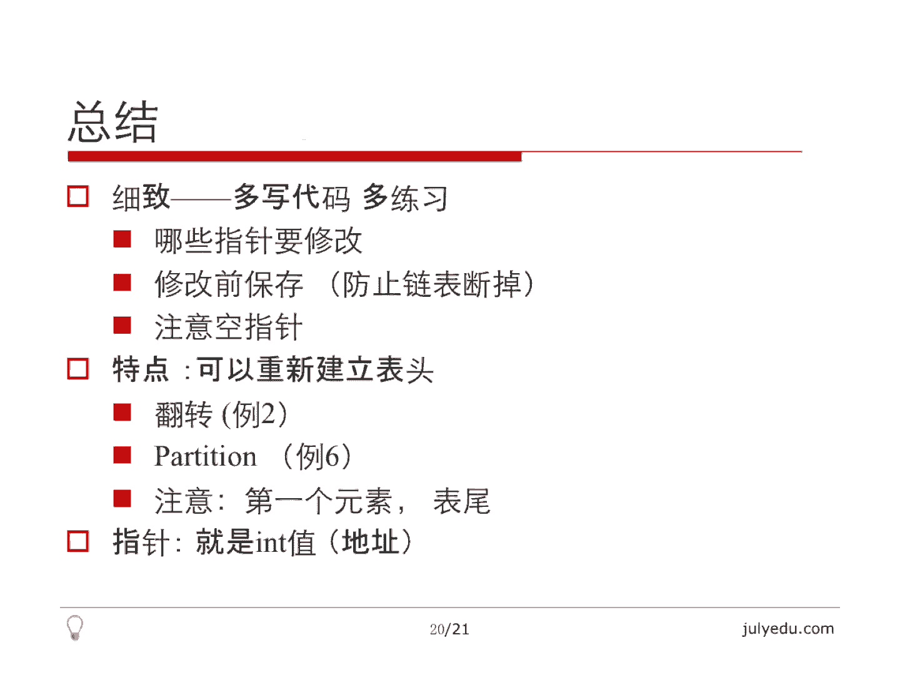

# 人工智能—面试求职公开课（七月在线出品） - P8：链表面试题精讲 📚

在本节课中，我们将学习链表相关的核心面试题。链表是数据结构的基础，其面试题虽然难度不高，但细节繁多，需要扎实的基本功和清晰的思路。我们将从链表的基本操作讲起，逐步深入到几个经典的面试问题，帮助你掌握解题技巧。

## 链表简介 🔗

链表是一种常见的数据结构。它的一个特点是，每个元素只能通过指针来连接下一个元素。这里指的是单链表。我们不能在常数时间内访问第K个元素，这和数组不一样。数组可以直接通过下标访问第K个元素。链表只能从表头开始一个一个找过去。

链表的分类包括单链表和双链表。单链表只有指向下一个节点的指针。双链表有一个指向前一个节点的指针和一个指向后一个节点的指针。

另一个分类是循环链表。它和单链表、双链表本身并不是独立的分类，而是有交集。它指的是首尾相接，把最后一个元素和第一个元素连起来形成一个圈，这就是循环链表。

在编程语言中，Java有`LinkedList`，C++的STL里有`list`。C语言没什么好说的，只能通过指针来实现链表，这是最基本的一种陈述。

## 面试题总体分析 📝

链表的面试题都不是很难，但是很繁杂。主要涉及链表的基本操作，包括插入、删除、翻转。翻转有多种形式：一种是从头到尾都翻转过来；第二种是给定一段区间，例如第M个节点到第N个节点，把这段翻转过来，其他地方不动；还有一种是把链表分成每K个一组，每组翻转一次。总的来说都是翻转。

还有涉及链表排序的，比较经典的是归并排序。这里提到了，还有快排的`partition`。

还有一种类型是复杂链表的复制，后面有例题。再后面是链表，这里指的是单链表，判断是否有环。如果有环，环的起点在哪里？环的长度有多长？后面有个例题会说明。

链表的倒数第K个节点，其实可以通过快慢指针找到。只要快指针和慢指针相差K个节点，这样扫描一遍就能找到倒数第K个节点。当然也可以先统计出链表的长度，然后再找第K个节点，都比较简单。

还有一类是随机返回链表的一个节点，要等概率的。这其实不属于链表的范围，它属于随机采样的范围，只是从全面性的角度把它列出来。

还有一个是链表和其他数据结构，主要指的是二叉树。二叉树和双向链表之间可以相互转换。这个本来举了一个例题，后来因为时间关系删掉了，会放在“树和图”那一章里面讲。

## 例题一：链表的插入与删除 ✏️

上一节我们介绍了链表的基本概念和常见面试题型。本节中，我们来看看最基础的操作：链表的插入与删除。

链表的插入与删除是最基本的操作。这里只列出来让大家熟悉一下基本操作。我们讲最简单的类型，就是单链表。

遇到链表的问题，建议先在纸上画一下要做哪些操作，一画就明了了。我们需要考虑哪些指针需要修改。显然，这个节点之前的那个节点，也就是前驱节点的`next`指针要改变，因为它要指向新节点。新节点自己的`next`指针肯定也要变，要指向原来前驱节点的`next`。所以我们至少要改变两个指针。

插入一般要找到插入之前的那个节点，也就是前驱。有什么特殊情况呢？在`head`之前插入。这里其实还包括`head`等于空的情况，`head`就是表头。如果表头等于空，这个链表就没有东西，那我们插入就只剩下一个东西了。这种情况其实和在`head`之前插入可以统一起来。

我们直接`node`就作为新插入的节点。假设我们已经构造好了，我们执行`node.next = head`和`head = node`。其实这两步就完成了插入。这个特殊情况其实就是说插入之后，表头变了。

大部分情况都是在中间插入，插入之后，表头不变。因为我们链表的问题一般都是写一个函数，传进去一个表头，传回来还是一个表头。因为这个链表会有变化，我们只有通过表头来访问链表。所以链表的问题都是传入一个表头，传出也是一个表头，表头非常关键。所以我们要考虑得非常清楚。

一般情况就是这个样子。我刚才说了，改变两个指针。改变新节点的指针，改变前驱节点的`next`指针。注意这两个顺序，因为我要把新节点的`next`赋值为前驱节点的`next`，所以我必须要先改变新节点的`next`，再改变前驱的`next`。所以这个比较简单。

删除其实差不多。哪些指针要修改？其实就是前驱的`next`，把它跳过去就可以了。把它指向它的`next`的`next`就可以了。特殊情况是表头会变，因为可能把表头删了。

如果链表里面只有一个元素的话，删了之后它就是`null`，因为`temp = head.next`就是`null`。我们在`p`后面删除的话，怎么删呢？先把`p`的下一个节点记下来，然后把`p.next`赋成`temp.next`，再把`temp`，也就是原来`p`的下一个节点，也就是要删的那个节点的空间释放掉。所以删除也就这么几步，非常简单。

以下是几个思考题：
*   刚才讲的是最简单的情况，就是单向链表。双向链表怎么插入、怎么删除？
*   另一个是循环有序的链表。就是这个链表本身，例如`1->2->3->4->5`，这是一个有序的，并且它把`5`的`next`指向`1`了，就是在一个圈里面。那么要插入一个节点，其实还是有点困难的。例如插入的节点有重复值，或者插入的是最大的、最小的等等，插入的位置怎么选取，要把它想好了。不过个人建议是先把它断开，插好之后再把它最后一个节点指到第一个节点上，这样不容易错。但其实有很多不用断开它，加了很多条件判断的方法也可以做。这个留给大家思考。

这里想提一下所谓的`lazy delete`，就是懒删除。假设我们要删除`node`这个节点，这里要注意，`node`不是最后一个节点。那么我们找到`node`，我们现在就在`node`这个节点上，我们要删除它。这个在单链表里面一般情况是无法实现的，因为我们必须在它之前的那个节点位置才能把它删除。那现在我已经到了这个节点，我怎么把它删除呢？

有一个比较懒的办法，就是我把`node`的下一个节点复制过来。我这里假设这个`node`只有一个字段，就是`val`，只有一个整数值。我把下一个节点的内容信息都复制过来。那这样的话，`node`本身和`node`下一个节点长得都一样了。那么我再把`node.next`删掉。实际上这并不是真正的删除`node`，我真正删除的其实是`node`的下一个节点，我只是用`node`把它的下一个节点复制了一遍，再把下一个节点删除。所以这是一种删除方式。

## 例题二：单链表的翻转 🔄

上一节我们讨论了链表的插入与删除。本节中，我们来看看另一个基础操作：单链表的翻转。

单链表的翻转非常简单，我就快速地讲一下。前两个例题都是帮大家理解链表最基本的操作。

翻转其实就是把当前节点拿过来作为已经翻转结果的表头就可以了。因为我们可以改变链表的顺序，类似于一个栈。假设我前面已经翻好了，我把这个节点拿过来作为新的结果的表头，那么前面这些节点都已经翻好了。

我们看一下，非常简单。`result`就是我翻好的这个链表的结果。那么我先要保存当前这个节点的下一个节点，因为我下一次循环就要翻这个节点了。那么我现在要翻的就是`head`这个节点。`head`节点的`next`等于我之前翻好的那个链表的表头，那么表头变一下，就是结果的表头变一下，那么`head`变成它原来的下一个节点。所以这个顺序很重要，主要强调一下顺序。并且这里面`head`为空的情况，其实都已经在这个里面隐含着了。因为`head`为空`result`肯定为空，并且翻转之后的最后一个节点的`next`肯定也是空，因为第一个节点就把`head.next = result`了。

还有一个就是顺序要注意，先把这个节点的下一个节点保存下来才能改变它，不然链表就断掉了。前两个例题都非常简单。

以下是思考题：
*   如何翻转一部分链表？例如LeetCode第92题，就是翻转第M个元素到第N个元素之间的那一段。其实我们需要把它从第M个元素之前断开，第N个元素之后断开，把M到N翻转了，翻转之后还得再连回来。连回来的时候，前面那部分就是第M个元素之前的那部分的最后一个元素我们必须得有，因为我们要从最后一个元素把那个翻转那部分接回来。后面那部分第N个元素之后那部分的第一个元素我们也必须有，还得接回来。还有很多特殊情况需要处理，例如`M`等于1，也就是链表第M个元素之前没有东西怎么办？第N个元素后面没有东西怎么办？所以很多特殊情况需要考虑，尽管这几步说起来非常简单。
*   另一个是刚才说的LeetCode第25题，每K个元素翻一次，一样的。同样我们把前面翻转好的部分都保存好，现在要翻转这K个，把它单独截出来，翻转之后再把它连上来。那后面没有处理的，还要再继续处理。还有如果最后有余数不足K怎么处理？所以有很多细节的问题，说起来都不太难。这个留作思考题。

## 例题三：判断链表是否有环并找出环起点 🎯

上一节我们学习了链表的翻转。本节中，我们来看一个经典问题：判断链表是否有环，并找出环的起点。

第三个例题其实比较经典。它是说给你一个单链表，问这个链表是否有环。其实就是说这个链表可能建错了，我最后一个节点的`next`不是空，而是它指向了前面的某一个元素。这样的话，链表就转起来了。如果沿着链表走，就会转起来，没有头没有尾，就是从头直接走，走到一个节点，永远走不到尾。

我们怎么判断这种情况呢？这个是LeetCode上141、142题。141题和142题有一个区别在于，有一个题是说只要判断有没有环就行了，返回一个布尔值`true/false`。那另外一个题是说如果有环的话，把环的起点找出来，就是环的起点是哪个节点。当然这个环可能不是从开头就产生的，有可能是一个类似于阿拉伯数字`6`的这种形状，就是它开始有一段，然后才有一个环。所以环的起点也需要求。

我们先来看一下如何找环。最直接的办法就是我们用一个`set`存放每个节点的地址。注意`set`里面存放的元素必须是有序的，这个序不一定是大小关系，你需要给它定一个序，所以并不是任何的`object`都可以放到`set`里面。我们需要给它规定一个顺序。那地址就具备这种顺序。其实地址我们可以把它理解为整数，尽管这种理解可能不是十分正确，但是其实真正意义上地址它就是一个整数，只不过这个整数我们不能做传统的加减运算。

最直接的方法，我们就用一个`set`把经过的节点都存下来就好了。我们就这样沿着头指针走。如果找到了之前经过的一个节点，那么它显然就是走环绕回来的，就有环，否则就没有环。这是一个方法。但它额外用了一个`set`，主要是空间复杂度有一些，时间复杂度也有，因为`set`里面查找是`O(log n)`的。当然我们把它改成哈希的话，就可以做到期望的时间是`O(n)`的，但问题在于还是用了额外的空间。

有没有不用`set`的办法呢？我们来看一下。我们用两个指针，`p1`和`p2`。`p1`每次走一步，`p2`每次走两步。如果有圈，它们一定会相遇。请大家思考一下，为什么一定会相遇？如果相遇的时候，我们如何找到交点？

我定义一些变量。圈长是`N`。链表起点到圈的起点的距离，也就是那个“柄”的长度，是`A`。`p1`到起点的时候，因为`p1`是每次走一步的那个指针，它到了圈的起点的时候，`p2`肯定比它进圈早，因为它走得快。`p2`在圈的`X`位置，这个`X`是指距离圈起点的位置。

刚才说了，`p1`到圈起点后，`p2`已经走了`X`步了，在圈里面。那么他们相距其实是`N - X`步，因为在圈里面两个方向，一边是`X`，那边就是`N - X`，圈总长度是`N`。那么他们`N - X`步肯定会相遇。这是一个追击问题，因为每走一步距离缩小一，`p2`走得快，每走一步，他走2，`p1`走1，他们相距`N - X`，所以走`N - X`步肯定相遇。

假设我们相遇的时候，相遇点到圈起点的距离是`B`。那么`p1`走的距离实际上是`A + B`。其实`p1`走的肯定小于一个圈，因为`p1`在圈里面只走了`N - X`步，圈的长度是`N`，所以`p1`肯定没有绕过一圈在圈里面。所以它走的距离就是`A + B`，因为这个相遇点距离圈起点是`B`，前面那个柄的长度是`A`，所以`p1`走的是`A + B`。

那`p2`走的是什么呢？`p2`其实在圈里面可能绕了很多圈了，可能绕了`K`圈了。这里其实`p2`不一定比`p1`只多走了一圈，它可能比`p1`在里面已经绕了`K`圈了。这是在`p1`进入圈之前，`p2`早就进入圈了。如果这个柄比较长，圈比较短的话，`p2`在这个时候已经在圈里面绕了很多圈了。但无论如何它绕了`K`圈。那么他走了就是`A + B + K * N`，因为`N`是圈长，`K`是一个整数。

右边是怎么回事？右边是刚才说了，`p2`走的是`p1`的二倍，`p2`的速度是`p1`的二倍，所以`p1`走`A + B`，`p2`显然走了`2*(A+B)`，所以这就有了这么一个等式：`A + B + K * N = 2 * (A + B)`。

这个等式对我们来讲有什么用呢？把`A + B`消掉，就是`A + B = K * N`。这就说明`A + B`，也就是`p1`走的距离，或者说柄的那段长度再加上圈的起点到这个相遇点的那个距离，正好是圈长的整数倍。

那这个有什么意思呢？我们在想，我们现在假设两个点已经相遇了，他们相遇的时候，距离圈起点的距离是`B`。那么我们把`p1`拉回起点，这个不是圈的起点，拉回链表的起点，就是第一个节点。把`p2`不动，因为它就在距离`B`的位置。那么我们再走。这时候走并不是一个一步一个两步了，每个都走一步，就是`p1`走一步，`p2`也走一步，然后`p1`再走一步，`p2`再走一步，就这样一步一步走。

这样走`A`步之后，我们看一下出现什么情况。因为我刚才说`A`的定义是起点到圈的起点的那个长度，也就是那个柄的长度。所以`A`步之后，`p1`肯定到了圈的起点，因为这个`A`就是这么定义的。`p2`呢？`p2`在`B`的位置走的，在距离圈起点`B`的位置走的，因为相遇点是距离圈的起点是`B`。它走`A`步之后，我们有这个式子`A + B = K * N`，它走`A`步之后，算上`B`的那段，恰好也是圈长的整数倍。所以`p2`也到了圈的起点。这时候`p1`、`p2`又相遇了。

所以我们在第一次相遇之后，把`p1`拉回起点，然后两个指针再一步一步地走，而不是一个一步一个两步地走。走`A`步之后再次相遇的时候，我们就找到圈的起点了。找到圈的起点，再找圈长就容易了。因为我们顺着那个圈再走一圈，例如`p1`不动，`p2`再走，再相遇的时候，记一个数，那个长度就是圈的长度。所以关键是如何找到圈的起点，圈长是好办的。

我们来看一下这有个示意图。这个就是我说的。这个是入口，就是圈的起点，这个是链表的起点。`p1`进入入口的时候，`p2`是在这里的。然后呢，第一次相遇点就是这个红的位置，实际上就是说刚才说的这段距离是`A`，红的这段距离是`B`。`p1`走的是`A + B`，`p2`走的是可能是好多圈，但也到`B`了。但无论如何，这个`A`加上`B`的长度，是这个圈长的若干倍，这个刚才已经证明了。

那现在如果他们在第一次在这相遇了，相遇之后，我把`p1`拉回来，`p2`从这走。因为他相当于`p2`先走了`B`，在圈里面先走了`B`。那么`p1`走`A`的时候，到圈的起点，`p2`走了也走了一个`A`，他走了一个`A`，算上之前那个已经在圈里的`B`，他肯定也走到了圈的起点。这个就是`A + B`是圈长的整数倍的应用。他们在同时到相遇的时候，恰好到了圈的起点，我们就找到圈的起点了。那这是一个证明。

那么大家可以看一下我的代码。其实代码写起来非常简单。

首先，两个都是头指针，这步就是一个走一步，一个走两步的过程。因为`p2`快，所以我没有必要判断`p1`是不是空。注意我这里混用了那个`NULL`空值和`0`。如果`p2`是空或者`p2`的`next`是空，就说明这个链表是有限长的，因为肯定已经到表尾了。那否则的话我`p2`就走两步，`p1`走一步，直到他们相遇。如果推出这个循环，显然就是有环了。如果在这返回就是没有环。

那有环之后，就是我刚才说的，把`p1`拉回起点，然后再一步一步走，这个是`p1`走一步，`p2`走一步。实际上这个推出来之后，这个`p2`就在圈的那个刚才我说的`B`的那个位置，`p1`拉回来，然后他们在同时走`A`步，走`A`步的时候会同时到达圈的起点。这时候`p1`、`p2`相同了，相同的时候返回哪一个都可以，都是起点。这个就是第三题，我觉得是比较经典的一个问题。

## 例题四：两个单链表的交点 🔀

上一节我们解决了链表环的问题。本节中，我们来看一个相对简单的问题：寻找两个单链表的交点。

第四题其实我觉得比第三题简单很多。可以看一下，在两个单链表里面找到它们的