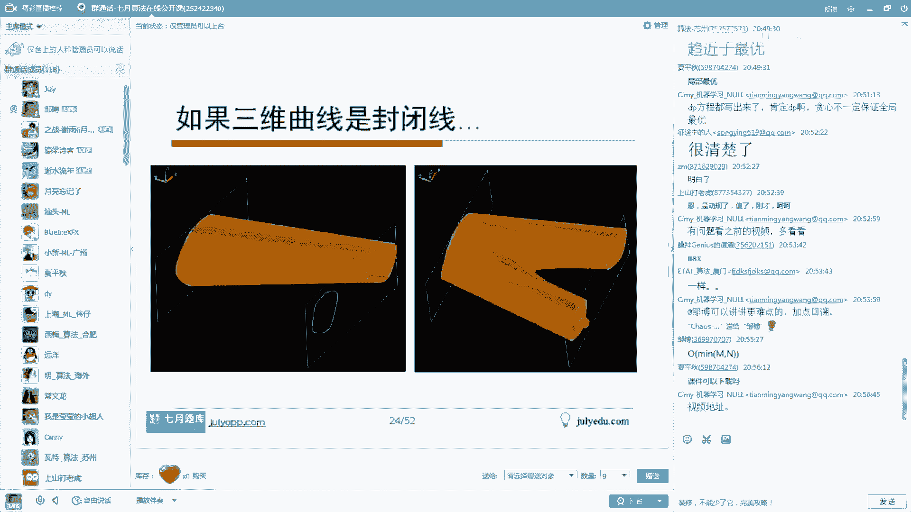
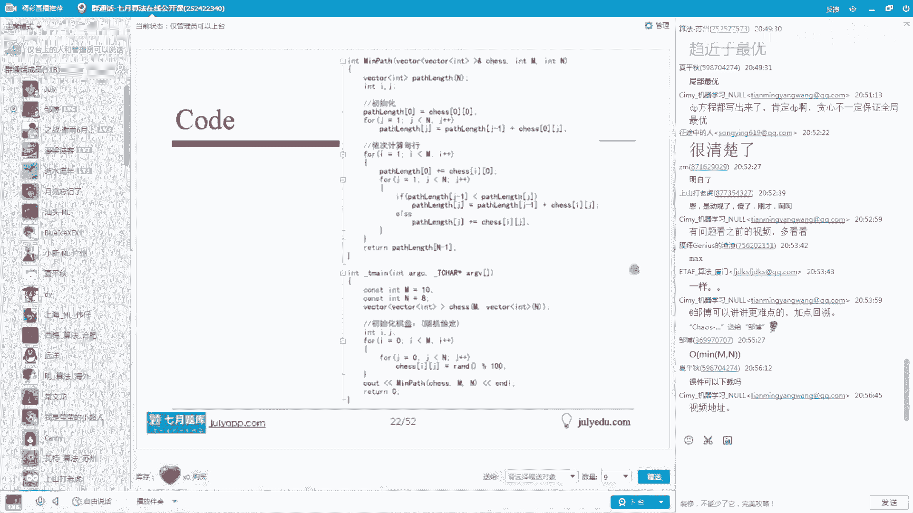
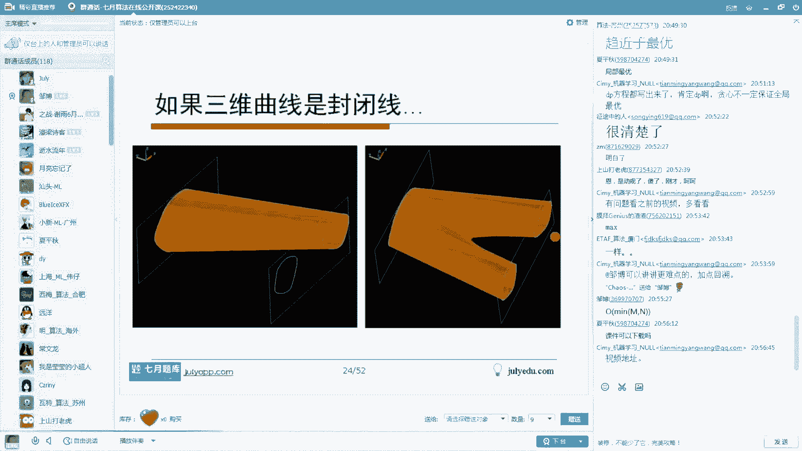
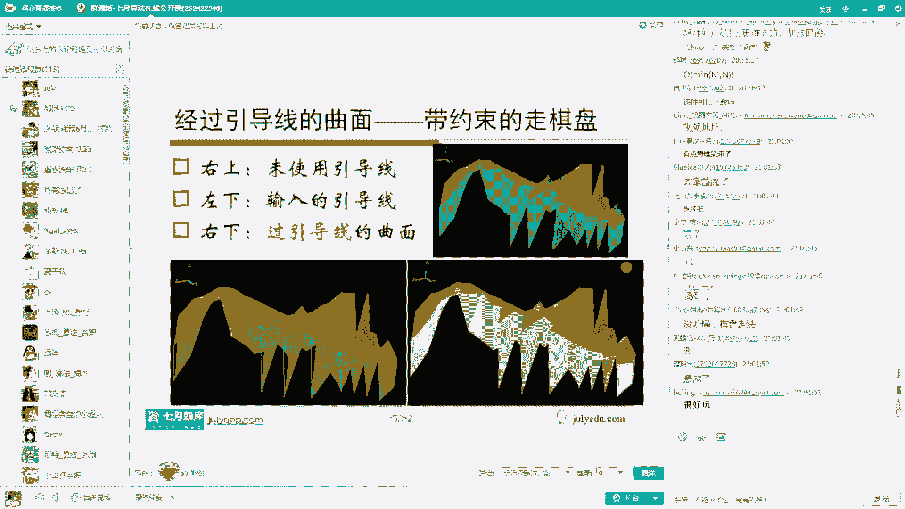
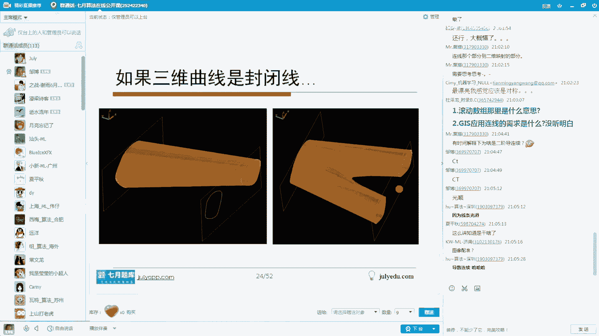

# 人工智能—面试求职公开课（七月在线出品） - P9：探秘校招笔试面试

在本节课中，我们将一起探讨当前人工智能领域校招笔试与面试的常见题型、解题思路以及背后的核心知识。课程内容涵盖概率论、算法、逻辑推理等多个方面，旨在帮助初学者理解题目本质，掌握解题方法。

---

## 概述：校招笔试面试的趋势与考察重点

我的总体体会是，现在的笔试和面试题目越来越难。除了考察编程语言、数据结构、数据库、操作系统、计算机网络这些传统内容，还增加了许多算法、逻辑以及数学方面的题目。

数学方面的题目，大家要尤其重视概率论这个方面的内容。概率论、数理统计这方面的内容大家尤其需要重视。此外，机器学习的题目也做了一些增加，难度也有所提升。贝叶斯属于机器学习的内容。

我个人觉得，当然你也可以把它归类到数据挖掘，意思差不多。概率论这方面，可能更多考察的就是大家在概率论和数理统计那门课程一般的学习过程中，本科生或研究生的教材内容。我一般是感觉是这样。只不过在面试里面会大量充斥着一些关于算法和逻辑的题目。

大家有时候会有疑问，在以后的工作中，算法和逻辑题真的会用吗？我觉得这个事情，咱们可以先讨论两句。事实上，算法题目分两种。有一类工种真的会用到算法，但并不是所有内容都需要它。尤其对于校招来讲，公司没有一个更好的尺子来判断你的能力，他总要筛选一些人，选择他觉得合适的。在这些基本内容以外，他觉得考察算法非常接近于他所想要的人才，就会拿这个东西作为一个衡量标准。

另外，即使是突击学的算法，如果你学得还不错，通过了面试官和公司的考核，他觉得OK，那么你在学习其他内容的时候，也应该是一个非常好的苗子。基于这个考虑，所以好多公司在做笔试面试题目时会增加算法题目和逻辑题目。我想他的原因可能是这样，这是我个人的一个想法。

对了，还有就是做广告了。大概在10月11号，每周六、周日下午2点到4点，是我们即将开始的10月算法班。还有一个9月机器学习班，它的时间是10月11号开始，每周六和周日的晚上7点到9点。我们的9月算法班和10月算法班，其实开始时间都是10月11号。

我大概罗列了一下算法班的大纲以及机器学习班。因为机器学习班有24课，内容实在很多，我就随便截了一下后面的那几个。大家有兴趣可以看一下。关于报名，直接访问我们的官网 `julyedu.com`。打开这个官网之后，就能看到报名链接以及一些相关内容。`julyapp.com` 是附属于官网之下的一个专门为手机APP做的链接。在这里面大家可以发现我们的APP有安卓版和iOS版，可以在里面下载。`julyedu.com`，大家打开这个就好了。里面有论坛、社区，还有一些课程和相关内容。

我大概贴了一下某些公司今年的校招题目。我们随便看一个，比方说第一个为例。在一个8列乘6行的矩阵中，从A点移动到B点的过程之中一共有多少种不同的走法？要求是只能够向上和向右走，不能够走回头路，并且不能够经过P这个点。这种题目，我觉得难度应该算是中档，不算难，但还是需要稍微考虑一下。像这些题目，等会儿会跟大家一个一个去梳理，看看到底怎么做。

有这种题目，我觉得其实是个算法题。而第二个求期望的题目，其实是考察概率论和数理统计方面的内容。第三个是一个典型的逻辑题目，需要知道怎么样去推导推理。这个题目，你说它是算法也行，说它是推理也可以。就是说取这100个数，它们可能的绝对值的差的和，最大是多少。像这个题目显然是一个比较怪异的概率题目。这个题目其实有一个更有趣的问题叫“三门问题”，大家有兴趣可以在我们的7月算法APP上或者一些网站上去搜一下这个问题，都是一些很有趣的关于概率的、并且经常考的内容。第四个看起来像是一个推荐系统方面的内容，我们待会看看它到底想考察什么，其实没有那么难。我们就不再一个个过了，只是跟大家看一下今天要聊的一些相关题目。

---

## 第一节：概率问题与几何解法

我们先看刚才说的那个所谓的推荐系统里面的一个小东西。它先介绍一个背景，商品推荐的场景。如果你是过分地聚焦在商品推荐上，其实往往会损害到购物体验。有时候系统会选择一定程度的随机性来给用户增加一些惊喜感，惊喜度也是推荐系统需要考察的一个度量标志。

假设在某个推荐系统里，想去计算A和B这两个商品与当前访问用户的匹配情况。假设用户来了，并且算出来了用户和A商品的匹配度是0.8，和B商品的匹配度是0.2。这是我们经过其他相应知识算出来的。然后，系统随机地给A商品生成一个从0到0.8的均匀分布的得分，给B商品生成一个从0到0.2的均匀分布的得分。让你算一下，B的最终得分会大于A的最终得分的概率是多少？

大家先把题目读一下。这个题目很长，但考察内容看起来像是推荐系统、向机器学习，但其实后面是让你算概率。这个题目大家有感觉吗？怎么做呢？

是这样，我们可以在这里算面积就可以了。怎么算呢？因为涉及A和B两个商品，人类最习惯的是二维的东西。现在它给定的就是算两个商品之间的关系，二元关系是很有趣的关系。A是从0到0.8的一个均匀分布，B是一个0到0.2的均匀分布。因此我画出横轴A和纵轴B，各自组成两个轴。A从0到0.8变化，B从0到0.2变化，因此它们总体的变化域就是从0到0.8和从0到0.2这么一个矩形。现在都是均匀分布的，在二维上也是均匀分布的。

现在让我们算的是B的概率大于A的概率。那很显然，画一条A等于B的斜线。位于三角形区域的点，比方说红色点，大家会发现这时候B的值是这么高，如果鼠标在这儿的话，A是这么大，所以说B是大于A的。所以三角形这块面积是满足B大于A这个情况的。一共满足条件就这么大，总共的是矩形面积。算一下三角形面积，算下矩形面积，一除就好了。

蓝色三角形面积我算成0.02，矩形整个的是0.2乘0.8等于0.16，一除等于0.125，也就是八分之一。这个题目就做完了。

像这种题目，往往遇到了这种算概率，并且是二元的事情，你其实直接画个面积一下子就出来了，没必要去真正地推导，推导的话反而麻烦了。

---

## 第二节：约会问题与概率计算

为了让大家能够去理解这个事情，咱再找一道题目。这个题目也是今年的一个实际的面试题。大家思考一下，假定A、B两个国家元首，他们相约在首都机场晚上8点到晚上12点之间去交换一个重要的文件。如果A国的飞机先到，那么A国的元首会等一个小时。如果B国的飞机先到，那么B国的元首会等待两个小时。现在假定这两架飞机都是从20点到24点均匀降落在机场的，它的降落时间分布是均匀分布的。算一下，最终能够在20点到24点完成文件交换的概率是多大？这里加一个小提示，假定交换文件本身是不需要时间的，就他们俩如果能碰面，就算交换成功了。

这个题目我没有给大家给出解析，大家可以思考一下怎么做。我们的APP上是有的，有兴趣我可以让大家先想想。在今天，比方说假定一个半小时之后结束的话，最后我把答案贴出来。大家可以想想，都是一样的一个套路。这个题目比刚才那个题目难度要略高一点，略难一点点，就是它的画图要比它麻烦一点点。

---

## 第三节：进制转换问题

我们来看第二道题目。给定一个公式是 `84 * 148 = ECA8`，如果成立的话，请问这个公式采用的是几进制？

这种题目有一个放之四海而皆准的标准解法。假定它是一个X进制的，那么84就是 `8*X + 4`，148就是 `1*X^2 + 4*X + 8`。ECA8，显然B是11，A是10，所以是 `E*X^3 + C*X^2 + A*X + 8`，即 `14*X^3 + 12*X^2 + 10*X + 8`。左边式子相乘等于右边式子，化简一下就出来了。这个式子不可能等于零，因为X是大于零的整数，这里面只有X等于12是可以的。这种做法是完全最标准的。大家直接遇到这种题目时，如果上来硬算，直接这么算，一点问题都没有。这是第一个常规做法。

第二个启发式做法，计算尾数就够了。事实上，如果在十进制体系下表述的话，左侧的尾数是4，右侧的个位数是8。4乘8是32，右侧个位数是8，这个32和8的差是24。那24的差既然是24，它的进制必然是24的一个约数。这里面只有12是24的约数。因为你这个24一定要能够整除它的进制。这样子也可以搞定。这种做法更简单。

我说明两点：第一，我们用十进制来做这个事情，仅仅是个技术习惯。第二，第二种做法可以作为第一种解法的一个辅助手段，来相互验证一下是不是做对了。

---

## 第四节：构造法与贪心策略

这个题目稍微有点麻烦，它是一个N个数的差，我把它叫做“绝差之和”问题。题目是这样的：从1到100这100个数任意的排列，形成一个环。要求求两个相邻数的差的绝对值求和，最大是多少？当然有些选项，大家看看哪个答案对。

首先，题目本身没问题吧？从1到100连完做成个环，后面数减前面那个数取绝对值，然后把这个绝对值加起来，问这个绝对值的和最大能够达到多少。

我个人理解这个题目，用构造法是最合适的。他这里让我们算的是相邻两个数的差的绝对值。那这样的话，相邻两个数的差，这里从1到50，从51到100分两部分。我把1到50叫小数，51到100叫大数，这是我个人的定义，为了表示方便。我们把这个相邻元素的差的绝对值简称叫“绝差之和”。

我们看看怎么样去做。现在给定一个贪心的思路：为了让绝差之和最大，我们就应该先验地知道，要避免把大数跟大数放在一块。你俩大数放在一块儿的话，抵消掉好多部分。因此我就考虑把大数和小数间隔着排。就是1, 100, 2, 99, 3, 98, ..., 50, 51。这个序列就是我想要的绝差之和最大的那个序列。

为什么呢？我们需要给出一个证明。我们可以想想，如果序列里面两个小数X和Y进行交换，或者是两个大数A和B进行交换，或者是大数和小数进行交换，它都能得到一个我们想要的结论，或许就能搞定了。因为就这三种情况，除此以外没别的情况。我把所有情况都分析完不就完了吗？

1.  **小数和小数换**：假设用小数X和小数Y来换。交换之前和交换之后的绝差之和是一样的。
2.  **大数和大数换**：假设用大数A和大数B来换。交换之前和交换之后的绝差之和也是一样的。
3.  **大数和小数换**：假设把大数A和小数Z做交换。交换之后会发现，绝差之和会变小。

因此，交换了还不如不交换，交换的话会导致绝差变小。而刚才前两种情况，交换的话相当于没有任何效果。因此，相当于我就证明了原始的这种间隔状态是能够使得绝差之和最大的。

而这种原始状态，1, 100, 2, 99, 3, 98...这种情况，它的绝差是多少呢？后者减前者：100减1是99，99减2是97，98减3是95，...，51减50是1，然后1和51的差是50。这个数我们加起来很方便得到5000。因为1到100加起来是5050，这样就少了50，所以是5000。

第二，从刚才的小小交换和大大交换会知道，最终的这个绝差最大序列不是唯一的。你可能构造一个这样的序列，我也可能构造一个别的，仍然是最大的。但是跑不出去，我通过小小和大大做交换，能够交换成跟你一样的。

---

## 第五节：动态规划与棋盘路径

这是一个非常经典的题目，经典到几乎任何一本书都会谈到。给定一个M乘N的矩阵，矩阵里面每一个位置都是一个非负整数。在左上角放个机器人，这个机器人每次只能够向右和向下走，不能够往回走。最终会走到右下角。请问从左上角走到右下角，经过的最小路径和是什么？

先把题目的审题验过了，题目有问题吗？

有朋友谈到了动态规划(DP)，组合排列，深度优先搜索。深度优先搜索有点过分了，因为时间复杂度有点高。贪心和动态规划，本质可以看的是一码事。这个题目没必要上A*算法。

我们看这个题目怎么做。既然它要从左上走到右下，我们就来考察某一个点它的情况。首先我们知道，在走的方向决定下，同一格子不能走两次。如果在红色这个点的时候，那么它上一次要么来自上方这个绿色格子，要么来自于左侧这个绿色格子，除此以外没有别的情况。

我们就用一个 `dp[x][y]` 来表示它位于(x,y)这个点的时候，它的最短路径和。那么，`dp[x-1][y]` 是它位于左边这个点的最短路径和，`dp[x][y-1]` 是它位于上面这个点的最短路径和。那么，这两个最短路径和，它们各自加上 `a[x][y]`（当前点的值）走到当前这个红色点，这两个值谁小，我就取谁，就是能够走到红色这个点的最短的那个路径。当然里面可以把公因式 `a[x][y]` 提出来。

这是普通一个点上的事情。第二，如果假定它位于第一行呢？它如果位于第一行，比如绿色这个点的位置，它只能够从左到右依次加上来。因此第一行的值就是第一行这些数的累加。第一列的点，只能是从上到下依次累加得到。所以第一行第一列我单独处理。而中间某一个点，我用一个最小值（谁小我算谁的）加上去，最后就能得到 `dp[m][n]` 那个值，就是走到右下角的时候，它的最短路径和的值。

这个题目咱的解析就算是说完了。

---

### 动态规划的深入分析

下面我们对这个题目做一点更进一步的分析。

1.  **最大路径问题**：如果题目里把求最小路径变成求最大路径，其实上面所有的分析过程就把里面的 `min` 变成 `max`，所有的都不变。所以这个题目相当于蕴含着两个对偶的问题，本质一样。
2.  **空间优化（滚动数组）**：通过刚才的写法，其实可以写出更规则化的状态转移方程。如果这么写状态转移方程，空间复杂度是 `O(m*n)`。但是如果你用滚动数组的方式来降维，一行一行地去滚动，空间复杂度就能降到 `O(min(m, n))`。这是空间复杂度从大体上 `O(n^2)` 降到了 `O(n)`。
3.  **与组合数的关系**：我们现在假定用 `dp[x][y]` 去表示，如果位于(x,y)这个点的时候，它一共有多少种可行的路径。那么显然 `dp[x][y]` 就是 `dp[x-1][y]` 和 `dp[x][y-1]` 的可行路径加和。这个方程可以推导出组合数公式 `C(m+n, n)`。因此，这个格子取数/走棋盘问题也蕴含着组合数公式，可以说它真的是一个排列组合相关的题目。

---

### 路径计数问题的变体

我们把这个题目再琢磨一下，变成例4.1。给定一个8列6行的棋盘，从A点移动到B点，只能够向右和向上走，要求是不能走回头路，并且不能经过点P。那么一共有多少种可行的走法？

如果不经过P的话，怎么做呢？从A到B一共需要往右走7步，向上走5步，因此可行走法有 `C(12, 5)` 种。但是从A到P呢？向右走5步，向上走3步就到P了，因此是 `C(8, 3)` 种走法。而P到B呢？向右走2步，向上走2步，`C(4, 2)` 是6种走法。那么从A到B经过P有多少种呢？`C(8, 3) * C(4, 2)`，这是一个乘法原理，得到336种。而一共多少种呢？`C(12, 5)` 是792种，792减336就是456。这就是这道题的答案，从A到B一共需要456种。

这些东西都是在我们7月算法APP里面得到的一些内容。只是今天时间稍微宽裕一点，所以我就把这个题目展开，从走棋盘，从各种各样有意义的东西，把它聊出来。

另外，可以根据刚才的说法，其实如果一共有一种，每一个就这么写就完了。比方说这个10怎么得来的，有左边这个值，下面这个值加起来。70怎么得来的，左边这个值下面这个值加起来，只不过P点的值是0。比方说98怎么得到，70加28嘛，我们总能把它算出来也是这个数。如果大家不想这么算，并且你非常任性的话，可以这么玩一下，其实答案肯定是一样的。

---

## 第六节：逻辑推理与技能匹配

这个题目叫做“寻找程序员”。我们有A、B、C、D四个人去应聘一个程序员职位。职务的要求是：要Java熟练，要懂数据库，要会Web，此外还需要有C++。谁满足的条件越多，就雇佣谁。并且我们先验地知道，这四个要求（Java、数据库、Web、C++）中，每两个技能组合恰好有一个人是满足的。并且我们知道了一些知识：A和B会Java，B和C会Web，C和D懂数据库，D有C++经验。但是其他的，比方说A是不是懂Web不知道。现在通过这四个已知的条件，以及“两两组合只有一人满足”，最后推一下A、B、C、D各自会哪些技能，并且最后告诉我们应该雇佣谁。

这个题目是实际面试的时候出的一道题目，我把它变成了那种表述方式。咱先把这个题目本身技术层面先解决清楚。

这个题目怎么做呢？我个人的解法是这样：

1.  **整理信息**：把信息整理出来，就是A会Java，B会Java跟Web，C会数据库跟Web，D会数据库和C++。把人和技能列成表格，把各自会什么打上勾，空格处是未知的。并且他告诉我们两两组合只有一人满足。一共有4种技能，两种组合，一共就6种情况：Java+数据库，Java+Web，Java+C++，数据库+Web，数据库+C++，Web+C++。这6种组合，我把它命名作甲、乙、丙、丁、戊、己这么6个条件，它恰好只有一人满足。并且我们知道Java和Web是B满足的，数据库和Web是C