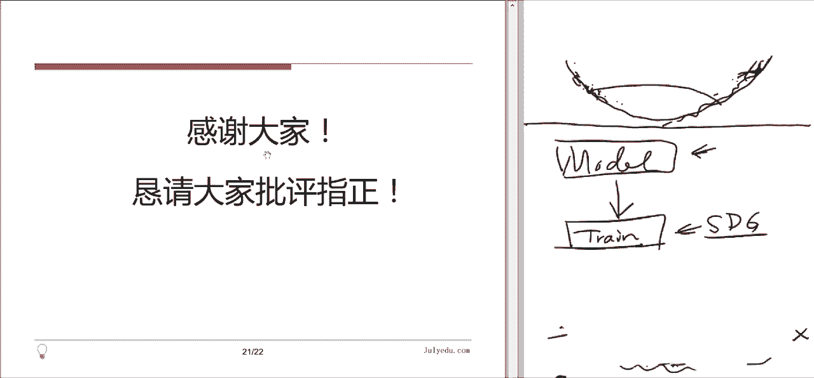
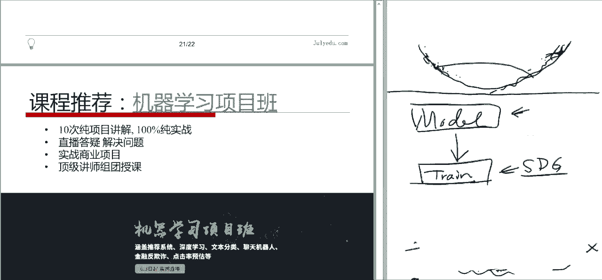

# 论文公开课（P1）：随机梯度下降算法综述 📚

在本节课中，我们将学习随机梯度下降算法的基本原理、面临的挑战以及其各种改进变种。我们将跟随一篇综述性论文的结构，系统地了解不同优化算法的设计思想、优劣以及适用场景，旨在帮助大家在实践中更合理地选择和使用梯度下降类算法。

---

## 第一节：梯度下降法简介 📉

在机器学习中，训练模型通常涉及定义一个损失函数 \( J(\theta) \)，其中 \( \theta \) 是模型参数。我们的目标是调整参数 \( \theta \)，使损失函数 \( J(\theta) \) 最小化。梯度下降法是最基础的优化方法。

梯度下降法的核心思想是：在参数空间的当前点 \( \theta_t \)，计算损失函数的梯度 \( \nabla_\theta J(\theta_t) \)。梯度方向是函数值增加最快的方向，因此，我们沿着梯度的反方向更新参数，以期望函数值减小。参数更新公式如下：

\[
\theta_{t+1} = \theta_t - \eta \cdot \nabla_\theta J(\theta_t)
\]

其中，\( \eta \) 称为学习率，它控制着每次更新的步长。

然而，标准的梯度下降法存在两个主要问题：
1.  **梯度计算开销大**：在机器学习中，损失函数通常是所有样本损失的和，即 \( J(\theta) = \sum_{i=1}^{n} J_i(\theta; x_i) \)。计算完整梯度需要对所有样本求导并求和，当样本量 \( n \) 很大时（例如数百万），计算非常耗时。
2.  **学习率选择困难**：学习率 \( \eta \) 需要手动设定。如果设置过大，可能导致算法在最优解附近震荡甚至发散；如果设置过小，则收敛速度会非常缓慢。

---

## 第二节：随机梯度下降法（SGD）及其变种 🔄

为了解决标准梯度下降法计算开销大的问题，引入了随机梯度下降法。

### 随机梯度下降法（SGD）

SGD的核心改进是：每次更新时，**只使用一个随机样本**来计算梯度估计，并用这个估计来更新参数。更新公式变为：

\[
\theta_{t+1} = \theta_t - \eta \cdot \nabla_\theta J_i(\theta_t)
\]

其中，\( i \) 是在每次迭代中随机选取的样本索引。

**优点**：
*   **计算高效**：每次迭代只计算一个样本的梯度，大大加快了单次迭代的速度。
*   **可能逃离局部极小值**：由于梯度的随机性，算法具有一定的“噪音”，这有助于跳出一些较差的局部极小点。

**缺点**：
*   **更新方向方差大**：单个样本的梯度不能代表整体数据的梯度，导致参数更新路径震荡剧烈，收敛不稳定。

### 小批量随机梯度下降法（Mini-batch SGD）

为了在计算效率和稳定性之间取得平衡，最常用的方法是**小批量随机梯度下降法**。每次更新时，随机抽取一小批样本（例如32、64、128个）来计算梯度的平均值。

\[
\theta_{t+1} = \theta_t - \eta \cdot \frac{1}{m} \sum_{i=1}^{m} \nabla_\theta J_i(\theta_t)
\]

其中，\( m \) 是小批量的大小。

**优点**：
*   **计算与稳定性平衡**：相比SGD，梯度估计更稳定；相比全批量梯度下降，计算量更小。
*   **利于硬件并行**：小批量计算可以很好地利用现代计算硬件的并行能力（如GPU）。

**注意**：在实践中，当人们提到“SGD”时，通常指的就是Mini-batch SGD。在每个训练周期（Epoch）结束后，通常会将整个数据集打乱（Shuffle），然后重新划分小批量，以消除样本顺序可能带来的偏差。

---

## 第三节：SGD面临的挑战与问题 ⚠️

尽管SGD及其变种被广泛应用，但它们仍然面临一些核心挑战：

1.  **病态曲率与震荡**：损失函数的曲面可能在某些方向非常陡峭，而在另一些方向相对平坦（例如狭长的山谷地形）。SGD在陡峭方向会大幅震荡，而在平坦方向进展缓慢，导致收敛速度慢。
2.  **学习率调优困难**：虽然可以通过预设一个衰减计划（如随时间步衰减）来使学习率变小以促进收敛，但如何为不同数据集自动设定合适的衰减策略仍然是个难题。
3.  **稀疏特征与不同频率的参数更新**：对于出现频率差异很大的特征（例如文本中的罕见词和常见词），统一的学习率是不公平的。频繁出现的特征希望用较小的学习率精细调整，而罕见特征则希望用较大的学习率在出现时快速学习。
4.  **陷入鞍点**：在高维非凸优化问题中（如神经网络），鞍点（某些方向是极小值，某些方向是极大值的点）比局部极小值更常见。在鞍点附近，梯度很小，SGD会停滞不前。

---

## 第四节：SGD的改进算法 🛠️

为了解决上述问题，研究者提出了多种改进算法。上一节我们介绍了SGD的基本形式及其挑战，本节中我们来看看一系列旨在解决这些问题的著名优化器。

### 1. 动量法（Momentum）💨

动量法旨在解决**病态曲率导致的震荡问题**。其灵感来源于物理学：将参数更新过程视为一个有质量的球在损失函数曲面上滚动。动量会累积之前更新的方向，使当前更新不仅受当前梯度影响，也受历史更新方向的影响。

**更新公式**：
\[
\begin{aligned}
v_t &= \gamma v_{t-1} + \eta \nabla_\theta J(\theta_t) \\
\theta_{t+1} &= \theta_t - v_t
\end{aligned}
\]
其中，\( v_t \) 是当前速度，\( \gamma \) 是动量系数（通常取0.9），用于衰减历史速度。

**作用**：在梯度方向一致的方向（如山谷底部），动量会不断累积，加速下降；在梯度方向变化剧烈的方向（如山谷两侧），动量会相互抵消，抑制震荡。

### 2. Nesterov 加速梯度法（NAG）🚀

NAG是对动量法的一个改进。动量法在当前位置计算梯度并加上动量。而NAG具有“前瞻性”：它先根据累积的动量向前走一步，在那个“未来”的位置计算梯度，然后进行校正。

**更新公式**：
\[
\begin{aligned}
v_t &= \gamma v_{t-1} + \eta \nabla_\theta J(\theta_t - \gamma v_{t-1}) \\
\theta_{t+1} &= \theta_t - v_t
\end{aligned}
\]

**作用**：这种“向前看”的梯度计算，使得算法在接近最低点时能提前感知到坡度的变化，从而及时减速，避免在谷底过度震荡，提高了稳定性。

### 3. Adagrad 自适应学习率算法 📉

Adagrad 旨在解决**稀疏特征和自动学习率衰减**的问题。它为每个参数维护一个累积平方梯度，并据此为每个参数自适应地调整学习率。

**更新公式**：
\[
\begin{aligned}
G_{t, ii} &= G_{t-1, ii} + (\nabla_{\theta_i} J(\theta_t))^2 \\
\theta_{t+1, i} &= \theta_{t, i} - \frac{\eta}{\sqrt{G_{t, ii} + \epsilon}} \cdot \nabla_{\theta_i} J(\theta_t)
\end{aligned}
\]
其中，\( G_t \) 是一个对角矩阵，其对角线元素 \( G_{t, ii} \) 是参数 \( \theta_i \) 历史梯度平方的累积和。\( \epsilon \) 是一个小常数，防止除零。

**作用**：
*   **参数特异性**：对于更新频繁的参数（梯度平方和大），分母大，有效学习率小；对于更新稀疏的参数（梯度平方和小），分母小，有效学习率大。这非常适用于稀疏数据。
*   **自动衰减**：随着训练进行，\( G_t \) 单调递增，导致所有参数的学习率都在自动衰减。

**缺点**：由于 \( G_t \) 持续累积，学习率会变得过小，可能导致训练提前终止。

### 4. Adadelta / RMSprop 算法 🔄

为了改进 Adagrad 学习率急剧下降的问题，Adadelta 和 RMSprop 不再累积全部历史平方梯度，而是使用**指数移动平均**来关注最近一段时间的梯度规模。

**RMSprop 更新公式**：
\[
\begin{aligned}
E[g^2]_t &= \beta E[g^2]_{t-1} + (1-\beta)(\nabla_\theta J(\theta_t))^2 \\
\theta_{t+1} &= \theta_t - \frac{\eta}{\sqrt{E[g^2]_t + \epsilon}} \cdot \nabla_\theta J(\theta_t)
\end{aligned}
\]
其中，\( \beta \) 是衰减率（通常为0.9），\( E[g^2]_t \) 是平方梯度的指数移动平均。

**作用**：解决了 Adagrad 学习率单调下降至零的问题，使得学习率能够适应非平稳目标，在训练后期也能有更新。

### 5. Adam 自适应矩估计算法 ⚡

Adam 可以说是目前最流行、默认推荐的优化器。它**结合了动量法和自适应学习率的优点**。它同时计算梯度的一阶矩（均值，提供动量）和二阶矩（未中心化的方差，提供自适应学习率），并进行偏差校正。

**更新公式**：
\[
\begin{aligned}
m_t &= \beta_1 m_{t-1} + (1-\beta_1) \nabla_\theta J(\theta_t) \quad &\text{(一阶矩估计)} \\
v_t &= \beta_2 v_{t-1} + (1-\beta_2) (\nabla_\theta J(\theta_t))^2 \quad &\text{(二阶矩估计)} \\
\hat{m}_t &= \frac{m_t}{1 - \beta_1^t} \quad &\text{(偏差校正)} \\
\hat{v}_t &= \frac{v_t}{1 - \beta_2^t} \quad &\text{(偏差校正)} \\
\theta_{t+1} &= \theta_t - \frac{\eta}{\sqrt{\hat{v}_t} + \epsilon} \hat{m}_t
\end{aligned}
\]
其中，\( \beta_1, \beta_2 \) 通常分别取0.9和0.999。

**优点**：
*   兼具动量的加速效果和自适应学习率对稀疏梯度、不同曲率的适应性。
*   通常收敛速度快，且对超参数（除了学习率）相对不敏感。

**如何选择优化器？**
*   对于稀疏数据，可使用自适应学习率算法（Adagrad, Adadelta, RMSprop, Adam）。
*   如果数据分布相对均匀，动量法或NAG通常表现良好。
*   **Adam** 因其鲁棒性和优秀的综合性能，常被作为默认选择。当不确定用哪种时，可以先尝试Adam。

---

## 第五节：其他优化策略 🧩

除了修改参数更新规则，还有一些外围策略可以提升SGD的训练效果。

以下是几种常见的策略：

*   **Shuffling（数据打乱）**：在每个训练周期开始时，随机打乱训练数据顺序，可以防止模型因数据顺序而产生偏差，提升泛化能力。
*   **Batch Normalization（批标准化）**：对每一层神经网络的输入进行标准化处理（减去均值，除以标准差），可以稳定网络的训练过程，允许使用更高的学习率，并具有一定的正则化效果。
*   **Early Stopping（早停）**：在验证集误差不再下降甚至开始上升时，提前终止训练。这是防止过拟合最简单有效的方法之一。
*   **Gradient Noise（梯度噪声）**：在梯度中加入少量高斯噪声。公式为：\( g_t = \nabla_\theta J(\theta_t) + \mathcal{N}(0, \sigma_t^2) \)。噪声可以帮助模型逃离局部极小值或鞍点，其中噪声方差 \( \sigma_t^2 \) 通常随时间衰减。

---

## 总结 📝

本节课中我们一起学习了随机梯度下降算法的核心脉络：
1.  我们从最基础的**梯度下降法**出发，认识了其计算开销大和学习率难调的问题。
2.  引入了**随机梯度下降（SGD）** 及其主流变种**小批量SGD**，以牺牲一定稳定性为代价换取了计算效率的巨大提升。
3.  深入分析了SGD面临的四大挑战：**病态曲率震荡、学习率调优、稀疏参数更新和鞍点问题**。
4.  系统学习了一系列改进算法：**Momentum/NAG** 通过引入“惯性”缓解震荡；**Adagrad/Adadelta/RMSprop** 通过自适应学习率处理稀疏性和自动衰减；**Adam** 综合了动量与自适应学习的优势，成为当前最流行的选择。
5.  最后，了解了一些辅助优化策略，如**数据打乱、批标准化、早停和添加梯度噪声**。

理解这些算法的原理和适用场景，能帮助我们在实际项目中不再是“黑箱”调用优化器，而是能够根据具体问题（如数据稀疏性、模型曲面特性）做出更明智、更有效的选择。