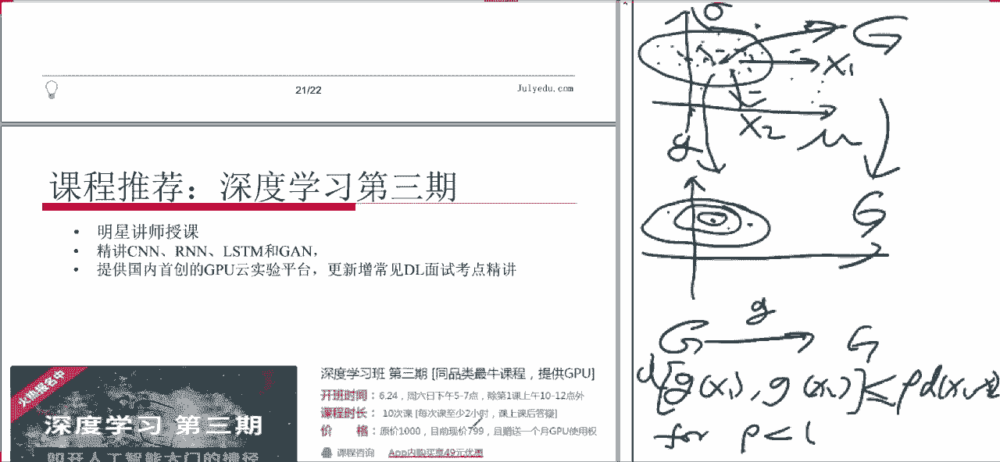

# 论文公开课（七月在线出品） - P2：深度学习中的归一化

## 概述

在本节课中，我们将一起探讨深度学习模型中的归一化技术。我们将以“批量归一化”这一经典方法作为基准，并引入最新的“自归一化神经网络”思想，通过对比这两篇文章，系统地梳理归一化在深度学习中的作用、原理与实现方式。课程旨在让初学者能够理解为什么需要归一化，以及它是如何解决训练过程中的关键问题的。

---

## 第一部分：深度模型与激活函数回顾

上一节我们介绍了课程的整体脉络，本节中我们首先回顾一下深度学习模型的基本结构。

一个深度模型，例如多层感知机（MLP），其核心目的是通过组合多个简单的函数来逼近一个复杂的未知函数。机器学习本质上就是在学习一个从输入到输出的映射函数。

### 模型的基本形式

对于一个简单的两层网络，其计算过程可以表示为：

**公式：**
`y = g( W2 * h + b2 )`
`h = g( W1 * x + b1 )`

其中，`x` 是输入，`h` 是隐藏层的输出，`y` 是最终输出。`W1`, `b1`, `W2`, `b2` 是需要学习的参数，而 `g(·)` 是一个非线性函数，我们称之为**激活函数**。

### 激活函数的作用

激活函数的引入至关重要。如果每一层的变换都是线性的，那么无论叠加多少层，整个网络仍然等价于一个线性变换，无法拟合复杂的非线性关系。因此，激活函数为模型引入了**非线性**，使其能够学习更复杂的模式。

然而，激活函数的选择也会带来一些挑战。

---

## 第二部分：梯度消失问题

上一节我们了解了激活函数的基本作用，本节中我们来看看它可能引发的一个关键问题：梯度消失。

在训练深度神经网络时，我们通常使用基于梯度的优化方法（如随机梯度下降）。梯度通过链式法则从输出层反向传播到输入层。

**公式（链式法则简化示意）：**
`∂Loss/∂W1 = (∂Loss/∂y) * (∂y/∂h) * (∂h/∂W1)`

如果链式中的任何一项（特别是激活函数的导数）非常小，那么连乘之后，传递到较浅层的梯度就会变得极其微小，接近于零。这就是**梯度消失**现象。此时，网络浅层的参数几乎得不到更新，导致训练停滞。

### 常用激活函数及其导数

以下是导致梯度消失问题的具体分析：

1.  **Sigmoid 函数**：`σ(x) = 1 / (1 + e^{-x})`
    *   其导数 `σ'(x) = σ(x)(1 - σ(x))`。
    *   当输入 `x` 的绝对值较大时，函数值趋于0或1，导数则趋近于0。这意味着只要输入落在两端的“饱和区”，该神经元的梯度就会消失。

2.  **Tanh 函数**：`tanh(x)`
    *   与 Sigmoid 类似，在两端也存在饱和区，导数会趋近于0。

3.  **ReLU 函数**：`ReLU(x) = max(0, x)`
    *   在 `x > 0` 时，导数为1，缓解了梯度消失。
    *   但在 `x < 0` 时，导数为0。如果大量神经元输出为负，会导致“神经元死亡”，同样阻碍梯度传播。

梯度消失使得深度网络难以训练。为了解决这个问题，研究者们一方面设计了新的激活函数（如 Leaky ReLU, ELU），另一方面则从数据分布的角度提出了更根本的解决方案——归一化。

---

## 第三部分：批量归一化（Batch Normalization）

上一节我们分析了梯度消失的根源，本节中我们介绍一种广泛应用的解决方案：批量归一化。

批量归一化的核心思想是：在每一层的输入传递到激活函数之前，先对其进行标准化处理，使其保持稳定的分布（例如均值为0，方差为1）。这样可以减少内部协变量偏移，让每一层的输入都落在激活函数梯度较大的区域，从而加速训练并缓解梯度消失。

### 批量归一化的操作步骤

对于一个 mini-batch 的输入 `B = {x_1, ..., x_m}`，批量归一化进行如下变换：

**公式：**
1.  计算 mini-batch 的均值：`μ_B = (1/m) Σ_{i=1}^{m} x_i`
2.  计算 mini-batch 的方差：`σ_B² = (1/m) Σ_{i=1}^{m} (x_i - μ_B)²`
3.  归一化：`x̂_i = (x_i - μ_B) / √(σ_B² + ε)`，`ε` 是一个很小的常数，用于数值稳定性。
4.  缩放与偏移：`y_i = γ * x̂_i + β`

其中，`γ` 和 `β` 是可学习的参数。**步骤4至关重要**，它恢复了网络的表达能力。如果归一化后数据应该被平移或缩放，网络可以通过学习 `γ` 和 `β` 来适应，而不是被强制固定在标准分布上。

### 批量归一化的优点

*   **允许使用更高的学习率**：稳定的输入分布降低了训练对参数初始化和学习率的敏感性。
*   **减少对Dropout的依赖**：BN本身具有一定的正则化效果。
*   **加速模型收敛**：缓解了梯度消失/爆炸问题。

批量归一化已成为训练深度神经网络的标配组件。然而，它需要计算 mini-batch 的统计量，这在 batch size 较小或动态网络结构中可能受限。

---

## 第四部分：自归一化神经网络（Self-Normalizing Neural Networks, SNNs）

上一节我们介绍了需要外部干预的批量归一化，本节中我们来看一种更“智能”的方法：让网络自己实现归一化。

自归一化神经网络的核心创新在于设计了一个特殊的激活函数——**缩放指数线性单元（SELU）**，并证明了在使用该函数且满足一定条件（如权重初始化、网络宽度）时，网络具有“自归一化”的属性。

### SELU 激活函数

**公式：**
`SELU(x) = λ * { x (if x > 0), α * (e^x - 1) (if x ≤ 0) }`

其中 `λ ≈ 1.0507`，`α ≈ 1.6733` 是精心推导出的固定值。与 ELU 相比，SELU 在正区间的斜率 `λ > 1`。

### 自归一化属性的直观理解

自归一化属性是指：当网络使用 SELU 激活函数并正确初始化时，每一层输出的均值会向0收敛，方差会向1收敛，即使没有显式的批量归一化层。

其数学证明非常复杂，但思想可以概括为：
1.  **利用中心极限定理**：当网络较宽时，某一神经元的输入是许多随机变量的加权和，其分布接近高斯分布。
2.  **构造映射不动点**：SELU 函数被设计为，当输入是均值为0、方差为1的高斯分布时，输出也保持相同的均值和方差（这是一个“不动点”）。
3.  **证明收敛性**：进一步证明，该映射是一个“压缩映射”。这意味着，即使初始输入的分布偏离了标准高斯，经过多层这样的变换后，其分布也会被拉回那个不动点附近。

### SNNs 的意义与局限

*   **意义**：提供了一种无需额外归一化层就能稳定训练深度网络的方法，简化了网络结构，在 batch size 为1时也能工作。
*   **局限**：理论保证依赖于网络宽度、特定的权重初始化（如 LeCun normal）等条件。对于卷积网络等结构较窄的网络，其效果可能不如批量归一化稳定。

---

## 总结

本节课中我们一起学习了深度学习中的归一化技术。

我们首先回顾了深度模型的基本结构和激活函数的作用，并指出了传统激活函数可能导致的梯度消失问题。接着，我们深入分析了**批量归一化（BN）** 这一经典方法，它通过显式地标准化每一层的输入来稳定分布，从而加速训练并缓解梯度问题。最后，我们探讨了最新的**自归一化神经网络（SNN）** 思想，它通过精心设计的 SELU 激活函数，让网络自身具备了稳定内部数据分布的能力。

这两种思路代表了解决深度网络训练难题的不同路径：BN 是强大的工程化解决方案，而 SNN 则展示了通过理论推导改进基础组件的潜力。理解它们有助于我们更深入地把握深度学习模型训练的动力学，并在实践中根据任务需求选择合适的工具。

---
*注：本教程根据七月在线论文公开课第二讲内容整理，主要参考了《Batch Normalization: Accelerating Deep Network Training by Reducing Internal Covariate Shift》和《Self-Normalizing Neural Networks》两篇论文的思想。*