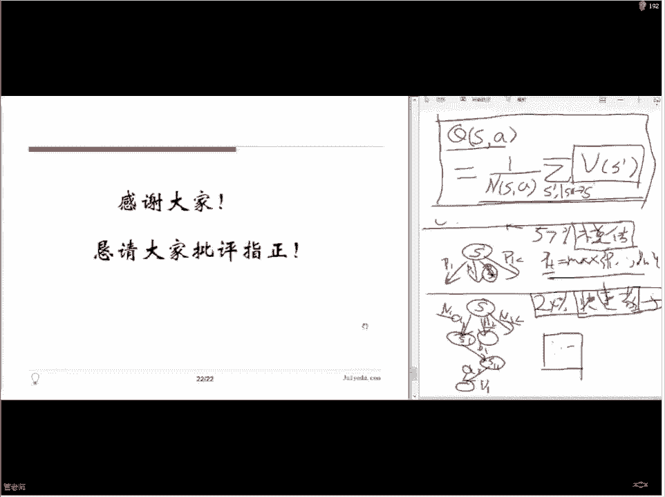

# 论文公开课（七月在线出品） - P3：AlphaGo Zero背后的算法

## 📚 课程概述

在本节课中，我们将学习AlphaGo Zero背后的核心算法。我们将从强化学习的基本框架入手，分析早期AlphaGo如何利用人类知识，并重点探讨AlphaGo Zero如何摒弃人类棋谱，通过自我对弈实现超越。课程将结合两篇关键论文，深入浅出地解释深度模型与蒙特卡洛树搜索的结合，以及这种“专家迭代”训练范式的原理。

---

## 第一部分：动态规划与强化学习

上一节我们介绍了课程的整体目标，本节中我们来看看解决此类问题的通用框架：动态规划与强化学习。

强化学习和动态规划的目标是一致的：设计一种算法，使其能基于环境状态采取行动，以最大化长期收益。这里的“环境”在围棋中就是棋盘上的棋子布局，“行动”就是落子位置，“收益”就是最终赢得比赛。

两者的核心区别在于对“环境变化规律”的认知：
*   **动态规划**：要求环境的转移规律是确定且已知的。
*   **强化学习**：不要求预先知道环境的转移规律，适用范围更广，但也更困难。

我们可以通过动态规划这个简化模型，来帮助理解强化学习以及AlphaGo的核心思想。

### 🤖 强化学习的基本模型

强化学习的基本思路可以概括为“智能体（Agent）与环境（Environment）的交互学习”。以下是其数学描述（马尔可夫决策过程）：
*   **状态集合 (S)**：所有可能的环境状态。例如围棋中所有可能的棋盘局面。
*   **行动集合 (A)**：在给定状态下，智能体可以采取的所有行动。例如在某个棋盘局面下所有合法的落子点。
*   **奖励函数 (R)**：在状态 `s` 下采取行动 `a` 后获得的即时奖励或惩罚。
*   **转移函数 (T)**：在状态 `s` 下采取行动 `a` 后，转移到新状态 `s'` 的概率分布。**这是动态规划与强化学习的关键区别点**。
*   **策略 (π)**：最终的学习目标，一个从状态到行动选择的映射函数。即给定任何局面，都知道最优的落子位置。

### 🎲 举例说明：21点游戏

为了具体化这些概念，我们以21点游戏为例。

*   **状态空间**：玩家手牌点数（P）和庄家明牌点数（D）的组合。
*   **行动空间**：玩家可以选择“要牌”或“停牌”。
*   **奖励函数**：游戏结束时，获胜得+1，落败得-1。**注意**：并非每一步都有奖励，只有终局才有。因此，另一种设计思路是将“获胜概率的增加值”作为每一步的奖励。
*   **转移函数**：玩家行动后，庄家会按照固定规则（点数小于17必须抽牌，否则停牌）行动，其抽牌的概率分布是已知的。

对于21点，由于其状态和行动空间有限，且转移规则固定，我们可以用**动态规划**计算出最优策略表。这个表告诉我们，在任何（P, D）的组合下，玩家选择“要牌”还是“停牌”的期望收益最高。

然而，围棋的挑战在于：
1.  **状态空间巨大**：可能局面数量远超宇宙原子数，无法列出完整的价值表。
2.  **转移函数未知**：你落子后，对手会如何应对是未知的，且对手的策略并非固定公开的规则。

因此，围棋属于典型的**强化学习**问题，且是其中非常困难的一类。

---

## 第二部分：AlphaGo的解决方案与核心困难

面对围棋的巨大挑战，AlphaGo的解决方案核心是两件事：
1.  使用**深度模型**来逼近复杂的价值函数和策略函数，以解决状态空间过多的问题。
2.  预测对手的**落子概率分布**，以应对转移函数未知的问题。

对于第二点“预测落子分布”，AlphaGo（初代）和AlphaGo Zero采取了截然不同的路径。

### 👥 AlphaGo（初代）：模仿学习与混合策略

AlphaGo初代的核心思想是**模仿学习**，即从人类高手棋谱中学习。它的训练和决策融合了三种策略：

以下是三种策略的来源与结合方式：

1.  **监督学习策略网络 (SL Policy Network)**：
    *   **目标**：直接模仿人类高手在特定局面下的落子。
    *   **训练数据**：数百万人类棋谱。
    *   **效果**：对人类高手走法的预测准确率达到57%。仅凭此无法战胜顶尖棋手。

2.  **强化学习策略网络 (RL Policy Network)**：
    *   **目标**：优化胜率，而非模仿。
    *   **训练方式**：让上面的SL策略网络自我对弈，根据对弈结果调整网络参数，使其朝着赢棋的方向进化。
    *   **效果**：性能与SL网络相当或略差，但目标更直接（赢棋）。

3.  **快速走子网络 (Fast Rollout Policy)**：
    *   **目标**：速度极快、精度较低的走子预测，用于蒙特卡洛模拟。
    *   **特点**：比策略网络快数千倍，但准确率仅24%。
    *   **用途**：在树搜索中进行快速胜负推演。

4.  **价值网络 (Value Network)**：
    *   **目标**：直接评估当前局面的胜率。
    *   **训练数据**：使用强化学习策略网络自我对弈产生的3000万局棋，**每局只随机采样一个局面**，以避免过拟合。
    *   **用途**：在搜索树中替代随机模拟到底，提供更稳定的局面评估。

**最终决策**：AlphaGo将以上策略通过**蒙特卡洛树搜索 (MCTS)** 框架结合起来。在树搜索中，它综合使用策略网络（提供优先落子点）、快速走子（进行快速模拟）和价值网络（评估叶节点），共同决定最终落子。实验表明，任何单一策略都无法达到职业水平，而三者结合则能超越人类顶尖棋手。

---

## 第三部分：AlphaGo Zero——无需人类知识的突破

上一节我们看到了AlphaGo如何依赖人类知识，本节中我们来看看革命性的AlphaGo Zero如何摆脱这一依赖。

AlphaGo Zero的核心是**“专家迭代”** 框架，它仅用一个神经网络，并通过自我对弈和树搜索进行训练。

### 🧠 核心架构：统一的神经网络

AlphaGo Zero使用一个深度残差神经网络 `f_θ`。该网络接收棋盘状态 `s` 作为输入，同时输出两个结果：
*   **落子概率向量 `p`**：代表在状态 `s` 下，选择每一个合法落子位置 `a` 的概率。`p = Pr(a|s)`
*   **局面价值标量 `v`**：代表从状态 `s` 出发，当前玩家的预期胜率。`v ≈ E[最终胜者 | s]`

这个网络统一了AlphaGo初代中的**策略网络**和**价值网络**。

### 🔄 训练过程：自我对弈与专家迭代

训练是一个不断循环的过程，每一步都包含三个关键阶段：

1.  **自我对弈（生成棋谱）**：
    *   使用当前神经网络 `f_θ`，基于**蒙特卡洛树搜索 (MCTS)** 的引导进行自我对弈。
    *   **关键点**：落子不是直接采用神经网络输出的概率 `p`，而是采用MCTS搜索后计算出的**改进后的概率分布 `π`**。`π` 比原始的 `p` 更强，因为它包含了通过搜索发现的更优变化。
    *   对弈直至终局，产生胜负结果 `z`（赢为+1，输为-1）。

2.  **神经网络训练（学习棋谱）**：
    *   利用自我对弈产生的数据 `(s, π, z)` 来更新神经网络参数 `θ`。
    *   训练目标是最小化以下损失函数 `l`：
        `l = (z - v)^2 - π^T log p + c ||θ||^2`
    *   **损失函数的三部分**：
        *   `(z - v)^2`：**价值损失**。让神经网络预测的胜率 `v` 接近实际对弈结果 `z`。
        *   `- π^T log p`：**策略损失**。让神经网络输出的落子概率 `p` 接近MCTS搜索出的更强分布 `π`（交叉熵）。
        *   `c ||θ||^2`：**L2正则化项**。防止过拟合。

3.  **迭代优化**：
    *   用新训练好的神经网络 `f_θ` 替换旧的，回到第1步开始新一轮自我对弈。
    *   随着迭代进行，神经网络和MCTS相互促进：更好的网络指导更高效的搜索，更高效的搜索产生更高质量的训练数据来改进网络。

### 🌳 蒙特卡洛树搜索 (MCTS) 在AlphaGo Zero中的角色

MCTS是“专家迭代”中产生更强策略 `π` 的关键。其过程可以概括为**选择、扩展、评估、回溯**四个步骤，在搜索中为每条边 `(s, a)` 维护：
*   **访问次数 `N(s, a)`**：该边被访问的次数。
*   **行动价值 `Q(s, a)`**：该边带来的平均胜率估计。
*   **先验概率 `P(s, a)`**：由神经网络 `f_θ` 给出的原始落子概率。

**搜索时的选择公式**（UCT算法的变体）：
在节点 `s` 选择行动 `a` 时，最大化以下置信上限：
`U(s, a) = Q(s, a) + c_{puct} * P(s, a) * sqrt(∑_b N(s, b)) / (1 + N(s, a))`
*   第一项 `Q(s, a)`：**利用**。倾向于选择历史胜率高的行动。
*   第二项：**探索**。倾向于选择先验概率 `P` 高但访问次数 `N` 少的行动。`c_{puct}` 是控制探索程度的常数。

搜索结束后，根节点各行动的访问次数分布 `N(s, a)` 被归一化，即作为改进后的策略 `π` 用于训练神经网络。

---

## 📊 总结与对比

本节课中我们一起学习了从AlphaGo到AlphaGo Zero的算法演进：

| 特性 | AlphaGo (初代) | AlphaGo Zero |
| :--- | :--- | :--- |
| **人类知识** | **依赖**。使用人类棋谱训练监督学习策略网络。 | **无需**。完全从随机初始化开始自我学习。 |
| **网络结构** | **分离**。独立的策略网络（SL/RL）和价值网络。 | **统一**。一个神经网络同时输出策略 `p` 和价值 `v`。 |
| **快速走子** | **需要**。使用快速但低精度的策略进行蒙特卡洛模拟。 | **无需**。价值网络 `v` 直接评估叶节点，更高效准确。 |
| **训练数据** | 人类棋谱 + 自我对弈数据。 | 纯自我对弈数据。 |
| **核心方法** | 模仿学习 + 蒙特卡洛树搜索 + 价值网络混合。 | **专家迭代**：神经网络与蒙特卡洛树搜索紧密耦合，相互增强。 |
| **性能与效率** | 需要大量计算资源和时间训练，已超越人类。 | **更高效、更强大**。使用更少的计算资源，在更短时间内达到更高水平。 |

AlphaGo Zero的成功表明：
1.  对于围棋这类问题，**无需人类先验知识**，纯自我对弈的强化学习可以找到甚至超越人类认知的策略。
2.  **深度神经网络**是逼近复杂策略和价值函数的强大工具。
3.  **蒙特卡洛树搜索**不仅可用于决策，还能与神经网络结合，生成高质量的训练目标，形成强大的“规划-学习”循环。

这一框架为许多其他具有明确规则但策略空间复杂的领域（如其他棋类、电子游戏、算法设计等）提供了新的解决思路。

---

