# Cursor 团队访谈：人工智能驱动下的编程未来 🚀

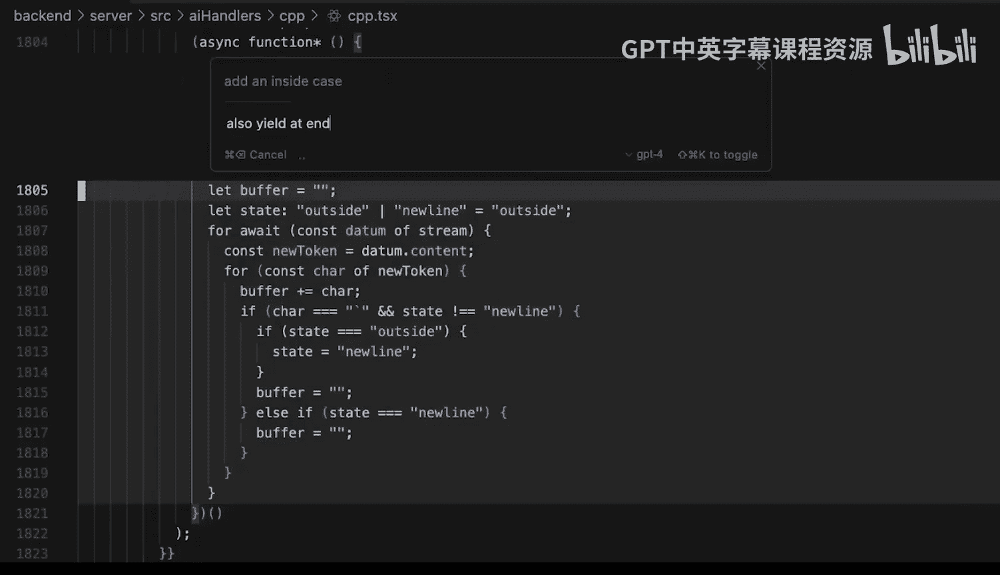

## 概述

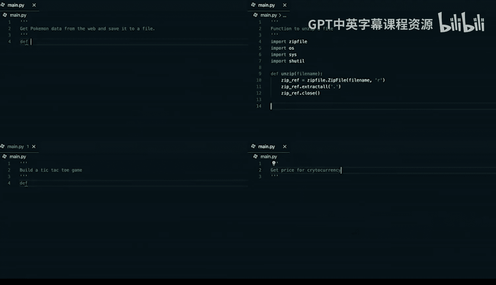

在本节课中，我们将一起学习 Cursor 团队在 Lex Fridman 播客中分享的关于人工智能如何改变编程未来的深刻见解。我们将探讨代码编辑器的演变、AI 辅助编程的核心技术、未来编程的形态，以及 Cursor 团队如何通过创新推动这一变革。

---

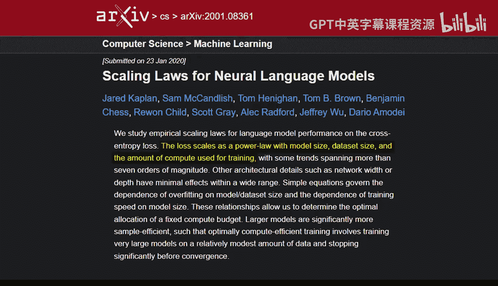

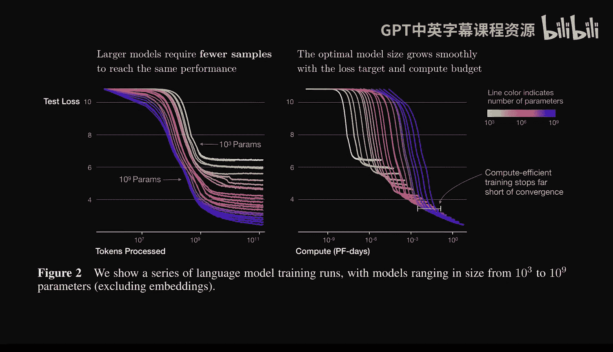

## 代码编辑器的本质与演变

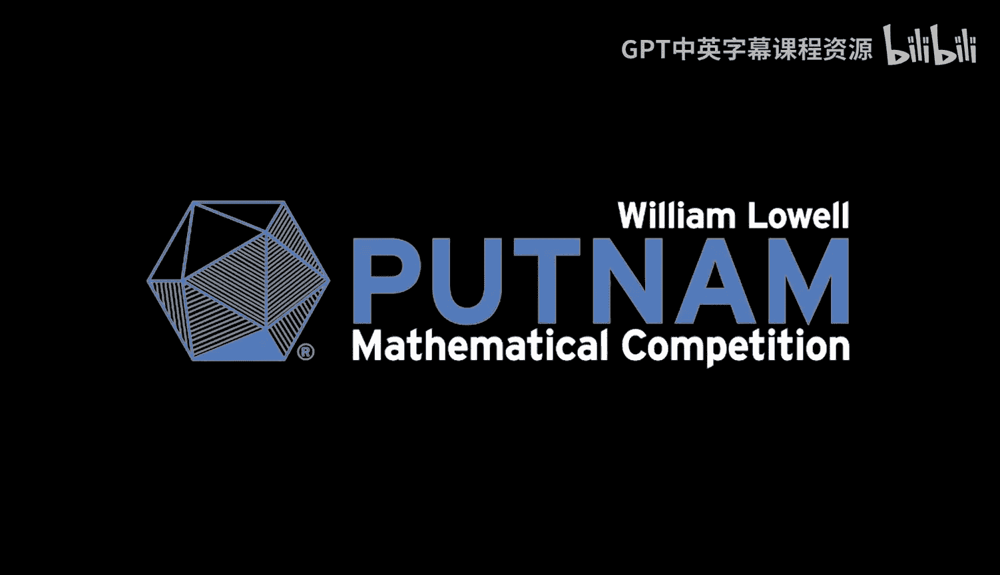

代码编辑器长期以来是构建软件的核心场所。对于非程序员来说，可以将其视为一个为程序员高度优化的文字处理器。代码具有丰富的结构，因此代码编辑器能够提供许多传统文字处理器无法实现的功能。

以下是代码编辑器提供的一些核心功能：

*   **视觉区分**：快速扫描代码中的不同标记。
*   **导航**：像使用超链接浏览网页一样，在代码库中跳转到定义处。
*   **错误检查**：捕获基本的程序错误。

随着 AI 技术的融入，代码编辑器的定义和功能将在未来十年发生巨大变化。编程的本质和构建软件的方式也将随之改变。

编程本身应该充满乐趣。速度往往是乐趣的关键因素之一。计算机编程的魅力在于，个人就能与计算机快速交互，独立构建出非常酷的东西。

---

## Cursor 的诞生与愿景

Cursor 是一个基于 VS Code 的代码编辑器，它增加了许多强大的 AI 辅助编程功能，吸引了编程和 AI 社区的广泛关注。Cursor 团队的创始成员包括 Michael Trull、Swli Asff、Arvid Lumark 和 Amman Sger。

团队最初都是 Vim 用户。大约在 2021 年 GitHub Copilot 推出时，为了体验其功能，他们转向了当时唯一支持 Copilot 的编辑器 VS Code。Copilot 带来的体验足够好，促使他们完成了这次切换。

Copilot 的核心功能是智能代码补全。它能在你开始编写时，建议如何完成当前的一到三行代码。当它“理解”你的意图时，会带来一种默契感；即使出错了，影响也不大，因为你可以通过继续输入字符来迭代修正。Copilot 是第一个真正意义上的 AI 消费级产品，也是大型语言模型的第一个“杀手级应用”。

Cursor 的起源与 OpenAI 在 2020 年发布的“缩放定律”论文密切相关。该论文指出，模型规模和数据量的增大可以带来可预测的性能提升。这让他们意识到，AI 技术将对各领域知识工作者产生深远影响。

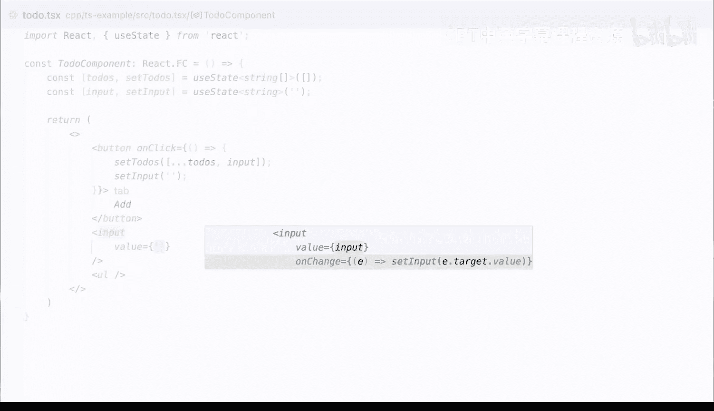

2022 年底，团队获得了 GPT-4 的早期访问权限。其能力的巨大飞跃，让之前基于缩放定律的理论预测变得非常具体。他们意识到，这不仅是一个点状解决方案，而是整个编程流程都将通过这些模型进行，这需要一个全新的编程环境和方式。于是，他们开始着手构建 Cursor，以实现这个更宏大的愿景。

团队曾对 AI 在数学领域的进展速度有过激烈讨论。事实证明，对进展最乐观的成员 Amman 的预测非常具有前瞻性。AI 在数学等具有明确验证信号的领域可能进展神速，甚至达到超人类水平，但这并不等同于通用人工智能。

---

## 为何选择分叉 VS Code

既然已有 Copilot 等 VS Code 扩展在做 AI 相关功能，为何还要分叉 VS Code 并从头构建 Cursor？

团队认为，随着模型能力持续快速提升，构建软件的方式将发生根本性改变，不仅会带来巨大的生产力提升，编程行为本身也会彻底改变。如果仅作为现有代码编辑器的插件，会受到诸多限制。他们不希望被这些限制束缚，而是希望自由地构建最有用的功能。

在竞争方面，AI 编程领域非常独特。每年甚至每次模型能力的跃升，都会解锁一波新的可能性和功能。在这个领域，即使只是领先几个月，产品的实用性也会天差地别。Cursor 的目标是不断创新，快速实现新功能，推动能力上限。他们以初创公司的敏捷性，致力于进行必要的研究和实验。

一个被低估的事实是，他们最初是为自己构建 Cursor。当时他们感到沮丧，因为模型能力在提升，但 Copilot 的体验却停滞不前，没有充分利用模型的新能力。相比之下，Cursor 的体验是统一开发的，负责 UX 交互和模型优化的是同一批人，甚至往往是同一个人，这种紧密协作能创造出原本不可能实现的功能。

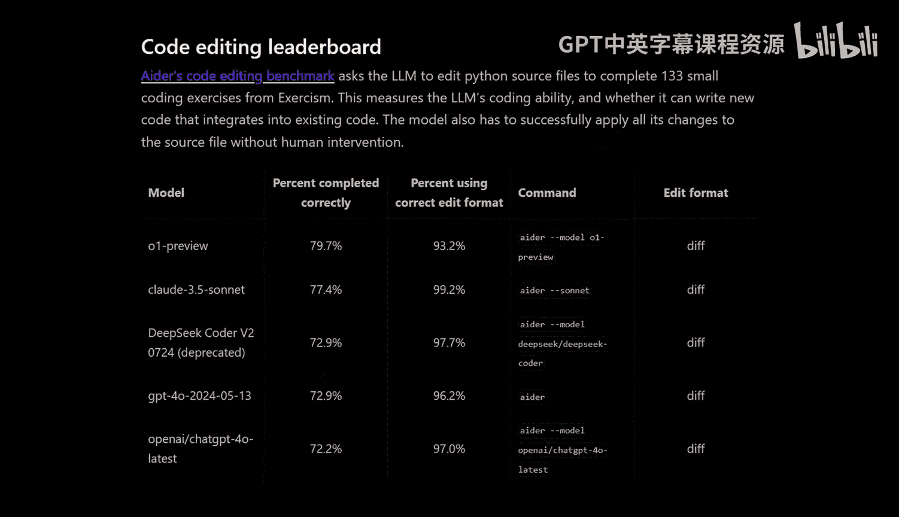

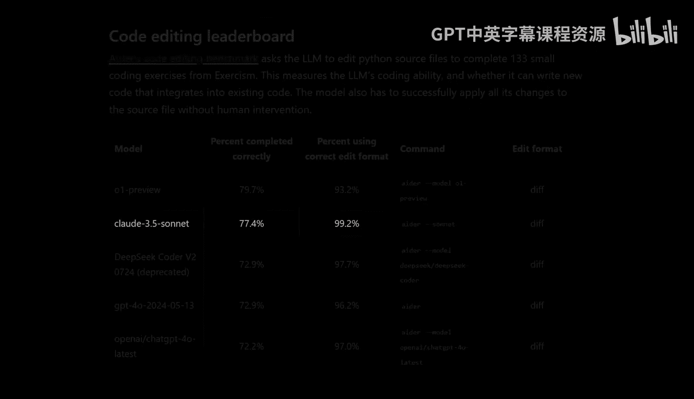

---

## Cursor 的核心功能：Tab 与智能编辑

Cursor 目前主要擅长两个方面：

1.  **预测与补全**：像一个快速的同事，预测你的下一步操作并提前输入。这不仅是预测光标后的字符，更是预测下一个完整的更改、下一个要跳转的位置。
2.  **指令到代码**：帮助你跳转到 AI 前面，通过指令生成代码。

团队在这两方面都投入了大量工作，旨在使编辑体验符合人体工程学，同时确保功能智能且快速。

**Tab 键** 是实现“零熵操作”理念的核心。其抽象思想是：一旦你表达了意图，而完成这个想法所需的操作是确定性的（即信息熵为零），那么模型就应该能“读懂你的想法”，通过按 Tab 键直接跳过这些步骤。代码的字符可预测性本身就比自然语言高，而预测用户在现有代码基础上的下一个编辑动作，这种可预测性会被进一步放大。Tab 的目标就是消除编辑器中所有低熵的操作，让用户直接“跳跃”到未来。

**技术实现细节**：
为了实现高质量且低延迟的 Tab 预测，需要解决几个关键技术挑战：
*   **长上下文与低延迟**：预测需要很长的提示（看到大量代码），但生成的令牌却很少。这非常适合使用 **混合专家模型**，它能显著提升长上下文下的性能。
*   **推测解码变体**：团队构建了一种称为 **推测编辑** 的变体。它利用原始代码作为强先验，并行处理大块代码，直到模型预测与原始代码出现分歧，从而大幅加速代码重写过程。
*   **缓存优化**：由于输入令牌量巨大，必须设计缓存感知的提示，并重用键值缓存，以减少每次击键的计算量，降低延迟和 GPU 负载。

**Tab 的未来能力**：
Tab 功能旨在实现“下一个动作预测”。其广义目标包括：
*   生成新代码（填充空白）。
*   跨多行编辑代码。
*   在同一文件内跳转到不同位置。
*   在不同文件间跳转。
*   甚至建议在终端中运行命令，或跳转到定义处获取必要知识后再返回，以便用户验证补全是否正确。

理想状态下，如果编程中接下来五分钟要做的事可以从近期操作中预测，那么用户就能通过不断按 Tab 键，快速完成一系列大型更改。

---

## 差异界面与代码审查

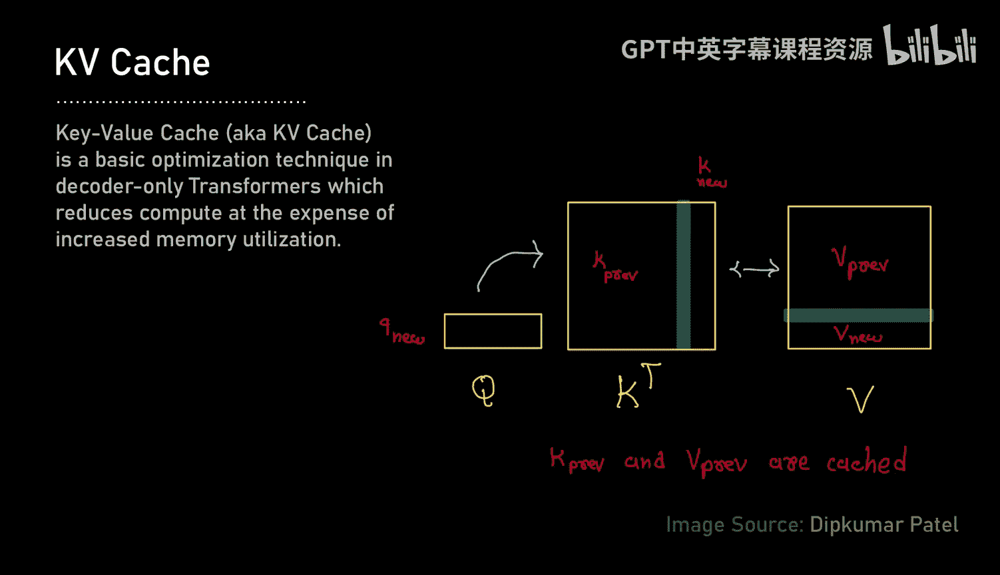

Cursor 的一个显著特点是其差异界面。当模型建议修改时，会通过红色（删除）和绿色（添加）高亮显示代码变更，用户可以在聊天窗口中查看、应用或接受这些差异。

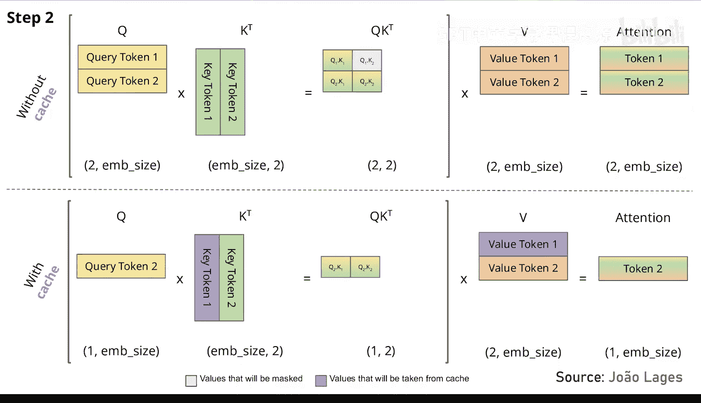

团队为不同场景优化了不同的差异界面：
*   **自动补全**：差异需要极快的阅读速度，因为用户视线聚焦在单一区域。
*   **审查大块代码**：需要不同的呈现方式。
*   **多文件更改**：又需要另一种优化。

他们尝试过多种设计方案，例如最初采用类似 Google Docs 的删除线样式，但过于分散注意力；后来尝试过按住 Option 键预览建议。目前的版本可能仍非最终形态。

随着模型变得更智能，它们能提出的更改会越来越大，人类需要进行的验证工作也越来越多。当前的差异算法缺乏智能，无法区分更改的重要性。未来的方向是让模型智能地指导审查，例如：
*   **高亮重要部分**：突出显示差异中包含大量信息的关键部分，淡化低熵的重复性更改。
*   **自动标记潜在错误**：让模型分析差异，标记出可能存在问题的部分，提示用户重点审查。

这本质上是一个引导人类程序员以最优方式阅读必要信息的 UX 设计工程问题。

对于跨多文件的代码审查，可以借鉴但超越 GitHub 的代码审查体验。当代码由语言模型生成时，设计可以完全围绕审查者展开，使其工作更轻松、高效。例如，模型可以智能地引导审查顺序，按照逻辑依赖关系而非简单的文件列表顺序进行审查。

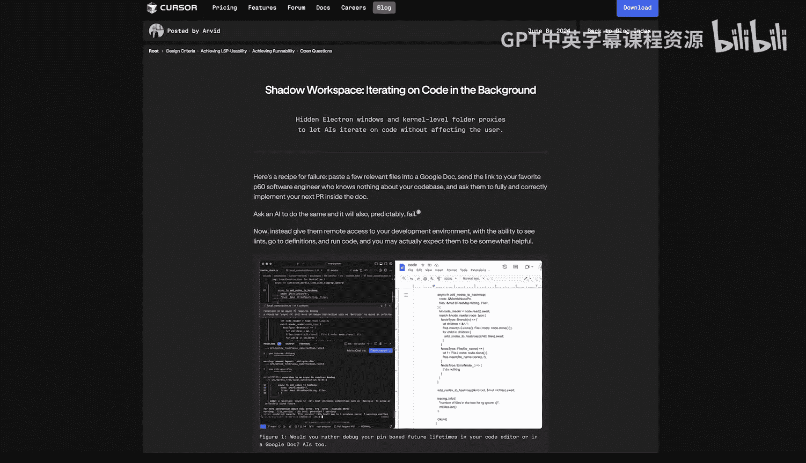

---

## 自然语言与编程的未来

编程的未来是否完全由自然语言主导？团队认为并非如此。

与 AI 协作编程，类似于人与人之间的结对编程。有时，通过自然语言指令（“请实现这个函数”）是最高效的；但有时，用语言解释意图非常繁琐，直接动手写一部分示例代码给 AI 看，反而是更简单的沟通方式。未来，沟通方式可能更加多元，包括拖拽、绘图，甚至脑机接口。

因此，自然语言会占有一席之地，但绝不会是大多数时候编程的主要方式。

---

## 底层机器学习技术

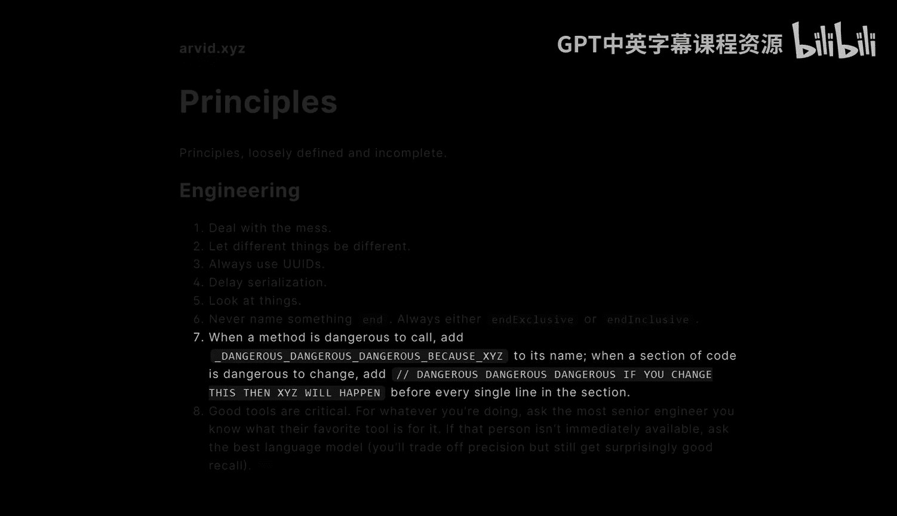

Cursor 的有效运行依赖于一个由定制模型和前沿模型组成的“组合拳”。定制模型可以在特定任务上超越甚至是最先进的前沿模型。

**定制模型的应用领域**：
1.  **Cursor Tab**：专门针对“预测下一个编辑”任务进行训练和优化的小模型，在该任务上表现卓越。
2.  **代码应用**：将模型生成的“草图”实际应用到代码文件中。前沿模型擅长规划代码更改和生成粗略草图，但精确地生成差异（如准确计算行号）却很困难。Cursor 的解决方案是：让前沿模型勾勒出更改的粗略代码块，然后由一个专门训练的 **应用模型** 来精确执行这个更改，将其应用到文件中。这个“应用”步骤对人类来说看似简单，但对模型而言并非确定性算法，需要专门优化。

这种分工模式允许使用更智能的模型进行规划，而由能力稍弱的模型处理实现细节，从而在成本和延迟上取得平衡。未来，可能会形成更复杂的层级，例如由 O1 给出更高层次的计划，然后由 Sonnet 和应用模型递归执行。

---

## 模型比较与基准测试

在编程领域，没有哪个模型在所有重要维度（速度、代码编辑能力、长上下文处理、编码能力）上全面占优。

目前综合表现最佳的是 **Sonnet 3.5**。**O1** 在解决编程面试或 LeetCode 风格的问题上表现出色，但在理解模糊意图方面感觉不如 Sonnet。其他前沿模型在基准测试中表现很好，但一旦稍微偏离基准测试的分布，能力就可能下降。

**基准测试的局限性**：
基准测试（如 SWE-bench）与真实编程存在显著差距：
*   **真实编程的模糊性**：真实编程中，人类的指令可能是破碎的英语、引用之前的操作，或者包含大量上下文依赖。它更侧重于理解人类意图并执行，而非解决定义明确的问题。
*   **数据污染问题**：流行的公共基准测试数据很可能已经污染了基础模型的训练数据。模型可能直接“记住”了问题、文件路径或函数名，而非真正解决问题。

由于基准测试的缺陷，许多构建系统或模型的公司会依赖 **人工定性评估**（“氛围检查”）和私有测试集来评估进展方向。

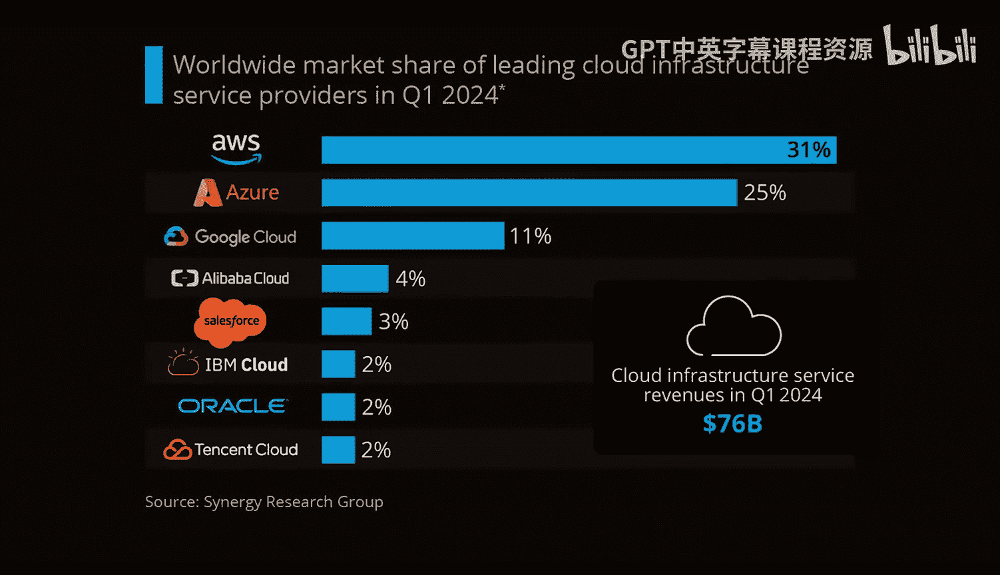

---

## 提示工程与上下文管理

好的提示对于模型成功至关重要。不同模型对提示的敏感度不同。早期 GPT-4 上下文窗口小，对提示非常敏感。现在即使上下文窗口变长，填满整个窗口也会导致速度变慢，有时甚至会让模型困惑。

Cursor 内部构建了一个名为 **Preempt** 的系统来管理上下文。其灵感来源于 React 的声明式 UI 设计。开发者使用类似 JSX 的语法声明提示组件及其优先级（例如，光标所在行优先级最高），然后由 Preempt 渲染器根据上下文窗口大小智能地编排这些组件，决定包含哪些、截断哪些。

团队的目标是让用户以最自然的方式操作，而由系统负责在后台智能地检索和组织相关上下文。系统也会尝试在用户输入时，主动建议可能相关的文件，以减少指令中的不确定性。

---

## 智能体与编程

智能体非常酷，它模仿人类的行为方式，让人感觉更接近 AGI。但目前，智能体在许多任务上还不够实用。

智能体在某些类型的任务上会很有用，例如修复一个定义明确的 Bug。用户可以用两句话描述问题，然后让智能体花长时间去定位、复现、修复并验证这个 Bug。

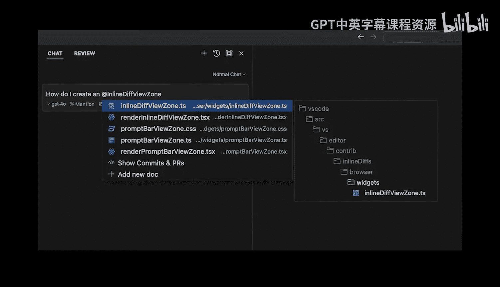

然而，团队认为智能体不会接管所有编程工作。因为编程的很多价值在于迭代，用户在看到初始版本前往往不清楚自己想要什么，之后需要快速迭代并提供更多反馈。因此，对于大量编程工作，用户更需要一个能即时给出初始版本并支持快速迭代的系统。

像 **Roo Code** 或 **Devin** 这类能设置开发环境、安装软件包、配置数据库并部署应用的智能体，对于某些类型的编程（尤其是繁琐的步骤）会很酷。这属于 Cursor 让程序员生活更轻松、更有趣的范畴，但目前并非工作重点。

未来，智能体可以在后台运行，与用户协同工作。例如，当用户在处理一个涉及前后端的 PR 时，后台智能体可以并行处理后端部分，等用户切换到后端时，就已经有了一些初始代码可供迭代。

---

## 性能优化技术

Cursor 的多数操作都感觉非常快。性能优化涉及多个层面：

1.  **缓存预热**：在用户输入时，就预先将可能用到的上下文（如当前文件内容）加载并计算其键值缓存。当用户按下回车时，需要预填充和计算的令牌就很少，从而显著降低首次令牌生成时间。
2.  **键值缓存**：Transformer 模型通过注意力机制工作，其中键和值代表了之前所有令牌的内部表示。如果已经计算并存储了前 N 个令牌的 KV 缓存，在计算第 N+1 个令牌时，就无需再次让前 N 个令牌通过整个模型，只需处理新令牌并复用缓存，这大大加快了生成速度。
3.  **高级缓存与推测**：对于 Cursor Tab，可以提前推测用户接受建议后的状态，并触发另一个请求，将结果缓存。这样当用户按下 Tab 时，下一个建议几乎可以立即呈现。
4.  **注意力机制优化**：从多头注意力转向 **多查询注意力** 或 **分组查询注意力**，可以压缩 KV 缓存的大小，这对于长上下文、大批量生成时的内存带宽瓶颈至关重要。**MLA** 等更复杂的算法通过将键值压缩为潜在向量，进一步减少了缓存大小。
5.  **被动搜索**：模型内部对“用户想要哪个建议”存在不确定性。通过一次生成多个候选，然后使用奖励模型（通过人类反馈进行强化学习训练）挑选出人类更可能喜欢的那个，可以提升体验。强化学习还可以用来训练小模型，使其在特定任务上达到与大模型相当的性能。

---

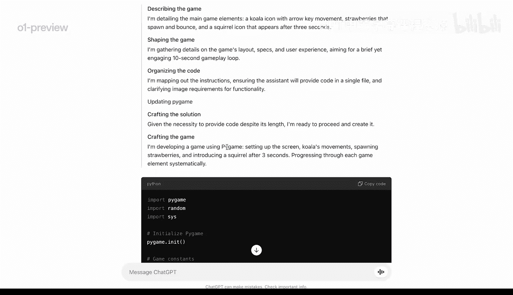

## 影子工作区与后台智能体

团队正在实验“影子工作区”的概念，即在后台进行计算，以帮助用户在更长的时间尺度上（如下一个十分钟）预测和准备将要进行的操作。

其核心思想是利用反馈来提升模型表现。一个重要的反馈来源是 **语言服务器**。LSP 为不同编程语言提供语法检查、类型检查、跳转到定义、查找引用等功能。在大型项目中，这些功能至关重要。

影子工作区的实现方式是：在本地启动一个隐藏的 Cursor 窗口，AI 智能体可以在其中任意修改代码（只要不保存），并获取 LSP 的反馈、跳转到定义、迭代运行代码，就像在真实环境中一样。在 Linux 上，可以通过内核扩展创建内存中的镜像文件系统；在 macOS 和 Windows 上则更具挑战性。

一个有趣的思路是“保存锁”。智能体持有保存锁，在内存中进行修改和测试，当用户尝试运行时，如果检测到锁，可以从智能体那里取回锁。这为实现强大的后台智能体提供了可能。

对于耗时较长、改动较大的任务，可能需要在远程沙箱环境中进行，这又带来了如何精确复制用户环境的挑战。

---

## Bug 检测与程序验证

当前，即使是最先进的模型，在被动提示下进行 Bug 检测的效果也很差，校准度非常低。

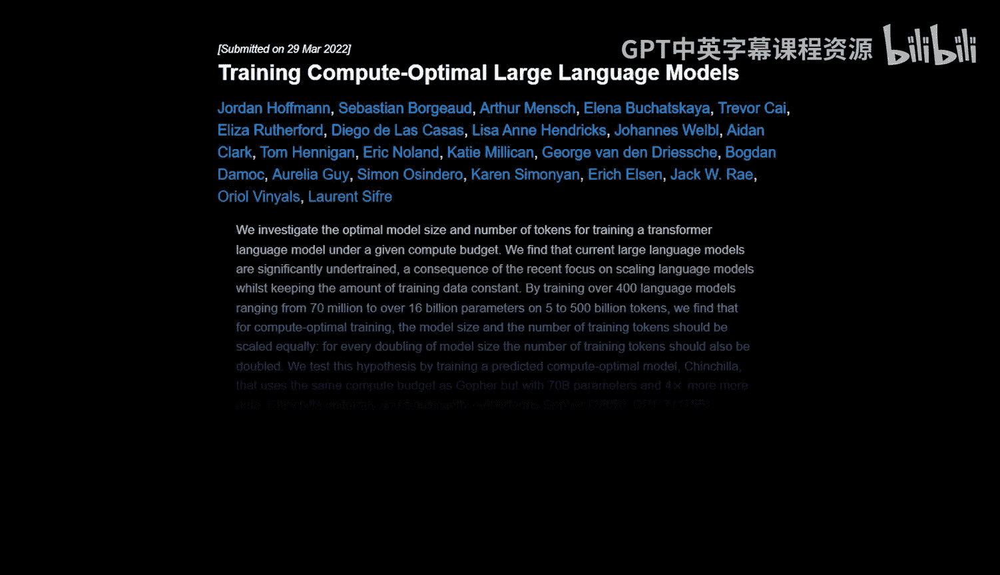

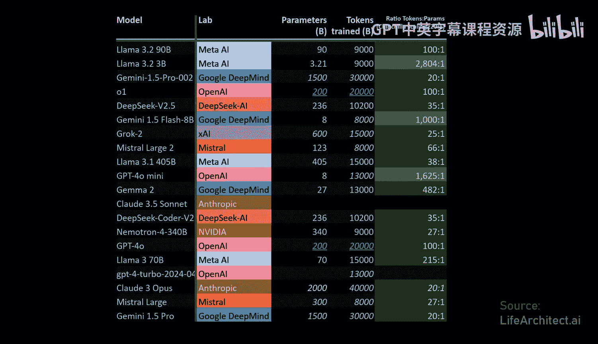

这可能是因为在预训练数据中，真正“检测真实 Bug 并提出修复”的例子非常少。模型可能“感觉”到某些代码有问题，但难以将其明确表达出来，更难以判断 Bug 的严重性（是实验性代码中的小问题，还是数据库核心代码中不可接受的错误）。

**Bug 检测的重要性**：随着 AI 承担越来越多的编程工作，不仅需要生成代码，还需要验证代码。强大的 Bug 检测模型对于实现 AI 编程的最高愿景至关重要。

**如何训练 Bug 检测模型**：
*   **合成数据**：一个流行的思路是，引入 Bug 比发现 Bug 更容易。可以训练一个模型在现有代码中引入合理的 Bug，然后利用这些合成数据训练一个反向的 Bug 检测模型。
*   **利用更多信息**：除了代码本身，还可以让模型访问运行时信息，如跟踪、调试器步骤、日志等。
*   **产品形态**：可能有两种形态：一个快速、专业的模型在后台持续运行，尝试发现 Bug；另一种是用户愿意为解决特定难题支付高额费用，让模型投入大量计算进行深度分析。

**代码标注实践**：在可能造成严重损害的代码行旁添加醒目的注释（如“危险！！！”），不仅对人类工程师是很好的提醒，也能让 AI 模型更关注这些区域，从而提高发现 Bug 的几率。这是一个有争议但可能非常有效的实践。

**程序验证的未来**：未来，人们可能不再需要编写测试。模型会在你编写函数时，建议一个规范，并在你审查规范的同时，由智能推理模型计算出一个证明，验证实现符合规范。这可能适用于大多数函数。

然而，**规范制定**本身就是一个难题。如何用形式化语言准确捕捉那些难以明确指定的意图？此外，如何处理外部依赖（如调用 Stripe API）或程序中使用语言模型作为原语的情况？这些都是程序验证面临的挑战。但若能实现，将从消除程序 Bug 到确保 AI 安全，产生深远影响。

---

## 基础设施与扩展挑战

Cursor 主要使用 AWS。AWS 的可靠性是选择它的关键原因，尽管其控制台界面可能复杂，但服务本身非常稳定。

随着用户量和请求量的指数级增长，团队遇到了各种扩展挑战：
*   **通用组件**：缓存、数据库等通用组件在规模扩大时会遇到各种问题，如表溢出。
*   **定制系统**：例如为代码库构建语义索引的检索系统。

**检索系统的技术细节**：
*   **隐私与同步**：非常注重客户端 Bug，因此服务器上不存储用户代码，只存储代码片段的嵌入向量。技术挑战在于确保本地代码库状态与服务器状态同步。
*   **高效同步**：使用默克尔树等层次化哈希结构进行高效同步。仅当根哈希不匹配时，才逐层向下查找具体差异的文件，避免了持续的全量哈希比对带来的巨大网络和数据库开销。
*   **嵌入缓存**：嵌入计算是成本瓶颈。对于同一公司的多个用户访问相同代码库（可能处于不同分支），可以通过基于代码块哈希的向量缓存来避免重复嵌入，大幅提升速度并降低成本。

**索引代码库的当前价值**：最明显的用途是快速定位。当你在大型代码库中模糊记得某个功能的位置时，可以通过代码库聊天功能快速找到。未来，随着检索质量的提升，其价值会越来越大。

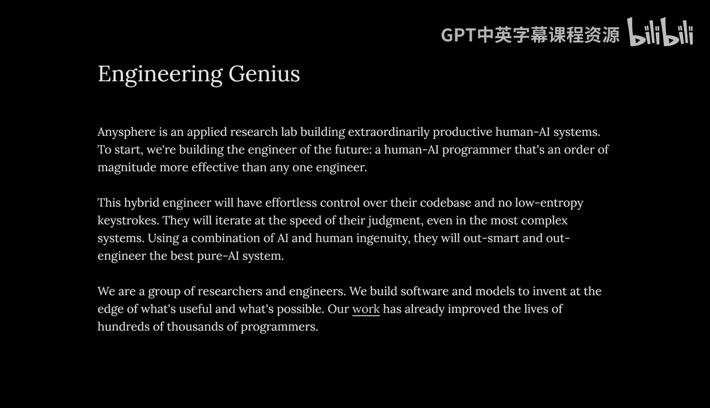

**为何不做本地处理**：团队考虑过本地模型，但这非常困难。大多数用户使用