# 人工智能与搜索的未来：第1部分：Perplexity CEO Aravind Srinivas访谈 🧠

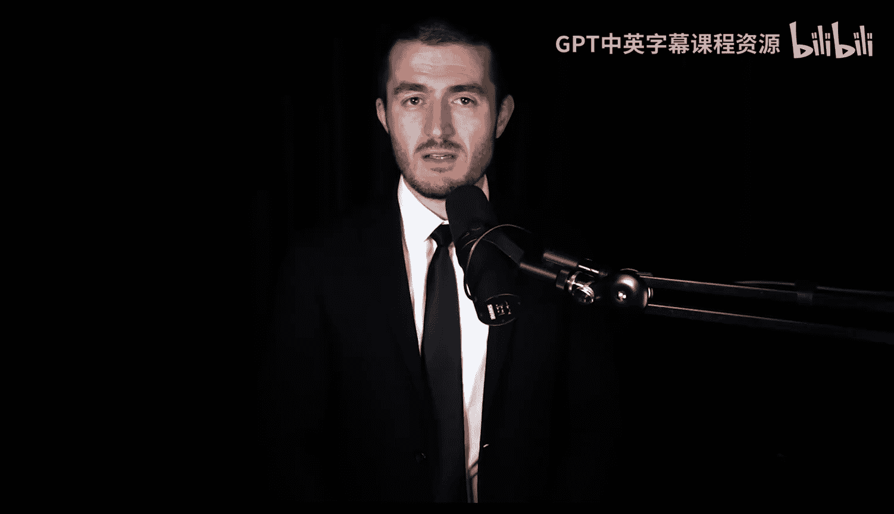

在本节课中，我们将一起学习Perplexity AI的核心理念、技术架构及其对搜索和互联网未来的影响。我们将跟随Perplexity联合创始人兼CEO Aravind Srinivas的视角，深入探讨如何结合大型语言模型（LLM）与传统搜索来构建一个以事实为依据的“答案引擎”。

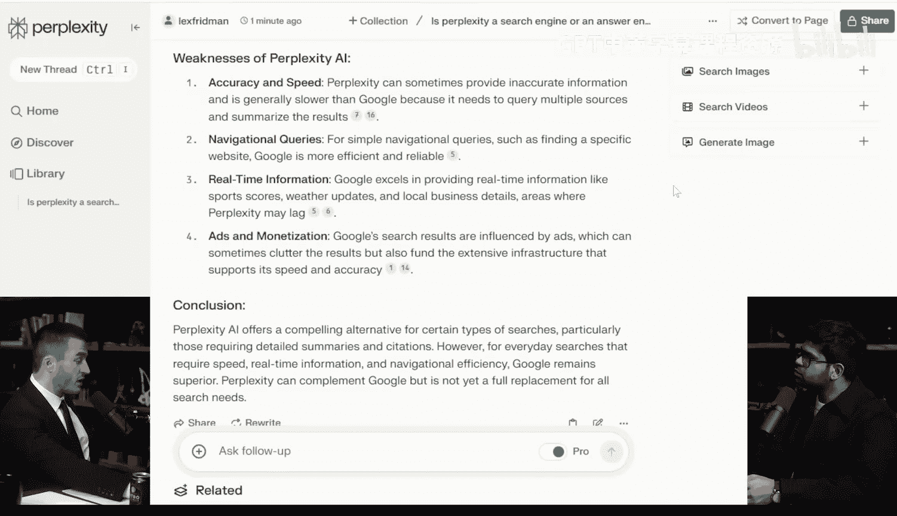

---

## 概述：什么是Perplexity？🤔

Perplexity AI 被其创始人描述为一个“答案引擎”。与传统的搜索引擎不同，它旨在直接回答用户的问题，并且每一个回答都附有来自互联网上人类创建来源的引用。这大大减少了大型语言模型常见的“幻觉”问题，使其在研究或满足好奇心驱动的探索时更加可靠。

上一节我们介绍了Perplexity的基本定位，本节中我们来看看它的核心工作原理。

---

## 核心架构：搜索与LLM的结合 🔧

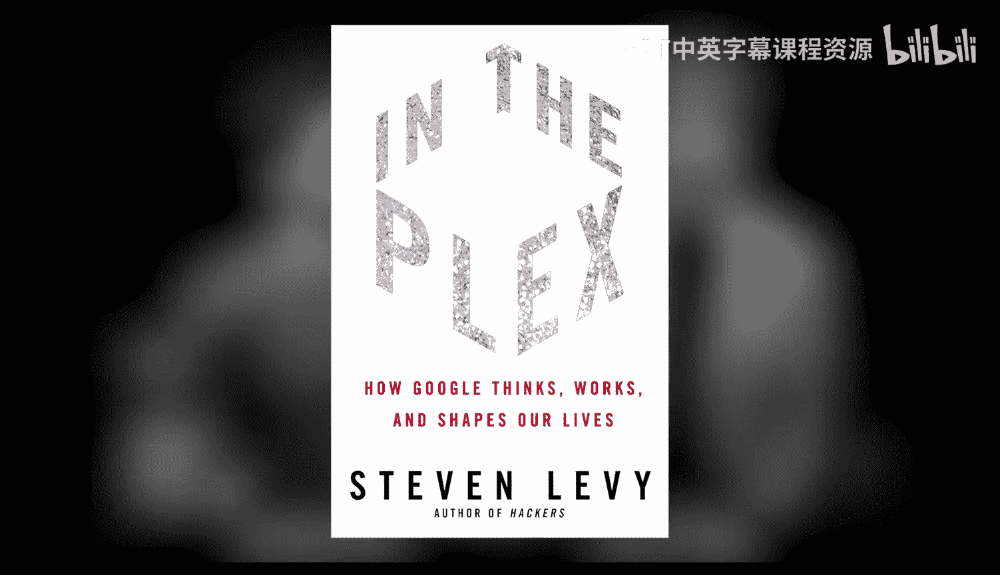

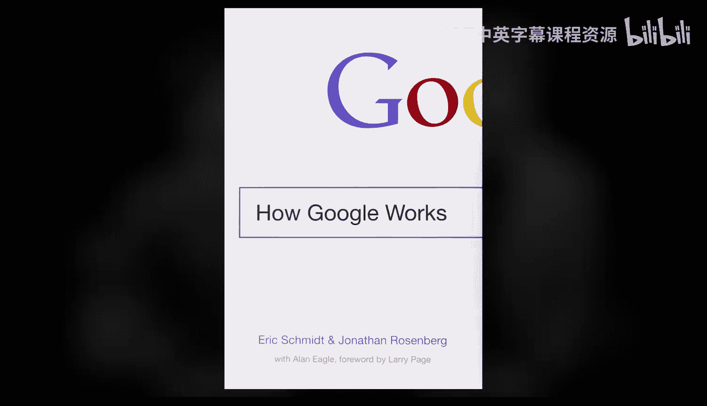

Perplexity 结合了传统搜索引擎和大型语言模型。其工作流程可以概括为以下几个步骤：

1.  **传统搜索**：首先，系统会像传统搜索引擎一样，根据用户查询检索相关的网页和文档。
2.  **信息提取**：从检索到的文档中提取出与查询最相关的段落。
3.  **LLM生成答案**：将这些相关段落输入给大型语言模型（LLM）。
4.  **格式化与引用**：LLM根据这些段落和原始查询，生成一个格式清晰、易于阅读的答案，并自动在答案的相应部分添加脚注，引用其信息来源。

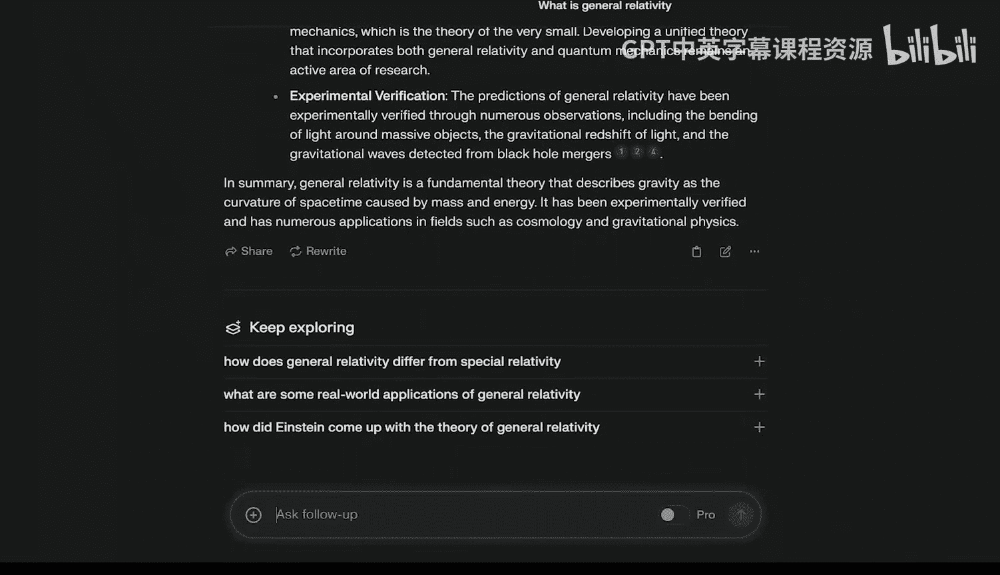

**公式化描述**：
`最终答案 = LLM( 提取段落( 搜索引擎( 用户查询 ) ) )`

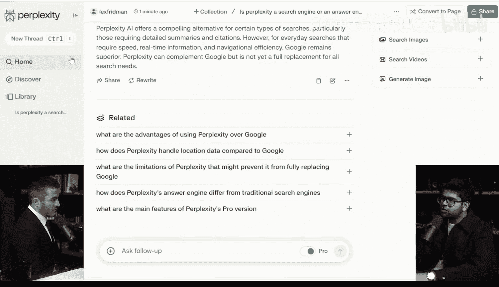

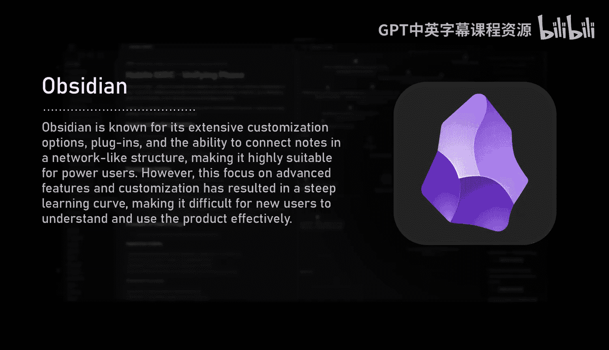

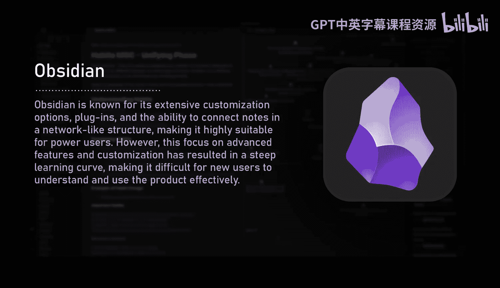

其核心指令是：**“给定一组链接和段落，为用户撰写一个简洁的答案，并附上适当的引用。”** 这模仿了学术写作的原则——每一句话都应有据可查。

---

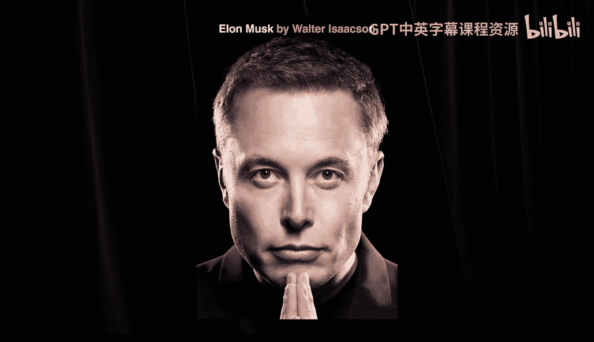

## 设计哲学：从学术界汲取灵感 📚

Perplexity 的设计深受学术规范影响。Aravind 提到，他在撰写第一篇论文时学到的一条深刻原则是：**论文中的每一句话都应该有引用支持**，无论是来自其他同行评审的论文还是自己的实验结果。任何没有引用的陈述更像是个人观点。

他们将这一原则应用于聊天机器人，问自己：**“让聊天机器人保持准确的最佳方式是什么？”** 答案是：强制它只说出能在互联网上找到、并且有多个来源支持的内容。这并非一个突发奇想的实验，而是源于解决实际问题的需求。

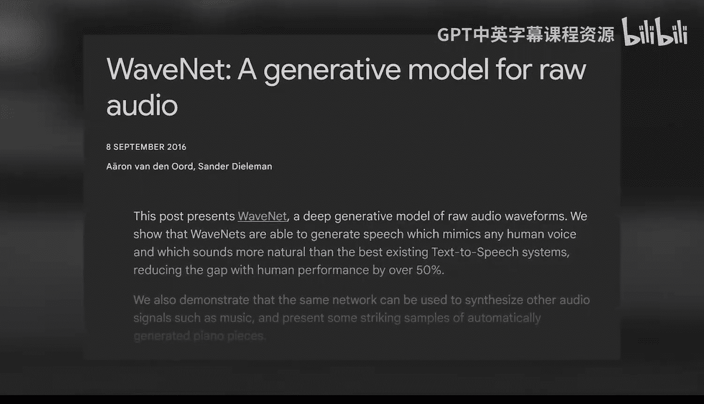

---

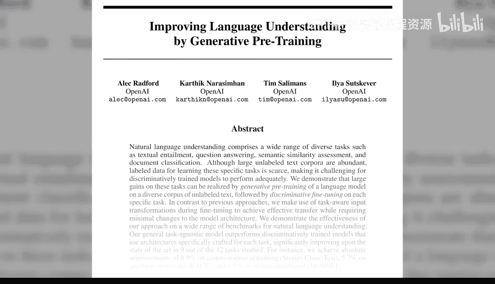

## 产品演进：从内部工具到公众产品 🚀

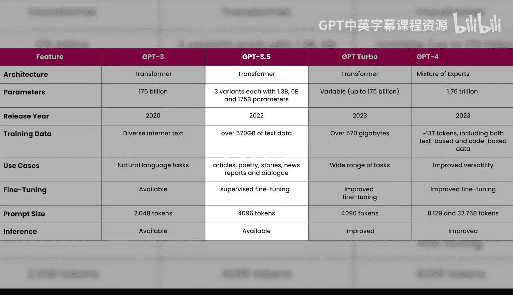

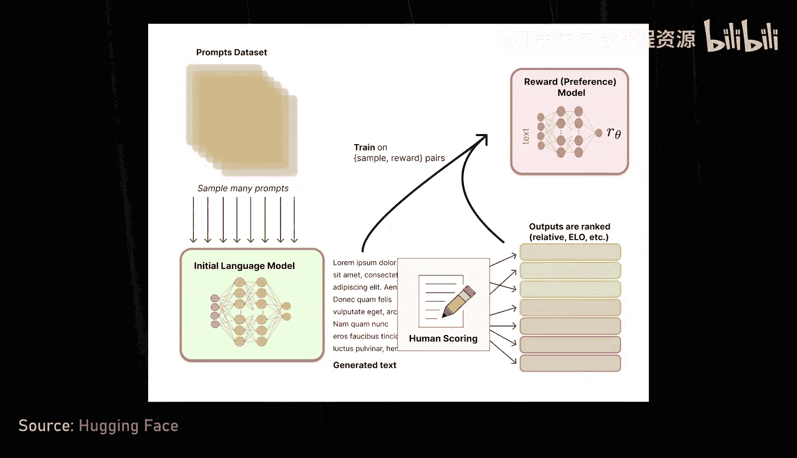

Perplexity 的诞生源于团队自身的需求。在创业初期，团队成员对许多事务（如为第一位员工办理健康保险）一无所知。他们发现，即使使用GPT-3.5这样的模型来回答问题，也无法判断答案是否正确，模型经常给出错误信息。

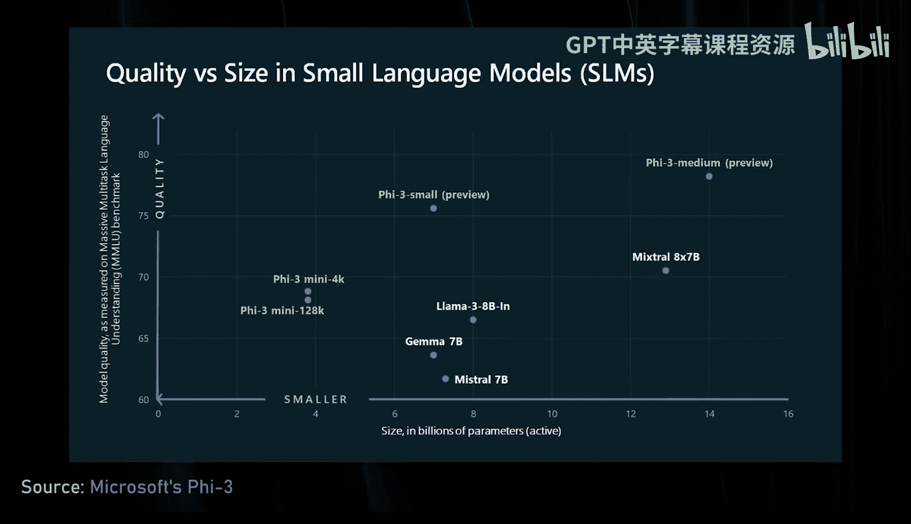

这促使他们回归学术根源，思考如何阻止模型“胡说八道”。他们意识到，这本质上就是维基百科的工作方式——任何编辑都需要有可靠的来源支持。因此，他们决定构建一个产品，将搜索的严谨性与LLM的叙事能力结合起来，确保答案的每一个部分都有据可查。

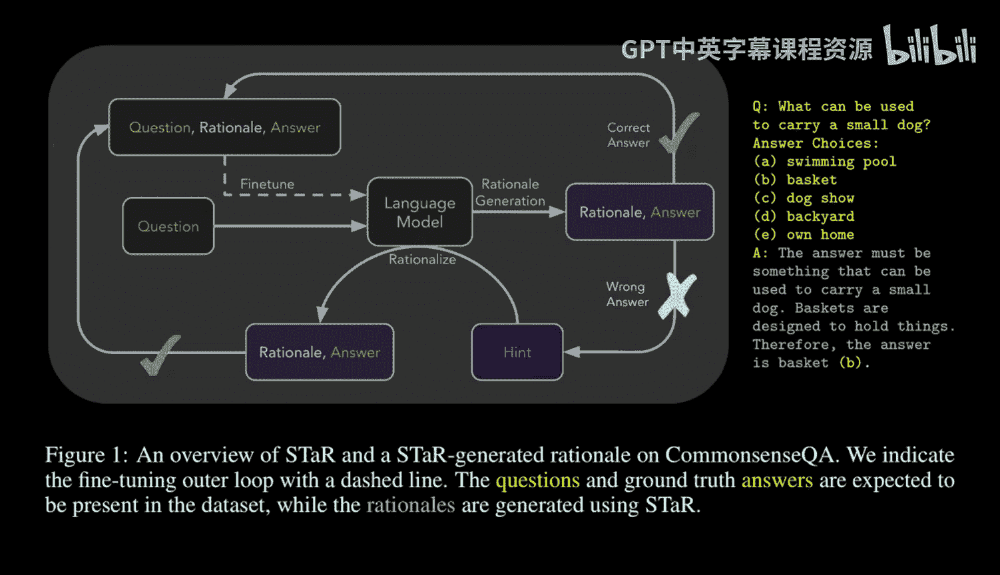

---

## 与Google的对比：答案引擎 vs. 搜索引擎 🔄

Aravind 强调，Perplexity 不仅仅是一个搜索引擎，更是一个“知识发现引擎”。关键在于，**获取答案并不是旅程的终点，而是起点**。

以下是Perplexity与传统搜索引擎（如Google）的一些关键区别：

*   **用户界面与体验**：
    *   Google 提供一个链接列表，用户需要自行点击和筛选。
    *   Perplexity 直接提供综合了多个来源信息的答案。
*   **技术方法**：
    *   Google 依赖复杂的排名算法（如PageRank）和关键词匹配。
    *   Perplexity 结合了传统检索（如BM25算法）和AI驱动的语义理解与生成。
*   **旅程延伸**：
    *   Perplexity 会在答案下方提供“相关问题”建议，引导用户进行更深层次的探索，满足人类无穷的好奇心。

这种设计鼓励用户从一个问题出发，不断挖掘新的相关知识，形成一个“好奇心驱动的探索循环”。

---

## 商业模式与未来挑战 💰

Google的核心商业模式是基于关键词竞价的广告（AdWords），这被认为是过去50年来最伟大的商业模式之一。然而，对于Perplexity这样的新产品，直接套用链接广告模式可能并不合适。

Aravind 认为，Perplexity 不需要追求成为像Google那样的“现金牛”。一个可持续的、良好的业务就足够了。未来的商业模式可能是混合的，例如结合订阅制和广告，但关键在于**不能以牺牲用户体验和答案的真实性为代价**。

集成广告的挑战在于，如何在不干扰用户寻求真相、不破坏产品信任感的前提下，有效地连接用户与信息源。理想的状态是广告高度相关，甚至让用户感觉不到在看广告。

---

## 技术挑战：幻觉与优化 🎯

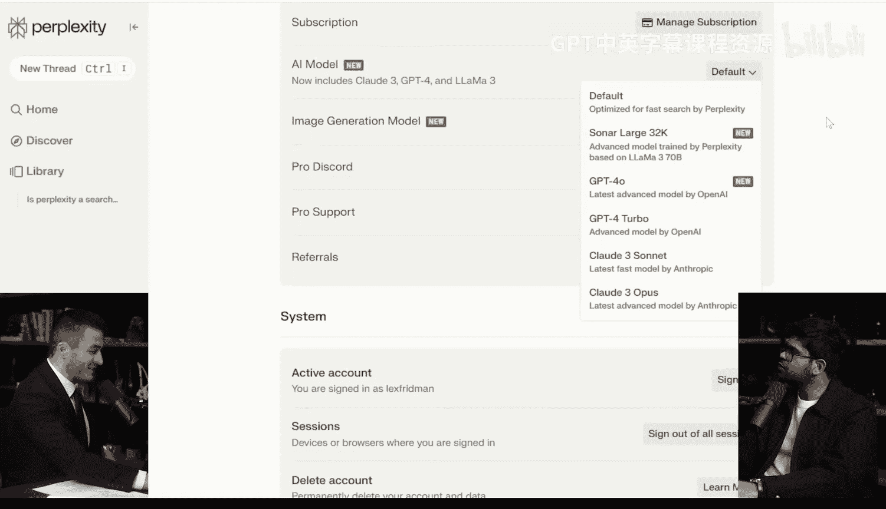

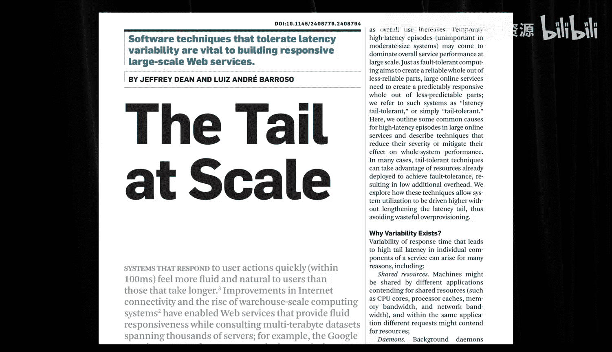

尽管Perplexity强制模型引用来源，但“幻觉”（即生成不准确或虚构信息）问题仍然可能通过多种途径发生：

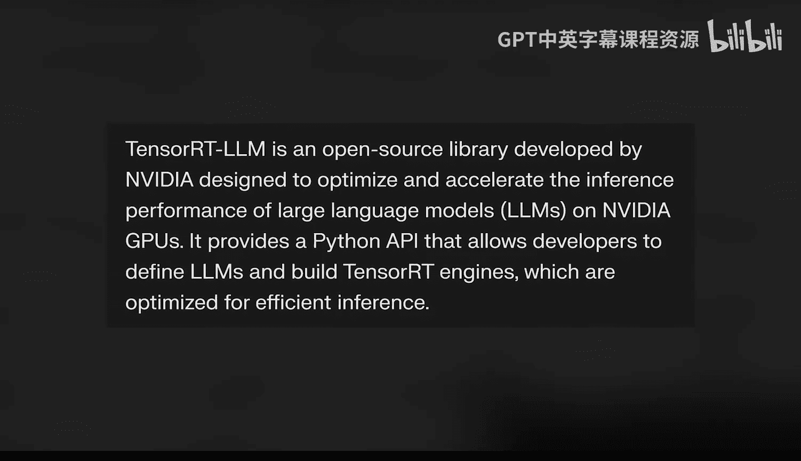

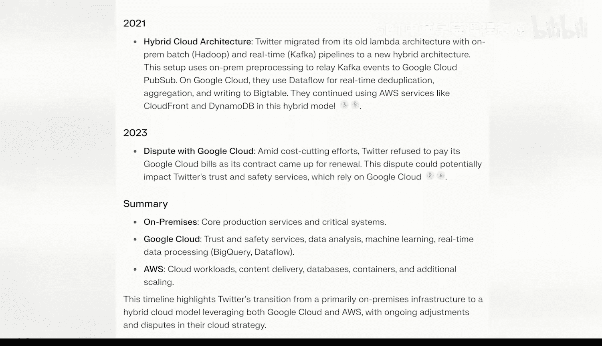

1.  **模型能力不足**：模型无法深度理解查询和段落的语义，导致答案不准确。
2.  **索引质量差**：检索到的文档信息过时、不完整或相互矛盾。
3.  **信息过载**：向模型输入了过多无关细节，干扰了其判断。
4.  **检索错误**：检索到的文档完全不相关（此时一个足够聪明的模型应该回答“我不知道”）。

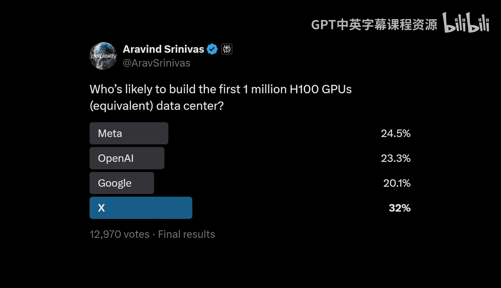

因此，减少幻觉需要从多个维度持续优化：提升模型本身的推理能力、改善检索和索引的新鲜度与质量、优化输入模型的信息片段。

---

## 对AGI与推理未来的展望 🌌

Aravind 探讨了人工智能未来的一个关键方向：**推理能力**。目前，模型通过海量计算和数据进行“预训练”来获取常识和知识，这有点像“闭卷考试”。但更高效的方式可能是让AI学会“开卷考试”——将事实记忆与推理能力解耦。

一个有趣的设想是：**能否与一个AI进行像与爱因斯坦或费曼那样的对话？** 你问一个难题，它说“我不知道”，但一周后，它经过大量研究回来，给出一个让你惊叹的答案。如果能够实现这种**随着推理计算量增加而答案质量显著提升**的能力，那将是“真正推理”的开始。

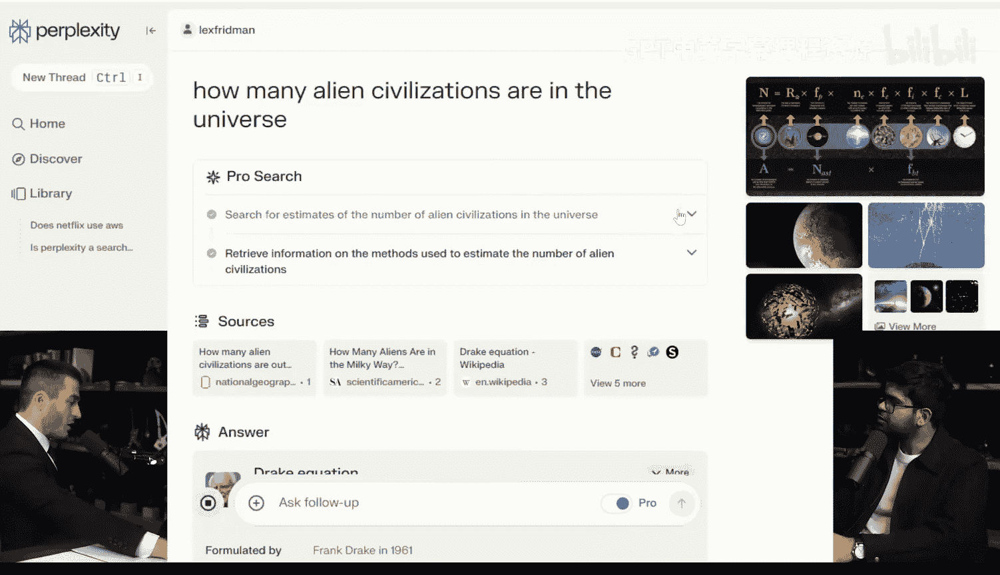

这指向了“自我引导推理”的研究方向，例如“思维链”提示和“STaR”（Self-Taught Reasoner）等方法，让模型能够生成解释自己推理过程的步骤，并通过这些步骤来训练自己，从而在数学、编码等任务上取得更好表现。如果这种能力能够泛化，将为实现更强大的AI智能体铺平道路。

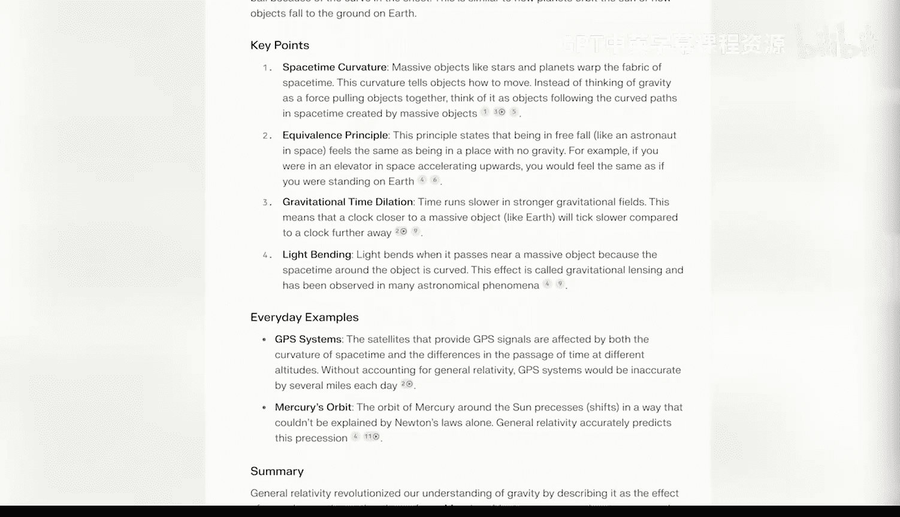

---

## 总结与启示 ✨

本节课中我们一起学习了Perplexity AI的核心理念与技术架构。关键要点包括：

*   Perplexity 是一个**答案引擎**，通过结合传统搜索和LLM，提供有引用的直接答案。
*   其设计哲学源于**学术严谨性**，强调每一句陈述都应有据可查。
*   它与Google等传统搜索引擎的区别在于**以答案和知识发现为中心**，而非链接列表。
*   面临的挑战包括减少幻觉、探索可持续的商业模式，以及应对“答案引擎优化”等新问题。
*   人工智能的未来可能在于**解耦记忆与推理**，发展出能够进行长期、深度思考的“开卷考试”式系统。

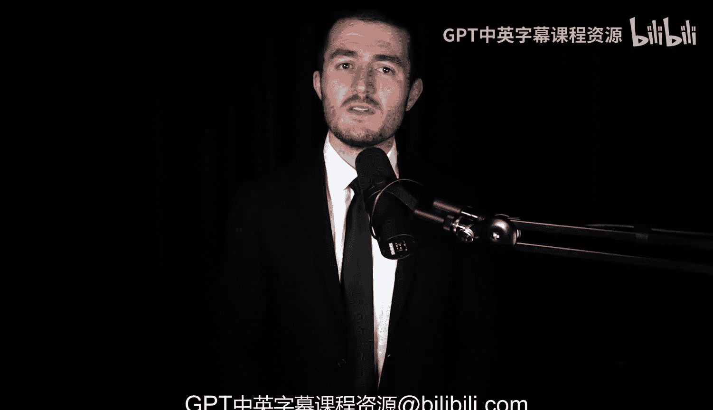

最终，Aravind 表达了一个乐观的愿景：AI 应该成为增强人类好奇心和求知欲的工具，帮助我们更好地理解世界、减少偏见、发现真理，从而引领我们走向一个知识无限扩展的未来。正如爱因斯坦所说：“重要的是不要停止提问。”