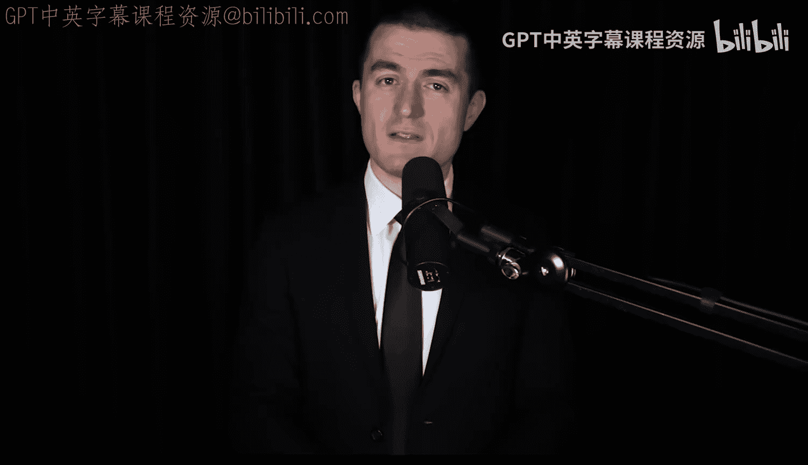
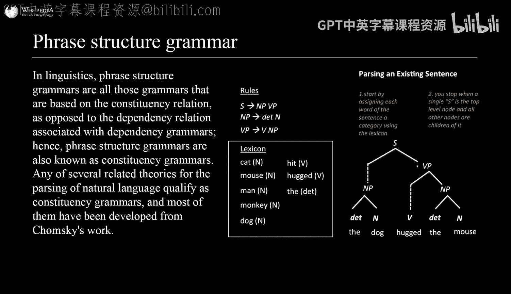
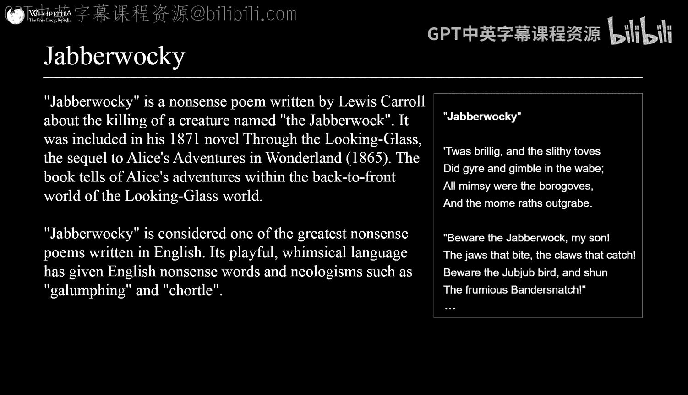
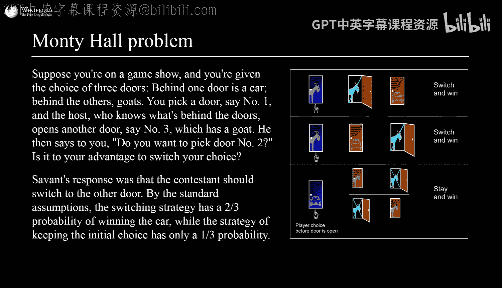

# 心理语言学与人类语言：第1部分：语言的形式、结构与认知处理

在本节课中，我们将学习人类语言的基本结构，特别是句法（语法）和依赖关系。我们将探讨为什么世界上的语言看起来各不相同，但又遵循一些普遍的规律。课程内容基于爱德华·吉布森（Ted Gibson）在Lex Fridman播客中的访谈，他是MIT的心理语言学教授和语言实验室负责人。

---

## 语言研究的起点：从数学到语言之谜

爱德华·吉布森最初是一名计算机科学家和数学家。他在本科学习计算机科学和数学后，偶然进入计算语言学领域，并从此将语言作为一个有趣的“工程难题”来研究。他认为，语言的“形式”（即词语如何组合）比“意义”更容易入手研究。

**过渡**：上一节我们介绍了吉布森如何从计算机科学转向语言研究。本节中，我们来看看他为什么认为研究语言的形式是一个好的起点。

## 语言形式的普遍规律：动词位置与介词/后置词

吉布森发现人类语言中存在一些迷人的普遍规律。例如，世界上大约40%的语言（如英语）是“主-谓-宾”语序，并且使用**介词**（如 `in`, `on`, `of`）。另外约45%的语言（如日语、印地语）是“主-宾-谓”语序，并使用**后置词**。这两种模式在各自语言内部是“和谐”的，即动词在宾语之前，介词也在名词之前；动词在宾语之后，后置词也在名词之后。

**公式表示**：
*   **SVO（主-谓-宾）语言**：`S + V + O` （如：The dog chased the cat.）
*   **SOV（主-宾-谓）语言**：`S + O + V` （如：Mary ball kicked.）

大约95%已知语序信息的语言都符合这种和谐模式。吉布森认为，这种模式背后的驱动力是为了**最小化词语之间的依赖距离**，使得生产和理解语言都更容易。

**过渡**：了解了语言在宏观语序上的规律后，我们需要深入理解“依赖关系”这个核心概念。

## 依赖语法：将句子视为树状结构

在吉布森看来，任何句子都可以被分解成一个**树状结构**，这被称为**依赖语法**。在这棵树中：
*   每个词（树叶）只依赖于另一个词。
*   有一个词是根节点，通常是主要动词。
*   词语之间的连接代表了语法和意义上的依赖关系。

例如，在句子“Two dogs entered the room.”中：
*   `entered` 是根节点。
*   `dogs` 依赖于 `entered`（主语）。
*   `two` 依赖于 `dogs`。
*   `room` 依赖于 `entered`（宾语）。
*   `the` 依赖于 `room`。

所有语言学家都同意句子可以表示为树，尽管他们对树的细节（如使用短语结构语法还是依赖语法）有不同看法。

**过渡**：既然句子可以表示为依赖树，一个自然的问题是：这种结构的认知代价是什么？

## 依赖距离与认知处理难度

依赖语法的优势在于，它清晰地展示了词语之间的**依赖距离**。吉布森的核心观点是：**依赖距离越长，生产和理解句子的认知成本就越高**。

例如，比较以下两个句子：
1.  The boy cried. （`boy` 和 `cried` 紧邻，依赖距离短）
2.  The boy who the cat scratched cried. （`boy` 和 `cried` 之间插入了从句，依赖距离变长）

第二个句子明显更难理解和产出。当进行**中心嵌套**（在一个依赖对中间插入另一个完整的从句）时，依赖距离变得极长，句子会变得几乎无法理解（如：The boy who the cat which the dog chased scratched ran away.）。

实验表明，无论是在理解度评分、阅读时间还是大脑语言网络的激活程度上，长依赖距离都对应着更高的认知负荷。吉布森猜测，这种成本可能是指数级增长的。

**过渡**：如果短依赖距离更高效，那么真实语言是否确实优化了这一点？让我们用数据来检验。

## 普遍性验证：所有语言都倾向于短依赖

吉布森的学生理查德·富特雷尔进行了一项研究。他们分析了约60种有依赖结构标注的语言文本。对于每种语言的每个句子，他们将其词语顺序随机打乱（同时保持依赖结构不交叉），生成许多“控制版本”的句子。

**研究结果**：在所有被研究的语言中，真实语言的**平均依赖长度都显著短于**随机打乱后的控制版本。这表明，**最小化依赖距离是跨语言的普遍倾向**，与具体的语序（SVO、SOV等）无关。

**过渡**：既然短依赖是普遍优势，为什么还会存在像“法律文书”这样难以理解的语言变体呢？

## 例外情况：法律文书的复杂性

法律文书（Legalese）是吉布森理论的一个显著例外。它之所以难以理解，研究发现主要不是因为使用生僻词或被动态，而是因为它大量使用了**中心嵌套结构**。

**数据对比**：
*   普通文本或学术文本：约20%-30%的句子包含中心嵌套。
*   法律合同文本：约70%的句子包含中心嵌套。

例如，法律条文中经常在主语和动词之间插入长长的定义，导致核心依赖关系被拉长。有趣的是，实验表明，即使是律师也更喜欢、更容易理解去除中心嵌套后的版本。吉布森提出“魔法咒语假说”，认为这种复杂形式可能作为一种“专业符号”而存在，但其起源尚不完全清楚。

**过渡**：从法律文书这个特例回到普遍原则，我们如何从更宏观的“沟通”角度理解语言形式？

## 沟通视角：噪声信道与语言优化

吉布森从信息论的角度思考语言。克劳德·香农提出了“噪声信道”模型：在沟通中，信息从说话者传递到听话者会经过一个有噪声的环境（如背景音、发音错误、听者分心）。

一种观点认为，语言的某些特征（如语序）可能被优化，以在噪声环境中更鲁棒地传递信息。例如，某种语序可能即使丢失部分词语，也能让听者更好地推测原意。不过，吉布森强调，与依赖距离的坚实证据相比，这是更具推测性的“合理故事”。

**过渡**：我们探讨了语言的形式和沟通功能。但语言和我们内心的“思维”是一回事吗？现代脑科学给出了惊人答案。

## 语言与思维的分离：脑科学证据

吉布森的妻子埃维·费德连科（也是MIT的神经科学家）的研究表明，大脑中存在一个**高度特化的语言网络**。这个网络在你理解或产出语言（无论是听、说还是读）时被激活。

**关键发现**：
1.  **语言网络独立于其他思维任务**：当人们进行非语言的高难度思维任务时（如空间记忆、音乐感知、数学计算、编程），这个语言网络**不会被激活**。这些任务会激活大脑其他区域（如“多重需求网络”）。
2.  **多语言共用同一网络**：如果你精通多种语言，它们都使用同一个语言网络。
3.  **脑损伤证据**：有些病人因中风导致语言网络严重受损，患上“完全性失语症”，他们无法理解或产出语言，但其他认知能力（如下棋、开车、做数学题）完全正常。

这些证据强烈表明，**语言是思维的一种表达工具，而非思维本身**。我们不一定用语言进行思考。

**过渡**：理解了人类语言与思维的关系后，我们可以看看当前最强大的语言形式模型——大语言模型（LLMs）。

## 大语言模型：擅长形式，而非意义？

吉布森认为，当前最好的语言形式理论可能就是大语言模型，因为它们能极其准确地预测什么是地道的语言。LLMs在捕捉语言形式规律方面表现惊人，甚至能复现人类在中心嵌套结构上的困难。

然而，LLMs在需要**深层意义理解**的任务上容易出错。例如，在改编版的“蒙提霍尔问题”中，即使前提条件改变（已知奖品确切位置），LLMs仍会机械地套用常见的“应该交换”的答案模式，显示出它缺乏真正的逻辑推理和世界模型。

这支持了吉布森的观点：LLMs极其擅长学习和生成语言**形式**，但可能并未真正理解语言背后的**意义**。这与大脑中语言网络独立于其他思维网络的现象有相似之处。

**过渡**：最后，让我们将视野放宽，看看文化如何塑造语言，以及语言反过来如何限制文化。

## 文化对语言的塑造：以皮拉罕人为例

吉布森研究了亚马逊雨林中的皮拉罕人。他们的语言挑战了一个普遍假设：所有人类语言都有精确计数词。

**惊人发现**：
*   皮拉罕语中没有表示“一、二、三”的精确数字词。
*   他们只有表示“少量”、“一些”、“许多”的近似量词。
*   因此，你无法用皮拉罕语说“给我两个那个东西”。

实验表明，皮拉罕人可以完美完成“一一对应”的匹配任务（这不需要计数），但在需要暂时记住一个集合数量（如被遮挡后复现）的任务中，超过4或5个物品时，他们就只能做近似匹配。这说明，**缺乏精确计数词，限制了他们执行某些需要精确记忆数量的认知操作**。

这体现了语言与文化的紧密关系：一个社群发明他们需要谈论的词语。皮拉罕人的生活方式可能不需要精确计数，因此没有发展出相应的词汇。而一旦有了这些词汇（如农业社会需要清点牲畜），它们又能开启新的认知和文化可能性。

---

## 总结

本节课我们一起学习了：
1.  **依赖语法**：将句子视为树状结构，其中词语通过依赖关系连接。
2.  **依赖距离最小化**：这是一个跨语言的普遍倾向，依赖距离越长，认知处理成本越高。
3.  **语言形式的普遍规律**：如动词位置与介词/后置词的和谐性。
4.  **语言与思维的分离**：脑科学证据表明，语言是独立的沟通模块，并非思维本身。
5.  **大语言模型的优势与局限**：它们极其擅长语言形式，但在意义理解和推理上仍有不足。
6.  **文化对语言的塑造**：以皮拉罕语为例，语言反映并可能限制一个文化的认知范畴。

吉布森的研究展示了一种从认知、计算和信息角度理解人类语言的强大路径，将语言视为一个为高效沟通而不断优化的、迷人的复杂系统。