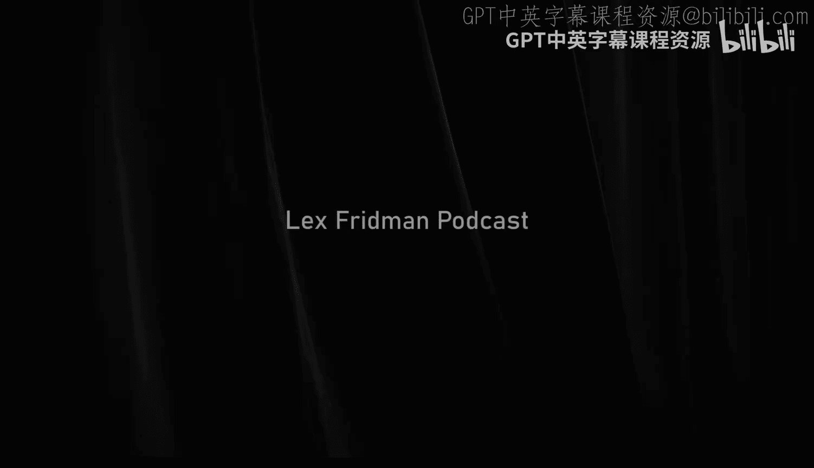
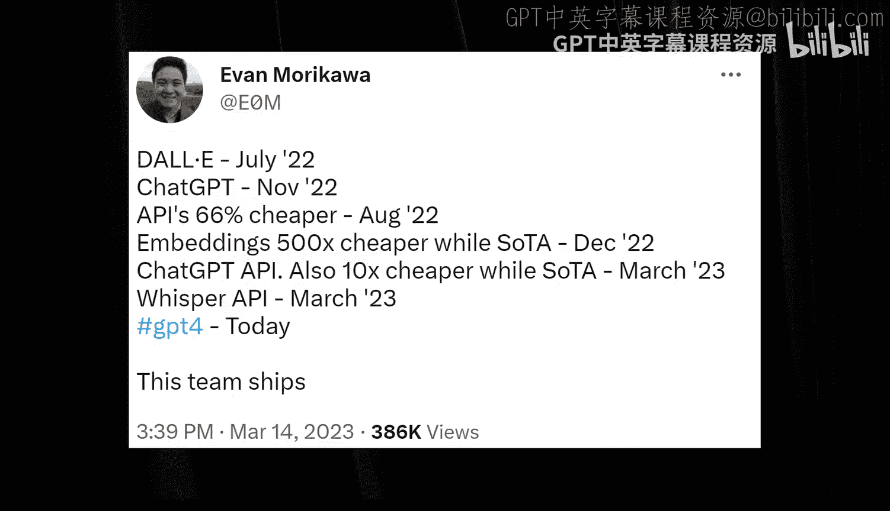

# Lex Fridman 播客 #367《Sam Altman OpenAI CEO：关于GPT-4, ChatGPT和AI的未来》中英字幕 - P1 - GPT中英字幕课程资源 - BV1kSkLBpEpL

## 课程概述：第1章：AI的黎明与OpenAI的诞生

在本节课中，我们将学习人工智能领域当前的关键时刻，特别是OpenAI及其CEO Sam Altman的视角。我们将探讨GPT-4、ChatGPT的工作原理、AI安全与对齐的挑战，以及AGI（通用人工智能）的未来可能性。课程内容基于Lex Fridman对Sam Altman的深度访谈整理而成，旨在为初学者提供一个清晰、全面的入门指南。

---

我们长期以来一直是一个被误解和严重嘲笑的机构，就像我们刚开始时那样。

我们在2015年底宣布成立这个组织，并说要致力于AGI的研究，当时人们认为我们完全疯了。

我记得当时，一家大型工业AI实验室的一位著名AI科学家，甚至一些记者都说：“这些人水平不怎么样，谈论AGI太荒谬了，真不敢相信你们还花时间关注他们。”当时这个领域对新来者说“我们要尝试构建AGI”充满了这种程度的狭隘和敌意。

所以，OpenAI和DeepMind是一小群勇敢到敢于谈论AGI、面对嘲笑的人。

我们现在被嘲笑的次数少多了。

---

以下是与Sam Altman的对话，他是OpenAI的CEO，这家公司背后有GPT-4、ChatGPT、DALL-E、Codex和许多其他AI技术。这些技术单独或共同构成了人工智能、计算乃至整个人类历史上一些最伟大的突破。

请允许我谈谈在人类文明历史的当前时刻，AI的可能性和危险性。

我相信这是一个关键时刻。我们站在根本性社会变革的边缘，虽然没人确切知道何时，但包括我在内的许多人相信，这将在我们有生之年发生。

人类物种的集体智慧，将在多个数量级上，开始显得不如我们构建和部署的大规模通用超级智能AI系统。

这既令人兴奋，又令人恐惧。令人兴奋是因为无数已知和未知的应用将赋能人类去创造、去繁荣、去摆脱当今世界普遍存在的贫困和苦难，并成功追求那古老而纯粹的人类目标——幸福。令人恐惧是因为超级智能的AGI所拥有的力量，无论有意无意，都可能摧毁人类文明。

这种力量可能以乔治·奥威尔《1984》中的极权主义方式扼杀人类精神，也可能以赫胥黎《美丽新世界》中享乐驱动的大众狂热方式出现。正如赫胥黎所见，人们会爱上压迫他们的东西，崇拜那些剥夺他们思考能力的技术。

这就是为什么现在与领导者、工程师、哲学家，无论是乐观主义者还是怀疑论者进行这些对话非常重要。这些不仅仅是关于AI的技术对话，更是关于权力的对话，关于部署、制衡这种权力的公司、机构和政治体系，关于激励这种权力安全并与人类对齐的分布式经济体系，关于部署AGI的工程师和领导者的心理，以及关于人性的历史、我们大规模行善或作恶的能力。

我非常荣幸能够认识并与许多现在在OpenAI工作的人进行过私下和公开的交流，包括Sam Altman、Greg Brockman、Ilya Sutskever、Wojciech Zaremba、Andrej Karpathy、Jakub Pachocki等许多人。Sam对我完全开放，愿意进行多次对话，包括具有挑战性的私下和公开交流，这对我来说意义重大。

我将继续这些对话，既庆祝AI社区令人难以置信的成就，也为各大公司和领导者做出的重大决策提供严谨的批评视角，始终以尽我微薄之力提供帮助为目标。如果我失败了，我会努力改进。😊，我爱你们所有人。这里是Lex Fridman播客，要支持它，请查看描述中的赞助商。现在，亲爱的朋友们，有请Sam Altman。

---

## 第2章：GPT-4的核心：是什么让它如此神奇？

上一节我们介绍了AI发展的关键时刻和OpenAI的创立背景。本节中，我们来看看GPT-4到底是什么，它是如何工作的，以及最令人惊叹的是什么。

从高层次来看，GPT-4是什么，它是如何工作的，最令人惊叹的是什么？

它是一个系统，未来我们回顾时会说它是一个非常早期的AI。它很慢，有漏洞，很多事情做得并不好，但最早的计算机也是如此。

它们仍然指明了通往我们生活中真正重要事物的道路，尽管这花了几十年的时间才发展起来。

你认为这是一个关键时刻吗？比如，50年后，当他们回顾早期系统时，哪个版本会被认为是真正的飞跃？在关于人工智能历史的维基百科页面上，他们会把哪个GPT版本标为里程碑？

这是个好问题。我倾向于将进步视为持续的指数曲线。我们很难说AI是从某个时刻从“没发生”变成“发生”的，我也很难精确指出单一事件。

历史书会写GPT-1、2、3、4还是7？这由他们决定。我不知道。

如果必须从我们目前所见中挑选某个时刻，我可能会选ChatGPT。你知道，重要的不是底层模型，而是它的可用性，包括RLHF和它的交互界面。

---

### 什么是ChatGPT？什么是RLHF？

RLHF代表**基于人类反馈的强化学习**。这个小小的魔法配料是什么，让这道菜变得如此美味？

我们使用大量文本数据训练这些模型，在这个过程中，它们学习到了关于文本中潜在表征的某些东西，并能做出惊人的事情。

但当你第一次使用我们称之为“基础模型”的那个版本时，它在评估测试上可能表现很好，能通过考试，里面有很多知识，但它并不非常有用，或者说至少不容易使用。

RLHF就是我们如何获取一些人类反馈的过程。最简单的版本是展示两个输出，询问哪个更好，人类评分者更喜欢哪个，然后通过强化学习将这些反馈输入模型。这个过程效果显著，在我看来，只需要**非常少的数据**就能让模型变得更有用。

所以，RLHF是我们如何让模型与人类希望它做的事情对齐的方法。

因此，有一个在巨大数据集上训练出来的大型语言模型，它包含了互联网上的背景智慧和知识。然后，通过这个过程添加一点点人类指导，就让它看起来如此强大。

也许只是因为它更容易使用，更容易得到你想要的东西，第一次就答对的几率更高，而**易用性**非常重要，即使基础能力之前就已经存在了。感觉它理解了你的问题，或者感觉你们在同一个频道上，它试图帮助你，这就是对齐的感觉。

是的，这可以是一个更技术性的术语。

你说这不需要太多数据，不需要太多人类监督。

公平地说，我们理解这部分科学还处于比最初创建这些大型预训练模型科学更早期的阶段。但没错，数据更少，少得多。

这很有趣。**人类指导的科学**，这是一门非常有趣的科学，也将是一门非常重要的科学，需要理解如何让它变得可用、明智、合乎道德，以及如何在我们所考虑的所有方面实现对齐。

这很重要：是哪些人类，以及整合这些人类反馈的过程是什么？你问人类什么？是让他们给事物排名吗？你让或要求人类关注哪些方面？这真的很有趣。

---

### 预训练数据集是什么？

预训练数据集是什么？你能大致谈谈这个数据集的庞大程度吗？

预训练数据集，我道歉，我们花了巨大的精力从许多不同的来源汇集数据。有很多开源信息数据库，我们通过合作伙伴关系获取资料，互联网上也有很多东西。我们很多工作就是构建一个高质量的数据集。

其中有多少是Reddit上的梗图子版块？不多，也许如果更多会更有趣。

所以，其中一些来自Reddit，一些来自新闻来源，比如大量的报纸，还有一般的网络内容。世界上的内容比大多数人想象的要多得多，是的，内容太多了。任务不是找东西，而是过滤掉东西，是的，没错。

---

### 成功的关键要素是什么？

这其中有什么秘诀吗？因为似乎有几个需要解决的组成部分：算法的设计（比如神经网络架构）、神经网络的规模、数据的选择，以及带有人类监督的方面（如RLHF）。

我认为，关于创造这个最终产品（比如制作GPT-4，我们实际发布的、你在ChatGPT中使用的版本）需要什么，有一点没有被很好地理解，那就是**所有部分必须协同工作**。

然后，我们必须在这个流程的每个阶段，要么想出新的想法，要么把现有想法执行得非常好。这其中涉及相当多的东西。所以，有很多问题需要解决。

你已经为GPT-4在博客文章和总体上说过，其中一些步骤已经趋于成熟，比如在进行完整训练之前就能预测模型的行为。

顺便说一句，这不是很了不起吗？就像有一条科学定律，让你能预测对于这些输入，另一端会输出什么，比如你可以预期的智能水平。这接近一门科学吗？还是仍然……

因为你用了“定律”和“科学”这些非常有雄心的词。接近吗？接近正确吗？准确吗？

是的，我会说它比我想象的要科学得多。你真的可以从一点点训练中就知道完全训练后的系统的独特特性。

就像任何新的科学分支一样，我们会发现不符合现有数据的新事物，必须提出更好的解释。这是科学发现的持续过程。但就我们现在所知，甚至我们在GPT-4博客文章中提到的，我认为我们都应该惊叹于我们竟然能在当前水平上进行预测，这太神奇了。

你可以观察一个一岁的婴儿，然后预测他SAT能考多少分吗？我不知道，似乎是等效的，但在这里，我们实际上可以详细审视系统的各个方面，从而进行预测。

---

## 第3章：模型的能力、智慧与对齐挑战

上一节我们探讨了GPT-4的核心工作原理和RLHF的重要性。本节中，我们来深入看看模型内部学到了什么，以及我们如何衡量和引导它的输出。

话虽如此，只是为了换个话题，他说GPT-4这个语言模型“学到”了某种东西。在科学和艺术等方面，OpenAI内部，像你、Ilya Sutskever和工程师们，是否对这个“东西”是什么有了越来越深的理解？还是它仍然是一种美丽而神秘的谜？

有很多不同的评估方法我们可以讨论。

什么是评估？哦，就是我们如何衡量一个模型，无论是在训练中还是训练后，比如它在某些任务集上表现如何。另外，稍微跑题一下，感谢你们开源了评估过程。是的，我认为那会非常有帮助。

但真正重要的是，我们投入了所有这些努力、金钱和时间到这个东西上，然后它产生的结果，对人们有多大的用处？给人们带来了多少快乐？在多大程度上帮助他们创造了一个更美好的世界、新的科学、新的产品、新的服务等等？😊，这才是最重要的。

对于一组特定的输入，理解它能给人们提供多少价值和效用，我认为我们在这方面理解得更好了。我们是否理解模型为什么做一件事而不是另一件事的一切原因？当然不，并不总是。但我会说我们正在越来越多地驱散战争迷雾，并且，我们投入了大量理解才制造出GPT-4，例如。但我甚至不确定我们是否能完全理解。

就像你说的，你只能通过提问来理解，因为它将所有网络内容压缩成少量参数，变成一个组织化的黑箱，里面是人类智慧。那是什么？人类知识，我们这么说吧。人类知识。这是个很好的区分。有区别吗？因为知识是事实，而智慧……我觉得GPT-4也可能充满智慧。从事实到智慧的飞跃是什么？

关于我们训练这些模型的方式，一件有趣的事情是，我怀疑太多的处理能力（暂时没有更好的词）被用于将模型当作数据库，而不是推理引擎。

这个系统真正令人惊奇的地方在于，对于某种定义下的推理（当然我们可以争论这个定义，对于许多定义这并不准确），它能够进行某种推理。也许学者、专家和Twitter上的键盘侠会说“不，它不能，你误用了这个词”等等。但我认为大多数使用过这个系统的人会说，好吧，它正在朝这个方向做些什么。

我认为这很了不起，也是最令人兴奋的事情。不知何故，通过吸收人类知识，它产生了这种推理能力，无论我们想怎么谈论它。在某些意义上，我认为这将是对人类智慧的补充；而在其他意义上，你可以用GPT-4做各种事情，然后说这里面似乎没有任何智慧。

至少在与人类的互动中，尤其是在处理多个问题的持续互动中，它似乎拥有智慧。所以我认为在ChatGPT方面，它说对话格式使得ChatGPT能够回答后续问题、承认错误、挑战不正确的前提并拒绝不适当的请求。但也有一种感觉，它似乎在为想法而挣扎。

是的，总是很容易过度拟人化这些东西，但我也有这种感觉。

也许我稍微跑个题，谈谈Jordan Peterson，他在Twitter上发布了一个政治类问题。每个人第一次问ChatGPT的问题都不同，对吧？你想尝试的不同方向，黑暗的东西，这多少能说明一些人的特点。

哦不，哦不，我们不必回顾我问了什么。我当然问数学问题，从不问任何黑暗的东西。但Jordan让它说一些关于现任总统乔·拜登和前总统唐纳德·特朗普的好话。

然后，他问GPT，作为后续问题，你生成的字符串有多长？他展示了包含拜登好话的回复比特朗普的长得多（或更长）。

Jordan要求系统：你能用相等长度、相等字符数的字符串重写吗？所有这些都让我觉得非常了不起，它理解了，但没能做到。

有趣的是，ChatGPT（我想是基于3.5版本）有点内省，是的，它似乎意识到自己没能正确完成工作。Jordan将其描述为ChatGPT在撒谎，并且知道自己在撒谎。

但这种描述是一种人类拟人化，我认为。但那种……GPT内部似乎在进行某种挣扎，去理解如何生成相同长度的文本，作为对一个问题的回答。还有，在一系列提示中，如何理解它之前失败了，在哪里成功了，所有这些并行的推理，看起来就像它在挣扎。

这里有两件独立的事情。第一，一些看起来应该显而易见且容易的事情，这些模型确实很挣扎。我还没看到这个具体例子，但计算字符数、计算单词数这类事情，对于这些按照当前架构构建的模型来说，很难做好，不会很准确。

第二，我们是在公开构建，我们发布技术是因为我们认为让世界尽早接触它很重要，可以塑造它的发展方向，帮助我们找到好的方面和坏的方面。每次我们发布一个新模型，我们这周在GPT-4上就真切感受到了这一点，外部世界的集体智慧和能力帮助我们发现了我们内部无法想象的事情，我们永远无法在内部完成。既有模型能做的新能力和很棒的事情，也有我们必须修复的真正弱点。所以，这种发布东西、发现好的部分和坏的部分、快速改进、让人们有时间感受技术并与我们一起塑造它、提供反馈的迭代过程，我们认为非常重要。

这样做的代价是公开构建的代价，即我们发布的东西会有严重的不完美。我们希望在风险还低的时候犯错，我们希望在每次迭代中越来越好。但像ChatGPT 3.5发布时的偏见，我肯定不为此感到自豪。它在GPT-4上已经好多了，许多批评者（我真的很尊重这一点）说，嘿，我在3.5上遇到的很多问题在4上好多了。但同样，没有两个人会同意任何一个单一模型在每个话题上都是无偏见的。我认为答案将是随着时间的推移，给用户更多个性化的、精细的控制。

关于这一点，我应该说我认识了Jordan Peterson，我试着和GPT-4谈论Jordan Peterson，我问它Jordan Peterson是不是法西斯主义者。首先，它给出了背景，描述了Jordan Peterson实际上是谁，他的职业生涯，心理学家等等。它指出，有一些人称Jordan Peterson为法西斯主义者，但这些说法没有事实依据。它描述了Jordan相信的一堆东西，比如他一直直言不讳地批评各种极权主义意识形态，他相信个人主义和各种与法西斯主义意识形态相矛盾的自由等等。它继续说了很多，真的很不错，最后总结起来就像一篇大学论文。我当时想，天哪。我希望这些模型能做的一件事，就是给世界带回一些细微差别。是的，它感觉真的很有细微差别。你知道，Twitter某种程度上摧毁了一些细微差别，也许我们现在可以找回一些了。这真的让我很兴奋。比如，我当然问了，新冠病毒是从实验室泄露的吗？答案再次非常细致。有两个假设，它描述了它们，描述了每个假设可用的数据量。这就像一股新鲜空气。

当我还是个小孩子的时候，我认为构建AI（当时我们并不真的称之为AGI）会是最酷的事情。我从未真正想过我有机会从事这项工作。但如果你告诉我，我不仅有机会从事这项工作，而且在制造了一个非常非常初级的AGI原型之后，我不得不花时间去做的事情，是试图与人争论它说某个人好话的字符数是否与说另一个人好话的字符数不同……如果你把AGI交到人们手中，而他们想做的就是这些，我不会相信你。但我现在更理解他们了。我对此也有同理心。

所以，你这句话的言外之意是，我们在重大事情上取得了如此巨大的飞跃，却抱怨或争论小事。

嗯，小事在总体上就是大事。所以我理解。只是，我……我也理解为什么这是一个如此重要的问题。这确实是一个非常重要的问题。但不知何故，我们……不知何故，我们纠结的是这件事，而不是比如这对我们的未来意味着什么。也许你会说，这对未来意味着什么至关重要，它说这个人的字符数比那个人多，谁来决定这个，如何决定，用户如何控制，也许这才是最重要的问题。但当我八岁的时候，我不会猜到这一点。

是的，我的意思是，OpenAI内部，包括你自己，确实有人看到了讨论这些议题的重要性，它们被归在AI安全这个大标题下。GPT-4发布时，这些方面谈论得不多。在安全考虑上投入了多少？在安全考虑上花了多长时间？你能谈谈那个过程吗？

当然，GPT-4发布时AI安全考虑投入了什么？我们在去年夏天完成后，立即开始让人们进行红队测试，我们开始自己做大量的内部安全评估，开始尝试研究不同的方法来对齐它。

这种内部和外部努力的结合，加上构建一系列新的方法来对齐模型，我们远未做到完美。但我关心的一件事是，我们的对齐程度增长速度要快于我们的能力进步速度。我认为随着时间的推移，这将变得越来越重要。

我知道，我认为我们在那里取得了合理的进展，得到了一个比以往任何时候都更对齐的系统。我认为这是我们发布的能力最强、对齐度最高的模型。我们能够对它进行大量测试，这需要时间。我完全理解人们为什么说“马上给我们GPT-4”。但我很高兴我们这样做了。

---

### 关于对齐过程的智慧与见解

关于这个过程，你学到了一些智慧或见解吗？比如如何解决对齐问题？

我想说清楚。我不认为我们已经发现了对齐一个超级强大系统的方法。我们有一些对我们当前规模有效的东西，叫做RLHF。

我们可以多谈谈它的好处和它提供的效用。它不仅仅是对齐，也许甚至主要不是对齐能力，它有助于制造一个更好的、更可用的系统。

这实际上是圈外人不怎么理解的一点。人们很容易把对齐和能力说成是正交的向量。它们非常接近。更好的对齐技术会带来更好的能力，反之亦然。有情况是不同的，而且是很重要的情况。但总体而言，我认为像RLHF或可解释性这些听起来像对齐问题的事情，也能帮助你制造能力更强的模型。这种区分比人们想象的要模糊得多。

所以在某种意义上，我们为了让GPT-4更安全、更对齐所做的工作，看起来非常类似于我们为解决与创建有用且强大模型相关的所有研究和工程问题所做的其他工作。

所以，RLHF是应用于整个系统的过程，人类基本上投票决定哪种说法更好。如果一个人问“我穿这条裙子显胖吗？”这个问题有不同的回答方式，这些方式与人类文明对齐。

没有一套单一的人类价值观，也没有一套对人类文明来说唯一正确的答案。

所以我认为将要发生的是，我们需要作为一个社会就非常广泛的界限达成一致。我们只能就这些系统能做什么的非常广泛的界限达成一致。然后在这些界限内，也许不同国家有不同的RLHF调整，当然个体用户也有非常不同的偏好。

我们在GPT-4上推出了一个叫做“系统消息”的东西