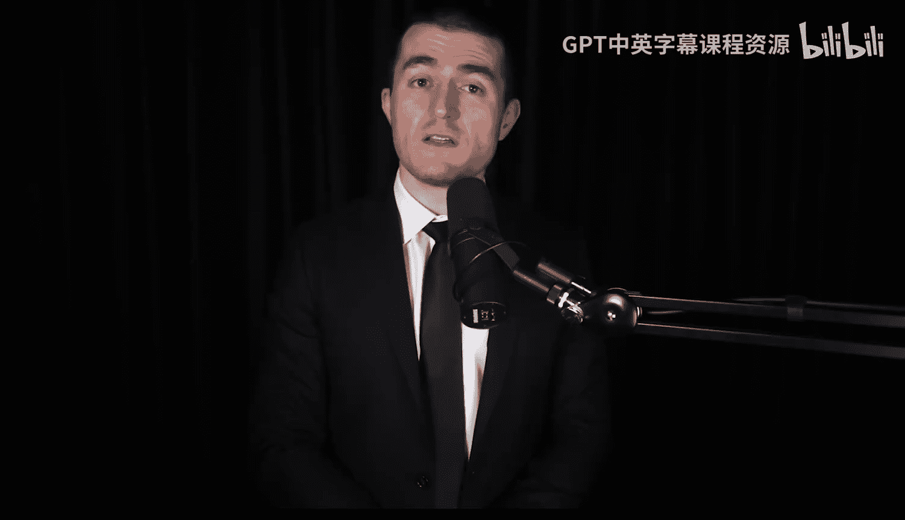
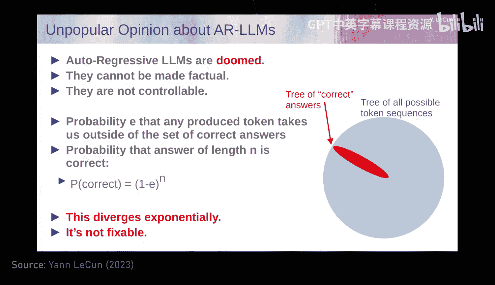
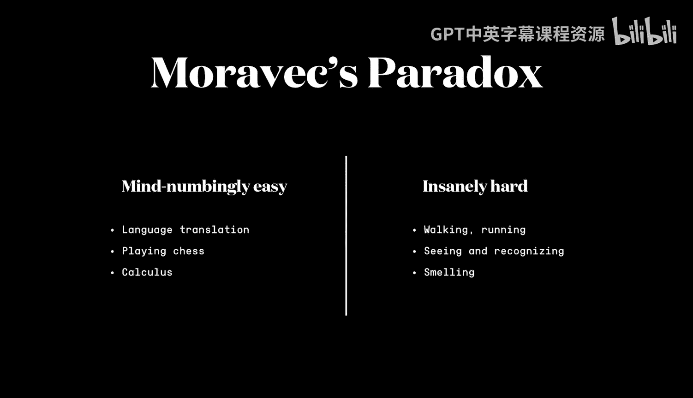
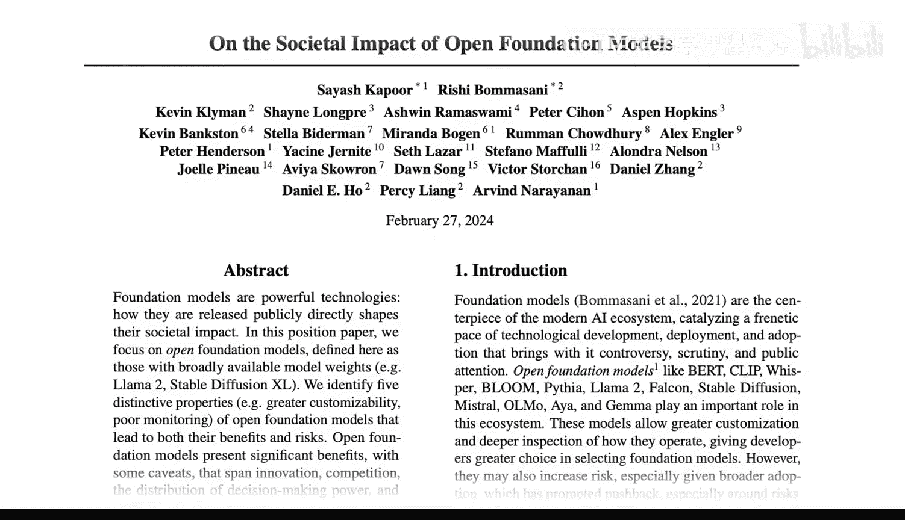
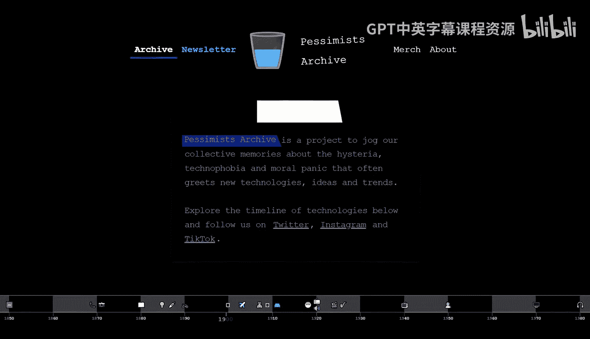
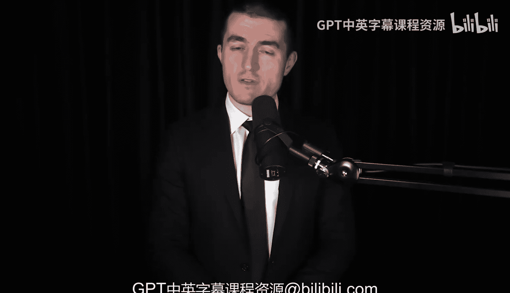

# 人工智能课程：第1章：杨立昆谈Meta AI、开源、LLM的局限、AGI与AI的未来

## 概述

在本节课中，我们将学习杨立昆（Yann LeCun）关于人工智能未来发展的核心观点。杨立昆是Meta的首席人工智能科学家、纽约大学教授、图灵奖得主，也是人工智能领域的奠基性人物之一。他深入探讨了当前大型语言模型的局限性、通往通用人工智能的可能路径，以及开源在塑造AI未来中的关键作用。

## 开源AI与权力集中

我认为，通过专有AI系统实现权力集中的危险性，远大于其他一切风险。

阻碍这一点的，是那些出于安全考虑，认为我们应该将AI系统锁起来，因为将其交到每个人手中过于危险的人。

那将导致一个非常糟糕的未来，我们所有的信息获取都将由少数几家拥有专有系统的公司控制。

我相信人性本善。AI，尤其是开源AI，可以让人变得更聪明。它只是放大了人性中的善。我认同这种感觉。

事实上，许多末日论者之所以是末日论者，正是因为他们不相信人性本善。

## 对话背景

以下是与杨立昆的对话。这是他第三次做客本播客。他是Meta的首席AI科学家、纽约大学教授、图灵奖得主，也是人工智能历史上的奠基性人物之一。他和Meta AI一直是AI开发开源的大力倡导者，并且身体力行，开源了他们许多最大的模型，包括Llama 2以及未来的Llama 3。同时，杨立昆也直言不讳地批评了AI社区中那些担忧通用人工智能（AGI）迫在眉睫的危险和生存威胁的人。

他相信AGI终有一天会被创造出来，但它会是好的。它不会逃脱人类的控制，也不会统治并杀死所有人类。在AI快速发展的当下，这多少算是一个有争议的立场。因此，看到杨立昆在网上参与许多激烈而有趣的讨论，是件很有趣的事。我们在这场对话中也是如此。

## 大型语言模型的局限性

你最近发表了一些关于人工智能未来的强烈声明，实际上在你的整个职业生涯中都是如此。你最近说过，自回归大型语言模型并不是我们通往超人类智能的道路。这些大型语言模型，比如GPT-4、Llama 2和3等等。它们是如何工作的？为什么它们不能带我们走完全程？

原因有很多。首先是智能行为的一些特征。

例如，理解世界的能力。理解物理世界的能力。记忆和检索事物的能力。持久记忆。推理的能力和规划的能力。这些是智能系统或实体的四个基本特征。

人类、动物都具备这些能力。大型语言模型一个也做不到。或者它们只能以非常原始的方式做到，它们并不真正理解物理世界，没有真正的持久记忆，不能真正推理，当然也不能规划。

所以，如果你期望一个系统在没有能力做这些事情的情况下变得智能，那你就错了。

这并不是说大型语言模型没有用，它们当然有用。也不是说它们不有趣，我们不能围绕它们构建一整套应用生态系统。我们当然可以。但是，作为通往人类水平智能的道路，它们缺少了必要的组成部分。

还有另一个我认为非常有趣的事实。这些大型语言模型是在海量文本上训练的，基本上是互联网上所有公开可用的文本，通常大约是10^13个令牌，每个令牌通常是两个字节，所以训练数据是2 * 10^13字节。如果你我每天阅读8小时，需要17万年才能读完。

这看起来像是这些系统可以积累的巨大知识量。

但如果你和发育心理学家交谈，他们会告诉你，一个四岁的孩子在他/她的生命中已经清醒了16,000小时。在这四年中，到达这个孩子视觉皮层的信息量大约是10^15字节。你可以通过估算视神经每秒传输大约20兆字节来计算这个数字。

所以，一个四岁孩子是10^15字节，而17万年的阅读量是2 * 10^13字节。这告诉我们，通过感官输入，我们接收到的信息比通过语言接收到的要多得多。尽管我们的直觉相反，我们学到的大部分知识，我们的大部分知识，是通过观察和与现实世界的互动获得的，而不是通过语言。我们在生命最初几年学到的一切，当然动物学到的一切，都与语言无关。

## 语言与物理世界的理解

也许需要反驳你所说的一些直觉。确实，进入人脑的数据量有几个数量级的差异。人脑能够多快地学习，以及多快地过滤数据。

有人可能会争辩说，你关于感官数据与语言的比较，语言已经是高度压缩的，它包含的信息量比存储它所需的比特数要多得多，尤其是与视觉数据相比。

所以语言中有很多智慧，有词汇以及我们组合它们的方式，它已经包含了很多信息。那么，是否有可能仅凭语言本身就包含了足够的智慧和知识，能够从中构建一个世界模型，理解世界，理解物理世界，而你却说所有大型语言模型都缺乏这种理解？

这是一个哲学家和认知科学家之间的大辩论，比如智能是否需要基于现实。我显然属于“是”的阵营，智能不能在没有基于某种现实的情况下出现，不一定需要物理现实，可以是模拟的，但环境比语言所能表达的丰富得多。语言是我们感知和心智模型的一种非常近似的表征。

我们完成的许多任务，我们操纵手头情境的心智模型，这与语言无关。所有物理的、机械的，当我们建造东西、完成任务时，比如抓取某物等，我们规划行动序列，我们通过想象一系列可能行动的结果来做到这一点。这需要与语言关系不大的心智模型。我认为，我们的大部分知识都源于与物理世界的这种互动。

因此，我的许多更关注计算机视觉等领域的同事，确实属于那个阵营，即AI本质上需要具身化。

然后，来自自然语言处理领域或有其他动机的人，可能不一定同意这一点，哲学家们也意见不一。

世界的复杂性很难想象，很难代表我们在现实世界中完全视为理所当然、甚至不认为需要智力的所有复杂性。这就是古老的莫拉维克悖论。来自机器人学家汉斯·莫拉维克，他说，为什么计算机似乎很容易完成高级复杂任务，如下棋、解积分等，而我们每天视为理所当然的事情，比如学开车、抓取物体，计算机却做不到。

我们有能通过律师资格考试的大型语言模型，所以它们一定很聪明，但它们不能像任何17岁的孩子那样在20小时内学会开车。它们不能像任何10岁的孩子那样，一次就学会清理餐桌并把餐具放进洗碗机。为什么会这样？我们缺少什么？我们缺少哪种学习或推理架构，基本上阻止了我们拥有五级自动驾驶汽车和家用机器人？

## 大型语言模型能否构建世界模型

一个大型语言模型能否构建一个知道如何开车、知道如何装洗碗机的世界模型，只是目前不知道如何处理视觉数据？

它可以在概念空间中操作。是的，很多人正在研究这个问题。简短的回答是：不能。

更复杂的答案是，你可以使用各种技巧让大型语言模型消化图像、视频或音频的视觉表征。一种经典的方法是，你以某种方式训练一个视觉系统。我们有很多训练视觉系统的方法，有监督的、自监督的等等。这会将任何图像转化为高级表征，基本上是一个令牌列表，与典型大型语言模型作为输入的令牌非常相似。然后你只需将其输入大型语言模型，连同文本一起。你期望大型语言模型在训练期间能够利用这些表征来帮助做出决策。我们沿着这些思路工作了很久，现在你看到了这些系统。有些大型语言模型有视觉扩展，但它们基本上是“黑客”，因为这些东西不是端到端训练的，不能真正理解世界，例如，它们没有用视频训练。它们目前至少不理解直观物理。

## 直观物理与常识推理

所以你认为，关于直观物理、关于物理空间的常识推理、关于物理现实，对你来说是一个巨大的飞跃，而大型语言模型就是做不到？我们无法用今天正在使用的这类架构做到这一点，原因有很多，但主要原因是大型语言模型的训练方式。

你取一段文本，去掉其中一些词，你掩盖它们，用空白标记替换它们，然后训练一个巨大的神经网络来预测缺失的词。如果你以特定的方式构建这个神经网络，使其只能看到它试图预测的词左边的词，那么你得到的基本上是一个试图预测文本中下一个词的系统。然后你可以给它一个提示文本，要求它预测下一个词。它永远无法精确预测下一个词，所以它会生成一个字典中所有可能词的概率分布。实际上，它预测的不是词，而是类似于子词单元的令牌。由于字典中只有有限数量的可能词，处理预测中的不确定性很容易。然后系统从该分布中挑选一个词。当然，挑选分布中概率较高的词的机会更大。所以你从该分布中采样以实际产生一个词。然后你将那个词移入输入。这允许系统预测第二个词，依此类推。这被称为自回归预测，这就是为什么这些大型语言模型应该被称为自回归大型语言模型，但我们只称它们为大型语言模型。

这种过程与我们说话时在产生一个词之前的过程之间存在差异。当你我说话时，你我都是双语者，我们会思考要说什么，这相对独立于我们将要用哪种语言来说。当我们谈论，比如一个数学概念时，我们正在进行的思考和计划要产生的答案，与我们用法语、俄语还是英语表达无关。所以你说在语言映射之前有一个更大的抽象？是的，它映射到语言上。

对于我们做的很多思考来说，这当然是正确的。你的思考在法语中和在英语中是一样的吗？差不多。这取决于思考的类型。如果是产生双关语，我在法语中比在英语中好得多。双关语有抽象表征吗？你的幽默是抽象的吗？当你发推文时，你的推文有时有点辛辣，在你大脑中映射到英语之前，推文有抽象表征吗？有一个关于想象读者反应的抽象表征。你从笑声开始，然后想办法让它发生，或者想引起某种反应，然后想办法说出来以引起那种反应。但这非常接近语言。但想想数学概念，或者想象你想用木头建造的东西。你正在进行的思考绝对与语言无关。不一定有特定语言的内心独白，你是在想象事物的心智模型。

所以，显然在我们进行大部分思考和规划时，存在一个更抽象的表示层次。如果输出是说出的话，我们会在产生之前规划我们要说什么。而大型语言模型不这样做。它们只是本能地一个接一个地产生词。这有点像潜意识行为，比如你分心了，正在做某事，完全集中注意力，有人来问你一个问题，你回答了问题，你没有时间思考答案，但答案很简单，所以你不需要注意，你自动回应。大型语言模型就是这样。它并不真正思考它的答案。它检索答案，因为它积累了很多知识，所以可以检索一些东西，但它会一个接一个地吐出答案，而不规划答案。

## 逐令牌生成的局限性

你只是逐令牌生成，一次生成一个令牌。这种生成方式注定是简单的。但如果世界模型足够复杂，那么一次一个令牌，它生成的最可能的东西，一个令牌序列，将是一个深刻的东西。但这假设系统实际上拥有一个世界模型。所以我认为根本问题是，你能构建一个真正完整的世界模型吗？不一定是完整的，但能深刻理解世界的世界模型。首先，你能通过预测来构建它吗？答案可能是“是”。你能通过预测词来构建它吗？答案很大程度上是“不能”。因为语言在信息方面非常贫乏，或者说带宽很低，那里没有足够的信息。

构建世界模型意味着观察世界，并理解世界为何以这种方式演化。世界模型的额外组成部分是，能够预测由于你可能采取的行动，世界将如何演化。所以世界模型实际上是：这是我对时间T世界状态的想法，这是我可能采取的行动。预测的时间T+1的世界状态是什么？这个世界的状态不需要代表关于世界的一切，它只需要代表足够多的、与这个行动规划相关的东西，但不一定是所有细节。

现在的问题是，你无法用生成模型做到这一点。一个生成模型在视频上训练，我们尝试这样做已经10年了。你取一段视频，向系统展示一段视频，然后要求它预测视频的剩余部分，基本上预测接下来会发生什么，一帧一帧地预测，就像自回归大型语言模型做的那样，但是针对视频。一个大型视频模型。这个想法已经存在很久了，在FAIR，我和一些同事已经尝试了大约10年。

你不能真正使用与大型语言模型相同的技巧，因为正如我所说，大型语言模型无法精确预测哪个词会跟随一个词序列，但可以预测词的概率分布。现在，对于视频，你必须做的是预测视频中所有可能帧的概率分布。我们不知道如何正确地做到这一点。我们不知道如何以有用的方式表示高维连续空间上的分布。这就是主要问题所在。

我们无法做到这一点的原因是，世界在信息方面比文本复杂和丰富得多。文本是离散的，视频是高维且连续的，有很多细节。如果我拍摄这个房间的视频，摄像机在平移，我无法预测当我平移时房间里会出现的一切。系统无法预测摄像机旋转时房间里会出现什么。也许它会预测这是一个有灯、有墙的房间，但它无法预测墙上的画是什么样子，或者沙发的纹理是什么样子，当然也无法预测地毯的纹理。所以没有办法预测所有这些细节。

处理这个问题的一种可能方法是，我们长期研究的一种方法是，拥有一个具有潜在变量的模型。这个潜在变量被输入神经网络，它应该代表你尚未感知但需要补充给系统以使其在预测像素（包括地毯、沙发和墙上绘画的精细纹理）方面表现良好的所有世界信息。这基本上完全失败了，我们尝试了很多东西。我们尝试了直接的神经网络，尝试了GANs，尝试了VAEs，各种变分自编码器，尝试了很多东西。

我们也尝试了这些方法来学习图像或视频的良好表征，然后用作图像分类系统等的输入。这也基本上失败了。所有试图从图像的损坏版本预测图像缺失部分或视频的系统，基本上都失败了。所以，你取一张图像或一段视频，以某种方式损坏或转换它，然后尝试从损坏的版本重建完整的视频或图像，然后希望系统内部能发展出可用于物体识别、分割等的良好图像表征。这基本上完全失败了。

## 联合嵌入架构

这对文本效果很好。这就是大型语言模型使用的原理。那么失败到底在哪里？很难形成图像的良好表征，良好是指嵌入图像中所有重要信息的良好嵌入。失败的原因是什么？首先，我必须确切地告诉你什么不起作用，因为有别的东西起作用。不起作用的是通过训练系统从损坏版本重建良好图像来学习图像表征。我们有一整套技术用于此，是各种变分自编码器的变体，比如我在FAIR的同事开发的MAE（掩码自编码器）。这基本上类似于大型语言模型，你通过损坏文本来训练系统，只不过你损坏的是图像，你从中移除一些块，然后训练一个巨大的神经网络来重建。你得到的特征并不好，它们不好是因为如果你用有标签数据、图像的文本描述等监督训练相同的架构，你会得到更好的表征，并且在识别任务上的性能要好得多。所以架构是好的，编码器的架构是好的，但训练系统重建图像并不会导致它在自监督训练（通过重建进行自监督）时产生良好的通用图像特征。

那么替代方案是什么？替代方案是联合嵌入。什么是联合嵌入？你对这些架构如此兴奋的是什么？现在，不是训练一个系统来编码图像，然后训练它从损坏版本重建完整图像，而是取完整图像，取损坏或转换后的版本，将它们都通过编码器运行（编码器通常是相同的，但不一定）。然后你在这些编码器之上训练一个预测器，以从损坏版本的表示预测完整输入的表示。所以是联合嵌入，因为你取完整输入和损坏或转换版本，将它们都通过编码器运行，得到一个联合嵌入，然后你说我能从损坏版本的表示预测完整版本的表示吗？我称之为JEPA（联合嵌入预测架构），因为这是联合嵌入，并且有一个预测器从“坏家伙”预测“好家伙”的表示。

大问题是如何训练这样的东西？直到五六年前，我们对于如何训练这些东西没有特别好的答案，除了一个叫做对比学习的方法。对比学习的想法是，你取一对图像，一张图像和它的损坏版本、降级版本或以某种方式转换的版本。你训练预测的表示与完整图像的表示相同。如果你只这样做，系统会崩溃，它基本上完全忽略输入并产生恒定的表示。对比方法通过同时展示你知道不同的图像对来避免这种情况，然后你推开这些表示，使它们不同。这可以防止崩溃，但有一些局限性。过去六七年出现了一系列技术可以改进这类方法，有些来自FAIR，有些来自谷歌和其他地方。

但对比方法有局限性。过去三四年发生的变化是，现在我们有了非对比方法。它们不需要那些我们知道不同的图像的负对比样本。你只使用你知道是同一事物的不同版本或不同视图的图像，并依赖其他技巧来防止系统崩溃。我们现在有半打不同的方法用于此。

## 联合嵌入架构与大型语言模型的根本区别

联合嵌入架构和大型语言模型之间的根本区别是什么？JEPA能带我们走向AGI吗？我们是否可以说你不喜欢AGI这个术语，我们可能会争论。我认为每次和你交谈，我们都会争论AGI中的“G”。我理解，我理解。我们可能会继续争论。你喜欢法语，我想在法语中是“朋友”，AMI代表高级机器智能。但无论如何，JEPA能带我们走向那种高级机器智能吗？这是第一步。

首先，与生成架构（如大型语言模型）的区别是什么？大型语言模型或通过重建训练的视觉系统会生成输入。它们生成原始的、未损坏、未转换的输入。你必须预测所有像素。系统花费大量资源来实际预测所有这些像素、所有细节。在JEPA中，你不是试图预测所有像素，你只试图预测输入的抽象表示。这在很多方面要容易得多。

所以，JEPA系统在训练时试图做的是，从输入中提取尽可能多的信息，但只提取相对容易预测的信息。世界上有很多我们无法预测的东西，例如，一辆自动驾驶汽车在路上行驶。道路周围可能有树。可能是有风的日子，所以树上的叶子以半混沌的随机方式移动，你无法预测，你也不关心预测。所以你希望你的编码器基本上消除所有这些细节。它会告诉你那里有移动的叶子，但不会保留具体发生了什么细节。当你在表示空间中进行预测时，你不必预测每一片叶子的每一个像素。这不仅简单得多，而且允许系统本质上学习世界的抽象表示，其中可以建模和预测的东西被保留，其余的被视为噪声并被编码器消除。所以它提升了表示的抽象层次。

想想看，我们绝对一直在这样做。每当我们描述一个现象时，我们都是在特定的抽象层次上描述它。我们并不总是用量子场论来描述每一个自然现象，那是不可能的。我们有多个抽象层次来描述世界上发生的事情，从量子场论到原子理论、分子、化学、材料，一直到现实世界中的具体物体等等。我们不能只在最低层次上建模一切。JEPA的理念正是关于以自监督的方式学习抽象表示，你也可以分层进行。

我认为这是智能系统的一个必要组成部分。在语言中，我们可以不用这样做，因为语言在某种程度上已经是抽象的，并且已经消除了很多不可预测的信息。所以我们可以不用做JEPA，不用提升抽象层次，而直接预测词。

## 联合嵌入与语言模型的结合

联合嵌入仍然具有生成性，但它在抽象表示空间中生成。你说在语言方面我们很懒，因为我们已经免费得到了抽象表示。现在我们必须退一步思考通用智能系统，我们必须处理物理现实的全部复杂性，你必须做这一步，从丰富详细的现实跳跃到基于该现实的抽象表示，然后才能进行推理等等。事实是，这些通过预测进行自监督的算法，即使在表示空间中，如果输入数据冗余度更高，它们会学到更多概念。数据中的冗余越多，它们就越能捕捉其内部结构。

因此，感知输入（如视觉）中的冗余和结构比文本多得多，文本的冗余度远没有那么高