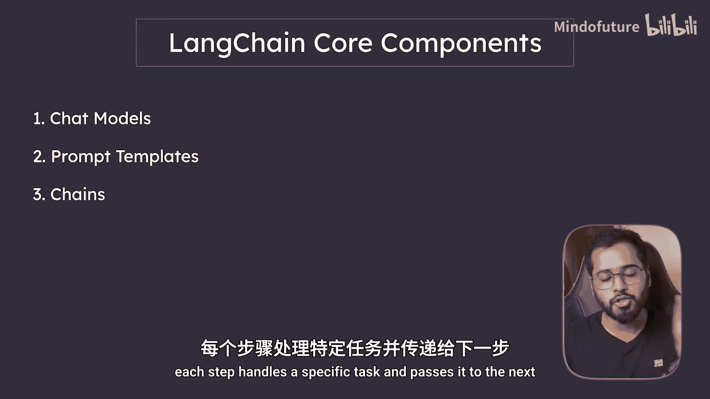
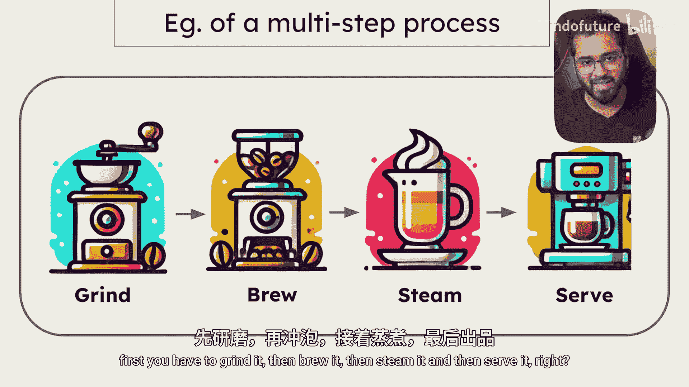
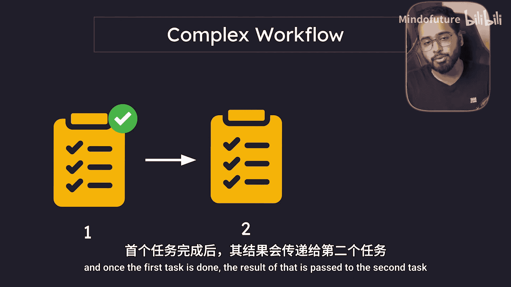
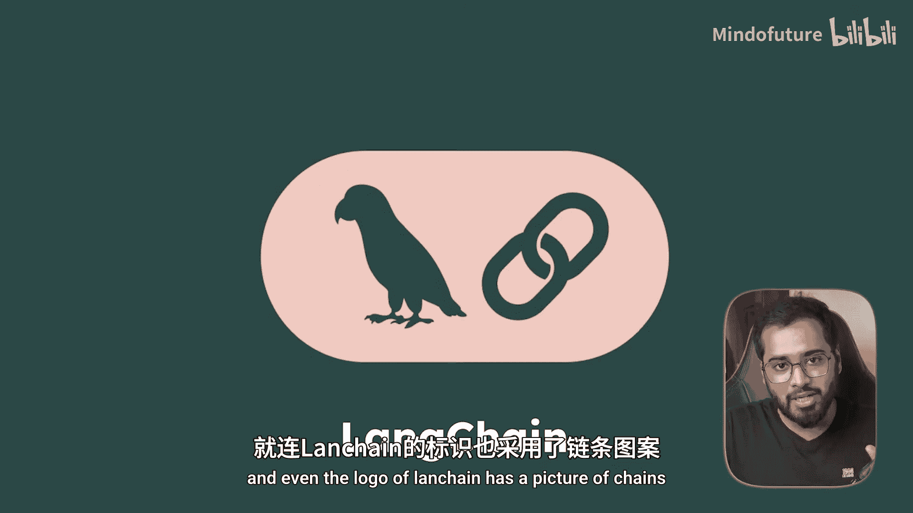
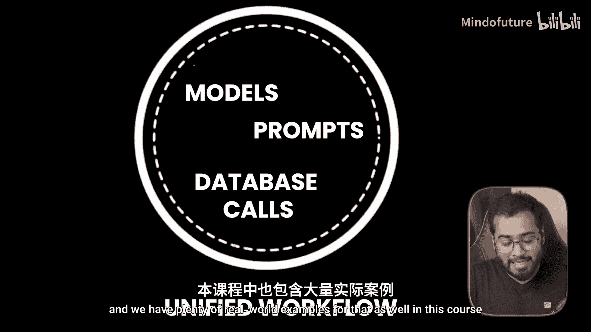
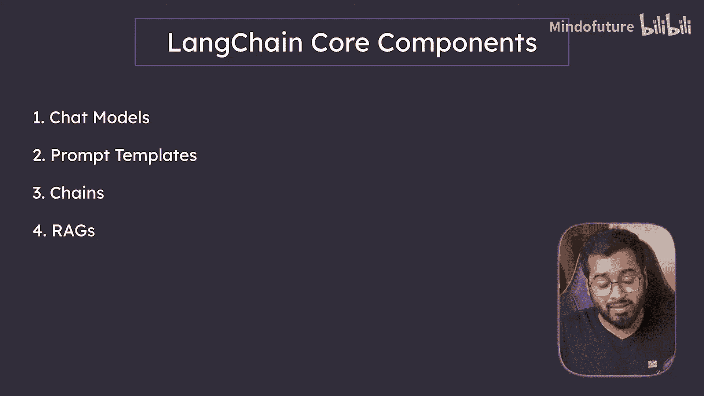
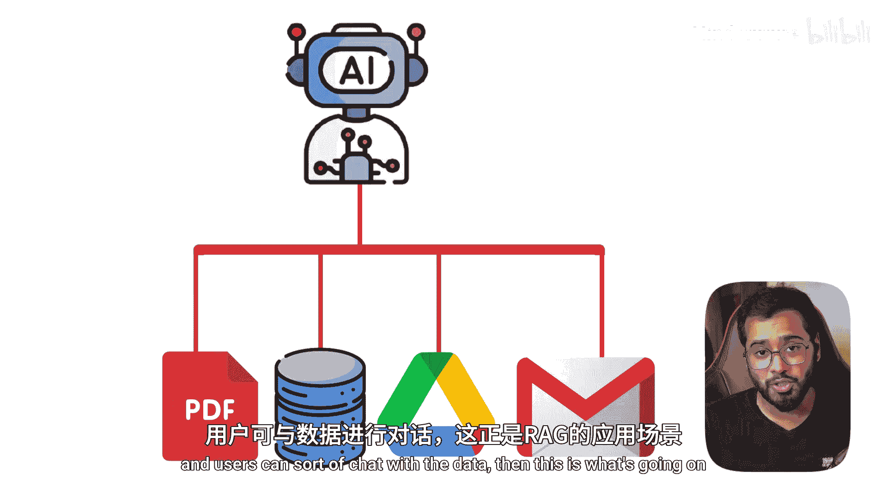
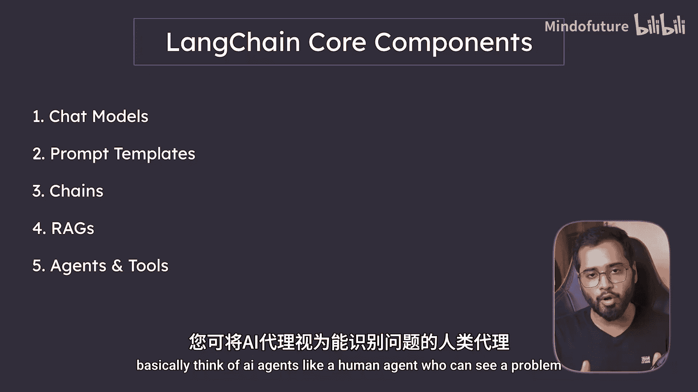
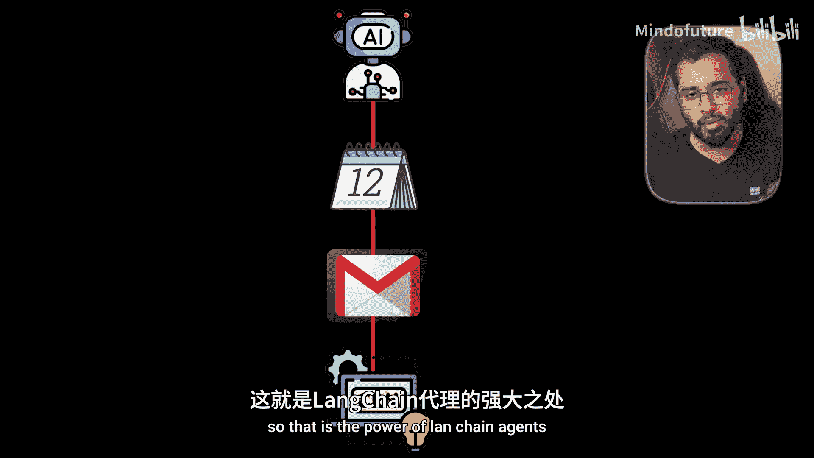

# 002：课程概述 🗺️

在本节课中，我们将要学习Langchain课程的整体结构与核心内容。我们将了解课程涵盖的五大核心组件，并理解它们如何协同工作以构建强大的AI应用。

## 课程内容概览

首先，我们将探讨什么是Langchain，为什么需要使用它，以及它实际解决了什么问题。

接着，我们将设置Python开发环境，以便能够开始使用Langchain并与各种API进行交互。

环境设置完成后，我们将深入探讨Langchain的核心组件。

## 核心组件详解

以下是本课程将要深入学习的五大核心组件。

### 1. 聊天模型

我们将从聊天模型开始。这意味着我们将学习如何与OpenAI、Claude等聊天模型进行基础交互。

### 2. 提示模板

Langchain的第二个核心组件是提示模板。其基本思想是将发送给AI的提示制作成模板，并在其中加入占位符，以便接收动态输入的值。

### 3. 链

下一个组件从这里开始变得非常有趣。Langchain的第三个组件是链。链在Langchain中就像一条装配线。😊

每个步骤处理一个特定任务，并将其传递给下一个步骤。这里有一个现实世界的例子。

想象一下制作咖啡的链条。首先，你需要研磨咖啡豆，然后冲泡，接着打奶泡，最后端上咖啡。我们在Langchain中所做的正是如此。

因此，如果有一个复杂的工作流程，我们会将其分解为更小的任务。第一个任务完成后，其结果会传递给第二个任务。这正是它被称为“链”的原因，甚至Langchain的Logo也包含链条的图案，因为它将模型、聊天模型、提示、数据库调用等各种过程链接成一个统一的工作流。本课程中也有许多相关的现实案例。

### 4. RAG（检索增强生成）

这是课程中一个非常重要的部分。它是帮助企业提升生产力的关键技术之一。

如果你听说过基于公司私有数据（数据形式可以是PDF、数据库等）训练的定制聊天机器人，并且用户可以与之“对话”，那么背后使用的就是RAG，即检索增强生成技术。

### 5. 智能体与工具

最后，我们将以Langchain的另一个关键组件——智能体与工具来结束本课程。你可以将AI智能体想象成一个人类代理，它能够看到问题，并使用各种工具来解决特定问题。

它可以与API交互、自动发送邮件、从网站抓取数据、运行Python脚本，甚至查询数据库。我举个例子：想象一个AI智能体接到预订会议的任务，就像人类一样。它可以检查你的日历、发送邮件邀请、同时更新CRM系统，这一切都是自动完成的。这就是Langchain智能体的能力，它们能为每一步选择并使用正确的工具。

## 学习建议

这里有一个快速提示：如果你想先获得完整的概览，可以尝试以两倍速观看整个课程，然后再回过头来专注于你最需要的部分。我就是这样学习的，因为它让我先看到了全局，并理解各部分是如何组合在一起的。

在下一节中，我们将探讨什么是Langchain，以及我们为什么需要它。

本节课中，我们一起学习了Langchain 2025入门课程的整体框架，明确了即将深入学习的五大核心组件：聊天模型、提示模板、链、RAG以及智能体与工具，并了解了它们如何构成构建AI应用的基础。