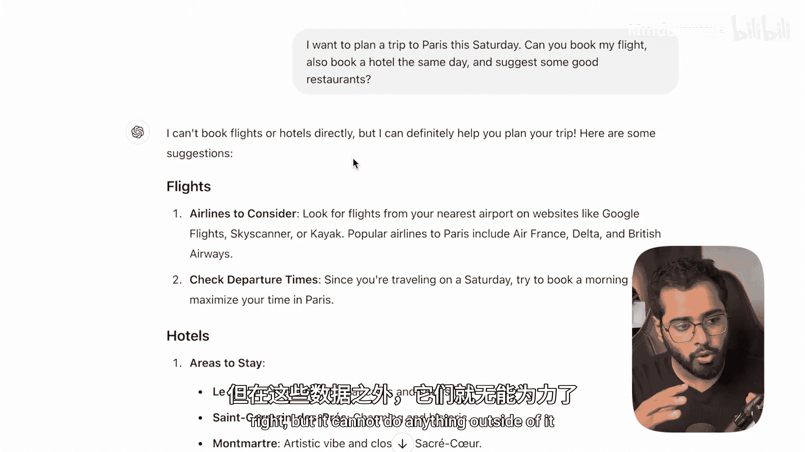
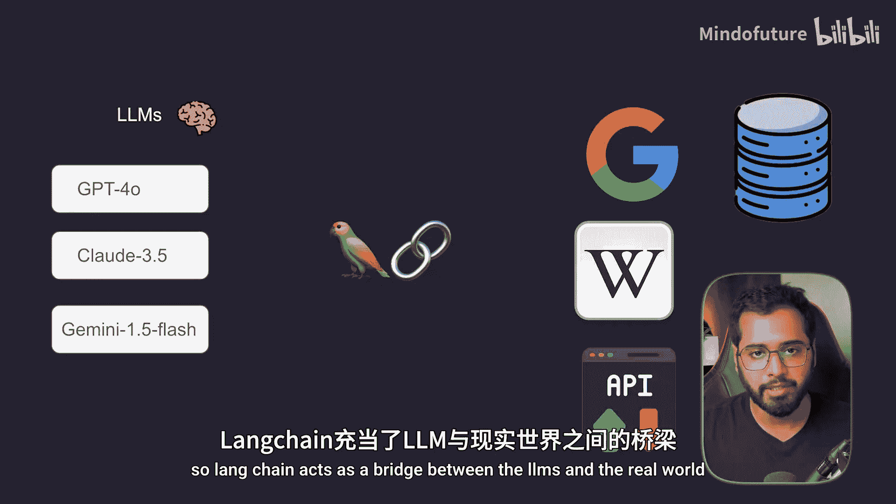
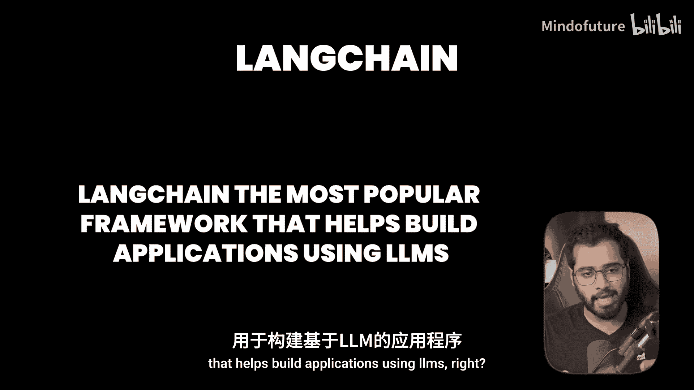
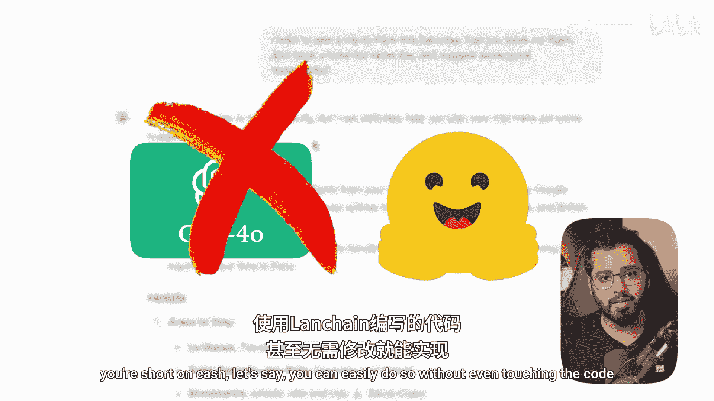
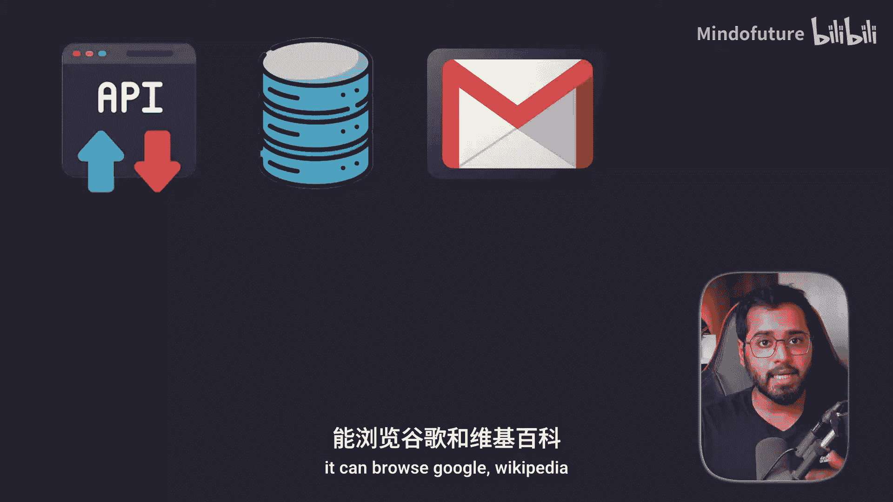

# 003：什么是LangChain

在本节课中，我们将要学习LangChain是什么，理解它如何作为大型语言模型（LLM）与现实世界之间的桥梁，以及为什么它在构建AI应用时如此重要。

## 概述：从现实问题出发

为了理解LangChain是什么，让我们从一个简单的问题开始。

想象一下，你想规划一次假期，并希望向ChatGPT寻求帮助。你可能会输入：“我想本周六去巴黎旅行，你能帮我订机票吗？同时预订同一天的酒店，并推荐一些好餐厅。”

在按下回车键之前，让我们看看幕后会发生什么。当你按下回车键，这个查询会被发送给一个LLM模型。ChatGPT这类应用可能使用多种模型，例如GPT-3.5、GPT-4、Claude等。这些就是你在右侧看到的大型语言模型。ChatGPT应用本身只是一个面向用户的界面。

## LLM的局限性

现在，让我们看看实际会发生什么。模型可能会回复：“我无法直接进行预订，但我可以帮你规划。” 这是大型语言模型最大的局限性之一：它们很聪明，可以讨论旅行，但无法真正与现实世界互动。

LLM本身只是“大脑”。它们可以在特定数据上进行训练并进行推理，但无法在此范围之外执行任何操作。例如，它不能直接调用预订API或发送邮件。

## LangChain的桥梁作用

假设你想构建一个应用，它既需要具备LLM的推理能力，又需要能够与现实世界通信，例如与API、数据库交互或发送邮件。为了实现这一点，我们需要一个位于中间的框架。这就是LangChain发挥作用的地方。

**LangChain充当了LLM与现实世界之间的桥梁。**

简单来说，LangChain是目前最流行的、用于帮助构建基于LLM的应用程序的框架。

## LangChain的核心优势

以下是LangChain提供的主要优势：

1.  **标准化接口**：它为不同的LLM（如OpenAI、Anthropic、Hugging Face的模型）提供了一个统一的调用接口。这意味着你可以轻松切换底层模型，而无需重写大量代码。
    *代码示例*：`llm = ChatOpenAI(model="gpt-4")` 可以轻松替换为 `llm = ChatHuggingFace(model="mistral-7b")`。

2.  **模块化组件**：LangChain将复杂应用拆分为可重用的模块，例如提示模板、记忆模块、检索器和输出解析器。

3.  **“链”式编排**：它允许你将多个步骤（调用LLM、查询数据、处理结果）连接成一个可执行的“链”（Chain），从而构建复杂的工作流。

4.  **代理（Agent）能力**：这是LangChain最强大的功能之一。代理可以理解目标，并自主决定调用哪些工具（如搜索引擎、计算器、API）来完成任务，从而让AI能够在现实世界中行动。

## LangChain的赋能实例

通过LangChain，我们正在开发的AI可以在现实世界中做更多事情。以下是一些例子：

*   它可以访问众多API，例如从Booking.com或OpenTable.com获取航班和餐厅预订信息。
*   它可以访问私有公司数据库来回答客户查询。
*   它可以发送电子邮件。
*   它可以浏览谷歌、维基百科。
*   它可以抓取网站信息，以及完成更多任务。

因此，LangChain不仅仅是让AI变得更聪明，它赋予了AI在现实世界中行动的能力。这只是一个非常小的例子，随着课程的深入，我们将探索更多的用例。

## 总结

本节课中，我们一起学习了LangChain的核心概念。我们了解到，LLM本身存在无法与现实世界交互的局限性。LangChain作为一个框架，通过提供标准化接口、模块化组件和强大的代理能力，在LLM与现实世界之间架起了桥梁。它使开发者能够构建出不仅能够思考，更能够行动的智能应用程序。在接下来的课程中，我们将开始动手实践，探索如何使用LangChain构建各种应用。