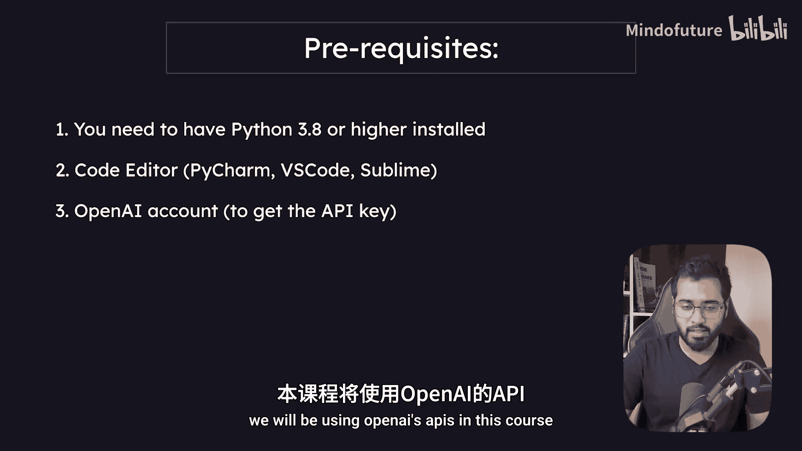
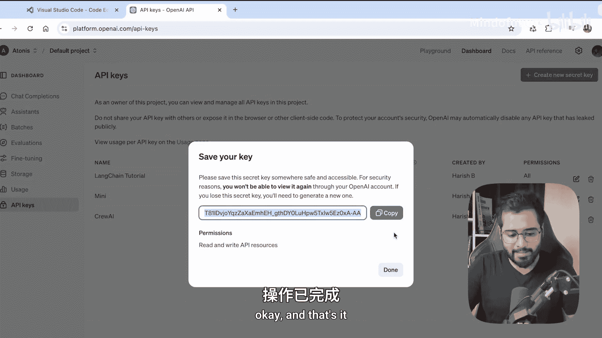
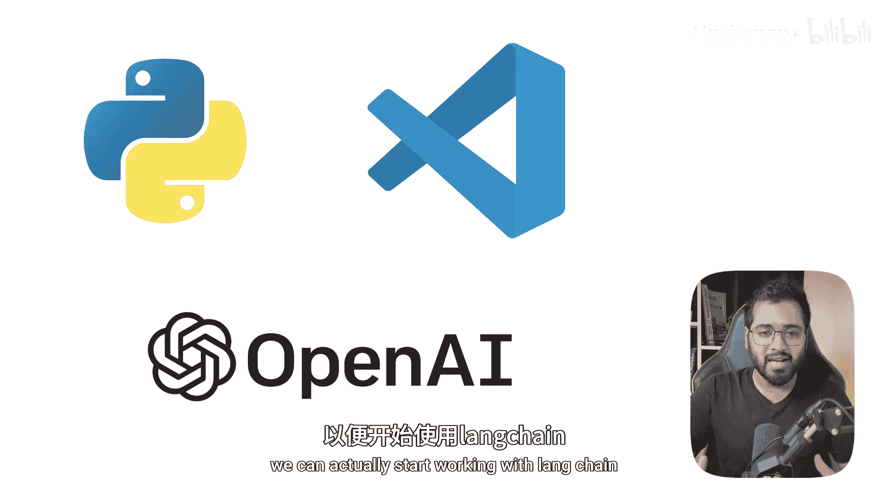

# 004：先决条件 🛠️

在本节课中，我们将学习开始学习Langchain课程前需要完成的准备工作。这包括安装必要的软件、创建账户以及获取关键的API密钥。

---

## 软件与账户要求

为了能够顺利跟随本课程，你需要准备好以下三项内容。

以下是具体的要求列表：

1.  **Python 3.8或更高版本**：这是运行Langchain和相关代码的基础环境。
2.  **代码编辑器**：用于编写和运行Python代码。课程中将使用Visual Studio Code (VS Code)。
3.  **OpenAI账户**：因为课程中将使用OpenAI的API来访问其大型语言模型。

---

## 详细安装与配置步骤

上一节我们列出了所需的软件和账户，本节中我们来看看如何具体获取和配置它们。

### 1. 安装Python

如果你尚未安装Python，可以按照描述区中提供的教程链接进行安装。教程涵盖了Windows和Mac操作系统。安装完成后，请返回视频继续学习。

### 2. 安装VS Code

你可以访问 [Visual Studio Code官网](https://code.visualstudio.com/) 下载适用于你操作系统的版本。VS Code的安装过程非常简单直接。

### 3. 创建OpenAI账户与API密钥

我们需要OpenAI账户的原因是，必须使用API密钥才能调用其API端点来访问模型。

以下是获取API密钥的步骤：

1.  访问 [OpenAI平台](https://platform.openai.com/)。
2.  如果你已有账户，请登录；如果没有，请点击“Sign up”进行注册。
3.  登录后，点击左侧边栏的“Dashboard”选项卡。
4.  在左侧菜单中找到并点击“API keys”。
5.  如果你是首次创建，可能会看到一个空列表。点击“Create new secret key”按钮。
6.  为密钥命名（例如：`LangchainTutorial`），权限保持默认的“All”即可，然后点击“Create”。
7.  **重要**：创建成功后，请立即将生成的API密钥妥善保存在你的电脑中。因为一旦关闭此页面，你将无法再次查看完整的密钥，若丢失则需重新创建。

---

## 环境设置预告

到目前为止，我们已经安装了Python 3和VS Code，并创建了OpenAI账户及API密钥。

在下一节中，我们将使用Python来设置我们的开发环境，以便真正开始使用Langchain。

---

本节课中我们一起学习了开始Langchain之旅前的所有先决条件：安装Python和VS Code，以及创建并保存OpenAI API密钥。确保完成这些步骤，为后续的实践操作做好准备。