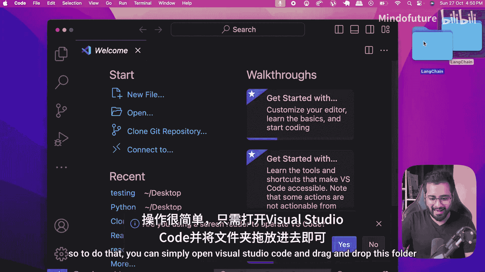
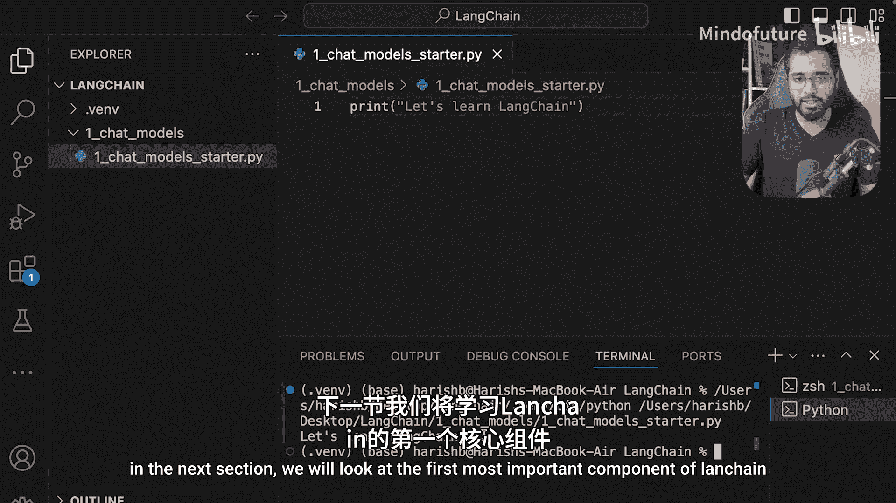

# 005：开发环境设置 🛠️

在本节课中，我们将学习如何为Langchain项目设置一个Python开发环境。我们将创建一个项目文件夹，初始化一个虚拟环境，并确保一切准备就绪，以便在后续课程中顺利安装和使用Langchain。

---



## 创建项目文件夹

首先，创建一个名为 `la chain` 的文件夹。这个文件夹将存放我们所有的项目文件。

## 在编辑器中打开项目

接下来，在Visual Studio Code中打开这个文件夹。你可以通过将文件夹拖放到Visual Studio Code窗口中来完成此操作。


## 设置虚拟环境

现在，让我们打开终端并创建一个虚拟环境。使用虚拟环境是Python项目的标准做法，它可以确保我们安装的包只对当前项目有效，而不会影响全局环境。

以下是创建虚拟环境的命令：

```bash
python3 -m venv .venv
```

**命令解释**：
*   `python3`：调用Python 3解释器（在Windows上通常使用 `python`）。
*   `-m venv`：告诉Python运行 `venv` 模块来创建虚拟环境。
*   `.venv`：这是我们将要创建的虚拟环境文件夹的名称。开头的点号 `.` 使其成为隐藏文件夹，你也可以选择不使用点号。

执行命令后，虚拟环境文件夹就创建好了。

## 激活虚拟环境

创建虚拟环境只是第一步，接下来需要激活它，使终端指向这个环境。这样，后续安装的所有包都会被隔离在这个环境中。

当前，终端可能指向的是基础环境（如 `base`）。在Visual Studio Code中，编辑器通常会弹出一个提示，让你选择新创建的 `.venv` 环境作为解释器。如果未弹出提示，你可以手动点击编辑器右下角或状态栏上的Python解释器选择按钮，然后选择 `.venv` 文件夹下的 `python` 可执行文件路径。

激活成功后，你会在终端提示符前看到 `(.venv)` 字样，或者在新打开的终端窗口中看到类似标识。这表明我们已经成功进入了虚拟环境。

至此，我们的Python开发环境已完全设置好。

## 验证环境

为了确保环境正常工作，我提前在项目文件夹中创建了一个简单的Python文件，名为 `chat_models_starter.py`。

在文件中输入以下代码：

```python
print("Let's learn Langchain!")
```

运行该文件。如果能在终端中看到输出的文本，就证明我们的开发环境已完美就绪。



---

## 总结

本节课中，我们一起完成了Langchain项目的开发环境设置。我们创建了项目目录，使用 `venv` 模块建立了独立的Python虚拟环境，并成功激活了它。现在，我们已经准备好开始学习Langchain的核心组件。


在下一节中，我们将探讨Langchain中第一个也是最重要的组件：**聊天模型（Chat Models）**。