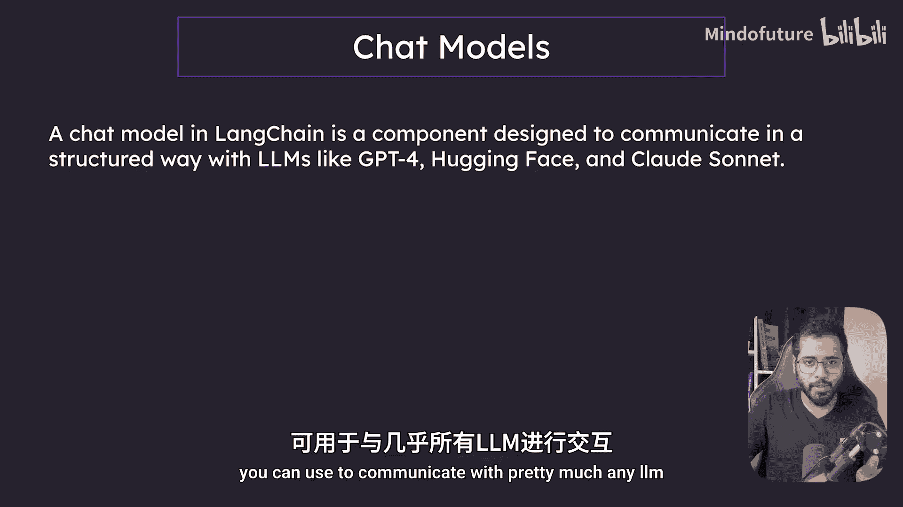
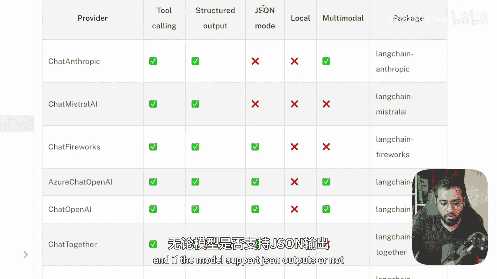
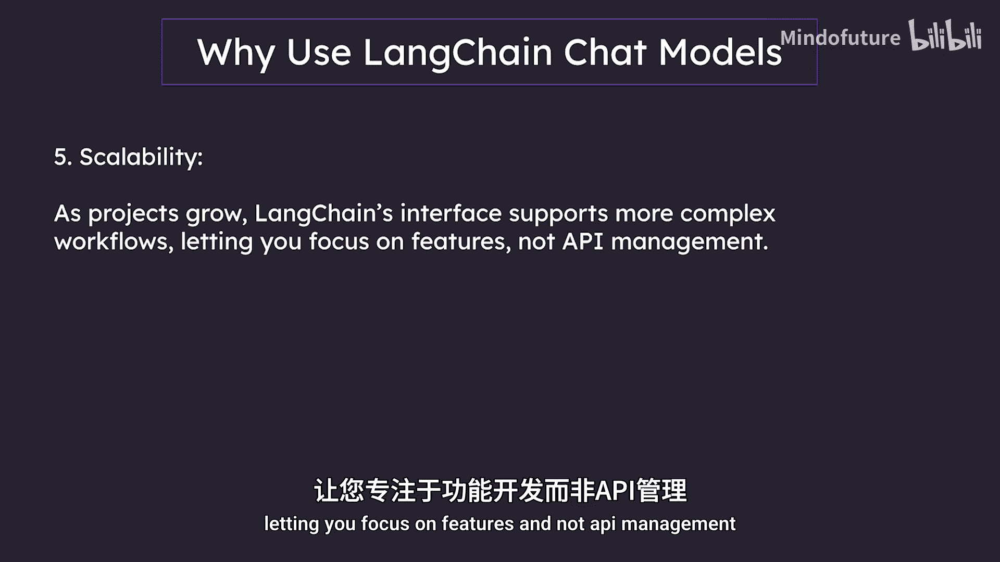
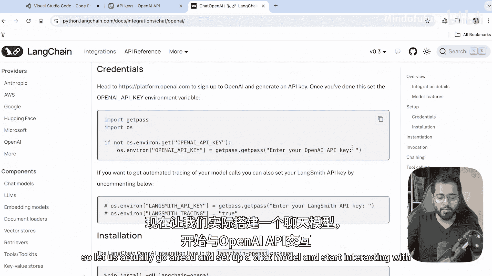

# 006：聊天模型概述 🧠

在本节中，我们将学习LangChain的第一个核心组件——聊天模型。我们将了解它的官方定义、核心优势，以及为什么在构建复杂应用时，使用LangChain的接口比直接调用大语言模型的API更高效。

## 什么是聊天模型？

上一节我们介绍了LangChain的整体架构，本节中我们来看看其中的核心组件之一：聊天模型。

根据官方定义，LangChain中的聊天模型是一个旨在以结构化方式与LLM进行通信的组件。这里的LLM可以是GPT-4，可以是Hugging Face上的开源模型，也可以是各类云服务商的API。LangChain的聊天模型提供了一个统一的接口，让你能够与你想要的几乎所有LLM进行通信。

如果你查看LangChain的官方文档，会发现有多种聊天模型可供选择：
*   有针对Anthropic公司LLM的LangChain聊天模型。
*   有针对其他服务商（如Myel）的模型。
*   由于本课程主要使用OpenAI的LLM，因此我们将使用 `ChatOpenAI` 这个模型类，这也是我们需要安装的包。

每个模型都具备不同的能力，例如：
*   有些模型支持使用工具（我们将在课程后续部分讨论工具）。
*   有些模型支持结构化输出（例如JSON格式）。

## 为什么需要聊天模型接口？

既然我们可以直接调用LLM的API，为什么还需要LangChain这个“中间人”呢？答案是：对于小型应用，直接调用当然可以。但随着应用变得越来越复杂，直接管理各种API调用会迅速变得混乱不堪。

使用LangChain聊天模型接口而非直接调用API，主要有以下优势。了解这些优势很重要，它能让你从更高层面理解我们为何这样做，从而在课程结束后也能更好地设计你自己的解决方案。

以下是几个关键优势：

**1. 统一的接口**
LangChain聊天模型统一了不同LLM API的调用方式，使你无需分别管理每个API独特的设置和细节。

**2. 易于切换模型**
如果你想从一个LLM切换到另一个，LangChain聊天模型让这个过程变得非常简单，无需大量修改代码。

**3. 上下文管理**
使用LangChain聊天模型有助于管理对话历史，让你能够无缝地在多次交互中保持上下文连贯。

**4. 高效编排**
你可以将多个LLM调用和任务连接到一个结构化的管道中，而手动设置这种编排可能会比较棘手。

**5. 可扩展性**
随着项目增长，LangChain的接口能够支持更复杂的工作流，让你专注于功能开发，而非API管理。

## 本课程将使用的模型

在本课程中，我们将主要使用OpenAI的API，因此我们需要 `ChatOpenAI` 这个模型。点击官方文档中相应的链接，你会发现其设置方法非常易于理解。

接下来，就让我们实际动手设置一个聊天模型，并开始与OpenAI的API进行交互吧。

本节课中我们一起学习了LangChain聊天模型的核心概念、主要优势以及它存在的必要性。我们了解到，聊天模型作为统一接口，简化了与不同LLM的交互，为构建可维护、可扩展的复杂应用奠定了基础。在下一节，我们将进行实践，亲手配置并使用 `ChatOpenAI` 模型。