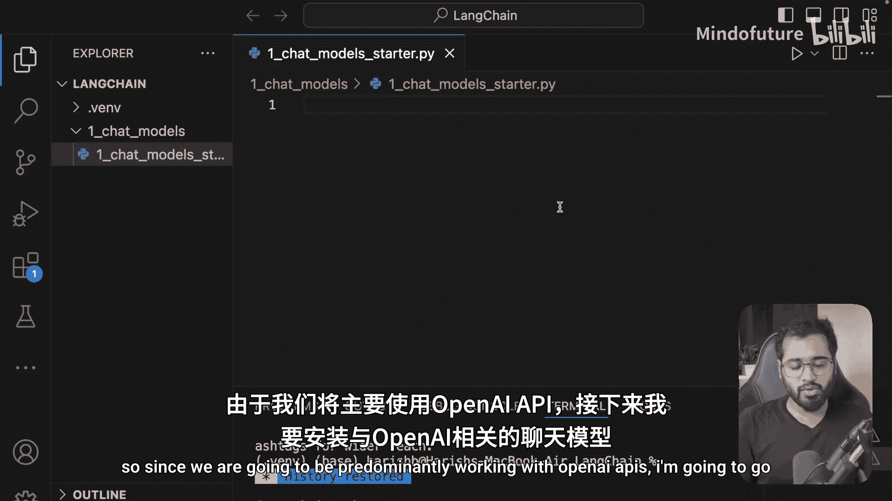
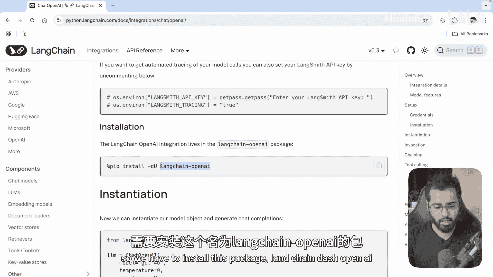
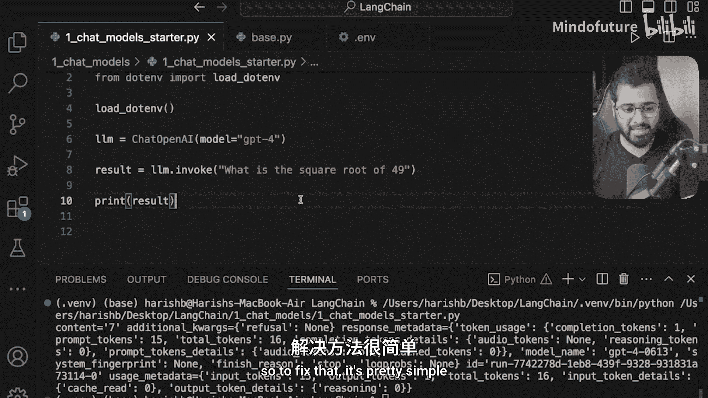
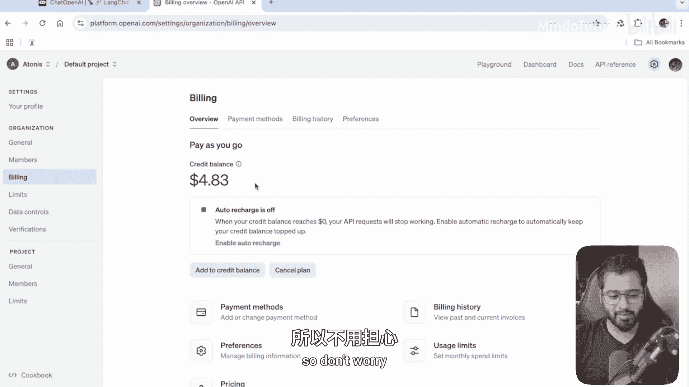
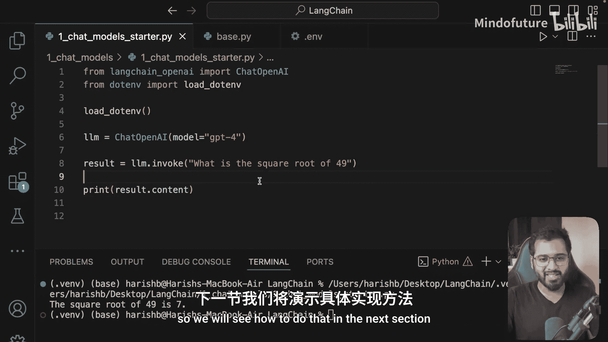

# 007：聊天模型设置 🚀



在本节课中，我们将开始学习如何使用Langchain的聊天模型。主要内容包括安装必要的包、初始化模型、调用API以及处理API密钥等基本操作。

---



## 安装与导入

上一节我们介绍了Langchain的基本概念，本节中我们来看看如何设置并使用聊天模型。由于我们将主要使用OpenAI的API，因此需要安装对应的Langchain包。

以下是安装 `langchain-openai` 包的步骤：

1.  打开终端。
2.  运行安装命令：`pip install langchain-openai`。

安装完成后，我们可以在代码中导入所需的类。

```python
from langchain_openai import ChatOpenAI
```

## 初始化模型

导入类之后，我们可以初始化一个聊天模型实例。在初始化时，需要指定要使用的模型。

```python
llm = ChatOpenAI(model="gpt-4o")
```

这里我们选择了 `gpt-4o` 模型。它是OpenAI发布的最新模型之一，功能强大但调用成本可能较高。如果预算有限，可以选择 `gpt-3.5-turbo` 或 `gpt-4` 等模型。这个 `llm` 变量将作为我们与OpenAI API通信的接口。

## 调用模型与处理错误

初始化模型后，我们可以通过 `invoke` 方法向模型发送提示并获取回复。

```python
result = llm.invoke("what is the square root of 49?")
print(result)
```

首次运行时，你可能会遇到API密钥缺失的错误。这是因为我们没有提供访问OpenAI服务的凭证。

## 配置API密钥

为了解决API密钥错误，我们需要创建一个环境变量文件来安全地存储密钥。

以下是配置API密钥的步骤：

1.  在项目根目录创建一个名为 `.env` 的文件。
2.  在文件中添加你的OpenAI API密钥：`OPENAI_API_KEY=你的密钥`。
3.  在Python代码中加载环境变量。首先安装 `python-dotenv` 包：`pip install python-dotenv`。
4.  在代码开头加载环境变量文件。

```python
from dotenv import load_dotenv
load_dotenv()  # 加载 .env 文件中的环境变量
```

完成这些步骤后，再次运行代码，应该就能成功获取模型的回复了。

## 解析模型响应



模型返回的 `result` 是一个包含丰富信息的对象。对于我们当前的需求，通常只关心其中的文本内容。



我们可以通过访问 `content` 属性来直接获取回复的文本。

```python
print(result.content)
# 输出：The square root of 49 is 7.
```

这样，我们就得到了清晰简洁的答案。

## 费用与账户管理

如果调用API时遇到余额不足的错误，需要为OpenAI账户充值。

以下是检查和充值余额的步骤：

1.  访问 OpenAI 平台网站 (`platform.openai.com`)。
2.  登录后，进入 `Settings` -> `Billing`。
3.  在账单页面可以进行充值。对于学习用途，充值5美元通常足够使用一段时间。

---



本节课中我们一起学习了Langchain聊天模型的基本设置。我们安装了必要的包，初始化了模型实例，学会了如何调用API并处理常见的API密钥错误，最后还了解了如何解析响应和管理账户余额。在下一节，我们将学习如何向模型发送完整的对话历史，使其能基于上下文给出更准确的回复。