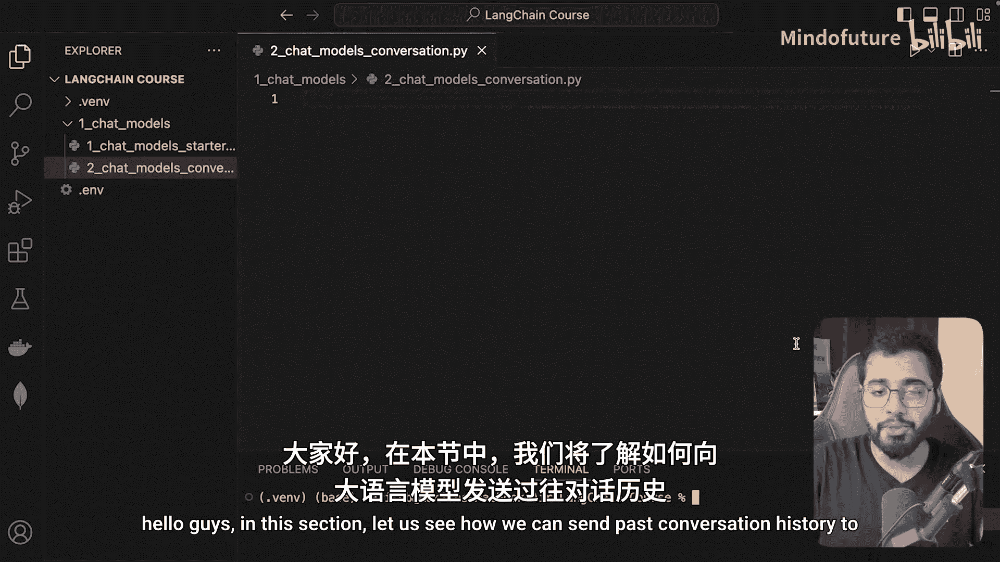
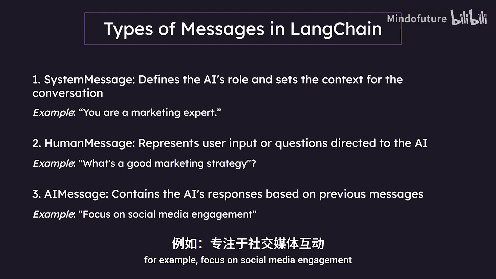
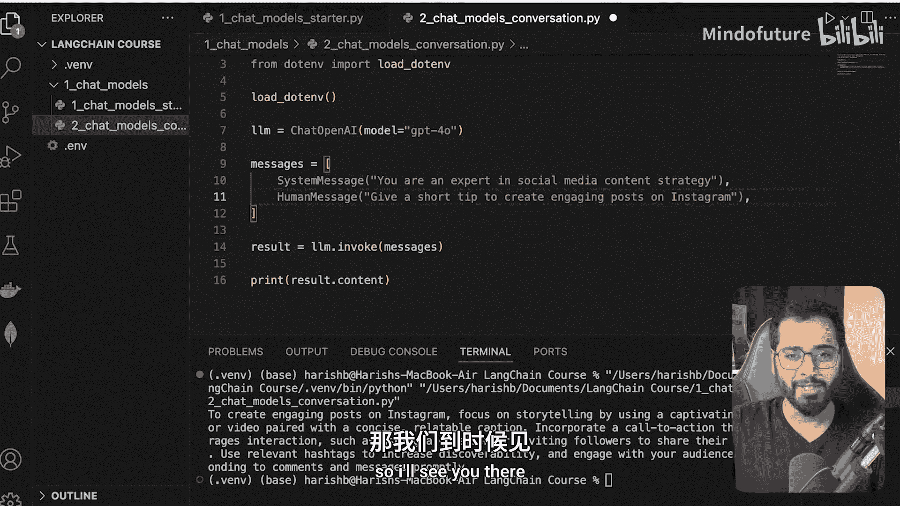

Langchain初学者入门2025：P08：聊天模型与历史记录传递



在本节课中，我们将学习如何将过去的对话历史传递给大型语言模型，以增强其对上下文的理解能力。这对于构建能够进行连贯多轮对话的应用程序至关重要。

上一节我们介绍了如何调用聊天模型，本节中我们来看看如何构建并传递包含历史记录的对话。

### 消息类型

在Langchain中，对话由不同类型的消息组成。理解这些类型是构建对话历史的基础。

以下是Langchain中三种核心的消息类型：



*   **系统消息**：用于定义AI的角色并设定对话的上下文。它通常在对话开始时发送。
    *   示例代码：`SystemMessage(content="你是一名社交媒体营销专家。")`
*   **人类消息**：代表用户向AI提出的输入或问题。
    *   示例代码：`HumanMessage(content="如何在Instagram上创建吸引人的帖子？")`
*   **AI消息**：包含AI基于之前消息生成的回复。
    *   示例代码：`AIMessage(content="专注于讲故事，使用吸引人的图片或视频。")`

### 构建对话历史

了解了消息类型后，我们来看看如何在代码中使用它们来构建一个对话历史列表。

首先，需要从Langchain的核心包中导入相应的消息类。

```python
from langchain_core.messages import SystemMessage, HumanMessage, AIMessage
```

导入完成后，我们可以初始化一个消息列表来模拟一段对话历史。以下是一个简单的例子：

```python
# 初始化一个消息列表，模拟对话历史
messages = [
    SystemMessage(content="你是一名社交媒体内容策略专家。"),
    HumanMessage(content="给一个在Instagram上创建吸引人帖子的简短建议。")
]
```

### 调用模型并传递历史

现在，我们已经有了一个包含系统指令和用户问题的消息列表。接下来，我们需要将这个列表传递给聊天模型以获取回复。

调用模型的方式与我们之前传递单个字符串时类似，但这次我们传入的是消息列表。

```python
from langchain_openai import ChatOpenAI

# 初始化模型
llm = ChatOpenAI(model="gpt-3.5-turbo")

# 将消息列表传递给模型
result = llm.invoke(messages)

# 打印AI的回复内容
print(result.content)
```

运行上述代码，模型将基于我们提供的系统角色和用户问题生成一个简短的回复，例如：“要在Instagram上创建吸引人的帖子，可以专注于讲故事，使用引人注目的图片或视频，并配以简洁、 relatable 的标题。”

### 扩展对话历史

为了模拟更真实的多轮对话，我们可以将AI的回复也加入到历史记录中，然后继续添加新的人类消息。

```python
# 扩展对话历史，加入AI的回复和新的用户问题
messages.append(AIMessage(content=result.content)) # 添加上一轮AI的回复
messages.append(HumanMessage(content="能再给一个关于使用话题标签的建议吗？")) # 添加新的用户问题

# 再次调用模型，传入更新后的完整历史记录
new_result = llm.invoke(messages)
print(new_result.content)
```

通过这种方式，AI在回答第二个问题时，能够“记住”之前的整个对话上下文（包括它自己之前的回答），从而给出更连贯、相关的建议。

虽然目前我们是手动硬编码了对话历史，但理解这个机制至关重要。在实际应用程序中，你可以动态地管理和存储这些消息列表，从而实现真正的、有记忆的对话功能。

### 总结



本节课中我们一起学习了Langchain聊天模型中传递对话历史的核心方法。我们首先认识了**系统消息**、**人类消息**和**AI消息**这三种基本组件。然后，我们通过代码演示了如何构建一个消息列表来代表对话历史，并将其传递给模型以获得上下文感知的回复。最后，我们看到了如何通过追加消息来扩展对话，模拟多轮交互。掌握这些概念是开发现实世界中智能对话应用的基础。在下一节，我们将探讨如何利用Langchain轻松地在不同的大语言模型之间进行切换。