# 009：聊天模型切换指南 🚀

在本节课中，我们将学习如何在Langchain框架中轻松地切换不同的聊天模型。之前我们一直使用OpenAI的模型，但实际应用中，你可能需要根据成本、性能或特定任务需求更换为其他模型，如Google的Gemini或Anthropic的Claude。Langchain通过统一的接口抽象了与不同模型API交互的复杂性，使得切换过程变得简单且一致。

## 代码结构回顾

首先，我们回顾一下之前使用OpenAI模型的基础代码结构。以下代码定义了一个简单的消息列表，并调用OpenAI的聊天模型进行处理。

```python
from langchain_openai import ChatOpenAI

# 定义消息
messages = [
    {"role": "system", "content": "你是一个有用的助手。"},
    {"role": "human", "content": "你好！"}
]

# 初始化OpenAI聊天模型
chat_model = ChatOpenAI(model="gpt-3.5-turbo")
response = chat_model.invoke(messages)
print(response.content)
```

这段代码你应该已经熟悉。它包含一个系统消息和一条人类消息，并使用`ChatOpenAI`类进行调用。

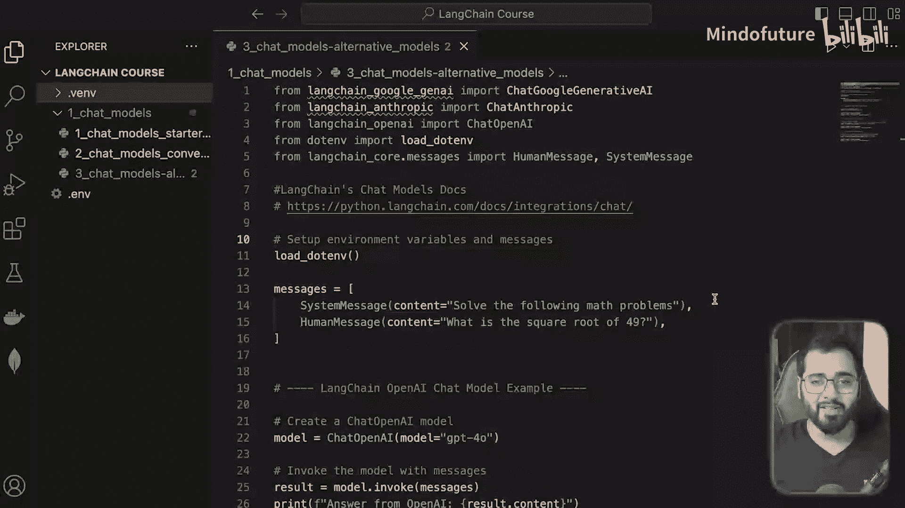

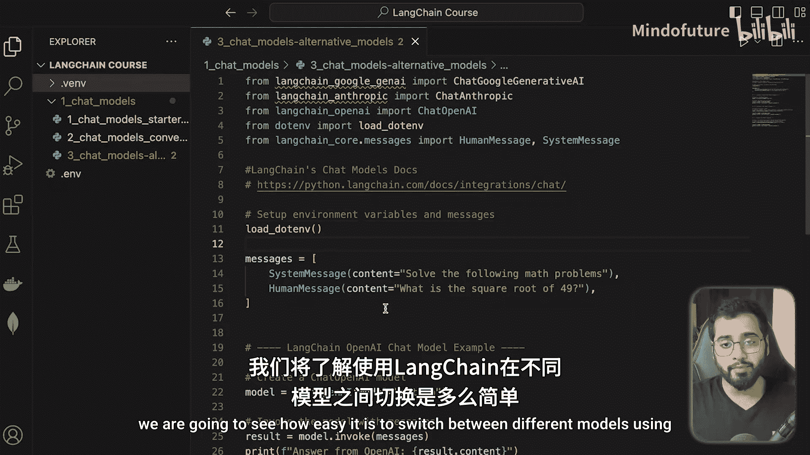

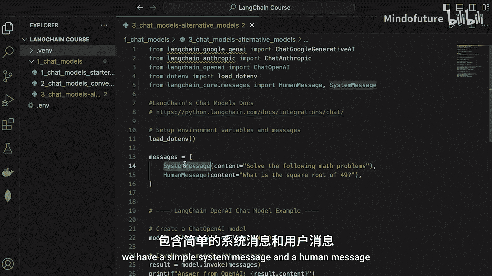

## 切换至其他模型

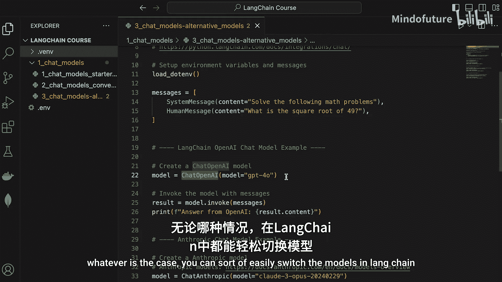

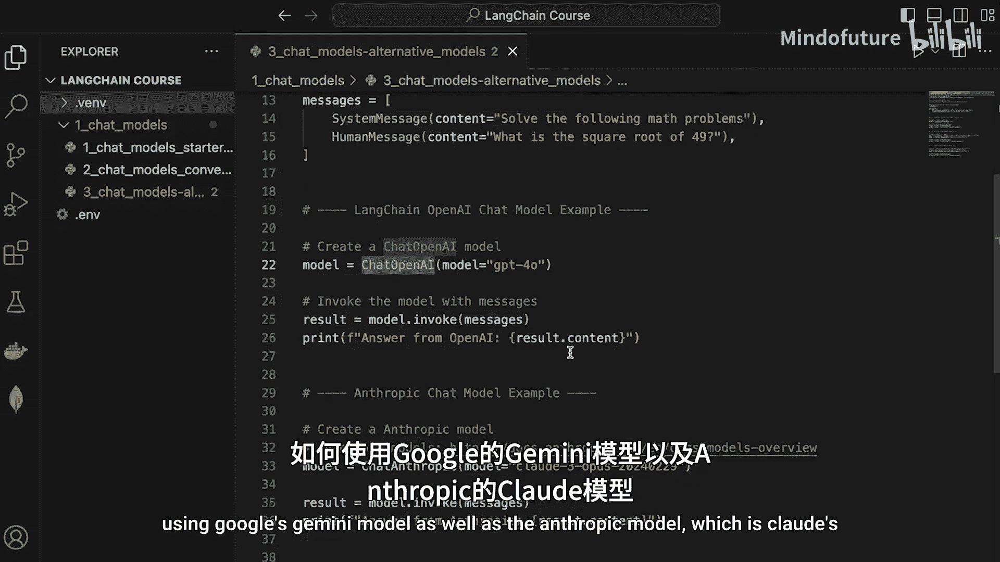

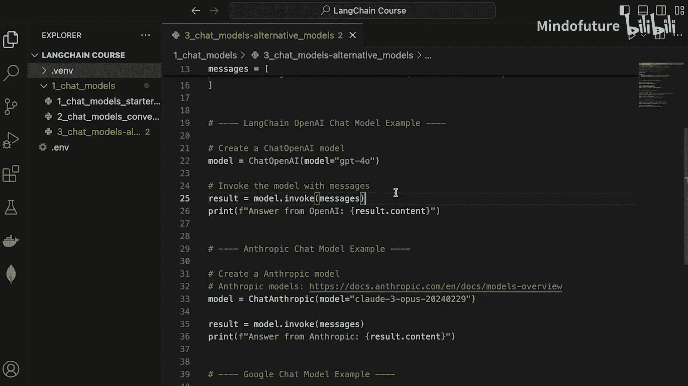

上一节我们介绍了OpenAI模型的基本用法。本节中，我们来看看如何将代码中的模型替换为其他提供商的模型，例如Google Gemini或Anthropic Claude。Langchain为不同的模型提供商提供了相应的封装类，这使得切换模型就像更换一个类名和模型参数一样简单。

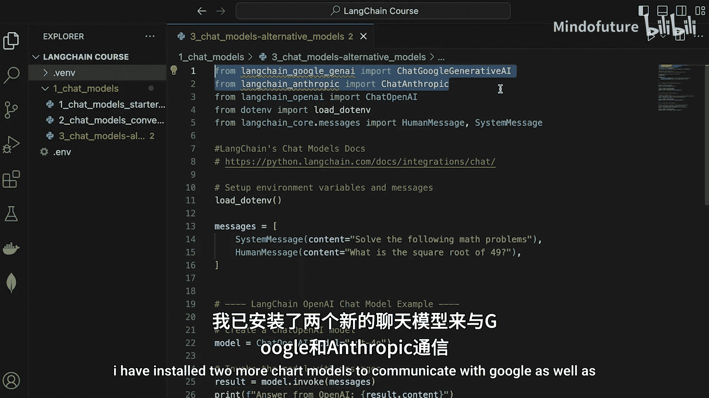

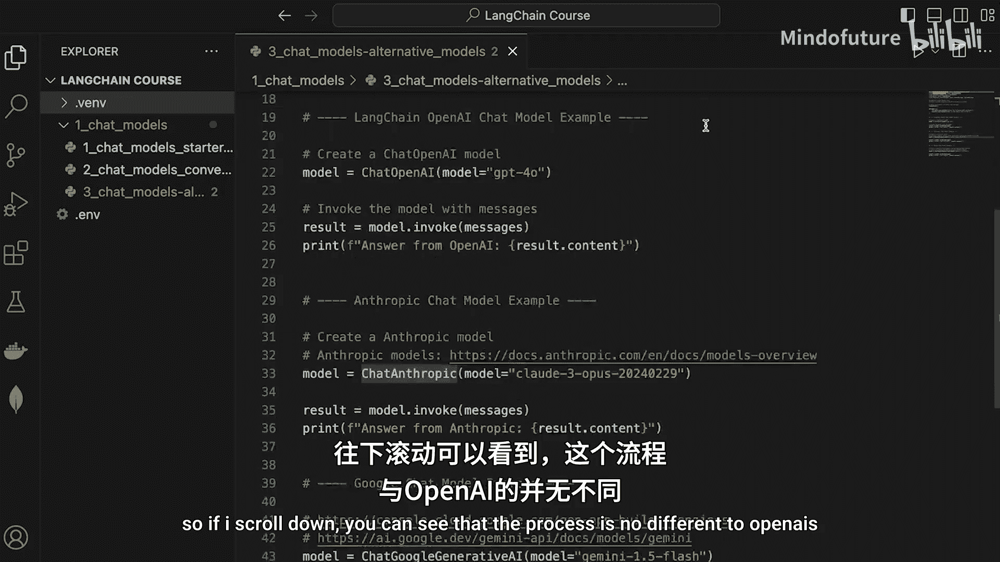

以下是切换模型的关键步骤：

1.  **安装必要的包**：首先，你需要安装目标模型对应的Langchain集成包。
2.  **导入正确的类**：在代码中，从相应的模块导入聊天模型类（例如，从`langchain_google_genai`导入`ChatGoogleGenerativeAI`）。
3.  **更新初始化代码**：使用新的模型类初始化聊天对象，并传入对应的模型名称参数。
4.  **保持调用方式不变**：调用`invoke`方法的方式与使用OpenAI模型时完全相同。

### 使用Anthropic Claude模型

要使用Anthropic的Claude模型，你需要安装`langchain-anthropic`包，并按照以下方式修改代码：

```python
from langchain_anthropic import ChatAnthropic

# 使用Anthropic Claude模型
chat_model = ChatAnthropic(model="claude-3-haiku-20240307")
response = chat_model.invoke(messages)
print(response.content)
```

你可以看到，除了导入的类和指定的模型名称不同，整个调用过程与使用OpenAI模型没有区别。

### 使用Google Gemini模型

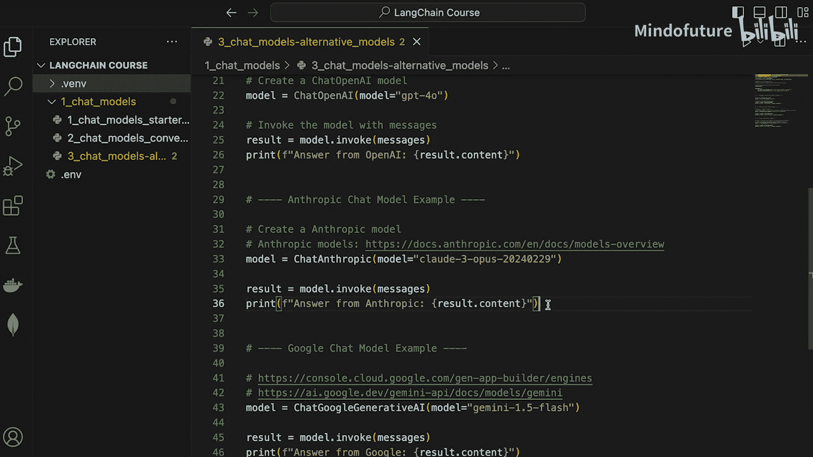

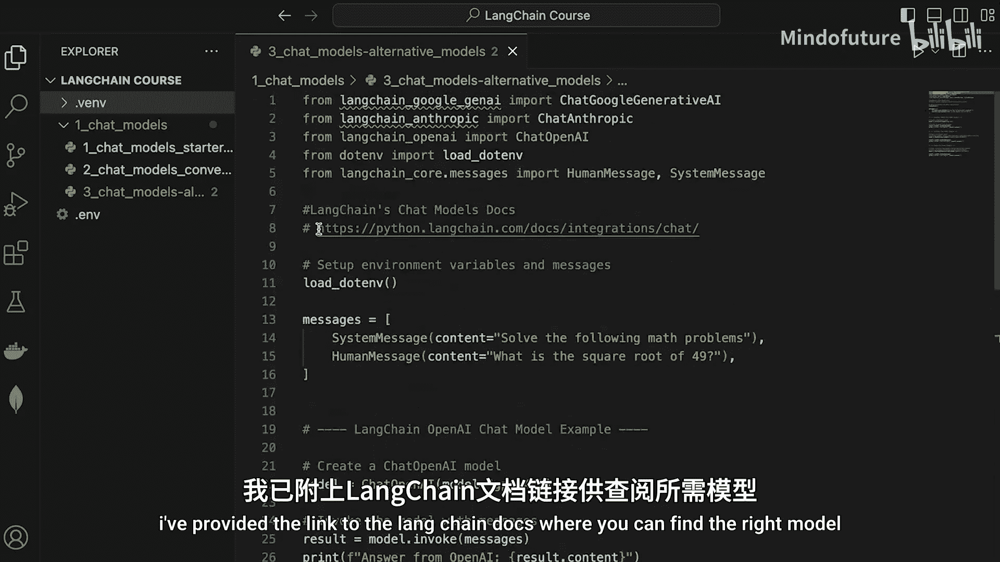

类似地，要使用Google的Gemini模型，你需要安装`langchain-google-genai`包。以下是相应的代码示例：

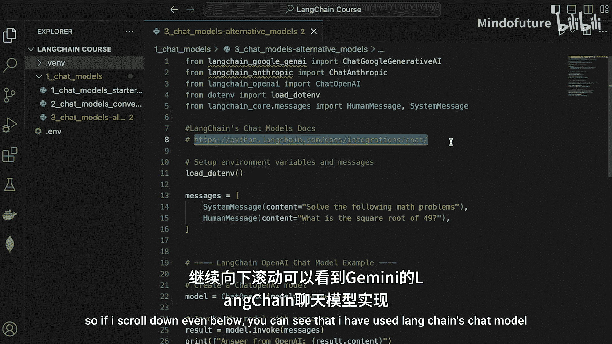

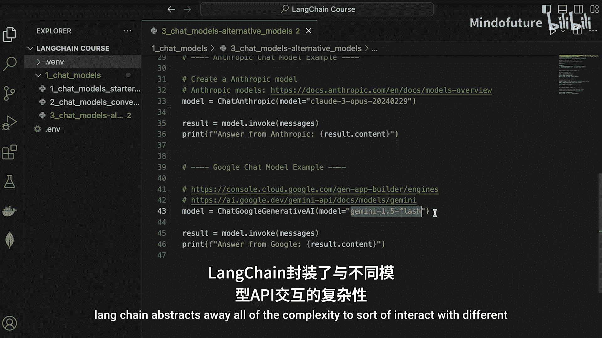

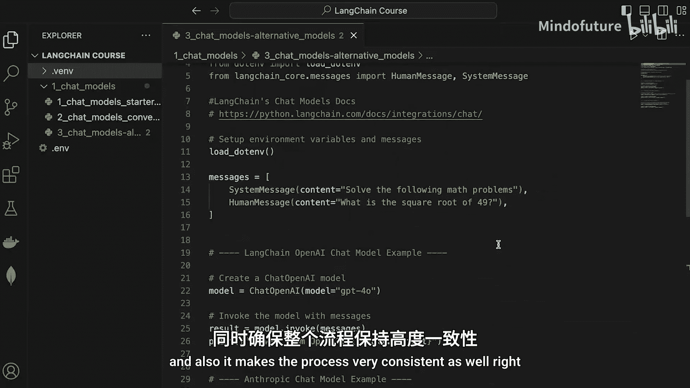

```python
from langchain_google_genai import ChatGoogleGenerativeAI

# 使用Google Gemini模型
chat_model = ChatGoogleGenerativeAI(model="gemini-1.5-flash")
response = chat_model.invoke(messages)
print(response.content)
```

同样，Langchain抽象了与Gemini API交互的细节，你只需要关注使用哪个模型。

## 模型选择策略

了解如何切换模型非常实用。在实际开发产品或解决方案时，根据手头的任务，不同的模型可能各有优势。以下是选择模型时可能需要考虑的因素：

*   **性能**：某些模型在特定任务（如代码生成、逻辑推理）上可能更准确。
*   **速度**：不同模型的响应延迟可能不同。
*   **成本**：模型API的调用价格差异可能很大。
*   **功能特性**：某些模型可能支持更长的上下文或特定的输出格式。

Langchain使得根据这些因素灵活调整模型变得非常容易。你可以查阅官方文档来了解每个提供商下所有可用的模型列表。

## 总结

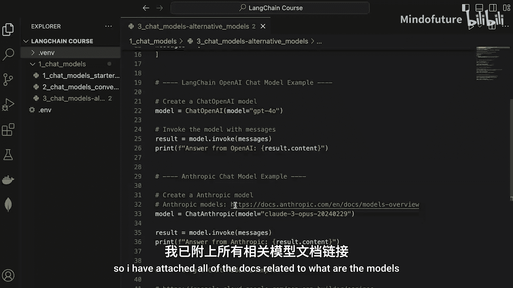

本节课中我们一起学习了在Langchain中切换不同聊天模型的方法。核心在于理解Langchain通过统一的接口（如`.invoke(messages)`）封装了不同模型提供商的API，使得开发者只需更换模型类的导入和初始化参数，即可无缝切换使用OpenAI、Google Gemini或Anthropic Claude等模型。这为构建灵活、可维护的AI应用提供了极大的便利。

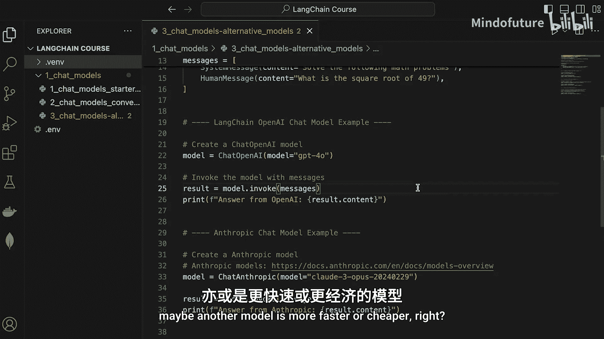

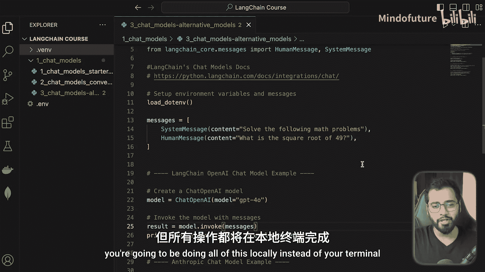

在下一节，我们将进行一个非常有趣的实践：在本地终端与LLM进行对话，类似于ChatGPT的体验，但完全在你的本地环境中运行。敬请期待！