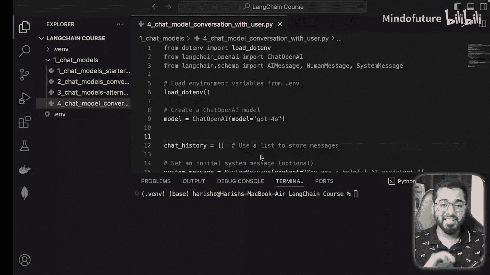
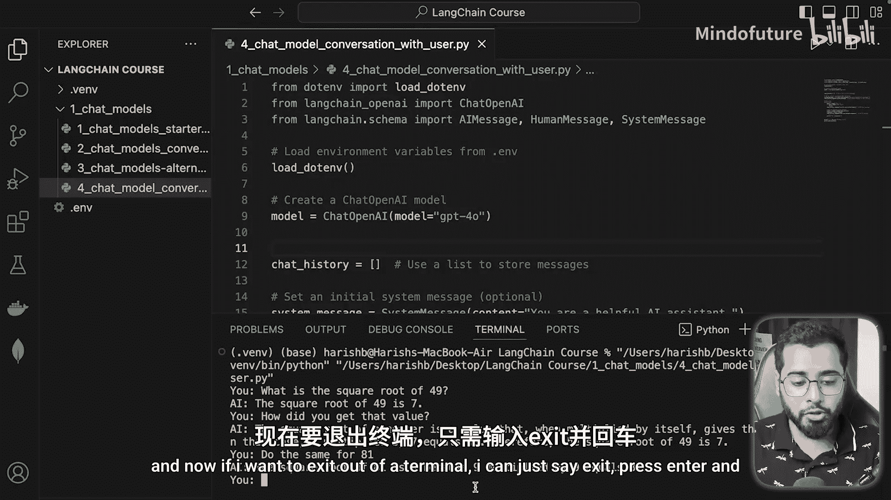
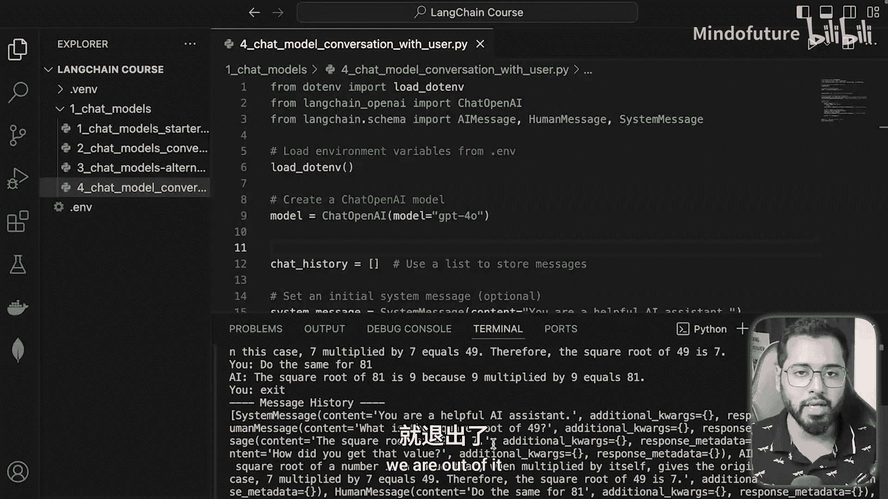
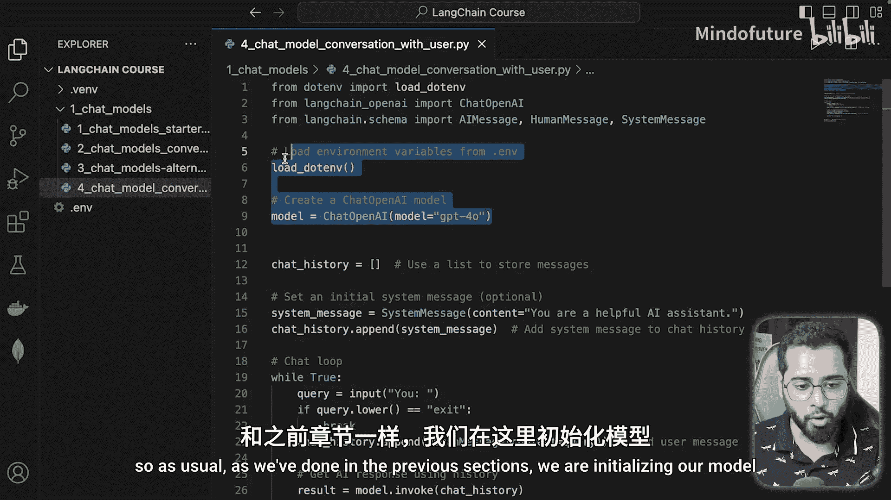
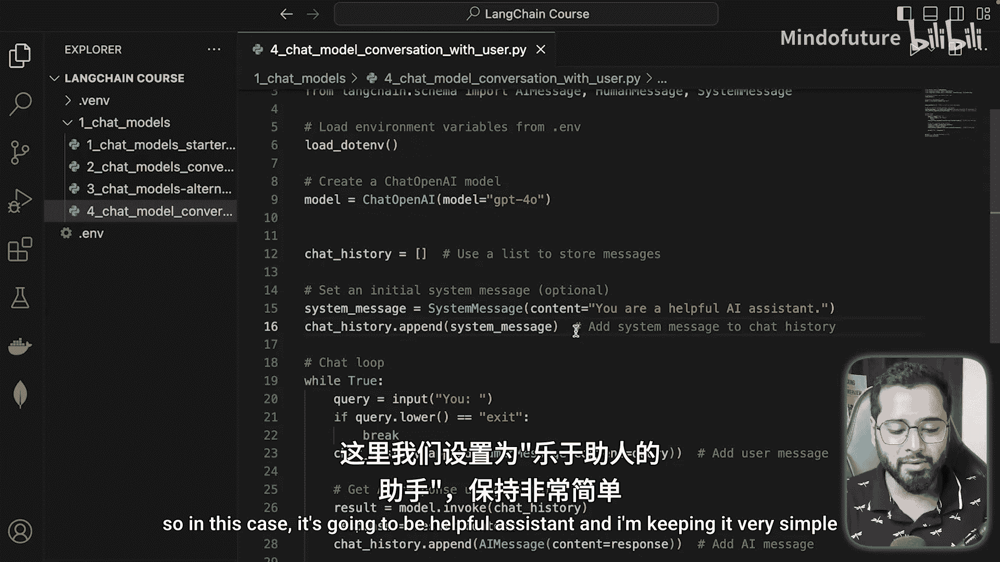
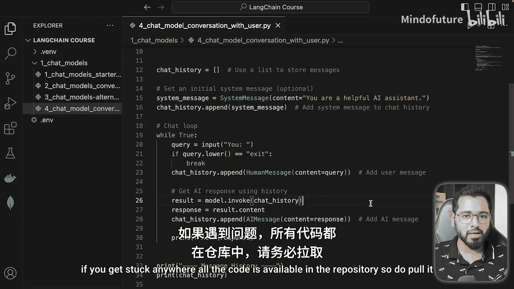
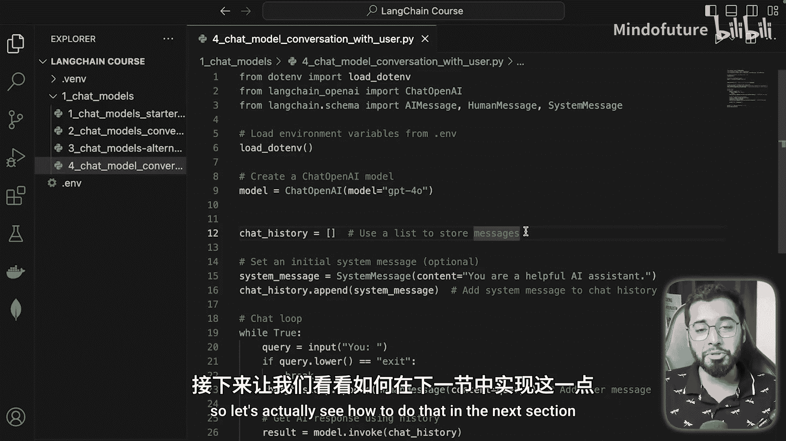

# 010：实现终端实时对话

在本节课中，我们将学习如何使用Langchain的聊天模型，在本地终端中实现一个类似ChatGPT的实时对话应用。我们将通过一个循环，动态地管理对话历史，并与大语言模型进行交互。

---



## 概述

上一节我们介绍了如何构建一个简单的对话链。本节中，我们将更进一步，创建一个交互式的终端对话程序。这个程序会持续运行，允许用户输入问题，模型会基于完整的对话历史给出回答，从而实现连贯的上下文对话。

## 代码实现与解析

以下是实现终端实时对话的核心代码步骤。

首先，我们初始化模型并加载环境变量。

```python
# 初始化聊天模型
from langchain.chat_models import ChatOpenAI
from langchain.schema import HumanMessage, AIMessage, SystemMessage
import os

chat = ChatOpenAI(model_name="gpt-3.5-turbo", temperature=0.7)
```





接下来，我们创建一个列表来动态存储对话历史。对话总是以一个**系统消息**开始，用于设定AI的角色。



```python
# 初始化一个空列表来存储对话历史
chat_history = []

# 首先添加系统消息，设定AI的角色
system_message = SystemMessage(content="你是一个乐于助人的助手。")
chat_history.append(system_message)
```



程序的核心是一个`while`循环，它持续运行直到用户输入退出指令。

以下是循环内的关键步骤：

1.  **获取用户输入**：程序提示用户在终端中输入问题。
2.  **检查退出条件**：如果用户输入“EXIT”，则跳出循环，结束程序。
3.  **添加用户消息**：将用户的输入作为`HumanMessage`添加到`chat_history`列表中。
4.  **调用模型并获取回复**：将包含全部历史的`chat_history`列表发送给大语言模型。
5.  **添加AI回复**：将模型返回的回复作为`AIMessage`添加到`chat_history`列表中，为下一轮对话提供上下文。

```python
while True:
    # 1. 获取用户输入
    query = input(“You: “)

    # 2. 检查退出条件
    if query.upper() == “EXIT”:
        break

    # 3. 添加用户消息到历史
    chat_history.append(HumanMessage(content=query))

    # 4. 调用模型，传入整个对话历史
    response = chat(chat_history)

    # 5. 添加AI回复到历史
    chat_history.append(AIMessage(content=response.content))
    print(f“AI: {response.content}”)
```

## 运行示例

当运行上述程序时，交互过程如下：
*   程序启动，显示`You:`提示符。
*   用户输入：`What is the square root of 49?`
*   模型回复：`7`
*   用户继续输入：`How did you get that value?`
*   模型能基于之前的对话历史，解释其计算过程。
*   用户输入：`Do the same for 81.`
*   模型理解上下文，直接回复：`9`
*   用户输入：`EXIT`，程序结束。

这个示例展示了模型如何利用`chat_history`列表来记住对话上下文，从而实现连贯的多轮对话。

## 总结





本节课中我们一起学习了如何使用Langchain在终端中构建一个实时对话应用。关键点在于使用一个列表来动态维护**对话历史**，并在每次调用模型时将整个历史传入，这使得模型具备了上下文记忆能力。目前，历史数据存储在程序的内存变量中。在实际生产应用中，通常需要将会话历史保存到数据库或云存储中，以实现数据的持久化。下一节，我们将探讨如何实现对话历史的持久化存储。