# 011：云端聊天历史存储 📚

在本节课中，我们将学习如何将聊天历史从本地内存迁移到云端数据库（Firebase Firestore）。这样，即使用户关闭应用后重新打开，也能继续之前的对话。

---

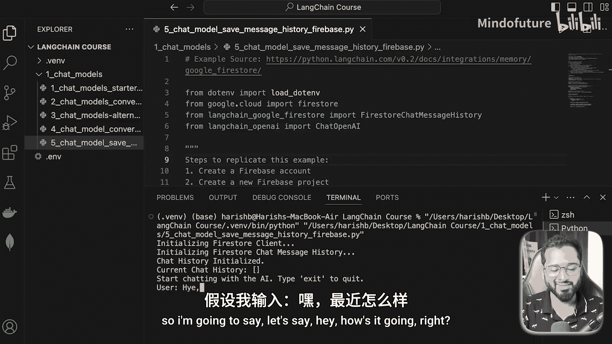

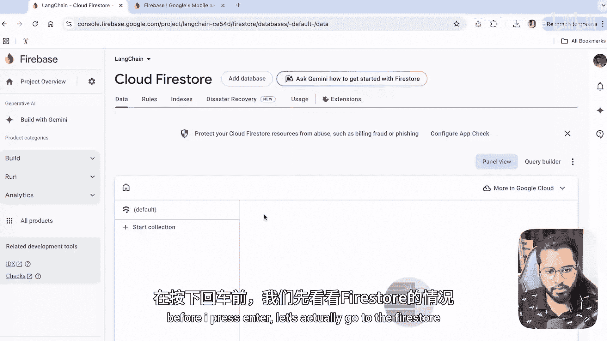

## 概述

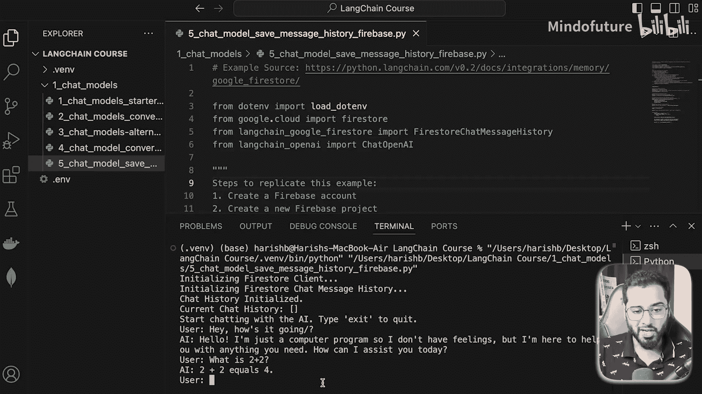

上一节我们介绍了如何在内存中管理聊天历史。本节中，我们将看看如何将其存储在云端，以实现持久化和跨会话的对话连续性。我们将使用 **Firebase Firestore** 作为云端数据库。

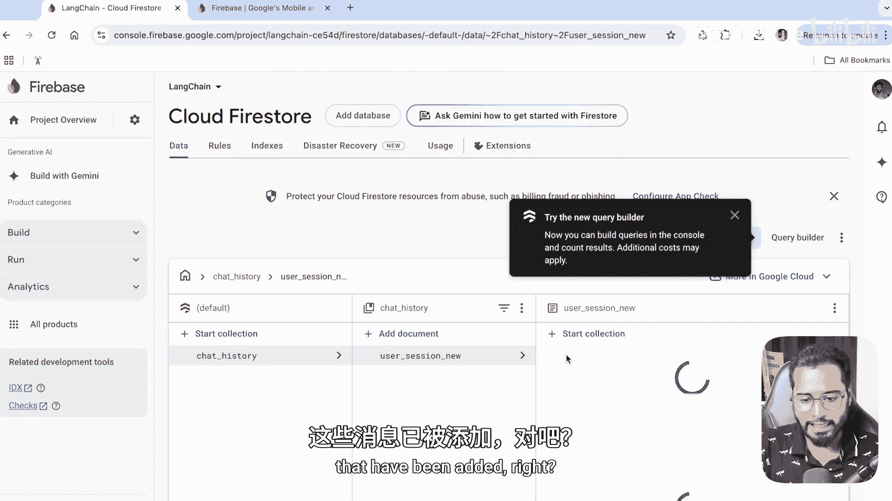

## 准备工作：Firebase 设置

以下是设置 Firebase Firestore 数据库的步骤。

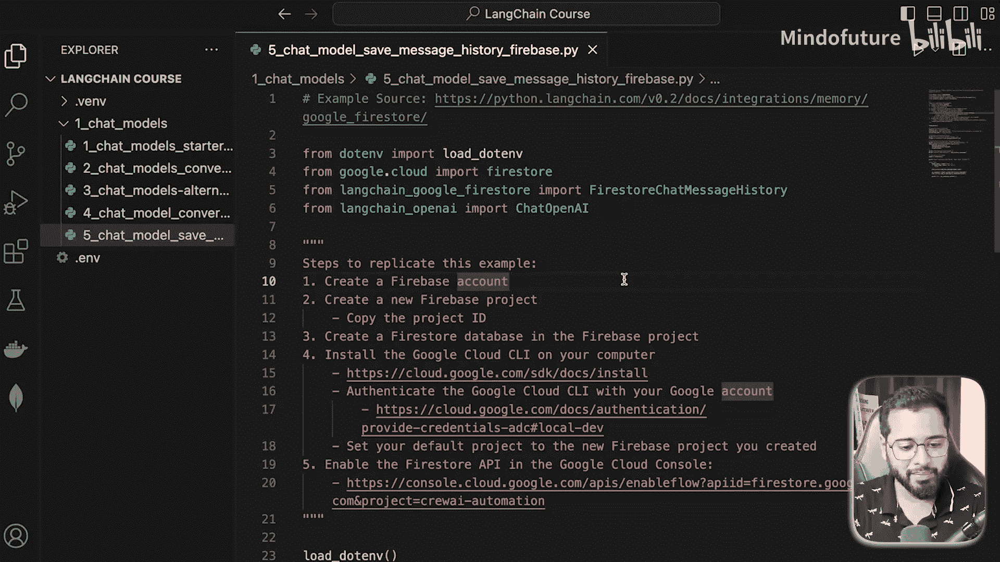

### 1. 创建 Firebase 项目
首先，访问 [Firebase 控制台](https://console.firebase.google.com/) 并创建一个新项目。例如，将项目命名为 `la-chain`。创建过程中可以暂时禁用 Google Analytics。

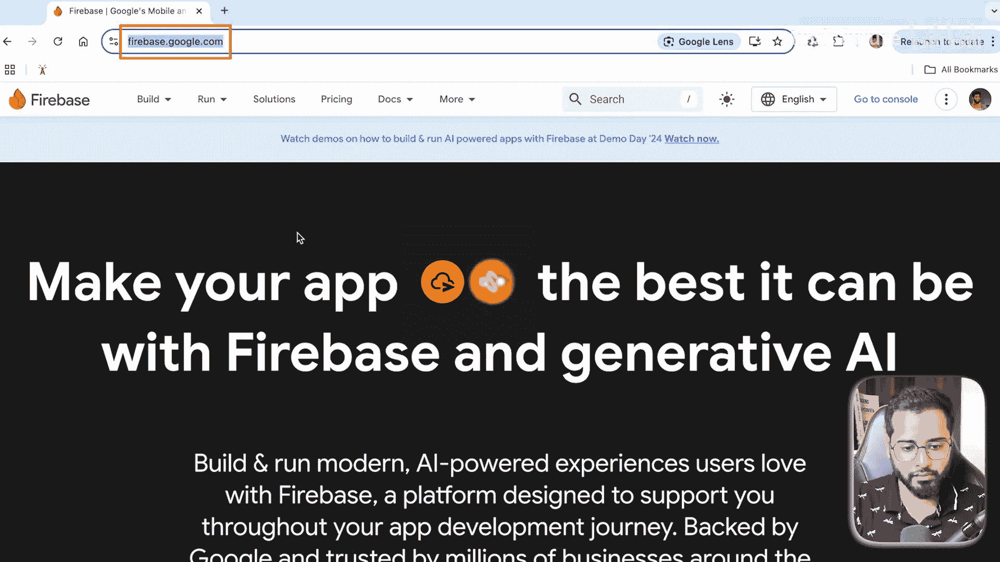

### 2. 创建 Firestore 数据库
在项目控制台中，从左侧导航栏的“构建”下拉菜单中选择 **Firestore Database**。点击“创建数据库”，保留默认位置设置，并选择以“测试模式”启动，以便快速开始。

**核心概念**：Firestore 是一个文档型 NoSQL 数据库。数据以“集合”和“文档”的形式组织：
*   **集合**：类似于文件夹，用于分组文档。
*   **文档**：存储实际数据的单元，格式为键值对。
结构通常是：`集合` -> `文档` -> `子集合` -> `子文档`。

### 3. 获取项目 ID
应用需要知道操作哪个 Firebase 项目。在 Firebase 控制台的“项目设置”中，找到并复制 **项目 ID**。我们将在代码中用到它。

### 4. 安装并认证 Google Cloud CLI
为了让本地应用获得操作 Firebase 的权限，需要安装并认证 Google Cloud CLI。
1.  访问 [Google Cloud SDK 下载页面](https://cloud.google.com/sdk/docs/install)，根据你的操作系统下载并安装。
2.  安装后，在终端中运行初始化命令进行认证：
    ```bash
    gcloud init
    ```
3.  接着，设置应用默认凭据：
    ```bash
    gcloud auth application-default login
    ```

### 5. 安装必要的 Python 包
除了 LangChain 的核心包，我们还需要安装专为 Firebase 集成的包：
```bash
pip install langchain-google-firestore
```

完成以上步骤后，云端数据库的基础设置就准备好了。接下来，我们进入代码实现部分。

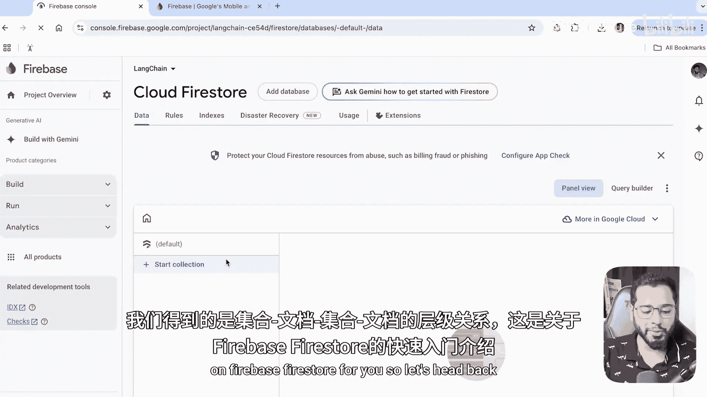

## 代码实现

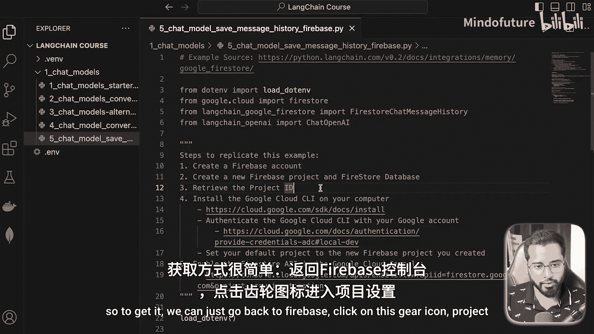

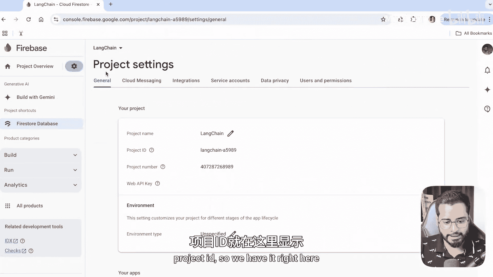

现在，我们来看如何修改之前的代码，使其能够与云端 Firestore 交互。

首先，确保导入了必要的模块：
```python
from langchain_google_firestore import FirestoreChatMessageHistory
from google.cloud import firestore
```

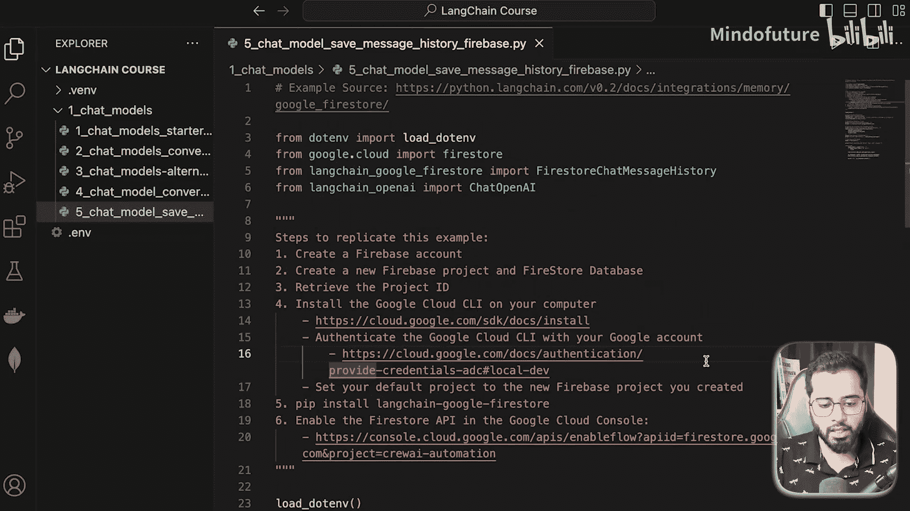

### 初始化 Firestore 客户端与聊天历史
与之前仅在内存中维护一个列表不同，现在我们需要初始化一个连接到 Firestore 的聊天历史对象。

```python
# 1. 初始化 Firestore 客户端，传入你的项目 ID
client = firestore.Client(project="your-firebase-project-id")

# 2. 创建 Firestore 聊天历史对象
chat_history = FirestoreChatMessageHistory(
    session_id="user_session_123",  # 当前聊天会话的唯一标识符
    collection="chat_history",       # Firestore 中存储消息的集合名称
    client=client                    # 上一步初始化的客户端
)
```

**参数解释**：
*   `session_id`：这是对话的唯一标识。在实际应用中，应为每个用户或每个对话会话生成一个唯一的 ID（例如，使用长随机字符串）。
*   `collection`：在 Firestore 中创建的集合名称，用于存储所有消息。
*   `client`：已认证的 Firestore 客户端实例。

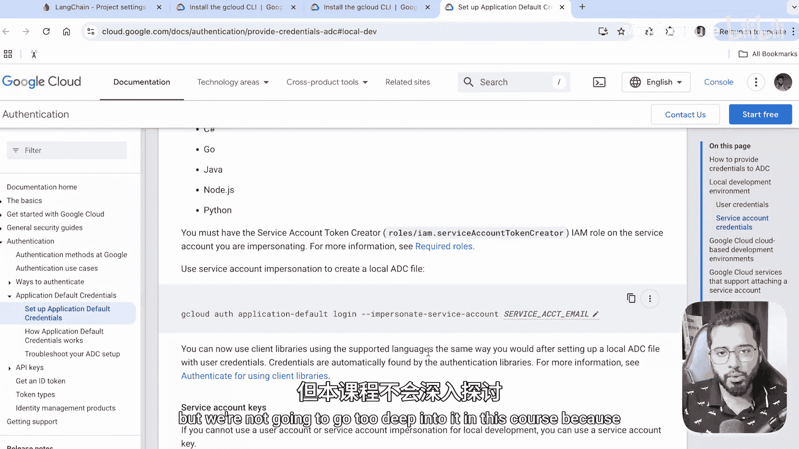

### 构建与运行对话链
其余代码与上一节几乎完全相同。主要的区别在于，我们不再使用一个普通的 Python 列表作为 `chat_history`，而是使用上面创建的 `FirestoreChatMessageHistory` 对象。

```python
from langchain_openai import ChatOpenAI
from langchain_core.prompts import ChatPromptTemplate, MessagesPlaceholder
from langchain.chains import LLMChain

# 初始化模型和提示模板（与之前相同）
prompt = ChatPromptTemplate.from_messages([
    ("system", "你是一个友好的助手。"),
    MessagesPlaceholder(variable_name="chat_history"),  # 历史消息将自动插入此处
    ("human", "{input}")
])
llm = ChatOpenAI(model="gpt-3.5-turbo")
chain = LLMChain(llm=llm, prompt=prompt)

# 对话循环
while True:
    user_input = input("你：")
    if user_input.lower() == 'exit':
        break
    # 调用链，传入当前输入和云端的历史记录
    response = chain.invoke({"input": user_input, "chat_history": chat_history.messages})
    print(f"AI：{response['text']}")

    # 将用户消息和AI回复添加到历史记录对象中
    # FirestoreChatMessageHistory 会自动处理将这些消息保存到云端
    chat_history.add_user_message(user_input)
    chat_history.add_ai_message(response['text'])
```

**关键点**：`FirestoreChatMessageHistory` 类封装了与 Firestore 交互的复杂性。当我们调用 `add_user_message` 或 `add_ai_message` 时，它不仅会更新本地对象的状态，还会自动将消息持久化到云端的 Firestore 数据库中。同样，当我们初始化它时，它会自动从云端加载指定 `session_id` 的所有历史消息。

## 效果演示

运行上述代码后：
1.  首次运行：在 Firestore 的 `chat_history` 集合下，会创建一个以 `session_id` 命名的文档，其中包含对话消息的子集合。你的消息和 AI 的回复会作为文档存储在其中。
2.  停止程序后重新运行：只要使用相同的 `session_id`，程序启动时就会自动从 Firestore 加载之前的所有对话历史，从而实现无缝的对话延续。

## 总结

本节课中我们一起学习了如何将 LangChain 聊天应用的历史记录从内存迁移到 **Firebase Firestore** 云端数据库。我们完成了 Firebase 项目的创建、数据库设置、本地环境认证，并最终使用 `langchain-google-firestore` 包提供的 `FirestoreChatMessageHistory` 类，以极少的代码改动实现了聊天历史的云端持久化。这为构建可投入生产环境、支持多会话的聊天应用奠定了基础。

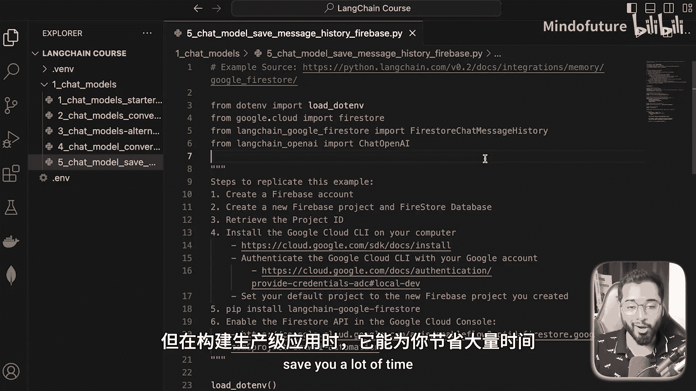

接下来，我们将进入 LangChain 另一个核心组件——**提示模板（Prompt Templates）** 的学习。它将帮助我们更高效、规范地构建和管理发送给 AI 模型的指令。