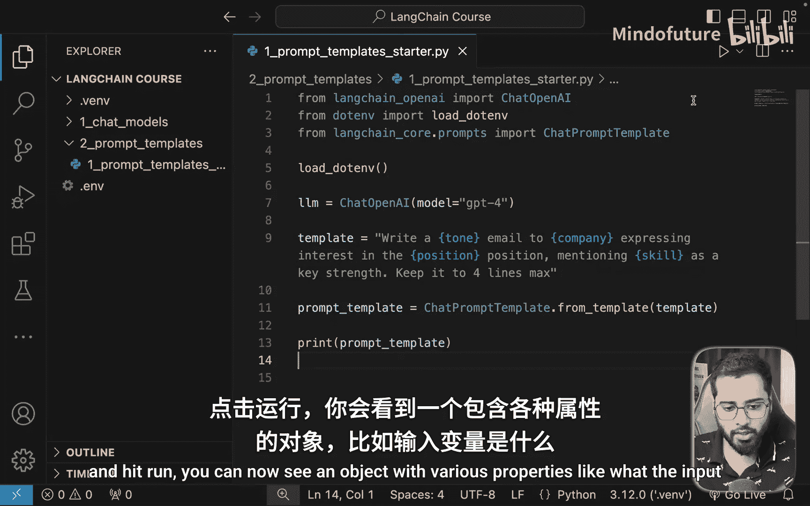
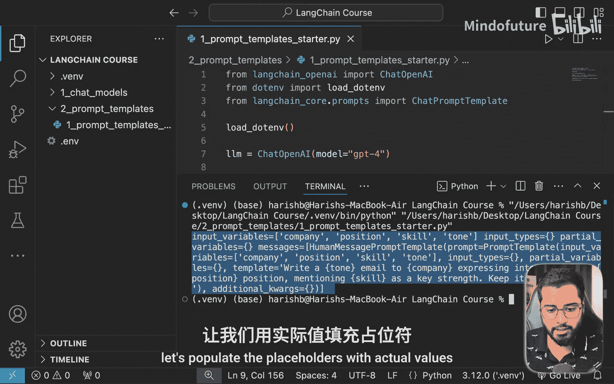
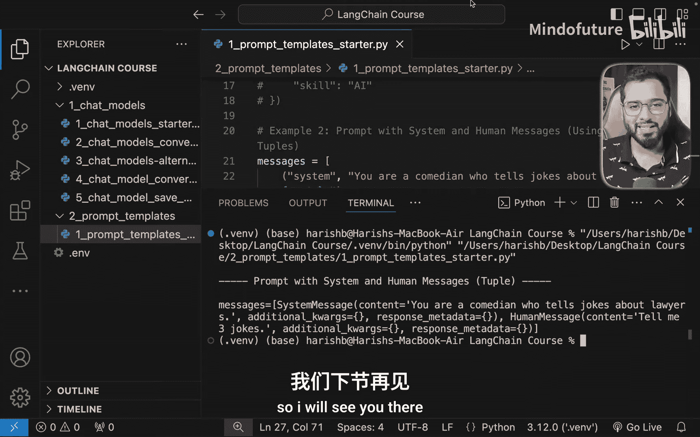

# 012：提示模板 📝

在本节课中，我们将要学习LangChain的第二个核心组件：提示模板。提示模板是一种强大的工具，它允许我们创建可复用的提示结构，并通过动态替换占位符来生成具体的提示内容。这在构建生产级应用时非常有用。

## 概述

提示模板的核心思想是将一个包含占位符的字符串（模板）转换为LangChain能够理解的格式，然后通过传入具体的值来填充这些占位符，最终生成一个完整的提示发送给大语言模型。

## 从示例开始理解

为了更好地理解提示模板，让我们先看一个简单的例子。假设我们需要一个生成求职邮件的提示。

以下是一个基本的提示字符串，其中包含了一些占位符，如`{tone}`、`{company}`、`{position}`和`{skill}`。

```python
template_string = “写一封语气为 {tone} 的邮件给 {company} 公司，表达对 {position} 职位的兴趣，并提及 {skill} 作为关键优势。”
```

这些占位符可以被自定义的值替换。例如：
*   `tone` 可以是“热情的”、“自信的”、“专业的”或“温暖的”。
*   `company` 可以是“谷歌”、“亚马逊”、“三星”等任何公司。
*   `position` 可以是“设计师”、“开发工程师”等职位。
*   `skill` 是求职者具备的技能。

如果我们传入具体值，例如：`tone=专业`, `company=三星`, `position=AI工程师`, `skill=机器学习`，那么经过替换后，我们将得到一个完整的提示字符串：“写一封语气为 专业 的邮件给 三星 公司，表达对 AI工程师 职位的兴趣，并提及 机器学习 作为关键优势。”

如果你正在构建一个根据这些不同参数生成邮件的产品，使用提示模板可以轻松实现这一功能。

## 在代码中实现提示模板

现在，让我们看看如何在代码中实现上述功能。首先，我们创建一个新文件并初始化一个聊天模型，这与我们之前所做的没有区别。

```python
# 导入必要的库
from langchain_openai import ChatOpenAI

# 初始化聊天模型
llm = ChatOpenAI(model=“gpt-3.5-turbo”)
```

### 第一步：创建包含占位符的字符串

第一步是创建一个包含占位符的提示字符串。请注意，这个字符串目前只是我们人类能够理解的格式。

```python
# 步骤1：定义模板字符串
template_string = “写一封语气为 {tone} 的邮件给 {company} 公司，表达对 {position} 职位的兴趣，并提及 {skill} 作为关键优势。”
```

### 第二步：转换为LangChain理解的格式

下一步是将这个提示字符串转换为LangChain能够理解的格式。为此，我们需要导入`ChatPromptTemplate`类。





```python
# 步骤2：导入ChatPromptTemplate并转换模板
from langchain_core.prompts import ChatPromptTemplate

prompt_template = ChatPromptTemplate.from_template(template_string)
```
`langchain_core`包在我们之前安装`langchain-openai`时已自动安装。现在，如果我们打印`prompt_template`变量，可以看到一个包含各种属性（如输入变量）的对象。

### 第三步：用实际值填充占位符

第三步是使用具体的值来填充模板中的占位符。我们使用`invoke`方法来完成这个操作。

```python
# 步骤3：填充占位符
prompt = prompt_template.invoke({
    “tone”: “充满活力的”,
    “company”: “三星”,
    “position”: “AI工程师”,
    “skill”: “深度学习”
})
```
运行后，`prompt`变量将包含一个消息列表（通常是一个`HumanMessage`），其内容中的占位符已被替换。这正是发送给LLM所需的格式。

### 第四步：发送给LLM并获取回复

最后，我们可以将这个构建好的提示发送给聊天模型以获取回复。

```python
# 步骤4：发送给LLM
result = llm.invoke(prompt)
print(result.content)
```
运行代码，你将收到一封根据指定参数（如“充满活力的”语气）生成的求职邮件。

## 构建更复杂的提示模板

上面介绍的方法有一个局限性：它总是创建一个只包含单条人类消息的列表。但有时我们需要更多的控制，例如，创建一个同时包含可定制系统消息和人类消息的提示。

实现这一点也非常简单。我们可以使用一个元组列表来定义消息序列。

```python
# 定义包含系统消息和人类消息的模板
message_templates = [
    (“system”, “你是一个专业的求职助手。请根据以下要求生成邮件。”),
    (“human”, “写一封语气为 {tone} 的邮件给 {company} 公司，表达对 {position} 职位的兴趣，并提及 {skill} 作为关键优势。”)
]

# 使用 from_messages 方法创建模板
complex_prompt_template = ChatPromptTemplate.from_messages(message_templates)

# 填充占位符
final_prompt = complex_prompt_template.invoke({
    “tone”: “专业的”,
    “company”: “三星”,
    “position”: “AI工程师”,
    “skill”: “强化学习”
})

print(final_prompt)
```
运行这段代码，你将看到一个包含`SystemMessage`和`HumanMessage`的列表，其中的占位符也已被正确替换。如果你的产品需要这种功能，现在你就知道如何实现了。同样，你可以将这个`final_prompt`传递给LLM来获取回复。

## 总结

本节课我们一起学习了LangChain的核心组件——提示模板。我们掌握了如何：
1.  创建一个包含占位符的字符串模板。
2.  使用`ChatPromptTemplate.from_template()`将其转换为LangChain格式。
3.  使用`.invoke()`方法并传入字典来动态填充占位符。
4.  将生成的完整提示发送给大语言模型以获取响应。
5.  通过`ChatPromptTemplate.from_messages()`构建包含多种角色（如系统消息）的更复杂提示序列。

提示模板是一个相对简单但极其重要的组件，它使我们的提示变得可复用和可动态配置，为构建复杂的AI应用奠定了基础。



在下一节中，我们将探讨另一个核心组件：链。这是一个功能强大且充满趣味的组件，其潜力几乎是无限的。敬请期待！