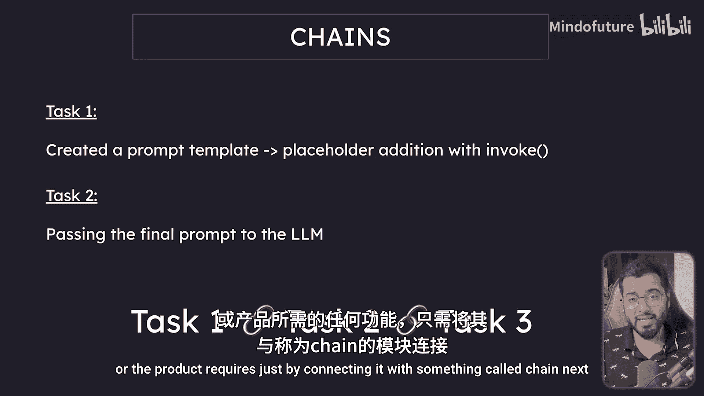
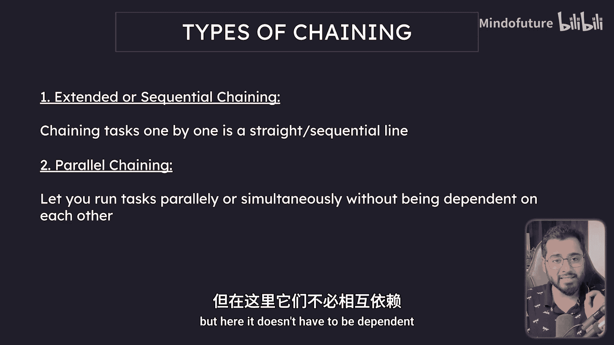
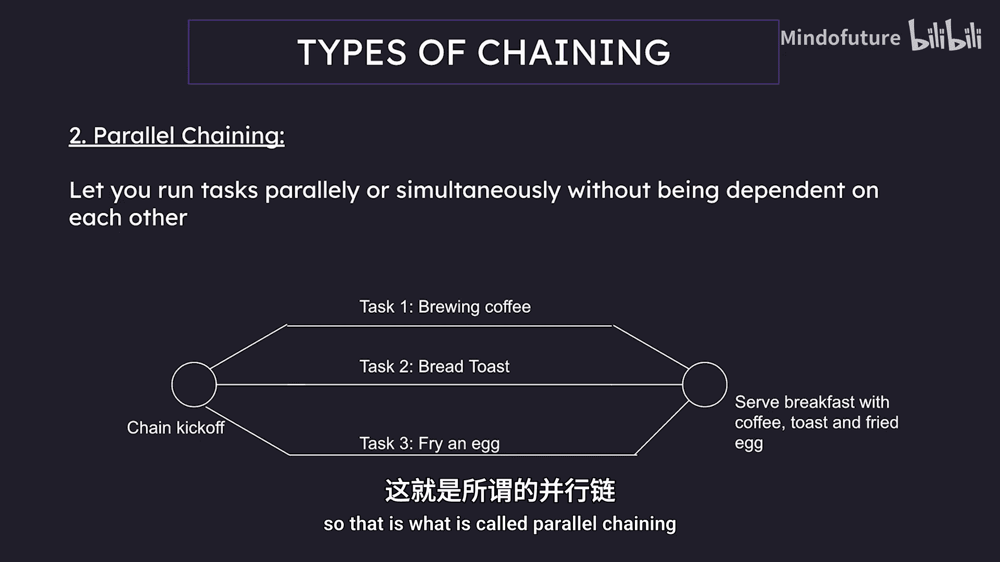
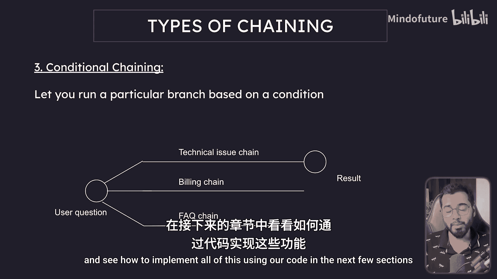

# 013：链概述 🧩

在本节中，我们将介绍Langchain的第三个核心组件——链。链是我个人最喜欢的组件，因为它允许你将多个任务连接起来，从而创建一个统一的工作流。

## 链的核心概念

链的核心思想是将多个独立的处理步骤串联起来。每个步骤的输出可以作为下一个步骤的输入。这类似于工厂的流水线，每个环节处理特定的任务，最终共同完成一个复杂的目标。

## 链的类型

链主要分为三种类型，每种类型适用于不同的场景。以下是这三种类型的详细介绍。

### 1. 顺序链

顺序链是最直观的链类型。任务一个接一个地执行，前一个任务的输出是后一个任务的输入。

**公式表示：** `任务A -> 任务B -> 任务C`

例如，一个简单的工作流可能包含以下步骤：
1.  使用提示模板生成问题。
2.  将生成的问题发送给大语言模型获取答案。
3.  将大语言模型的答案翻译成另一种语言（如法语）。
4.  将翻译后的结果通过电子邮件发送出去。

这个流程就是典型的顺序链，每个环节都依赖于前一个环节的结果。



### 2. 并行链


与顺序链不同，并行链中的多个任务可以同时执行，彼此之间没有依赖关系。所有任务执行完毕后，其结果可以汇聚到下一个环节。

**代码逻辑描述：**
```python
# 伪代码示例
task1_result = run_parallel(task_brew_coffee)
task2_result = run_parallel(task_make_toast)
task3_result = run_parallel(task_fry_egg)

final_result = serve_breakfast(task1_result, task2_result, task3_result)
```

例如，准备一份早餐可能涉及三个并行任务：煮咖啡、烤面包、煎鸡蛋。这三个任务可以同时进行，互不干扰，最后将它们的产出组合成一份完整的早餐。





### 3. 条件链

条件链引入了分支逻辑。任务的执行路径会根据某个条件或决策点的结果而改变，只有满足条件的那个分支会被执行。

**代码逻辑描述：**
```python
# 伪代码示例
user_choice = get_user_input()

if user_choice == “技术问题”:
    run_chain(troubleshooting_sequence)
elif user_choice == “账单问题”:
    run_chain(billing_inquiry_sequence)
else:
    run_chain(general_faq_sequence)
```

例如，在一个客服聊天机器人中，根据用户选择的问题类型（技术问题、账单问题或一般咨询），系统会触发完全不同的处理流程。每个流程都是一个独立的链，系统只会执行与用户选择相匹配的那一个。



## 总结


本节课我们一起学习了Langchain中“链”的概念。我们了解到，链是将多个组件连接成工作流的核心工具。我们介绍了三种主要的链类型：**顺序链**用于线性依赖的任务，**并行链**用于可同时执行的独立任务，而**条件链**则用于实现基于不同条件的分支逻辑。理解这些链的类型是构建复杂AI应用的基础。在接下来的章节中，我们将通过代码实践，学习如何具体实现这些链。