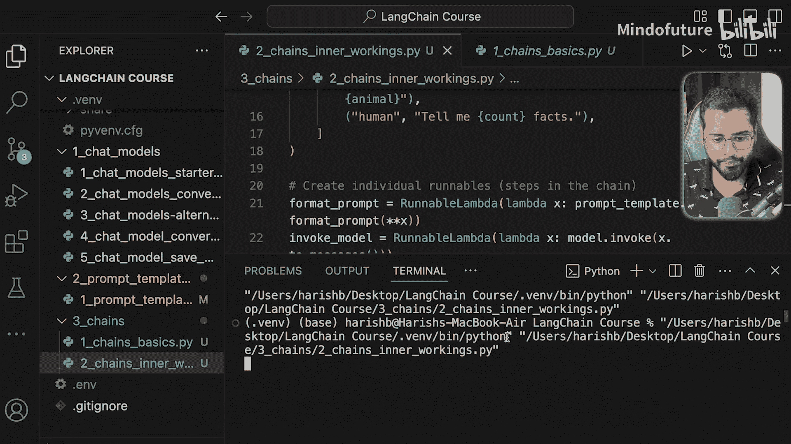

# 015：链的内部工作原理 🔧

在本节课中，我们将学习Langchain中“链”的内部工作原理。通过理解其底层机制，你将能够根据自身业务需求更灵活地定制工作流。我们将通过手动构建一个链，来揭示使用管道操作符（`|`）时背后实际发生的事情。

## 概述

在上一节中，我们使用管道操作符将不同的任务连接在一起。我们创建了一个提示词模板，其结果传递给模型，然后大语言模型（LLM）的结果再传递给另一个仅提取`content`属性的任务。本节中，我们将尝试在不使用管道操作符的情况下实现相同的功能，这有助于我们看清链在底层是如何运作的。


## 代码准备

首先，我们创建一个新文件，并复制上一节中编写的所有代码。这包括创建模型、提示词模板以及定义占位符。

```python
# 此处是上一节的所有代码，用于创建模型和提示词模板
```

## 理解任务目标

我们的目标是创建一个工作流，它需要完成三个任务：
1.  使用提供的值调用提示词模板，生成最终的提示词字符串。
2.  将生成的提示词字符串传递给聊天模型，调用LLM。
3.  从LLM的响应中仅提取`content`属性。

为了手动连接这些任务，我们需要引入两个新概念：`RunnableLambda`和`RunnableSequence`。

## 使用 RunnableLambda 封装任务

`RunnableLambda`是一个简单的包装器，它允许我们将每个任务封装成一个独立、可复用的单元。每个`RunnableLambda`接收输入，对其进行处理（例如填充提示词或调用模型），然后输出结果。这样，我们可以将每个步骤平滑地连接起来。

以下是创建第一个任务（格式化提示词）的示例：

```python
from langchain_core.runnables import RunnableLambda, RunnableSequence

# 任务1：格式化提示词
task1 = RunnableLambda(lambda x: prompt.format_prompt(**x))
```

在这个`RunnableLambda`中，我们提供了一个函数（这里使用了Python的lambda匿名函数），它接收输入值`x`（一个字典）并返回计算后的值。`format_prompt(**x)`方法会用字典`x`中的值替换提示词模板中的所有占位符。

**请注意**：这里我们使用的是`format_prompt`方法，而不是上一节中直接使用的`invoke`方法。`invoke`方法不仅会替换占位符，还会将数据转换为适合发送给LLM的格式。而`format_prompt`仅负责替换占位符，数据格式的转换将在我们最终调用整个链时完成。

## 定义后续任务

现在，我们继续定义第二个和第三个任务。

```python
# 任务2：调用LLM模型
task2 = RunnableLambda(lambda x: model.invoke(x))
# 任务3：从响应中提取content属性
task3 = RunnableLambda(lambda x: x.content)
```

至此，我们有了三个独立的`Runnable`（即可运行任务单元），但它们尚未连接成一个统一的工作流。

## 使用 RunnableSequence 连接任务

接下来，我们需要将这些任务链接起来。Langchain提供了`RunnableSequence`类来实现这一功能。

`RunnableSequence`类总是接收三个参数：
*   **第一个参数**：工作流的第一个任务（单个`Runnable`）。
*   **中间参数**：一个包含所有中间任务的列表（`List[Runnable]`）。无论中间有一个、两个还是一千个任务，都放在这个列表里。
*   **最后一个参数**：工作流的最后一个任务（单个`Runnable`）。

以下是创建链的代码：

```python
# 使用RunnableSequence将任务连接成链
chain = RunnableSequence(task1, [task2], task3)
```

现在，我们得到了一个完整的链`chain`，可以通过提供占位符值来调用它：

```python
# 调用链并传入参数
result = chain.invoke({"topic": "cats", "count": 2})
print(result)
```

运行代码，我们将得到关于猫的两个事实，这与我们的预期一致。

## 两种方式的对比

实际上，使用`RunnableSequence`类和使用管道操作符（`|`）在底层是等价的。管道操作符是Langchain表达式语言（LCEL）的一部分，它提供了一种更简洁、更易读的方式来连接`Runnable`。

将两种方式对比来看：



```python
# 方式一：使用RunnableSequence类（本节介绍的方法）
chain_v1 = RunnableSequence(task1, [task2], task3)

# 方式二：使用管道操作符（上一节使用的方法，LCEL）
chain_v2 = task1 | task2 | task3
```

显然，使用管道操作符的代码更加简洁明了。在大多数实际开发中，推荐使用LCEL和管道操作符来构建链。

## 总结

本节课中，我们一起深入探讨了Langchain链的内部工作原理。我们学习了如何：
1.  使用`RunnableLambda`将每个处理步骤封装成独立的任务单元。
2.  使用`RunnableSequence`类手动将这些任务单元按顺序连接成一个完整的工作流。
3.  理解了这种手动构建方式与使用管道操作符（`|`）的LCEL方式在功能上是等效的，但后者在语法上更简洁。

理解这些底层机制为你未来定制复杂链或调试工作流打下了坚实基础。在下一节中，我们将探索更有趣的内容：不同类型的链，如扩展链、并行链和条件分支链，并了解它们在实际场景中的应用。