# 016：链的顺序链接 🔗

在本节课中，我们将学习如何扩展已构建的链，以及如何持续添加更多的可运行组件。我们将通过一个具体示例，演示如何将多个任务按顺序连接起来，形成一个完整的工作流。

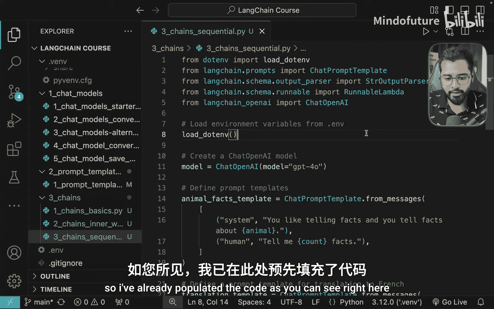

---

上一节我们介绍了链的基本概念。本节中，我们来看看如何将多个可运行组件按顺序链接，构建更复杂的处理流程。

我们使用与上一节相同的提示词模板，但为其赋予了一个更清晰的名称。

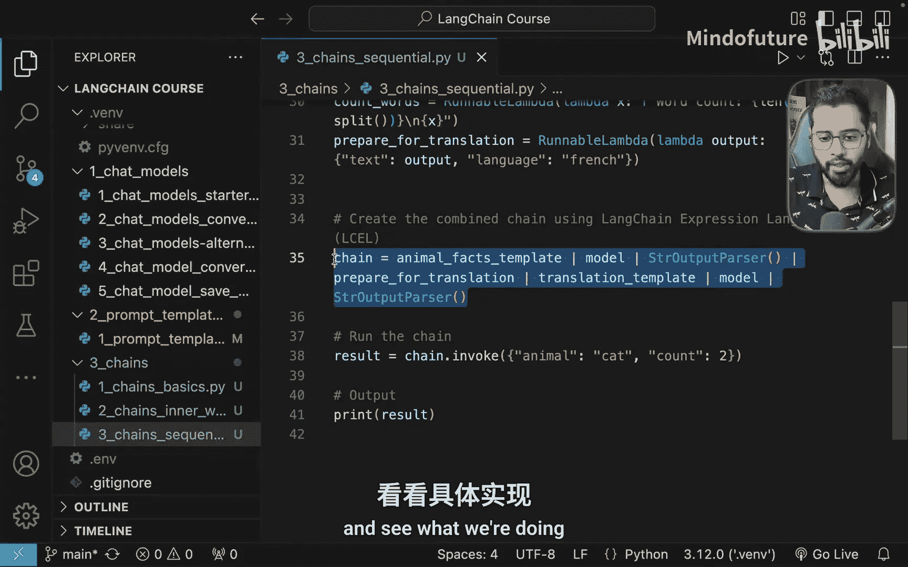

```python
prompt_template = PromptTemplate(...)
```

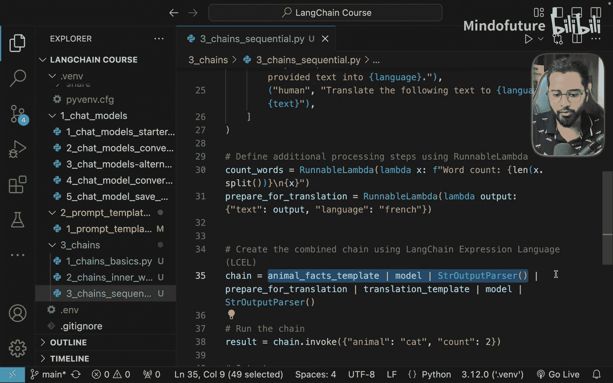

我们还添加了更多提示词。现在，让我们直接查看链的核心部分，从头开始理解其工作原理。

首先，我们已有前三个步骤。第一个提示词模板会指示模型生成关于特定动物的若干条事实。在本例中，是生成关于猫的两条事实。

```python
# 生成关于猫的两条事实
chain_part1 = prompt_template | model | StrOutputParser()
```

我们在此处仅提取文本内容。很好，现在我们得到了两条事实。

那么接下来呢？

假设我的应用场景是运营一个法语推特页面，而非英语页面。模型生成的响应是英文的。因此，我需要做的下一件事是将这段文本发送给大语言模型，要求其翻译成法语。

在调用大语言模型之前，我们总是需要做一件事：准备一个提示词模板，用于指示模型将文本翻译成特定语言。提示词模板需要一个对象作为输入。然而，上一步的输出只是一个字符串，并非对象。因此，我们需要准备输入，使其能够传入提示词模板。

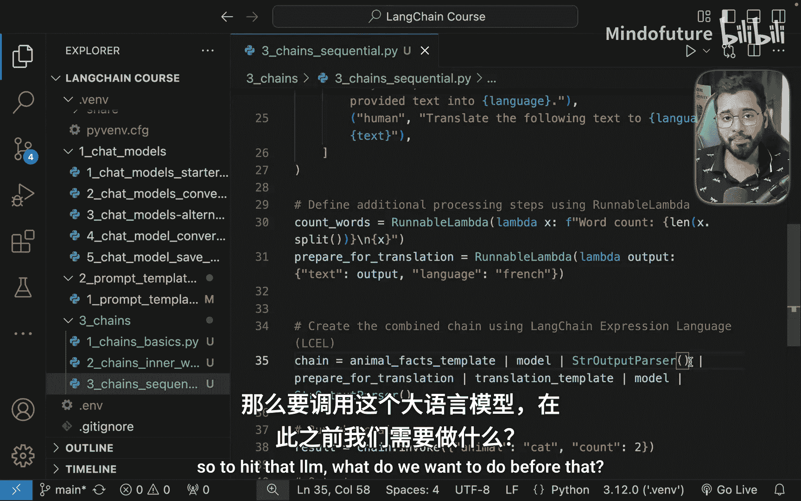

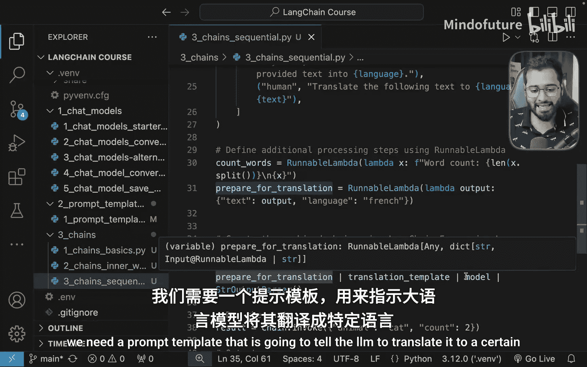

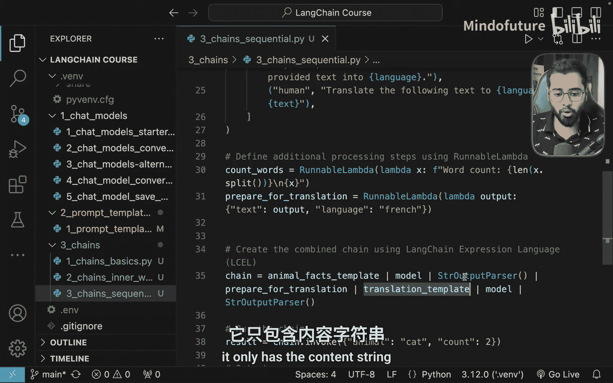

为此，我们编写了一个名为 `prepare_input_for_translation` 的可运行组件。

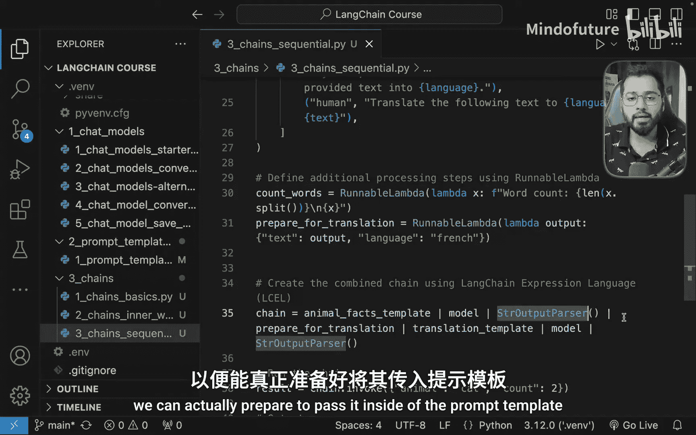

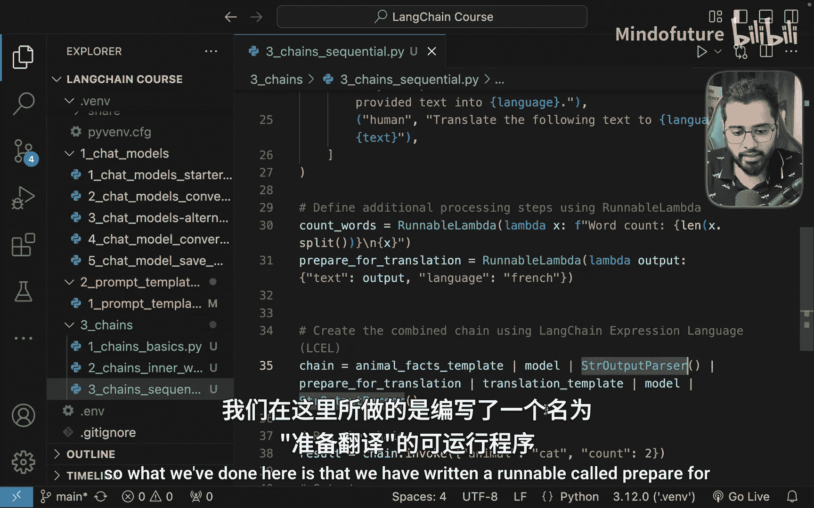

```python
def prepare_input_for_translation(previous_output):
    # 接收上一步的输出
    # 返回一个包含文本和语言信息的字典对象
    return {"text": previous_output, "language": "French"}
```

这个组件接收上一个任务（生成事实）的输出。你可以看到，它同时提供了输出文本和目标语言，并将其作为一个对象返回给下一个任务。

现在，这个对象被传入翻译的提示词模板。模板指示模型：“你是一名翻译，你的工作是将文本转换为指定语言”。我们已在对象中提供了文本和语言信息。最终，完整的提示词被生成。

随后，这个提示词被发送给模型，模型被调用，我们最终将翻译后的内容打印到控制台。整个过程就是如此简单。

让我们实际运行这个文件。点击运行按钮，稍等几秒钟。

完美。我们可以看到关于猫的两条事实已被翻译成法语（虽然我也看不懂）。我们甚至可以进一步扩展这个链。

例如，我们可以创建另一个可运行组件，让它调用推特API，将这条翻译后的内容作为一条推文发布出去。

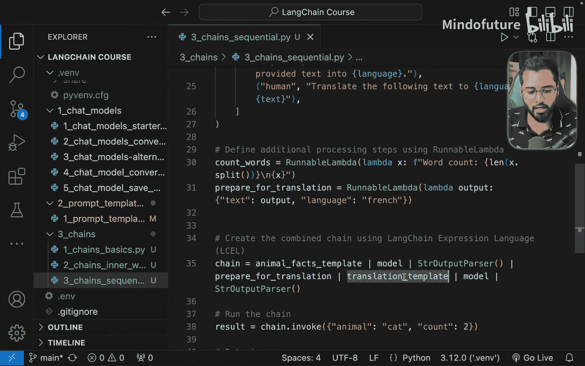

```python
# 伪代码示例：发布到推特
def post_to_twitter(translated_text):
    # 调用推特API的逻辑
    pass
```

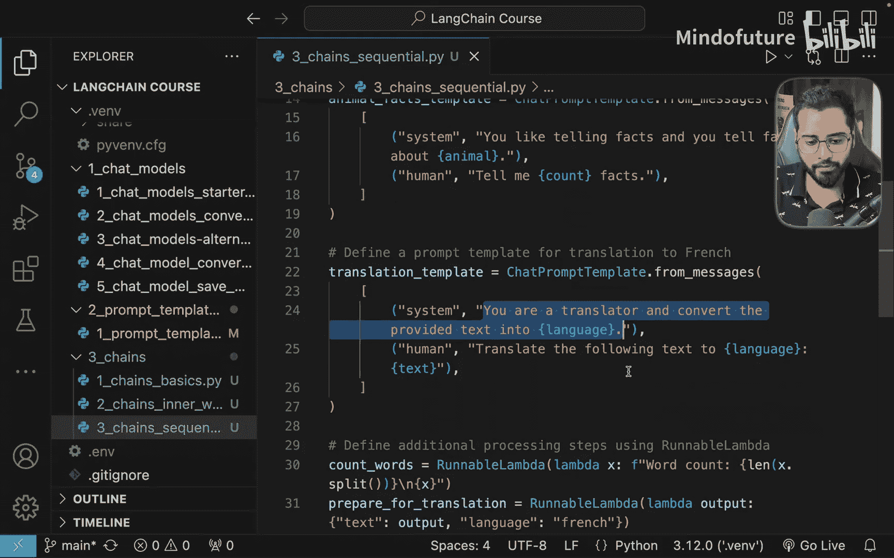

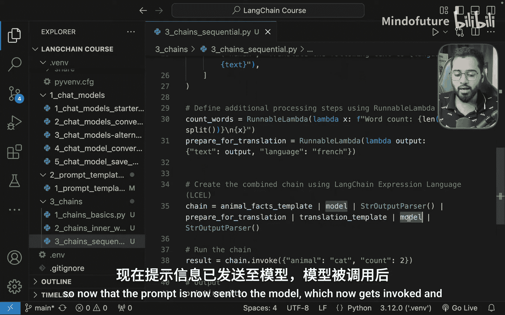

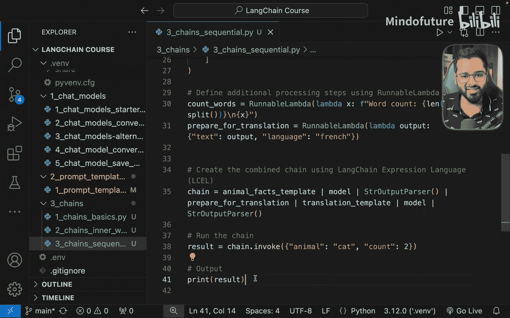

由此可见，在使用链时，可能性是无限的。我们可以持续地、按顺序在一条直线上添加越来越多的链。这就是顺序链的核心概念。

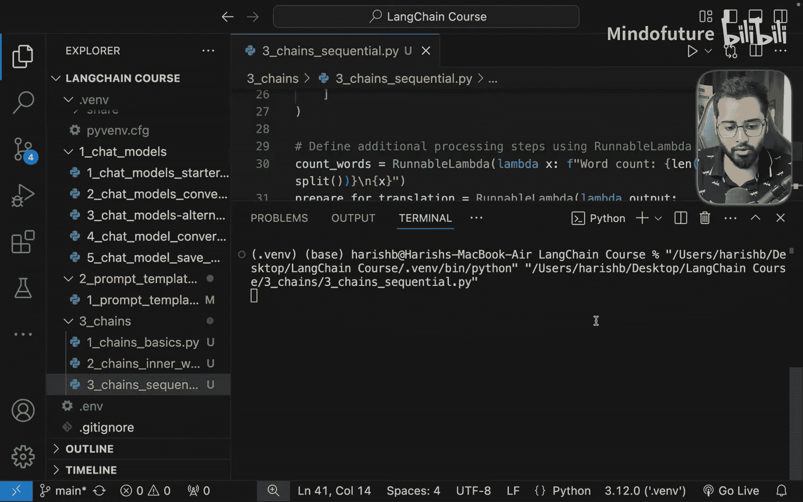

在下一节中，我们将探讨一种称为“并行链”的链类型。敬请期待。

---

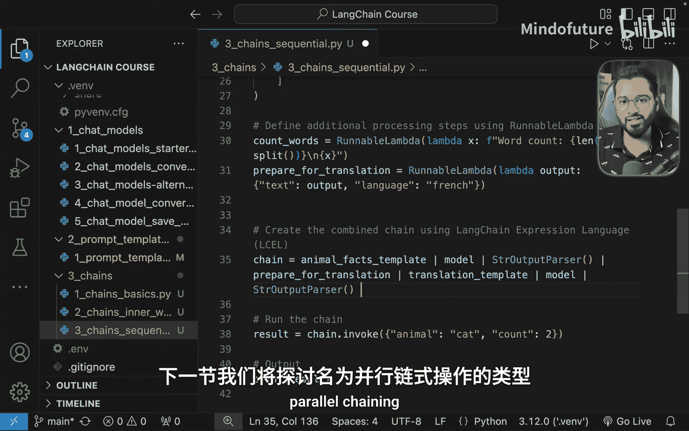

本节课中，我们一起学习了如何构建顺序链。我们从一个生成事实的简单链开始，通过添加一个翻译组件将其扩展，并理解了如何通过准备合适的输入对象来连接不同的任务。顺序链允许我们将多个步骤线性组合，构建出功能强大的自动化工作流。