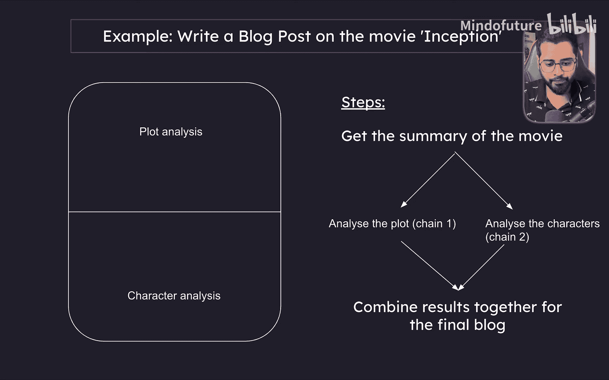
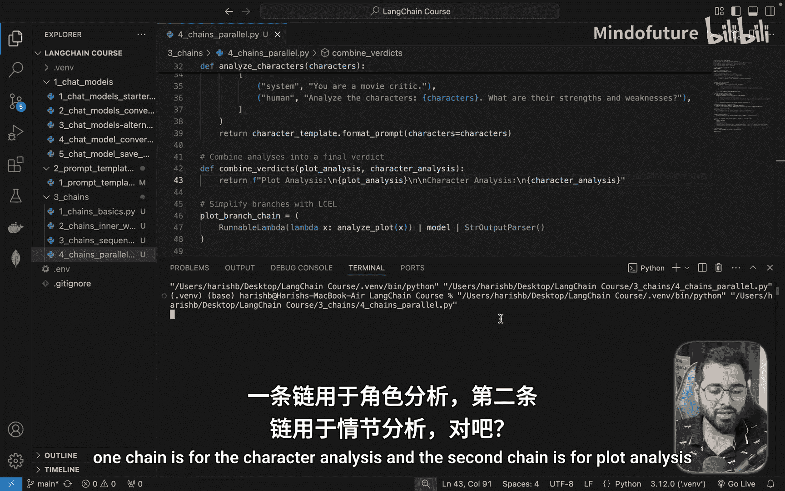
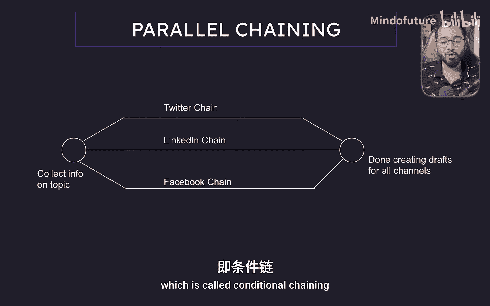

Langchain初学者入门2025：P17：并行链 🚀

在本节中，我们将学习如何在Langchain中使用并行链。并行链允许我们同时启动并运行多个独立的处理流程，并在所有流程完成后汇总结果，这能显著提升复杂任务的执行效率。

为了理解其工作原理，让我们回顾一下基本概念。并行链的执行模式是：首先触发一个初始任务，这个任务会同时启动两个、三个甚至上百个独立的处理链。这些链会**并行**运行。一旦所有链都执行完毕，我们就可以对所有链的输出结果进行后续处理。

### 构建一个电影博客分析示例 🎬

我们将通过一个简单的例子来演示。假设我们要撰写一篇关于电影《盗梦空间》的博客文章。我们希望博客的第一部分分析电影情节，第二部分分析电影角色。

以下是实现此目标的步骤：
1.  首先，我们从大语言模型获取电影的摘要。
2.  得到摘要后，我们同时启动两个独立的链：
    *   第一个链负责分析情节。
    *   第二个链负责分析角色。



这个例子虽然简单，但其模式可以应用于各种场景：触发一个任务，并行启动多个处理链，最后汇总所有结果。

现在，让我们深入代码，一步步查看具体实现。

### 代码解析与实现 🔧

首先，我们需要从LLM获取电影摘要。在调用LLM之前，我们总是需要先构建提示词。

```python
# 定义获取摘要的提示词模板
summary_template = ChatPromptTemplate.from_messages([
    ("system", "你是一位影评人。请为我提供电影《{movie}》的简要摘要。")
])
```

获取摘要后，有趣的部分开始了。我们将使用Langchain提供的 `RunnableParallel` 类来并行运行多个链。

```python
from langchain_core.runnables import RunnableParallel

# 创建并行链
parallel_chain = RunnableParallel(
    branches={
        "plot_analysis": plot_chain,
        "character_analysis": character_chain
    }
)
```

在 `RunnableParallel` 中，我们定义了一个 `branches` 字典，为每个要并行运行的链指定一个名称。这里我们有两个分支：
*   `plot_chain`: 分析情节的链。
*   `character_chain`: 分析角色的链。

每个分支本身都是一个完整的链。例如，`plot_chain` 会接收上一步得到的电影摘要，构造一个要求分析情节的提示词，然后调用LLM获取输出。`character_chain` 的结构与之类似。

当所有这些并行链都执行完毕后，我们会进入链的下一阶段，在那里我们将所有结果组合起来。

```python
# 假设这是组合结果的方法
def combine_results(results):
    # results 是一个字典，包含各个分支的输出
    plot = results["plot_analysis"]
    characters = results["character_analysis"]
    return f"情节分析：{plot}\n\n角色分析：{characters}"
```

`RunnableParallel` 的输出是一个对象，其 `branches` 属性包含了每个分支名称及其对应的结果。我们只需将这些结果提取并组合即可。

运行这段代码，我们会先得到电影摘要，然后并行进行情节和角色分析。最终输出将包含两部分清晰的分析内容。

### 并行链的实际应用场景 💡



这个简单的例子展示了并行链的基础用法。你可以根据业务需求，将其应用于多种场景。我再举一个例子，以便你更好地理解这个概念的应用。

假设你需要就同一个主题在多个社交媒体渠道（如Twitter、LinkedIn、Instagram、Facebook）上发布内容。每个渠道都有其独特的格式和风格要求。

我们可以这样设计流程：
1.  **初始任务**：收集关于该主题的所有必要信息。
2.  **并行处理**：为每个社交媒体渠道启动一个独立的链。每个链负责：
    *   根据目标渠道的风格格式化内容。
    *   （可选）调用该渠道的API，将内容发布为帖子或保存为草稿以供审核。

通过这种方式，我们高效地完成了跨平台的内容适配与发布任务。并行链的可能性几乎是无限的，它为我们处理需要多路并发的复杂工作流提供了强大支持。

### 总结 📝

本节课我们一起学习了Langchain中的并行链。我们了解了其**同时触发、独立运行、汇总结果**的核心工作模式，并通过电影博客分析的例子实践了如何使用 `RunnableParallel` 来构建并行处理流程。最后，我们还探讨了它在多社交媒体渠道内容发布等真实场景中的应用。掌握并行链将帮助你设计出更高效、更强大的AI应用工作流。



在下一节中，我们将学习最后一种链类型：条件链。敬请期待。