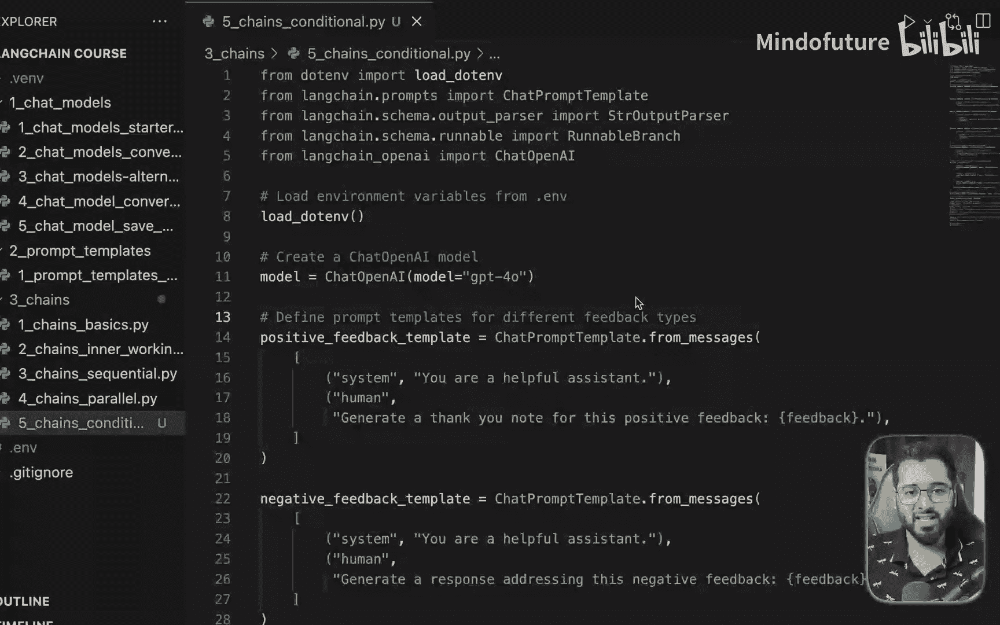
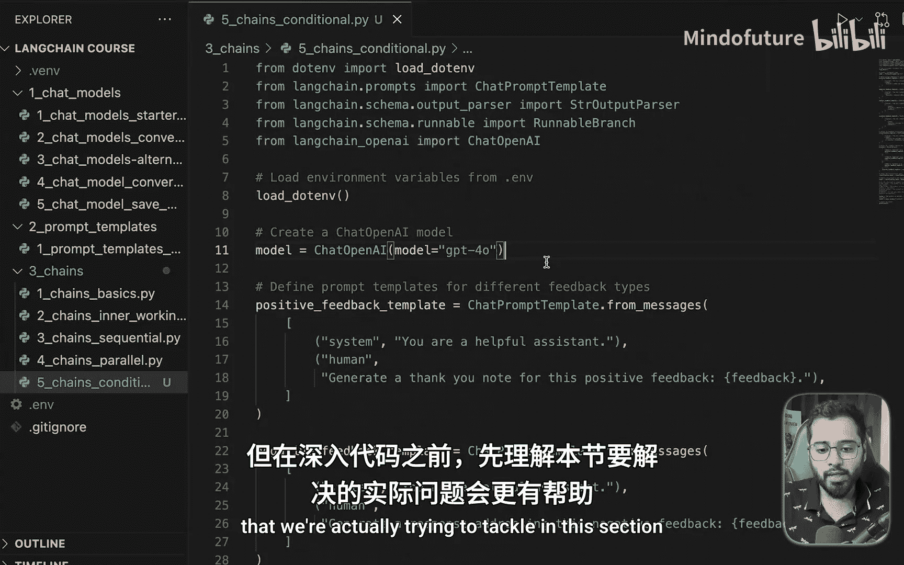
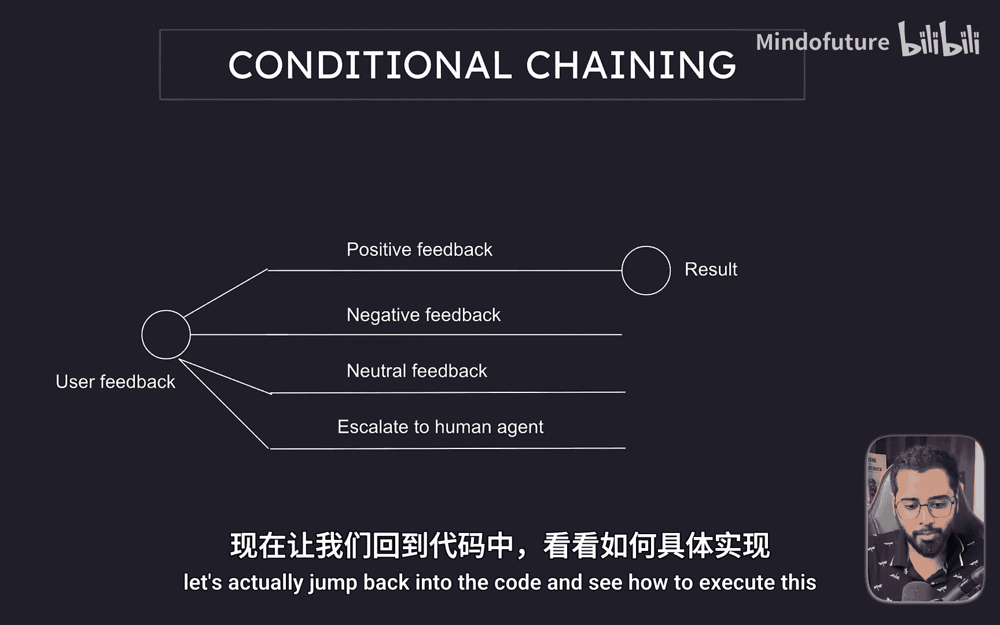
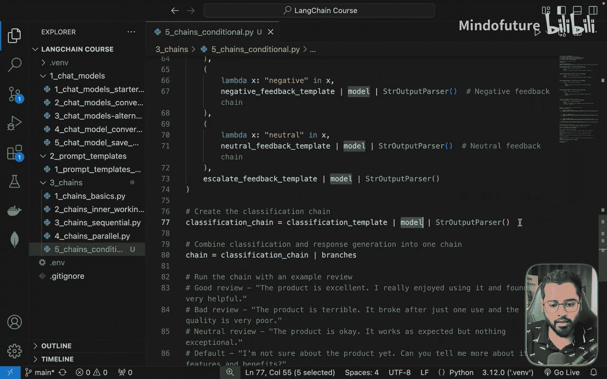
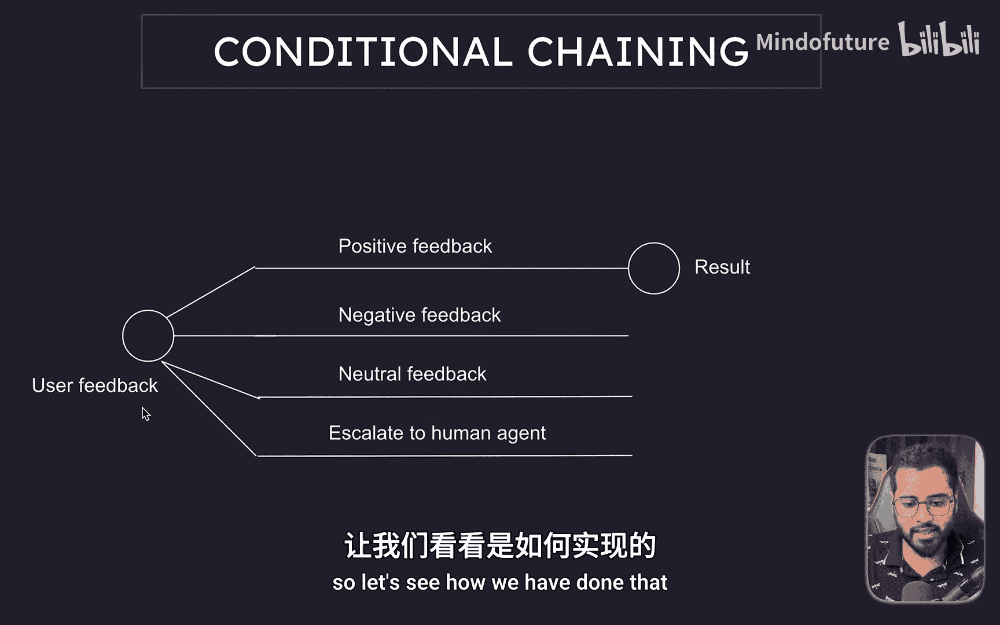
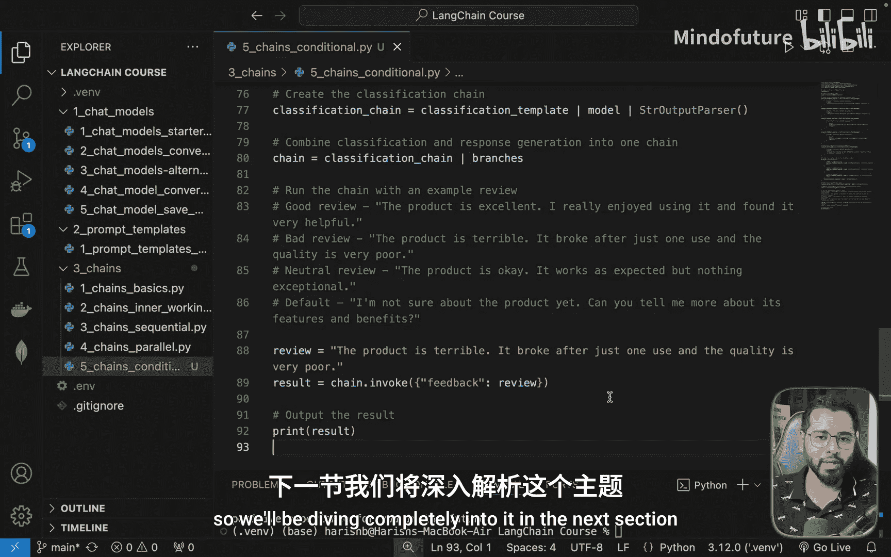

# 018：条件链 🧠

在本节课中，我们将学习最后一种常用的链类型：条件链。我们将通过一个电商网站用户反馈处理的自动化案例，来理解如何根据不同的条件，让AI流程走向不同的分支。





## 概述

上一节我们介绍了并行分支链，它会让所有分支同时执行。本节中我们来看看条件链，它的核心是根据一个判断条件，让控制流选择性地进入多个分支中的某一个。这就像编程中的 `if-else` 或 `switch-case` 语句。

## 问题场景

假设你运营一个电商网站，用户可以对购买的产品留下反馈。根据反馈的类型（正面、负面、中性或需要升级处理），客服的回应方式会完全不同。我们的目标是使用Langchain和AI来自动化这个客服响应流程。

其工作流程如下图所示：


流程分为两步：
1.  **分析反馈**：首先，我们将用户反馈发送给模型，让它判断反馈属于“正面”、“负面”、“中性”还是“需要升级”。
2.  **条件分支**：然后，根据上一步的判断结果，控制流会进入对应的分支链，生成特定的客服回应。

## 代码实现解析

让我们通过代码来具体看看如何实现这个条件链。我们将采用从整体到局部的方式进行分析。

### 1. 分类链



首先，我们需要一个链来分析用户反馈的情感。以下是这个分类链的核心代码结构：

```python
# 1. 创建提示模板
classification_prompt = ChatPromptTemplate.from_template(
    “””
    你是一个乐于助人的助手。
    请将以下反馈的情感分类为：positive, negative, neutral 或 escalate。
    反馈：{feedback}
    “””
)

# 2. 构建分类链
classification_chain = classification_prompt | llm | StrOutputParser()
```

这个链的作用是接收用户 `feedback`，并输出一个分类关键词（positive/negative/neutral/escalate）。这对应了流程图中的第一步。

### 2. 条件分支路由

获得反馈类型后，我们需要根据它路由到不同的处理链。这通过 `RunnableBranch` 实现，它类似于一个 `switch-case` 语句。



以下是定义分支的代码逻辑：



```python
from langchain.schema.runnable import RunnableBranch

# 定义不同的处理分支
branches = RunnableBranch(
    (lambda x: x[“sentiment”] == “positive”, positive_chain),
    (lambda x: x[“sentiment”] == “negative”, negative_chain),
    (lambda x: x[“sentiment”] == “neutral”, neutral_chain),
    escalate_chain # 默认分支
)
```

每个分支都是一个独立的链。例如，`positive_chain` 的提示可能是：“请为这条正面反馈生成一封感谢信。反馈：{feedback}”。

### 3. 组合完整链

最后，我们将分类链和分支链组合起来，形成完整的工作流。

```python
# 组合链：先分类，再根据结果路由到对应分支
full_chain = {
    “feedback”: lambda x: x[“feedback”], # 传递原始反馈
    “sentiment”: classification_chain, # 获取分类结果
} | branches # 路由到分支
```

当运行这个完整链时，它会自动执行“分析->路由->生成响应”的完整流程。

## 运行示例

我们用一个硬编码的负面反馈来测试：“产品太差了，只用了一次就坏了。”

运行程序后，AI会先将其分类为“negative”，然后路由到负面反馈处理链。该链可能会生成如下回应：
> “对于您糟糕的体验我们深表歉意。感谢您提出这个问题。为了能更好地帮助您，能否提供更多您遇到的细节？”

你可以尝试替换不同的反馈内容（如正面、中性、需升级的反馈），观察控制流如何进入不同的分支并生成相应的回应。

## 总结

本节课我们一起学习了条件链。我们了解了如何：
1.  使用一个链（分类链）来生成判断条件。
2.  利用 `RunnableBranch` 根据条件将控制流路由到多个分支链中的一个。
3.  构建一个完整的、能根据输入内容动态选择处理路径的AI应用。

掌握条件链后，你应该有信心根据实际业务问题来设计和构建自己的链式工作流了。

在下一节中，我们将进入Langchain另一个极为重要且强大的模块：**RAG（检索增强生成）**。它正在深刻改变许多业务的运作方式，能极大提升效率。虽然理解起来略有挑战，但掌握它将使你成为一名非常有价值的开发者。我们下节课见！



