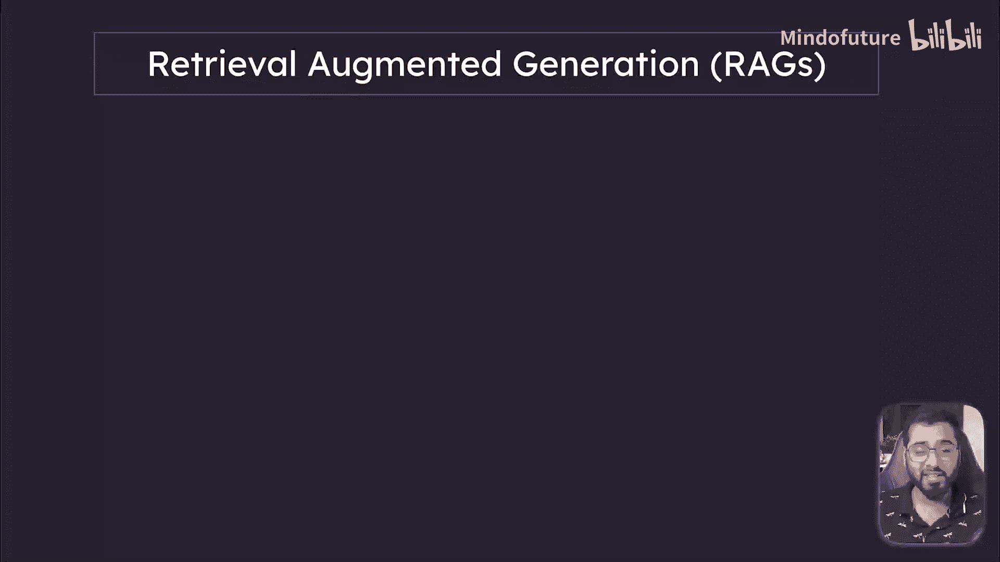
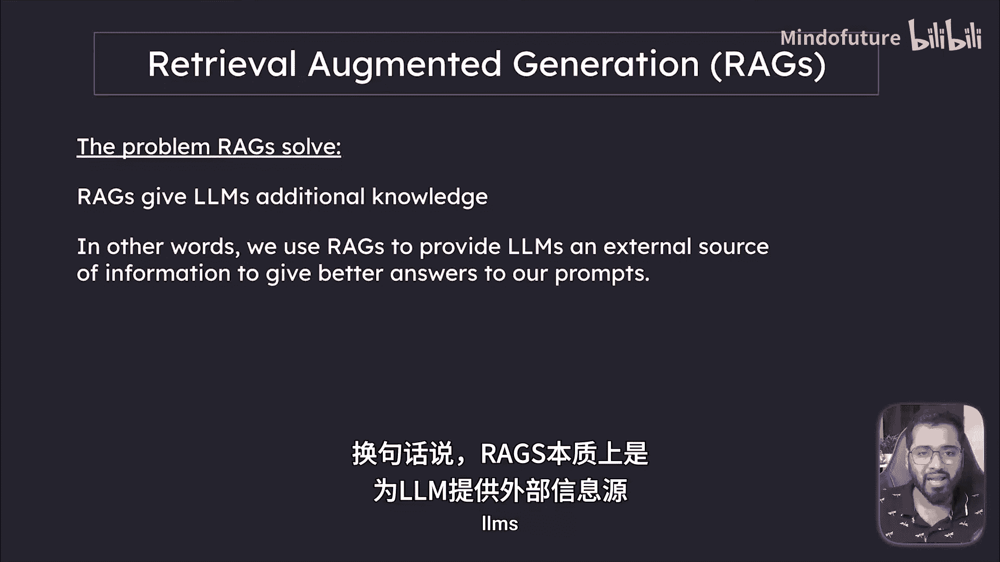
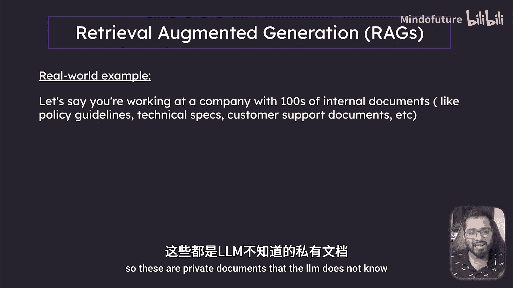
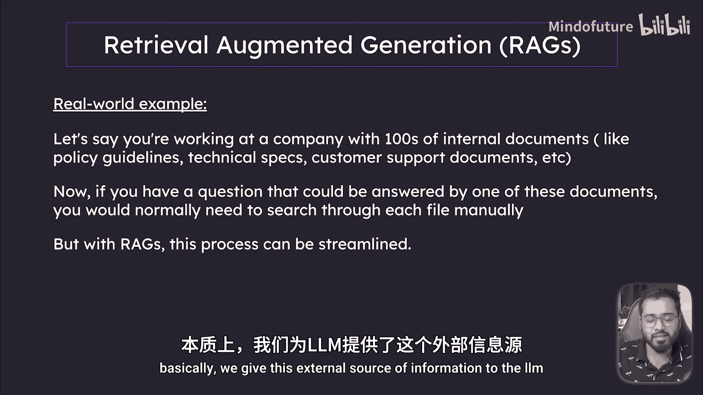
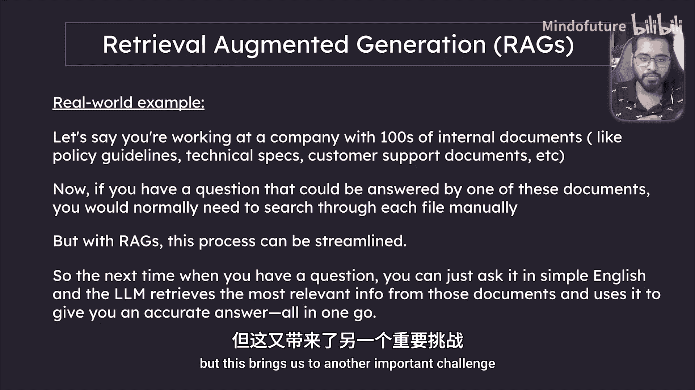
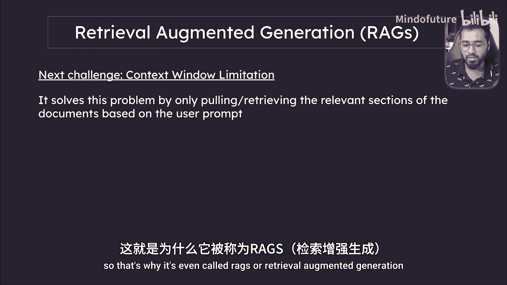
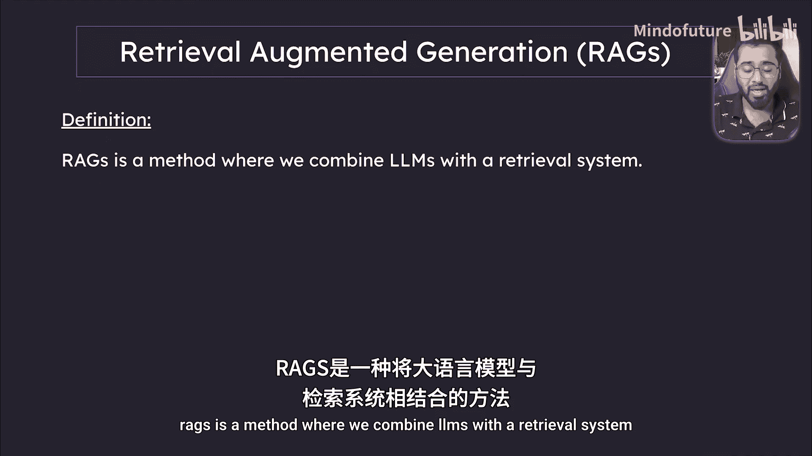
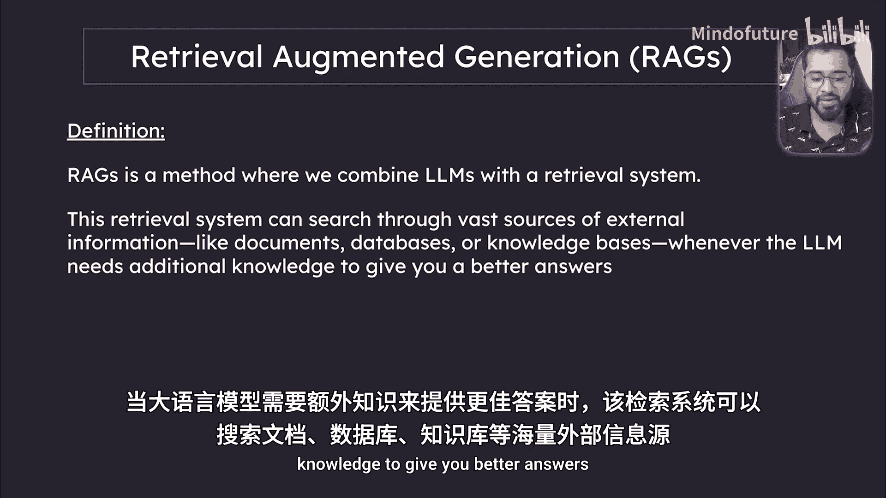
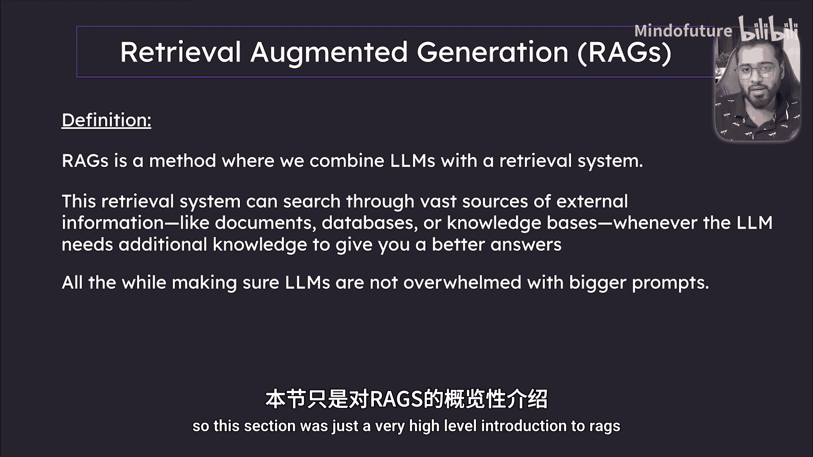
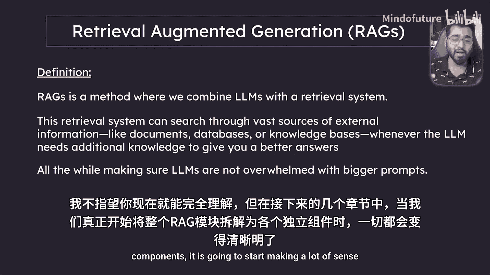

# 019：RAGs介绍 🧠

在本节课中，我们将开始学习Langchain的第四个核心概念：RAGs，即检索增强生成。我们将了解RAGs是什么，它解决了什么问题，以及它如何工作。

---

## 什么是RAGs及其解决的问题？

RAGs主要解决大语言模型的一个核心问题：**为LLMs提供额外的知识**。换句话说，RAGs为LLM提供了一个外部信息来源，使其能更好地回答用户的问题。

如果这听起来有些抽象，让我们通过一个简单的例子来探索。

### 一个工作场景示例

假设你在一家公司工作，公司内部有数百份文档，例如政策指南、技术规格书、客户支持文档等。这些都是LLM所不知道的私有文档。

当你有一个问题，而答案可能存在于这些文档中的任何一份时，在没有AI的情况下，你通常需要手动翻阅每一份文档来寻找答案，或者询问同事。

然而，借助AI，特别是RAGs技术，我们可以极大地简化这一过程。我们不是手动翻阅所有文件，而是让LLM能够访问所有这些私有数据。这样，下次你有问题时，只需用简单的英语提问。由于LLM现在可以访问你的所有私有信息，它能够梳理这些数据，并为你提供一个信息充分且准确的答案。这就是RAGs的力量。

---

## RAGs解决的第二个挑战：上下文限制

但这引出了另一个重要挑战：**上下文限制**。你可能遇到过这种情况：当你向LLM输入大量文本时，它很难回答问题，甚至开始“幻觉”或忘记之前的内容。这是因为上下文窗口或限制变得非常高。

因此，我们不能简单地将所有私有文档都“倾倒”到ChatGPT等模型的提示词中，然后提问，因为这是行不通的。

RAGs解决的第二个问题正是**上下文限制**。它让你可以将所有PDF等文档提供给LLM，而无需实际将它们全部塞进一个提示词里。RAGs的解决方式是：**仅根据用户提供的提示，从文档中提取相关的部分**。

通过这种方式，我们保持了信息的精简，只从所有文档中提取与用户问题相关的特定“块”，然后发送给LLM。这也正是它被称为“检索增强生成”的原因。

---

## RAGs的正式定义

让我们来看一个更准确的定义：

**RAGs是一种将LLMs与检索系统相结合的方法。**

这个检索系统可以在LLM需要额外知识以提供更好答案时，搜索海量的外部信息来源，如文档、数据库、知识库等。

同时，它确保LLM不会被过大的问题所淹没。

---

## 本节总结与下节预告

本节课只是对RAGs的一个高层次介绍。我们不要求你现在就完全理解它。

在接下来的几节中，当我们真正开始将整个RAG模块拆解成其各个组成部分时，一切都会变得清晰明了。这正是我们下一节要开始做的事情。