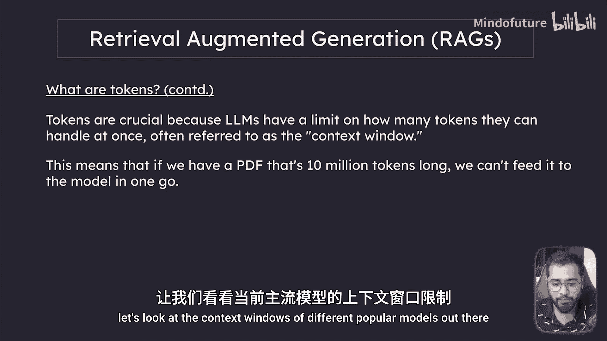
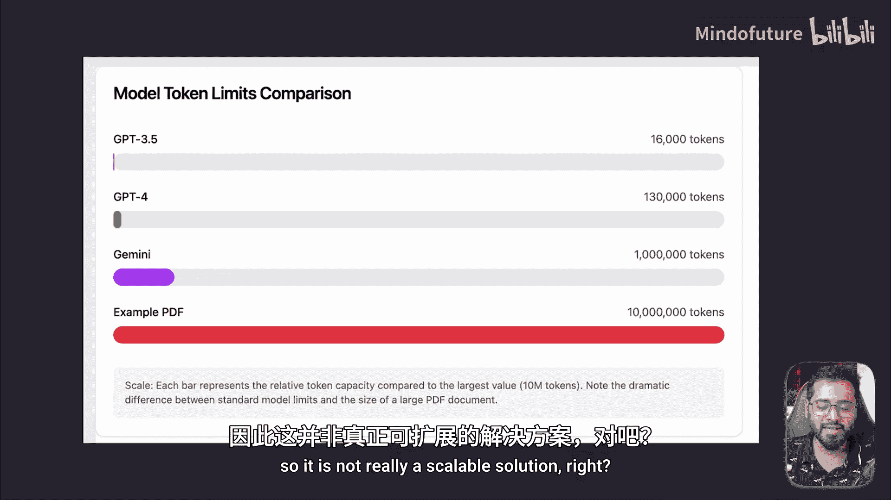
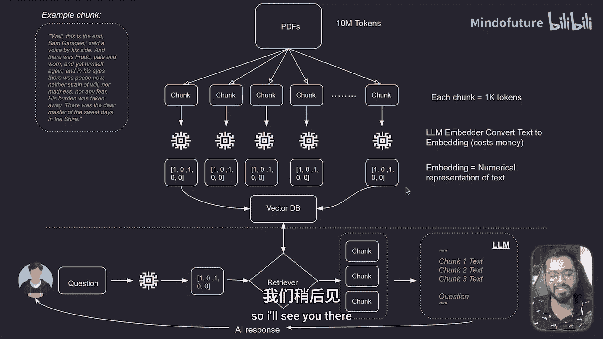

# 020：RAGs工作流程详解（第一部分） 🧩

在本节课中，我们将深入拆解检索增强生成系统的完整工作流程，并逐一剖析其核心组件。通过理解每个部分如何协同工作，你将发现实际的编码实现会变得非常简单。我们将使用上一节提到的例子，从处理大量私有文档开始，直到将其存储到向量数据库中。

上一节我们介绍了RAG系统的整体概念，本节中我们来看看其数据处理流程的第一步。

## 从文档到向量存储 📄➡️🗄️

在流程图中，我们从一个巨大的PDF文档开始，它可能包含上千万个标记。首先，我们需要理解什么是“标记”。

### 理解标记与上下文窗口

在语言模型的语境中，一个**标记**是模型处理的基本文本单位。标记可以短至一个字符，或长至一个单词，具体取决于语言和文本结构。

例如：
*   `hello` 是一个标记。
*   短语 `I am` 通常被拆分为两个标记：`I` 和 `am`。

标记至关重要，因为所有大语言模型一次能处理的标记数量都有限制，这个限制被称为**上下文窗口**。这意味着，如果一个PDF有1000万个标记，我们无法一次性将其全部输入给模型。

以下是不同流行模型的上下文窗口限制：

*   **GPT-3.5 Turbo**（免费版ChatGPT使用的模型）：约 **16，000** 个标记。
*   **GPT-4**：约 **128，000** 个标记。
*   **Google Gemini**：高达 **1，000，000** 个标记。

在我们的例子中，文档有**1000万**个标记，远超任何模型的上下文窗口。因此，直接向LLM提问是不可行的，模型会报错提示内容过长。这也不是一个可扩展的解决方案，因为未来文档可能会增长，而模型的上下文窗口可能保持不变。

### 引入分块技术

这正是RAG系统中引入**分块**步骤的原因。分块是将大型文档分割成多个较小片段的过程。

如图所示，我们将大文档分割成许多小块。假设每个块包含1000个标记，那么1000万标记的文档就会被分成大约10，000个块。

我们进行分块是因为无法将整个大文件扔给ChatGPT。但如果我们创建了小块，系统就可以根据用户的提问，通过**检索器**组件只查询那些相关的块，然后将这些块与用户问题一起传递给模型。

通过这种方式，我们可以传递多个块。例如，如果每个块是1000个标记，而免费版ChatGPT的上下文窗口是16000个标记，那么我们大约可以传递13-14个不同的块，同时为用户的问题留出足够的空间。

### 分块是什么样子？

如果你好奇分块具体是什么，它们本质上就是纯文本。想象一本500页的书，如果每个块只能有1000个标记，那么每个块可能就相当于4到5行文字或一个小段落。下一个块则是接下来的4到5行，顺序是保持连续的。

到目前为止，我们已经将大文本分割成了块。我们的下一个目标是：如何只提取与用户问题相关的块，并将这些特定块与问题一起发送给模型？

### 如何智能地检索相关块？

我们如何查询仅相关的块？当然，我们可以暴力搜索，寻找与问题完全匹配的单词，但这是种过时且低效的方法。我们需要根据**含义**而非确切的单词来收集块。

这时，**嵌入**和**向量数据库**的概念就登场了。它们允许我们进行语义搜索，即基于含义进行搜索，而不是寻找完全相同的单词或字母。

在下一部分，我们将简要了解一下嵌入和向量数据库是什么，然后再回到这个RAG流程中。

---

**本节课总结**：我们一起学习了RAG工作流程的第一部分。我们明白了由于大语言模型存在上下文窗口限制，无法直接处理超长文档。因此，我们引入了**分块**技术，将大文档切割成小块。同时，我们提出了一个新问题：如何从成千上万个块中，智能地找出与用户问题最相关的那些？这为下一节引入**嵌入**和**向量数据库**来解决语义检索问题做好了铺垫。