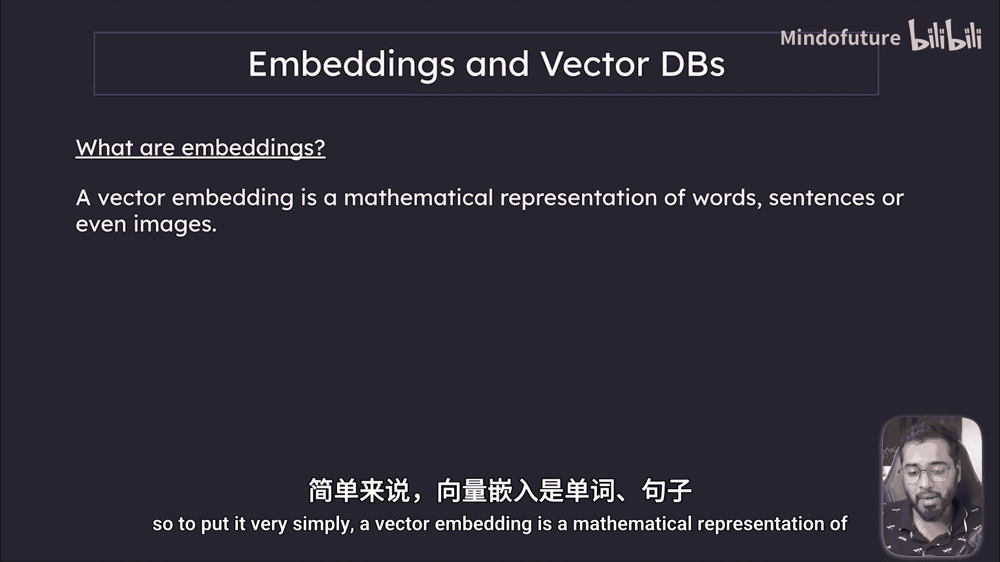
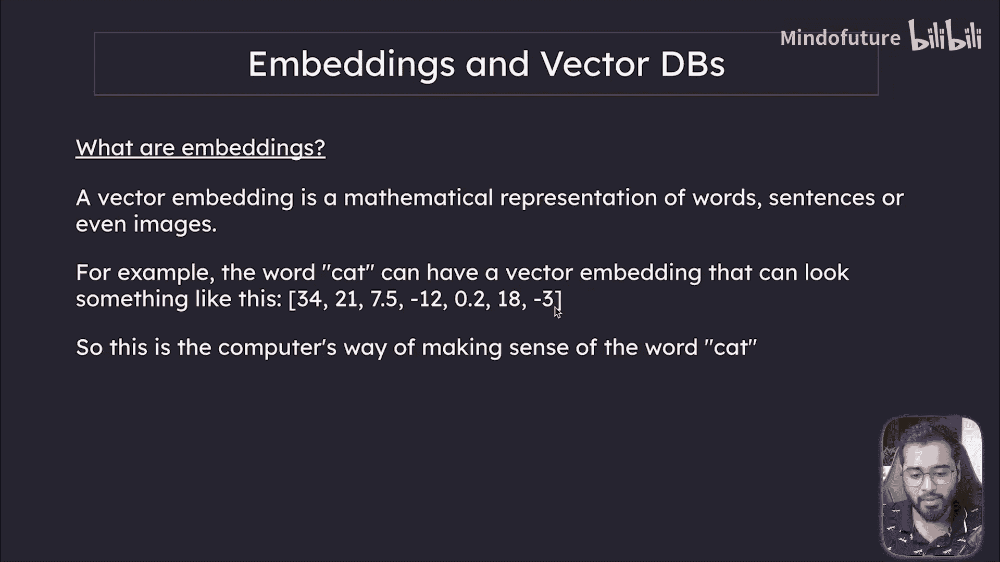
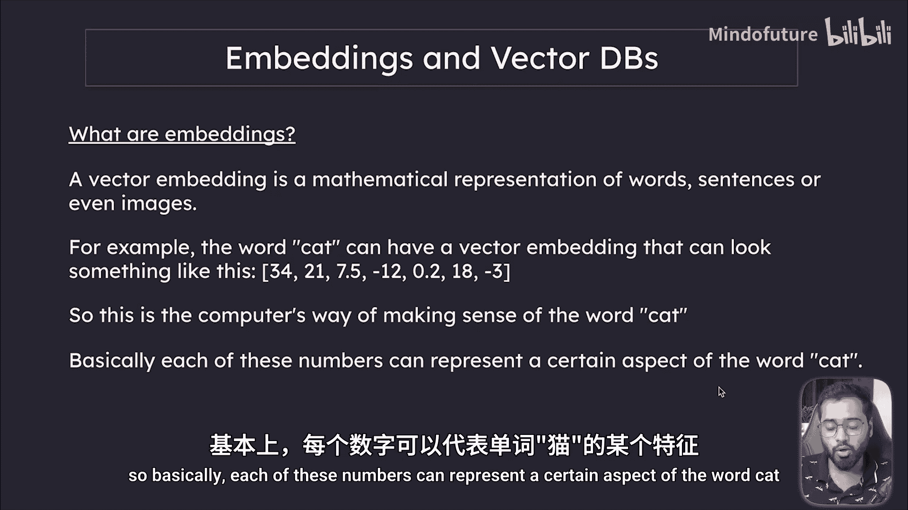
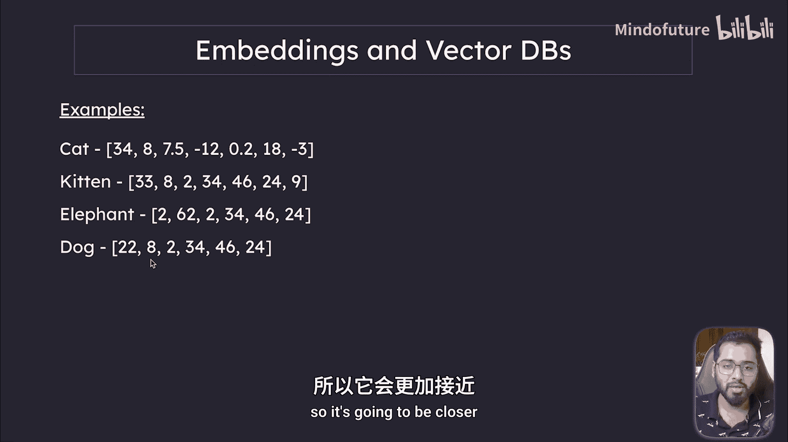
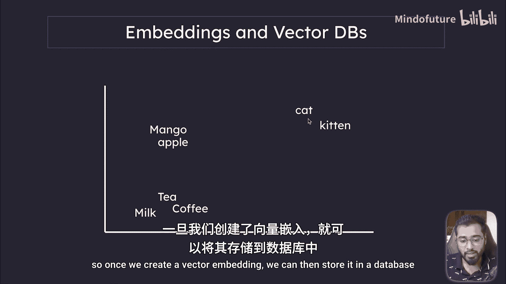
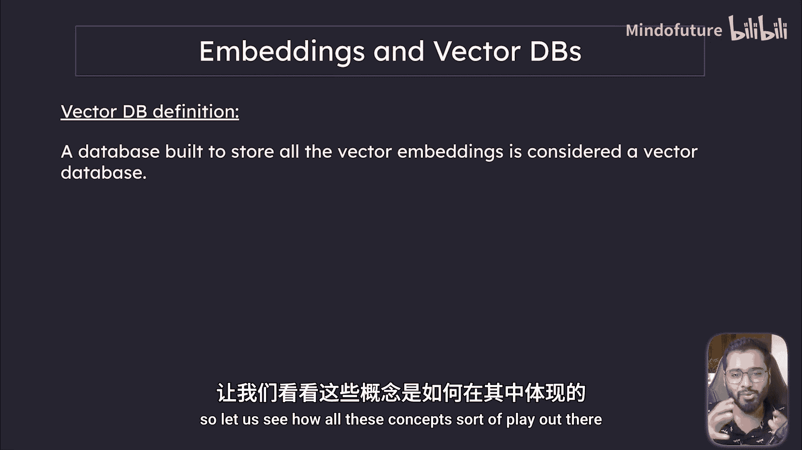

# 021：嵌入与向量数据库 🧠🗄️

在本节课中，我们将学习嵌入（Embeddings）和向量数据库（Vector Databases）的核心概念，并了解它们如何协同工作，为检索增强生成（RAG）等应用提供支持。

## 什么是嵌入？ 🤔

嵌入是一种数学表示方法，用于将单词、句子甚至图像转换为计算机可以理解的格式。简单来说，它把文本等数据转换成一串数字（即向量）。

例如，单词“cat”的向量嵌入可能看起来像这样：`[34, 0.9, -1.2, ...]`。这是计算机理解“cat”这个词的方式。ChatGPT等大型语言模型在底层也使用了类似的技术。

那么，这些数字代表什么呢？它们可以被视为描述某个概念的多个维度或特征。

## 理解嵌入的维度 📐

数组中的每个数字可以代表单词的某个特定方面。

*   **第一个数字**：可能代表物体的大小。例如，“cat”的第一个数值是34。那么“kitten”（小猫）的向量中，第一个数值会接近34，因为它们在大小上相似。相比之下，“elephant”（大象）嵌入的第一个数值会与34相差甚远。
*   **第二个数字**：可能代表它是否是宠物。由于猫和狗都是宠物，“dog”向量的第二个数值会与“cat”的第二个数值非常接近。

## 嵌入的几何意义：多维空间中的点 🗺️

我们可以把每个向量的值看作是**多维空间中的坐标**。

让我们看一个简单的二维图表示例。我们知道“cat”和“kitten”在含义上几乎相似，它们的向量坐标也非常接近。因此，在向量空间中，“cat”和“kitten”这两个点会靠得很近。

而像“mango”（芒果）这样的词，在几乎所有方面都不同，其坐标也会完全不同，因此在向量空间中会离“cat”和“kitten”非常远。

这只是一个简单的2D示例。实际上，嵌入向量通常有数百甚至数千个维度，包含了关于词语、句子之间关系的丰富信息。**语义相似的词或句子，其向量在空间中的位置也会彼此靠近**；不相关的则会相距甚远。

## 什么是向量数据库？ 💾

一旦我们创建了向量嵌入，就需要将其存储起来。专门用于存储和检索这些向量嵌入的数据库，就称为**向量数据库**。

与传统数据库基于精确匹配（如关键词）来检索信息不同，向量数据库的核心能力是**基于语义或含义进行检索**。它能够找到与查询向量在意义上最相近的向量，即使它们没有使用相同的词语。

## 回到RAG：概念如何落地 ⚙️

上一节我们介绍了RAG（检索增强生成）。现在，让我们看看嵌入和向量数据库是如何在RAG中发挥关键作用的。

在RAG流程中：
1.  首先，将您的文档（如知识库、文章）**分割**成较小的块（chunks）。
2.  然后，使用嵌入模型将这些文本块转换为**向量嵌入**。
3.  接着，将这些向量存储到**向量数据库**中。
4.  当用户提出一个问题时，系统同样将这个问题转换为向量（查询向量）。
5.  向量数据库会执行**相似性搜索**，快速找出与问题向量最相似的文档块向量。
6.  最后，将这些检索到的相关文本块作为上下文，与原始问题一起发送给大语言模型（LLM），从而生成更准确、基于知识的回答。

## 总结 📝

本节课我们一起学习了嵌入和向量数据库的核心概念。
*   **嵌入**是将非结构化数据（如文本）转换为计算机可处理的数值向量，其中语义相似的数据在向量空间中位置相近。
*   **向量数据库**是专门为高效存储和检索这些向量而设计的数据库，支持基于语义的相似性搜索。
*   在**RAG**等应用中，这两项技术结合使用，使大语言模型能够访问和利用外部知识，生成更可靠的回答。

理解嵌入和向量数据库是掌握现代AI应用，特别是那些需要处理和理解大量文本信息应用的基础。