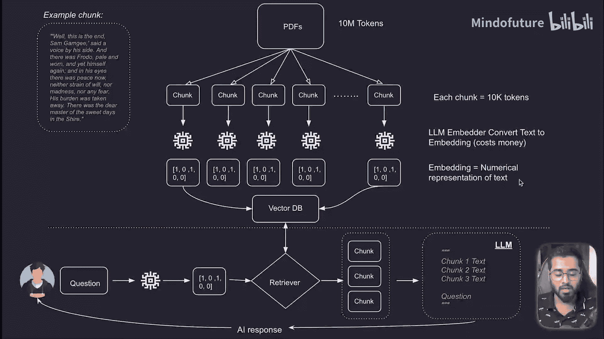
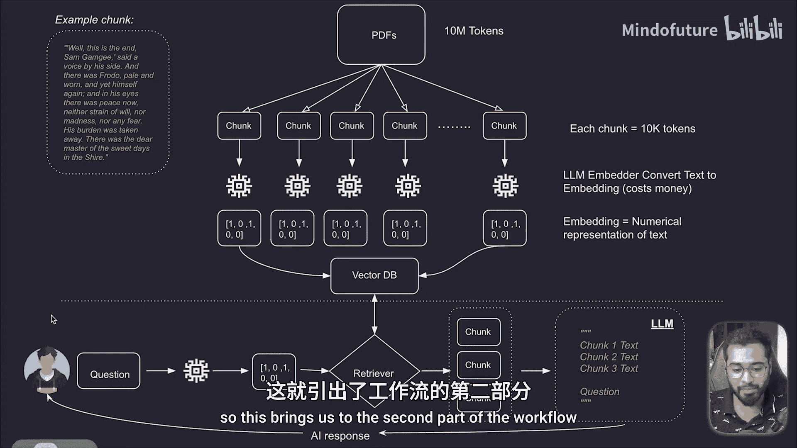

# 022：RAGs工作流程_第1部分（续） 🧩

在本节课中，我们将继续学习RAG（检索增强生成）工作流程的第一部分。我们将具体了解如何将文档块转换为向量嵌入，并将其存储到向量数据库中，为后续的检索步骤做好准备。

---

上一节我们介绍了嵌入和向量数据库的基本概念。本节中，我们来看看如何将分割好的文档块转化为向量，并存入向量数据库。

我们已经将一份大文档、一本厚书或任何数据分割成了若干“块”。这是流程的第一步。

第二步，我们需要将每一个文档块转换成向量嵌入。记住，嵌入是文本块在数学上的表示形式。

那么如何转换呢？我们可以使用大语言模型提供的嵌入器。市面上有很多选择，而OpenAI提供了一个嵌入API，可以将普通文本转换为嵌入向量。在本课程中，我们将使用这个API。

转换完成后，我们将得到每个文档块对应的嵌入向量。

最后，我们会将所有内容存储到向量数据库中。请注意，我们不仅存储每个块的嵌入向量版本，也会存储其原始纯文本版本。

因此，向量数据库中的每个条目都包含**嵌入向量**和**纯文本**。至此，我们整本书、PDF或任何私有数据就完整地存在于向量数据库中了。

正因为如此，我们现在可以根据用户的问题，只查询相关的文档块，并取回对应的原始文本。这引出了我们工作流程的第二部分，我们将在下一节进行探讨。

---

本节课中，我们一起学习了RAG流程中数据准备阶段的核心步骤：将分割后的文档块通过嵌入模型（如OpenAI的API）转换为向量，并将向量与原文一并存储到向量数据库中。这为后续基于用户查询进行精准检索奠定了数据基础。