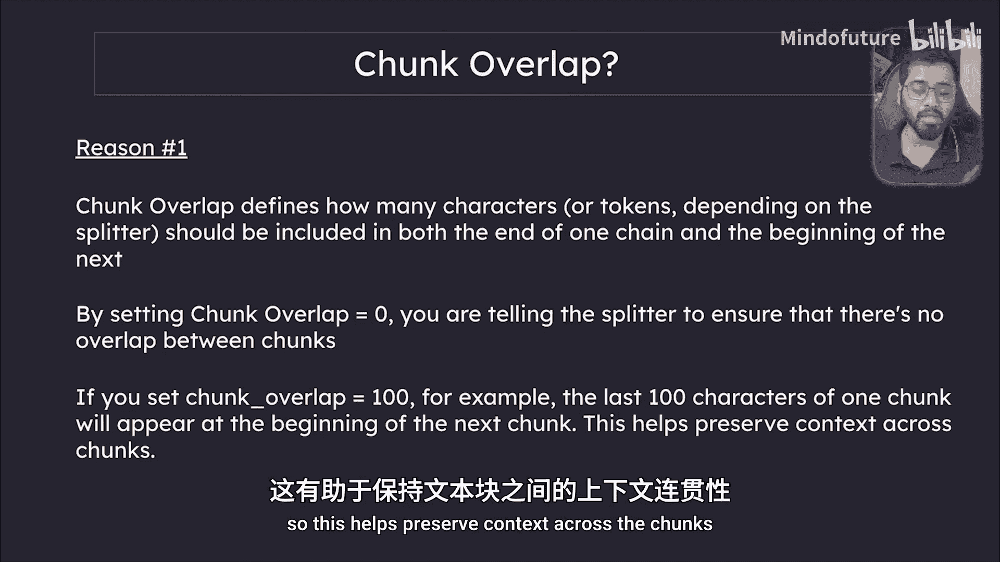
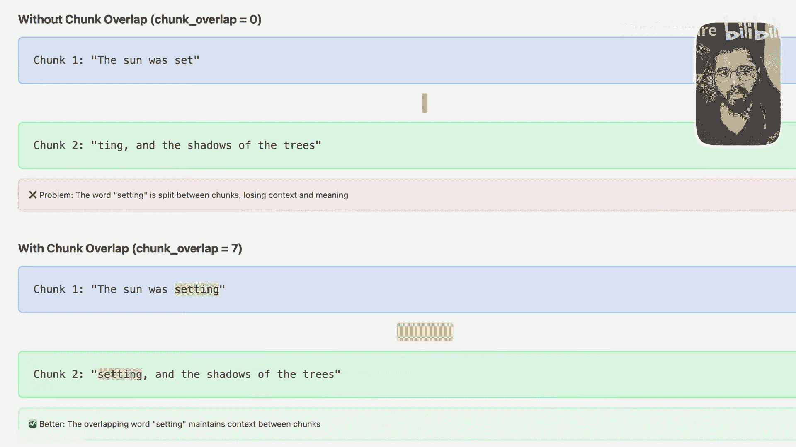
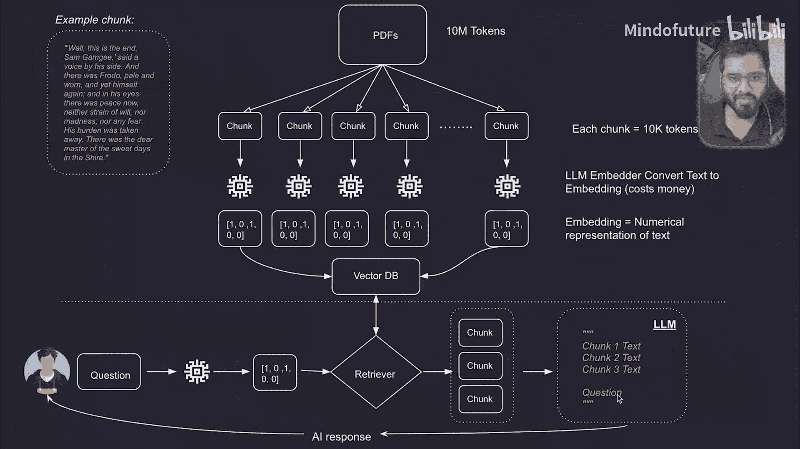

# 024：RAGs基本示例（1）

在本节课中，我们将学习如何实现检索增强生成（RAG）系统的第一步：文档加载、分块、向量化与存储。我们将以《霍比特人》一书为例，演示如何将文本数据转换为向量并存入本地向量数据库。

上一节我们介绍了RAG系统的整体架构，本节中我们来看看如何用代码实现其数据准备部分。

## 加载与准备文档

首先，我们需要加载文档。以下是实现步骤：

1.  **确定文档路径**：使用Python标准库获取当前脚本所在目录，并定位到文档文件。
2.  **初始化向量存储**：指定一个本地目录用于存储向量数据库文件，确保数据持久化。
3.  **检查避免重复处理**：如果向量数据库已存在，则跳过后续步骤，避免重复调用API产生额外费用。

```python
import os
from langchain.document_loaders import TextLoader
from langchain.text_splitter import CharacterTextSplitter
from langchain.embeddings import OpenAIEmbeddings
from langchain.vectorstores import Chroma

# 1. 获取文档路径
current_dir = os.path.dirname(os.path.abspath(__file__))
book_path = os.path.join(current_dir, 'documents', 'the_hobbit.txt')

# 2. 指定向量存储的持久化目录
persist_directory = os.path.join(current_dir, 'folder_db', 'chroma_db')

# 3. 检查是否已存在向量存储，避免重复处理
if not os.path.exists(persist_directory):
    print("持久化目录不存在，正在初始化向量存储...")
    # 后续处理代码将放在这里
```

## 文档加载与分块

接下来，我们加载文档并将其分割成更小的文本块。分块是处理长文档的关键步骤，它有助于模型更有效地理解和检索信息。

以下是分块过程的核心步骤：



1.  **加载文档**：使用 `TextLoader` 将文本文件加载到内存中。
2.  **初始化文本分割器**：使用 `CharacterTextSplitter`，并设置块大小和重叠字符数。
3.  **执行分块**：将加载的文档分割成指定大小的文本块数组。

```python
    # 加载文档
    loader = TextLoader(book_path)
    documents = loader.load()

    # 初始化文本分割器
    # chunk_size: 每个文本块的最大字符数
    # chunk_overlap: 相邻文本块之间的重叠字符数，用于保留上下文
    text_splitter = CharacterTextSplitter(chunk_size=1000, chunk_overlap=50)
    docs = text_splitter.split_documents(documents)

    print(f"文档已被分割成 {len(docs)} 个块。")
    print("第一个块的内容预览：", docs[0].page_content[:200])
```



**分块重叠** 是一个重要概念。它定义了相邻两个文本块之间共享的字符数量。设置重叠有助于在分块时保留关键上下文信息，防止重要内容在块与块之间被切断。例如，若 `chunk_overlap=100`，则一个块的末尾100个字符会出现在下一个块的开头。

## 生成向量嵌入与存储

文档分块完成后，下一步是将每个文本块转换为向量嵌入，并存储到向量数据库中。

以下是该过程的实现步骤：

1.  **选择嵌入模型**：使用OpenAI的 `text-embedding-3-small` 模型将文本转换为数值向量。该模型性能强大且成本较低。
2.  **创建向量存储**：使用 `Chroma.from_documents` 方法，传入文本块 (`docs`) 和嵌入模型，将向量和原始文本一并存入指定的持久化目录。

```python
    # 初始化嵌入模型
    embeddings = OpenAIEmbeddings(model="text-embedding-3-small")

    # 创建并持久化向量存储
    vectordb = Chroma.from_documents(
        documents=docs,
        embedding=embeddings,
        persist_directory=persist_directory
    )
    vectordb.persist()
    print("向量嵌入已生成并成功存储到数据库。")
```

运行以上完整代码后，系统将加载《霍比特人》文档，将其分割成约40个文本块，为每个块生成向量嵌入，并最终将所有数据保存到本地的 `chroma_db` 数据库中。控制台会输出处理日志和第一个文本块的内容预览。



本节课中我们一起学习了RAG系统数据准备阶段的核心操作：从定位和加载文档开始，到使用重叠分块策略处理文本，最后利用嵌入模型将文本转换为向量并持久化存储。至此，我们私有数据的向量化存储已完成，为后续的检索与生成环节打下了基础。