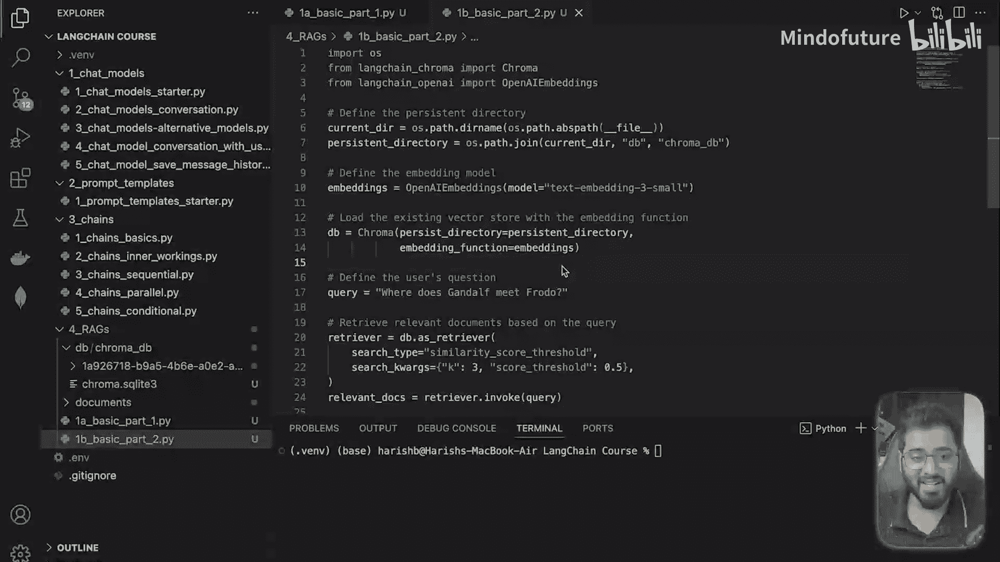
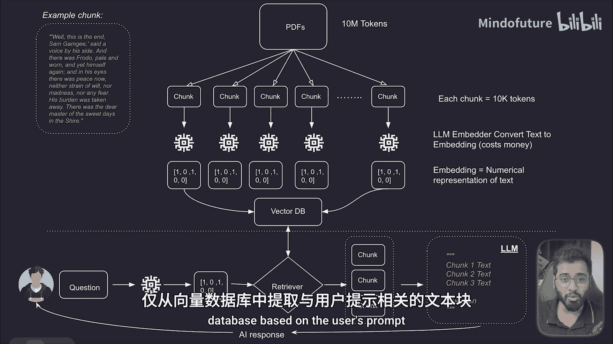
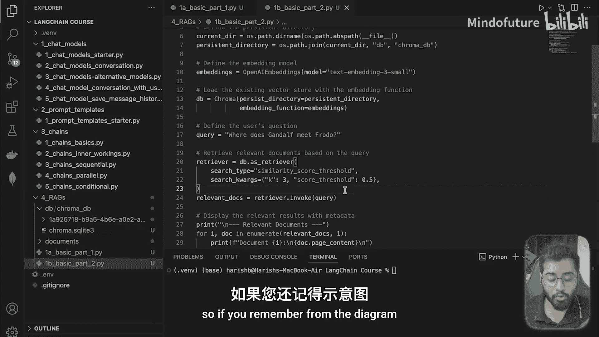
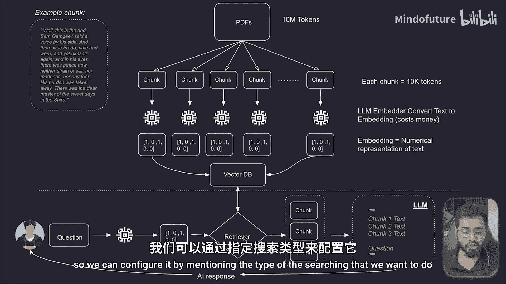
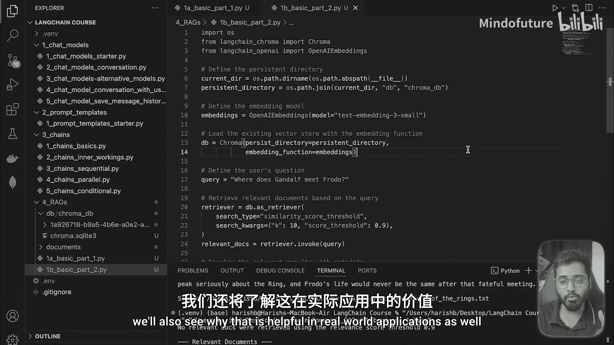

# 025：RAGs基本示例（第二部分）🔍





在本节课中，我们将学习RAG系统的第二部分：如何根据用户的问题，从向量数据库中检索出最相关的文本片段。我们将一步步配置检索器，并探索不同参数对检索结果的影响。

上一节我们介绍了如何将书籍向量化并存入数据库，本节中我们来看看如何从数据库中检索信息。

## 加载向量数据库

首先，我们需要让数据库在当前文件中可用。我们通过指定持久化目录的路径来加载之前创建的Chroma向量数据库。

```python
# 指定数据库文件路径并加载向量存储
persistent_directory = "./chroma_db"
vectorstore = Chroma(persist_directory=persistent_directory, embedding_function=embedding_model)
```

## 配置嵌入模型

接下来，我们需要一个嵌入模型来处理用户的问题。这里有一个关键点：**用于嵌入用户问题的模型，必须与当初嵌入私有数据时使用的模型完全相同**。在本例中，我们始终使用 `text-embedding-3-small` 模型。

```python
# 使用与嵌入数据时相同的模型
embedding_model = OpenAIEmbeddings(model="text-embedding-3-small")
```

## 设置与配置检索器

检索器的作用是根据用户的提示，从数据库中收集最相关的文本片段。我们可以配置检索器的搜索类型和参数。

以下是配置检索器的步骤：



1.  **指定搜索类型**：本例使用“相似度分数阈值”搜索。后续章节会探索其他类型。
2.  **设置搜索参数**：
    *   `search_kwargs={“k”: 3}`：指定检索器返回**相关性最高的前3个**文本片段。
    *   `search_kwargs={“score_threshold”: 0.5}`：设定相似度分数的**最低阈值**为0.5（范围0到1）。检索器只会返回相似度高于此值的片段。



```python
# 创建并配置检索器
retriever = vectorstore.as_retriever(
    search_type="similarity_score_threshold",
    search_kwargs={"k": 3, "score_threshold": 0.5}
)
```

## 执行查询并分析结果

配置好检索器后，我们就可以根据用户的问题查询相关片段了。我们使用 `invoke` 方法来触发检索。

```python
# 定义用户问题并执行检索
user_question = "Where does Gandalf meet Frodo?"
relevant_docs = retriever.invoke(user_question)

# 打印检索到的片段
for doc in relevant_docs:
    print(doc.page_content)
    print("---")
```

运行代码后，我们得到了三个最相关的文档片段。用户的问题是“甘道夫在哪里遇见了弗罗多？”，让我们检查检索结果是否准确：

*   **第一个片段**提到：“It was in the heart of Hobbiton, at the home of Frodo Baggins, that Gandalf came...”。这直接回答了问题：在霍比屯的弗罗多家中。
*   **第二个片段**提到：“Gandalf came to Hobbiton to visit Frodo one summer day.” 同样提供了答案。
*   **第三个片段**提到：“Frodo was in his home in Hobbiton when Gandalf arrived...” 再次确认了地点。

检索器成功找到了包含答案的精确段落。

## 调整参数并观察变化

我们可以通过调整参数来观察检索结果的变化，这有助于在实际应用中找到最佳平衡点。

以下是调整参数的两个示例：

1.  **增加返回数量，降低阈值**：如果将 `k` 改为10，并降低 `score_threshold`，检索器会返回更多结果，但其中可能包含相关性较低的片段。
2.  **提高阈值，要求更严格**：如果将 `score_threshold` 提高到0.9，再次运行查询，可能会发现检索器无法找到任何符合条件的相关文档。这说明阈值设置过高，过滤掉了所有片段。

这个实验告诉我们，在构建自己的RAG应用时，需要在召回率（找到相关结果）和精确率（结果高度相关）之间找到合适的平衡点，不能将阈值设置得过高或过低。

## 总结与下节预告

本节课中我们一起学习了RAG检索的核心流程：加载数据库、配置检索器、执行查询并分析结果。我们成功实现了一个针对单本书籍的RAG搜索，并理解了关键参数对检索效果的影响。



在下一节中，我们将学习如何为每个文本片段添加**元数据**。元数据可以包含片段来源的额外信息，例如来自哪本书、第几章、第几段等。这样，在未来检索时，我们不仅能得到答案，还能清晰地看到答案的出处。我们也将探讨这在真实应用场景中的重要性。