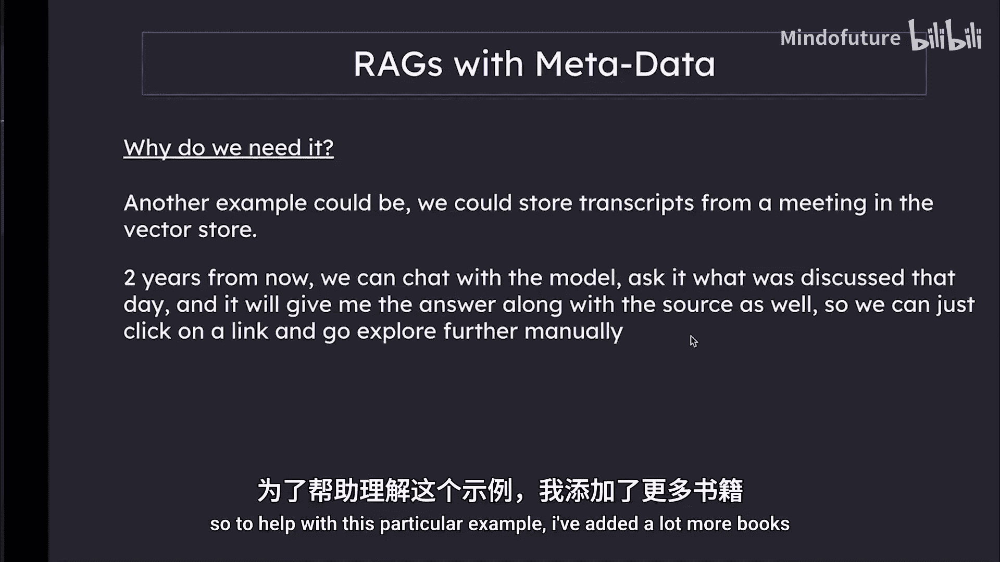
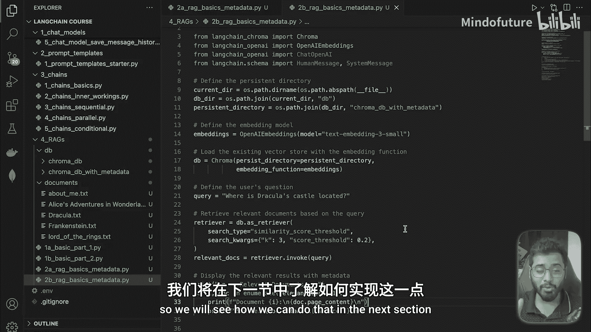

# 026：RAGs与元数据

在本节课中，我们将学习如何在RAG系统中为文本块添加元数据。元数据能帮助我们追踪信息的来源，例如知道某个答案来自哪本书或哪个文档的哪个部分，这对于验证信息真实性和进行深入探索至关重要。

上一节我们介绍了基础的RAG系统构建，本节中我们来看看如何通过引入元数据来增强它。

## 为什么需要元数据？

假设我们将10本不同的私人文档或书籍存入向量数据库。当我们提出一个问题时，除了获取相关的文本块，如果还能知道这些文本块的来源会更有帮助。例如，可以知道它来自某本书的第四章第三段，或某个文档的第七节。这为我们提供了关于信息出处的额外信息。

这类似于ChatGPT的联网搜索功能：它回答问题时会附带来源网址，让我们知道答案并非凭空捏造。另一个例子是，我们可以将会议记录存入向量数据库，两年后向模型提问“那天讨论了什么”，模型不仅能给出答案，还能提供来源链接，方便我们手动点击查看和进一步探索。

可能性是无限的。

为了演示这个例子，我添加了更多书籍，并为本节以及后续几节关于RAG的内容准备了代码。



## 代码实现：构建带元数据的向量数据库


现在让我们进入代码部分，你会发现这与我们之前编写的代码并没有太大不同。

首先，我们需要将所有新书籍存入向量数据库，以便开始提问。

我在这里添加了更多书籍，如《弗兰肯斯坦》、《德古拉》等，这些都是相当长的书籍。现在，让我们来分块处理这些书籍，进行嵌入，然后存入向量数据库。

以下是第一步，我们直接获取文档的引用。

```python
# 指定包含书籍文本文件的文件夹路径
documents_directory = "./documents"
```

同时，我们告诉Langchain创建一个新的向量数据库文件，用于存放所有这些带元数据的书籍。

```python
# 指定新的向量数据库路径
vector_db_path = "./db/ChromaDb_with_Meta"
```

这次我们使用一个不同的数据库文件。我已经运行过这个文件，所以数据库中已经包含了所有书籍的完整嵌入版本。

其余代码与我们看到的第一个例子非常相似。我们检查数据库是否已创建，如果已创建，则不会进入`if`代码块。

接下来的部分略有不同。基本流程与上次相同，但这次我们嵌入的是多本书籍。

以下是具体步骤：

首先，进入`documents`文件夹，搜索所有具有`.txt`扩展名的文件。这行代码将获取所有这些书籍文件名并放入一个数组中。

```python
import os
book_files = [f for f in os.listdir(documents_directory) if f.endswith('.txt')]
```

接着，我们遍历所有书籍文件名。对于每个文件名，使用加载器将其加载到内存中，并添加到最终的文档数组中。

这与我们之前所做的非常相似，但这里处理的是多个文档。

此外，我们还在做一件事：在加载每个文档时，为其添加元数据。

我们可以添加任意多的信息，但目前我只添加`source`（来源），并将书籍文件名赋给它。

```python
from langchain.document_loaders import TextLoader

all_documents = []
for book_file in book_files:
    file_path = os.path.join(documents_directory, book_file)
    loader = TextLoader(file_path)
    documents = loader.load()
    # 为每个文档块添加元数据，记录来源书籍
    for doc in documents:
        doc.metadata = {"source": book_file}
    all_documents.extend(documents)
```

例如，如果我加载的是《弗兰肯斯坦》这本书，那么`book_file`就是`Frankenstein.txt`。

从这里开始，我们将经历相同的过程：分块处理整个书籍列表，指定我们将用于嵌入的嵌入模型，最后通过提供文档、嵌入模型以及最终要创建的数据库文件路径来创建向量存储。

```python
from langchain.text_splitter import RecursiveCharacterTextSplitter
from langchain.embeddings import OpenAIEmbeddings
from langchain.vectorstores import Chroma

# 1. 分块
text_splitter = RecursiveCharacterTextSplitter(chunk_size=1000, chunk_overlap=200)
chunks = text_splitter.split_documents(all_documents)

# 2. 初始化嵌入模型
embeddings = OpenAIEmbeddings()

# 3. 创建并持久化向量存储
vectorstore = Chroma.from_documents(
    documents=chunks,
    embedding=embeddings,
    persist_directory=vector_db_path
)
vectorstore.persist()
```

正如开始时提到的，我已经运行过这个文件，所以已经创建好了包含所有嵌入文本块的数据库文件。

## 代码实现：查询带元数据的RAG系统

现在让我们进入下一部分，在这里我们可以实际向RAG系统提问。

我们将要做的几乎相同：将文件指向我们刚刚创建的新数据库位置。

```python
# 加载已存在的向量数据库
vectorstore = Chroma(
    persist_directory=vector_db_path,
    embedding_function=embeddings
)
```

这是我们准备提出的问题：“德古拉的城堡位于哪里？”如果你熟悉德古拉，就知道他是一个住在城堡里的吸血鬼。我们的问题就是关于城堡的位置，显然在书中的某个地方会提到。

我们超级智能的RAG系统将在运行此文件时检索相关的文本块。

让我们看下一段代码，这里我们配置检索器。

我们仍然使用基于相似度分数的搜索，并指定返回数量为3，阈值设为0.3。这个数值对我有效，因为如果降低它，可能得不到任何结果。在你的应用中，需要找到合适的平衡点。

```python
# 配置检索器
retriever = vectorstore.as_retriever(
    search_type="similarity_score_threshold",
    search_kwargs={"k": 3, "score_threshold": 0.3}
)
```

最后，我们使用`invoke`这个“魔法”关键字。它主要做两件事：将用户问题转换为嵌入向量；现在，我们有了向量化格式的查询，而书籍内容也是向量化格式的嵌入。它据此查询，返回最相关的三个文本块，并最终打印出所有块。

运行这个文件令人兴奋，让我们看看是否能在检索到的块中找到答案。运行可能需要4到10秒。

运行结果令人惊喜！我们现在得到了三个文本块，它们都相当大。我们知道德古拉存在于一个叫特兰西瓦尼亚的地方。让我们看看“Transylvania”这个词是否出现在任何检索到的块中。

正如你所见，第三行和第七行都提到了“Transylvania”。例如：“我曾参观过大英博物馆，并在图书馆的书籍和地图中搜索了关于特兰西瓦尼亚的信息。”下面甚至给出了德古拉城堡的具体位置。

仅凭这一段，即使是人类也能推断出德古拉住在特兰西瓦尼亚。更重要的是，我们还可以看到文本块的来源，它显示为`dracula.txt`。这是因为我们记得，我们将书名作为元数据添加到了每个文本块中。

现在让我们继续看下一个块。在第二个和第三个块中搜索“Transylvania”一词，可能没有直接列出，但它们可能提供了更多关于德古拉确实住在特兰西瓦尼亚的信息。例如，它写道：“因此，当我们找到这个人的住所时……”（这里“这个人”指的是德古拉），所以它仍然在讨论德古拉的位置。

目前我们只有三本书，但想象一下如果是上百本书、上千本书，或是公司的私有文档。RAG系统如何使得用自然语言与其对话并获取准确答案成为可能。希望你现在开始看到RAG系统的力量了。

## 总结与下一步

以上就是我们如何为每个文本块添加元数据的方法。下一步，基本上就是将所有检索到的文本块连同用户的问题一起发送给大语言模型。这样，LLM就可以查看那些可能包含该问题答案的文本块，并给出答案——在本例中就是“Transylvania”。

我们将在下一节中学习如何实现这一步。




本节课中，我们一起学习了如何在RAG系统中为文本块嵌入元数据，以追踪信息来源，并通过一个查询德古拉城堡位置的实例，演示了带元数据的检索过程。这为构建更可靠、可追溯的问答系统奠定了基础。