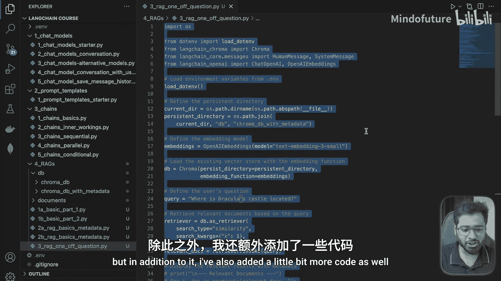
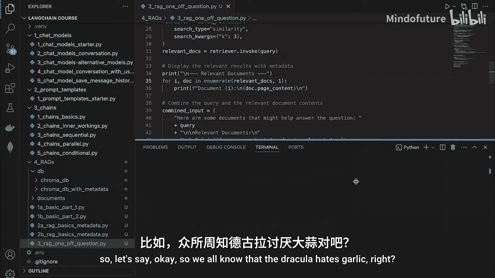
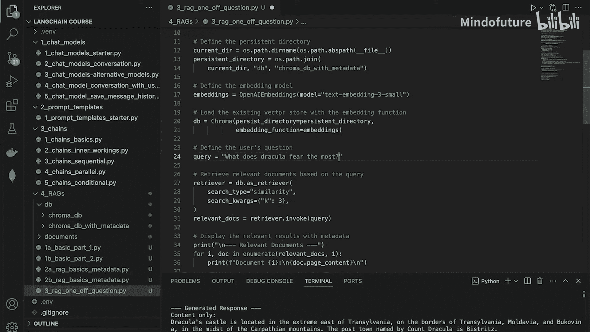
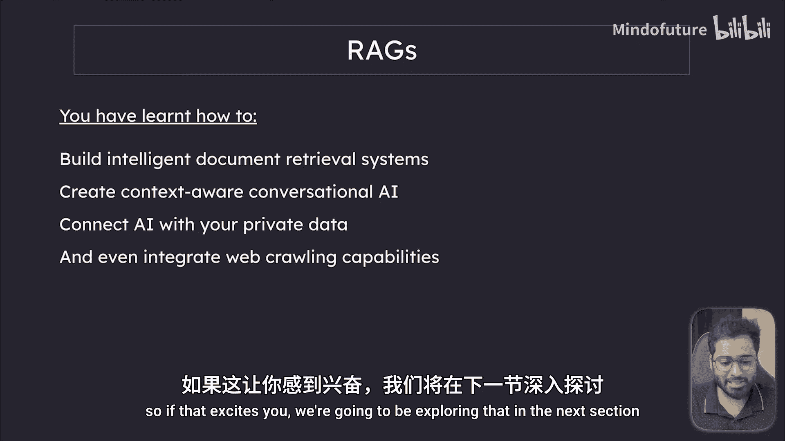

# 027：构建RAG问答系统

在本节课中，我们将学习如何构建一个完整的检索增强生成（RAG）系统。我们将把之前章节中获取的相关文档片段与用户问题结合，提交给大语言模型（LLM），从而获得基于特定文档的精确答案。

## 概述与准备



上一节我们介绍了如何根据用户问题检索最相关的文档片段。本节中，我们将利用这些片段来生成最终答案。

我复制了上一节的所有代码到一个新文件中，并在此基础上添加了更多功能。让我们逐步来看具体做了什么。

## 构建提示词

首先，我们有一个用户问题以及根据该问题检索到的相关文档片段。我要做的第一件事很简单：准备一个组合提示词提交给LLM。

这个提示词的结构如下：
1.  包含实际用户问题，例如：“德古拉的城堡位于何处？”
2.  提供所有相关的文档片段文本。我们筛选出最相关的三个片段，并将它们连接在一起。
3.  为确保LLM仅基于提供的文档回答，我们添加指令：“请仅根据提供的文档给出大致答案。如果答案未在文档中找到，请回复‘我不确定’。”

以下是构建提示词的代码示例：

```python
# 假设 user_question 和 relevant_chunks 已定义
combined_prompt = f"""
请根据以下文档回答问题。

用户问题：{user_question}

相关文档：
{‘ ‘.join(relevant_chunks)}

请仅根据提供的文档给出大致答案。如果答案未在文档中找到，请回复‘我不确定’。
"""
```

## 调用模型并获取答案

接下来，我们实例化模型并调用它。这一步我们已经做过多次。

以下是调用过程的代码：





```python
# 定义消息数组
messages = [
    {"role": "system", "content": "你是一个乐于助人的助手。"},
    {"role": "user", "content": combined_prompt}
]

# 调用模型并打印结果（仅内容）
response = model.invoke(messages)
print(response.content)
```

## 运行与结果分析

现在，让我们运行这个文件。几秒钟后，我们得到了最终结果。

基于提供的文档，LLM回答：“德古拉的城堡位于特兰西瓦尼亚的最东端，就在特兰西瓦尼亚、摩尔达维亚和布科维纳的边界上，喀尔巴阡山脉之中。德古拉伯爵命名的邮政城镇是Bistritz。”

这非常棒！LLM能够基于文档片段中的所有数据识别出这个信息。为了验证，我们可以复制“Bistritz”这个词并在片段中搜索，会发现它在多个地方出现。

## 尝试另一个问题

为了进一步测试，让我们问另一个问题。众所周知，德古拉讨厌大蒜。那么，让我们提问：“德古拉最害怕什么？”

再次运行文件，我们得到响应：“德古拉害怕很多东西：他不能被邀请就不能进入某些地方，不喜欢大蒜、圣水……” 它给出了答案，甚至包括一些我们原本不知道的信息。

让我们确认LLM是否是基于我们发送的片段给出这个答案的。复制“garlic”（大蒜）这个词并向上滚动搜索，可以看到它在片段中被多次提及。例如，片段中提到“他受大蒜困扰”以及“他也不喜欢十字架”。

通过这种方式，我们知道LLM仅基于提供的文档进行回答，没有动用其自身知识或进行网络搜索。因此，在你的项目中，你可以放入LLM无法知晓的私有数据，赋予其额外的知识并与之对话。

## 扩展可能性

我们甚至可以更进一步。与其进行一次性问答，你可以构建一个支持多轮对话的系统。还记得我们在聊天模型模块中已经实现过这个功能吗？你可以在这里实现同样的逻辑。

## 总结与展望

至此，我们已经完成了对RAG的深入探讨。花点时间欣赏一下我们已经走了多远。你现在已经跻身于能够使用Langchain构建RAG系统和智能检索系统的前5%开发者行列了。

你现在能够：
*   构建智能文档检索系统。
*   创建具有上下文感知能力的对话式AI。
*   将AI连接到你的私有数据。
*   甚至集成网络爬取能力。



我们的旅程尚未结束。接下来，我们将深入Langchain的最后一个核心组件：**智能体（Agents）和工具（Tools）**。想象一下，基本上就是赋予你的AI实际使用工具和像真人一样做出决策的能力。如果这让你感到兴奋，我们将在下一节中探索这个领域。