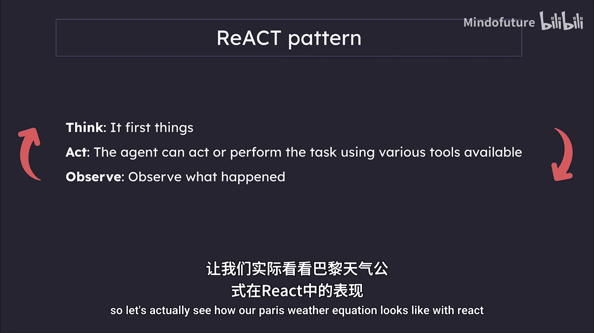
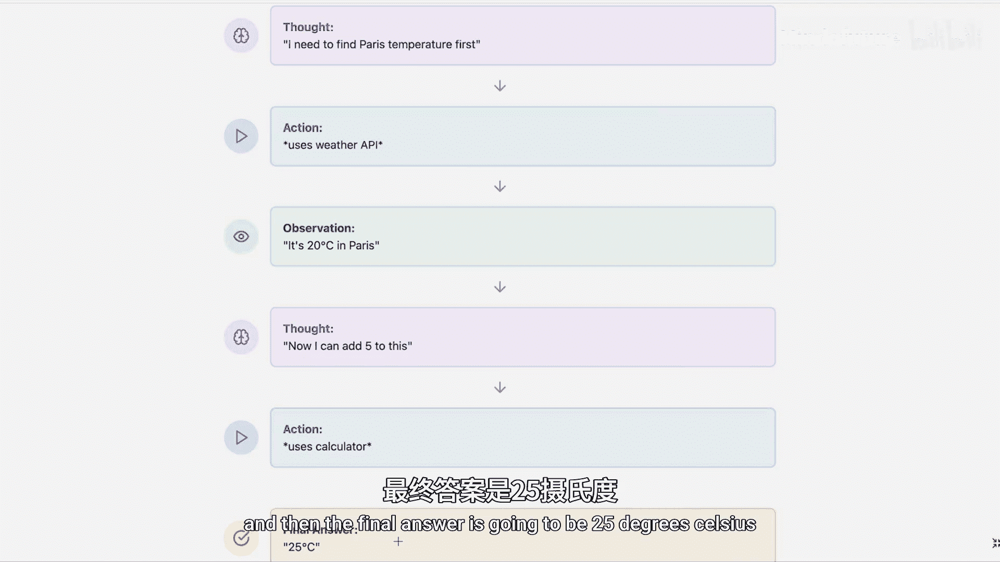
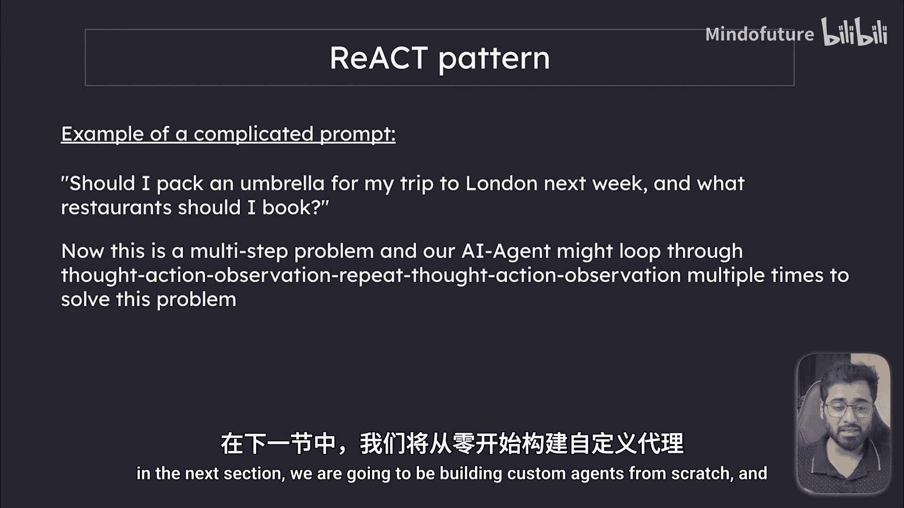

# 028：智能体与工具介绍 🧠

在本节课中，我们将要学习Langchain的最后一个核心组件：智能体与工具。你可能会觉得“AI智能体”听起来非常复杂，但事实上，它的核心概念比想象中要简单得多。通过本节的学习，你将理解智能体如何自主决策，以及工具如何赋予AI执行特定任务的能力。

上一节我们学习了链和检索增强生成，它们遵循我们设定的特定指令。本节中我们来看看智能体，它们将自主决策的能力提升到了一个新的高度。

## 什么是智能体？🤔

智能体可以被视为AI世界的问题解决者。它们是能够独立思考、自主做出决策的人工智能。

你可以将智能体想象成一位厨师。一位优秀的厨师知道在烹饪不同菜肴时，何时该用刀、何时该用搅拌器、何时该用烤箱。同样，一个AI智能体能够自主决定何时该使用浏览器搜索、何时该调用计算器、何时该向数据库发起API请求。

在这里，我们注意到一个关键词：**工具**。

## 什么是工具？🔧

工具是AI用来完成特定任务的函数。就像厨师的厨房工具（刀用于切割、烤箱用于烘焙、搅拌器用于混合）一样，工具是我们赋予AI智能体的特殊能力。

例如，我们可以给AI一个计算器工具、一个搜索引擎工具或一个日历工具。许多应用程序（如Perplexity）的核心就是建立在工具之上的。

现在你应该对为何要使用智能体有了一些概念。本质上，**智能体帮助语言模型在解决问题时，决定采取何种行动**。它们能在合适的时机选择正确的工具，而无需我们明确指示使用哪一个。

## 一个简单的工具使用示例 🌤️

让我们看一个使用工具的简单例子。如果我向一个AI智能体提问：“巴黎的天气温度加5是多少？”，这个过程会变得非常有趣。

AI智能体并非随机选择工具，它实际上在像侦探破案一样思考整个过程。

首先，智能体识别出问题包含两个部分：查询天气和进行数学计算。它知道需要先获取天气，因为你无法对一个未知的数值进行加法运算。然后，它再使用计算器工具进行加5操作。

你可能会问：智能体如何知道先做什么、后做什么？

## 理解ReAct模式 🔄

这就引出了**ReAct**的概念。这是当今构建AI智能体的最佳模式之一。这里的“ReAct”并非指前端框架，而是AI领域的术语，代表 **Reasoning（推理） + Acting（行动）**。这个概念模拟了人类的思考方式。

当我们面对一个问题时，首先会思考如何解决它。这正是智能体所做的第一步：**Think（思考）**。

第二步是 **Act（行动）**。智能体可以使用各种可用的工具来执行任务。

第三步是 **Observe（观察）** 行动的结果。

最后，如果需要，**重复**整个过程。

让我们看看“巴黎天气加5”这个问题在ReAct模式下的具体流程：

1.  **思考**：我需要先找到巴黎的温度。
2.  **行动**：使用天气API工具。
3.  **观察**：API返回“巴黎气温20摄氏度”。
4.  **再次思考**：现在我可以给这个数值加5。
5.  **再次行动**：使用计算器工具。
6.  **最终观察/答案**：25摄氏度。

可以把这想象成拼图。ReAct模式不是直接展示完成后的图片，而是让我们看到每一片拼图是如何被放置到正确位置的。

## 更复杂的场景想象 🧳

这是一个非常小的例子。想象一下，如果我提出一个更复杂的问题：“我下周去伦敦旅行需要带伞吗？以及我应该预订哪些餐厅？”

你可以想象，这是一个多步骤的问题。我们的AI智能体可能会通过多次循环 **思考 -> 行动 -> 观察** 的过程来解决它。

我希望你现在对智能体和工具有了一个初步的图景。如果你还没有完全理解，请不要担心。在下一节中，我们将从零开始构建自定义智能体，并查看大量实际示例。

## 总结 📝

本节课中我们一起学习了Langchain智能体与工具的核心概念。我们了解到，智能体是能够自主决策的AI问题解决者，而工具则是它们执行任务的具体手段。通过ReAct（推理+行动）模式，智能体能够像人类一样思考步骤、选择工具、观察结果并迭代执行，从而解决复杂的多步骤问题。这为AI应用赋予了前所未有的灵活性和自主性。