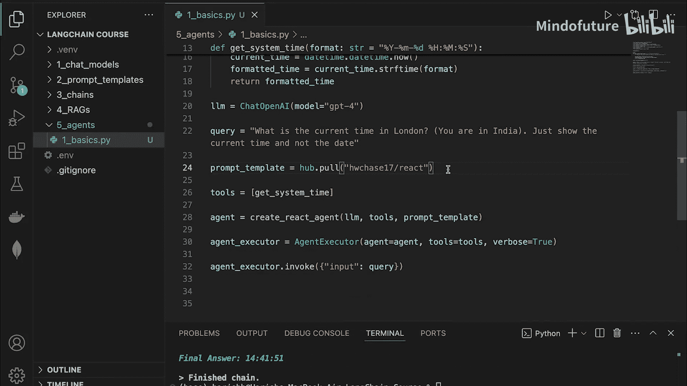
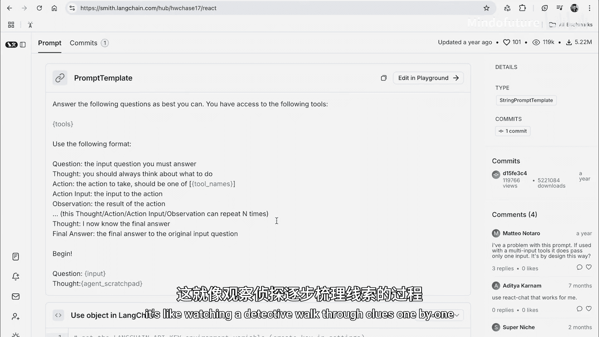
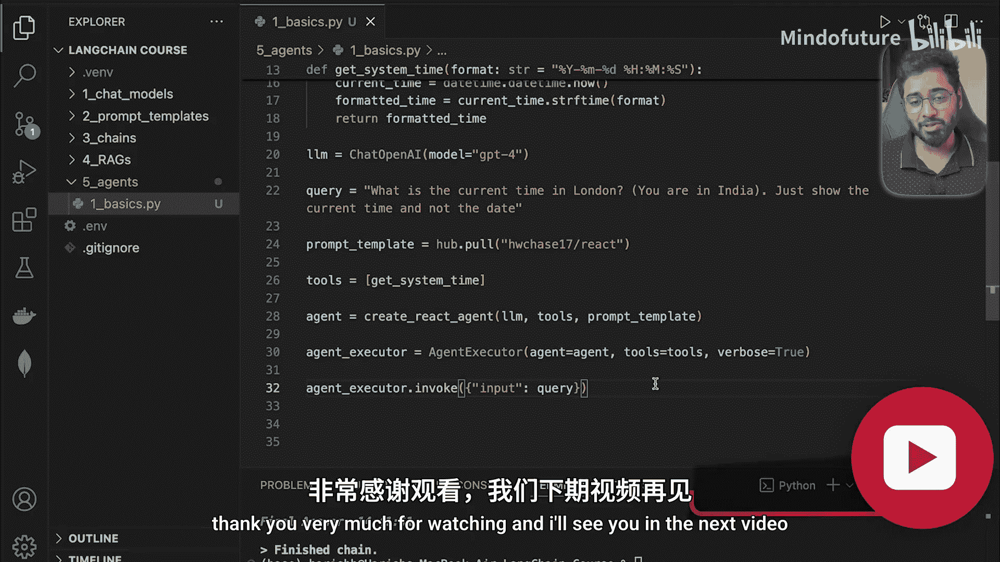

# 029：智能体工具深度解析

在本节课中，我们将学习如何从零开始构建一个AI智能体。通过本节内容，你将掌握为各种业务用例构建智能体的基本方法。由于这是一个新概念，我们将循序渐进地进行讲解。

首先，我们将展示当前大型语言模型存在的一个局限性，然后探讨如何通过构建智能体来解决这个问题。

## 初始化环境与提出问题

上一节我们介绍了智能体的概念，本节中我们来看看如何用代码实现。首先，我们需要设置基础环境。

以下是初始化步骤的代码：

```python
# 加载环境变量
# 初始化LLM，使用GPT-4模型
llm = ChatOpenAI(model="gpt-4")
query = "what is the current time?"
```

这段代码将问题输入到链中，链会将其转换为提示词并发送给LLM。这是一个非常基础的操作。

运行这段代码，让我们看看GPT-4如何回答当前时间的问题。

运行结果会显示，LLM无法访问实时信息。这是因为LLM本身无法获取实时数据。它们基于特定数据集进行训练，并且通常有一个数据截止日期。如果询问今天早上发生的事情，它很可能不知道。

这是一个完美的例子，展示了我们可以通过创建智能体来增强LLM的能力。智能体可以使用工具来获取当前时间。

## 安装必要包与引入提示模板

为了解决上述限制，我们需要安装一些额外的包。

首先安装 `langchain-hub` 包。这个包允许我们从互联网上使用他人创建的提示词模板，而无需自己编写。

在安装的同时，我们深入了解一下这个包。简单来说，它让我们能够复用社区中优秀的提示模板。

在这个例子中，我们需要使用ReAct提示模板。稍后我们会详细查看这个模板的内容，但现在我们先使用它。

以下是引入模板的代码：

```python
from langchain import hub
prompt = hub.pull("hwchase17/react")
```

这段代码从LangChain Hub拉取指定的ReAct提示模板。`hwchase17`是LangChain创建者Harrison Chase的组织空间，`react`是我们需要的模板文件。

## 创建工具与智能体

现在，让我们创建一些工具供智能体使用。

工具是一个列表，我们可以为智能体提供多种工具。根据智能体在特定时刻需要解决的问题，它会选择合适的工具来完成任务。工具可以是谷歌搜索工具、邮件发送工具等。

在这个案例中，我们需要创建一个获取系统时间的工具。

接下来，我们需要创建智能体。为此，我们需要从LangChain导入一些类。

以下是相关代码：

```python
from langchain.agents import create_react_agent, AgentExecutor

tools = [] # 工具列表，稍后填充
agent = create_react_agent(llm=llm, tools=tools, prompt=prompt)
agent_executor = AgentExecutor(agent=agent, tools=tools, verbose=True)
result = agent_executor.invoke({"input": query})
```

我们移除了之前的简单链，现在声明一个智能体执行器。将`verbose`参数设置为`True`，这样我们可以看到智能体在每个步骤中的思考和行动，便于调试和调整。

快速回顾一下：我们有查询问题、从Hub拉取的提示模板、工具列表（尚未编写），以及将这些信息传递给执行器。最后，我们用查询来调用智能体。

如果现在运行，由于LLM没有获取时间的工具，显然会失败。运行后，我们可以看到智能体逐步执行的日志。

ReAct智能体遵循“推理（Reason）-行动（Act）-观察（Observe）-重复”的循环，日志清晰地展示了这一过程。

首先，它进行推理：“我需要检查我当前位置的当前时间”。推理出问题或需要做的事情后，它需要采取行动：“使用工具来找出当前时间”。不幸的是，我们尚未为智能体提供时间工具，因此它报告没有工具来解决这个问题。最终，它给出无法找到当前时间的答案，因为它自己不知道如何解决。

## 实现获取时间工具

现在让我们修复这个问题，为智能体提供一个工具。

我们将创建一个简单的Python函数来返回当前时间。我们希望智能体以特定的时间格式给出答案。

以下是函数定义：

```python
import datetime
from langchain.agents import tool

@tool
def get_system_time(format: str = "%Y-%m-%d %H:%M:%S"):
    """
    以指定格式返回当前的日期和时间。
    """
    current_time = datetime.datetime.now()
    formatted_time = current_time.strftime(format)
    return formatted_time
```

我们使用了Python标准的`datetime`库来获取系统时间，并按照指定格式进行格式化。如果LLM没有传入特定格式，函数将使用默认格式。

但是，LangChain本身并不知道如何处理这个函数。我们需要为这个函数添加一个Python装饰器`@tool`。这个装饰器会将方法转换为LangChain易于理解的格式，并提供一个描述字符串，让LLM了解这个方法的上下文信息，从而判断是否应该为特定任务使用这个工具。

确保始终为工具函数提供清晰、良好的描述或文档字符串。

现在，剩下的就是将这个工具作为一项添加到工具列表中。

```python
tools = [get_system_time]
```

## 智能体工作流程解析

在运行文件之前，让我们梳理一下控制流程，以便更清楚地了解所有部分是如何协同工作的。

以下是智能体的工作步骤：

1.  **提示与初始化**：你向智能体提供一个提示，例如ReAct提示。该提示包含对LLM的任务指令、示例、逐步推理说明以及决定何时使用工具的指导。其次，提示中还包括可用工具的描述，包括它们的名称和使用细节。

2.  **智能体执行**：当用户向智能体提供查询时，LLM解释查询并生成响应。LLM不直接执行工具，而是建议调用哪些工具，并可能基于其推理提供参数。

3.  **工具调用**：智能体框架（LangChain）拦截LLM的输出，检查它是否建议调用工具。如果建议调用工具，LangChain会调用你Python代码中的工具，并传入LLM提议的任何参数。

4.  **工具执行**：该工具在你的Python环境中运行，可以访问你的Python资源（如当前时间、文件系统、API等）。工具将其结果返回给LangChain。

5.  **LLM响应**：LangChain将工具的输出发送回LLM，供其进一步推理或为用户生成最终响应。

## 运行与测试智能体

理论讲解完毕，现在让我们运行代码，看看一切是如何协同工作的。

运行后，智能体现在可以访问工具了。从日志中可以看到，它首先进行推理，需要访问`get_system_time`工具。推理完成后，第二步是行动。LangChain现在调用我们的函数，并传入LLM提供的输入（在这个例子中，它采用了默认格式）。然后生成最终答案，接着发生另一个LLM调用，LLM根据最终数据给出回答。

本质上，智能体遍历所有工具，找到能帮助它完成任务的那个并使用它。它能够通过我们提供的描述来识别工具。



我们不必对查询格式过于严格。可以提出略有不同的问题，例如只询问当前时间而不包含日期。

再次运行文件，可以看到LLM这次向工具提供了略有不同的输入格式，最终答案中只显示了时间而没有日期。在推理中，它能够识别出只需要调整格式就能给出正确答案。因此，LLM建议了一个不同的格式，而LangChain为我们执行了工具。

在我们的例子中，循环只运行了一次，因为这是一个单步问题：找到当前时间，所以它使用工具后就结束了。但对于更复杂的查询，这个循环可能会根据用户提示的复杂性运行三次、四次或五次。这就是ReAct智能体的工作原理。

让我们再稍微改变一下提示。这次我们让它告诉我们伦敦的当前时间。我们可以告诉它“你在印度”，因为我目前在印度。

运行后，智能体首先推理需要检查印度的系统时间，然后将其转换为伦敦时间。它也知道伦敦时间比印度晚大约5.5小时。它思考了这一点，然后行动，调用`get_system_time`函数，获取了印度的当前时间。它根据查询为工具传入了正确的格式。一旦有了正确的印度时间，它再次推理：“现在我们有了印度时间，需要通过减去5.5小时来计算伦敦时间”。这正是日志中显示的内容。推理后的下一步行动是“从时间中减去5.5小时”，然后给出最终答案，即当前的伦敦时间。

对于数学运算，我们可以提供自己的计算工具。大多数时候，LLM应该能够自行处理，但在生产环境中，提供自己的工具总是更安全，因为有时它会说找不到数学工具来进行减法运算。这是一个很好的演示，说明了工具的重要性。没有`get_system_time`工具，LLM就无法知道我的当前时间。

## 深入ReAct提示模板

到目前为止，我们已经看到了智能体经历推理、行动、观察循环的日志，但LLM究竟是如何做到这一点的呢？我们知道这得益于ReAct提示模板。让我们实际看看这个模板包含什么内容，使得它能够进行这种重复循环直到得到答案。

访问 `smith.langchain.com/hub/hwchase17` 可以查看ReAct提示模板。这是我们在应用中使用的系统级提示。

模板内容大致如下：
*   **指令**：“尽你所能回答以下问题。你可以使用以下工具：[工具列表]”。
*   **格式要求**：指示LLM遵循“Thought（思考）: ... Action（行动）: ... Action Input（行动输入）: ... Observation（观察）: ...”的格式。
*   **循环机制**：LLM首先思考下一步该做什么（Thought），然后决定采取哪个行动（Action）并提供输入（Action Input）。框架执行工具后返回结果（Observation）。LLM观察结果，判断是否已得到最终答案，或者是否需要再次进入“Thought-Action-Observation”循环。
*   **最终答案**：一旦确信解决了问题的每个部分，就进入“Final Answer（最终答案）: ...”。

就像在终端中看到的那样，“思考-行动-观察”的循环持续进行，直到智能体确信它已经解决了你提示中的每个部分。这就像看着侦探一步步破案。





本节课中我们一起学习了如何利用LangChain从零开始构建一个AI智能体。我们了解了LLM在获取实时信息方面的局限性，并通过创建工具（如获取系统时间）来扩展其能力。我们探索了ReAct智能体的工作流程，包括其“推理-行动-观察”的循环机制，并深入查看了驱动这一过程的提示模板。通过实际代码演示，我们看到了智能体如何选择并使用合适的工具来回答复杂问题。这为构建能够处理现实世界任务的AI应用奠定了坚实基础。